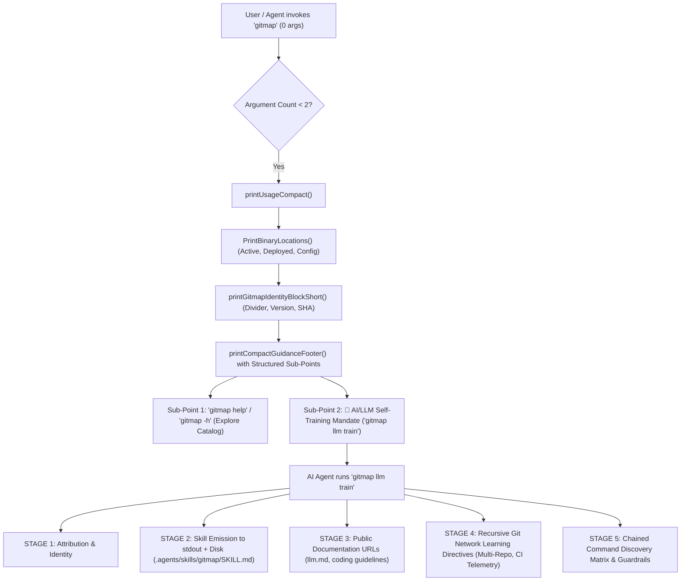

# Architecture Specification: Task 241 — GitMap Root AI Suggestions, Authoritative LLM Train Skills, Public Doc Links, and Minor Release

## Executive Overview
This specification details the architectural overhaul of GitMap's root CLI invocation and LLM training engine. It establishes a minimal, clean root display when invoked without arguments, providing explicit structured sub-points for both human developers and autonomous AI models. Furthermore, it elevates `gitmap llm train` into an authoritative skill delivery system that emits the comprehensive Antigravity skill directly to standard output, installs and updates `.agents/skills/gitmap/SKILL.md`, provides direct public links to raw Markdown documentation for model context ingestion, and embeds recursive directives for mastering the Git network.

---

## User Request (Verbatim)
```text
PS D:\work\wp-exam> gitmap                                                                                 
  Active binary:    C:\Users\Administrator\AppData\Local\gitmap-cli\gitmap.exe                             
  Deployed binary:  (not found)                                                                            
  Config binary:    (not found)                                                                            
                                                                                                           
                                                                                                           
  ────────────────────────────────────────────────────────────                                             
  gitmap binary                                                                                            
  ● Version:        v6.512.0                                                                               
  ● Commit SHA:     6f8671e2c3471c28f0d22dad5e84bbd76b1a4824                                               
                                                                                                           
Tip: Run 'gitmap help' or 'gitmap -h' to see the full command catalog.                                     
     Run 'gitmap help <topic>' for command-specific documentation.                                         
PS D:\work\wp-exam>                                                                                        

# High Priority Instruction

This section, try to have very less writing. That's the first thing. Second is that you should have the suggestions. There should be some suggestion. First of all, help or the hyphen H, it should be as a sub-point that AI can learn, and also you need to include the LLM train. If you are an AI model, then you can train yourself by the LLM train method. And as an AI, it should read it and then proceed. It should be in the instruction as well as a sub-point, and must follow the instruction. Now, in this case, it is AI, and it is running that LLM train it is reading. Currently, LLM train is bogus, so you should follow the skill method. Skill should be directly coming out directly from the `gitmap` LLM train. That's the first thing. Second, it should have a public link to MD files to the doc, where the LLM can actually go through and read those things, download these things, and that should come as a must-follow instruction as well, so that LLM and AI models can improve their memory. And LLM model should actually create a skill from learning this LLM train section as well. So that should be in their instruction set as well. So LLM train should be very powerful. It should have a recursive instruction to the AI, so that AI learns most of the things about the Git network.

# Actionable Items Must Follow Non-Negotiable

1. Write spec under 02-spec/21-app/<slug>/ and enqueue plan task in .ai-memory/plans/<slug>.md (subtasks in .ai-memory/plans/subtasks/<slug>/) first
2. Search codebase exclusively via GitMap (gitmap aum search, gitmap find, gitmap cat, gitmap ps, gitmap py, gitmap llm train); TOTAL BAN on rg, ripgrep, grep, git grep, Select-String
3. Strictly use relative Git paths (02-spec/..., .ai-memory/..., cmd/...); only add the relative paths, never add the absolute path during your work, and ensure this is respected on the release page and in release notes as well
4. Include help or the hyphen H as a sub-point that AI can learn.
5. Ensure LLM train is included and AI models can train themselves by this method.
6. Follow the skill method directly from the `gitmap` LLM train.
7. Provide a public link to MD files where the LLM can read and download to improve memory.
8. Ensure LLM models create a skill from learning the LLM train section.

## Must follow and spawn agent using

@[.agents/skills/execute-parent-task-with-n-steps-v6]

## Additional Instructions

- /plan first before doing the work to reduce the credits.
- /learn from @[.agents/skills/gitmap] skill to leverage GitMap high-speed search, toolchain discovery, and caching.
- Only add the relative paths, never add the absolute path during your work; this should be respected on the release page and in release notes as well.

We should have methods and better CLI options and skills updated for gitmap for all these factors, can you please do ti and make a minor bump and reelase pelase
```

---

## Visual Assets & Screenshot Register
The user screenshot has been captured and preserved into `assets/screenshots/`:


---

## System Architecture



---

## Architectural Principles & Invariants

1. **Minimal Vertical Height Invariant:**
   - Bare `gitmap` invocation strictly renders under 15 lines of output.
   - Redundant double blank lines between binary paths and identity blocks are removed.
2. **Explicit Dual-Audience Guidance:**
   - Human developers receive quick shortcuts to full documentation (`gitmap help` / `gitmap -h`).
   - Autonomous AI agents receive an imperative, high-priority instruction banner mandating `gitmap llm train` before undertaking any code edits or tool operations.
3. **The Skill Method Primacy:**
   - Rather than hiding the skill behind a quiet file write, `gitmap llm train` outputs the complete, copy-pasteable, parsable Antigravity skill directly into standard output with full YAML frontmatter.
   - Models are instructed to verify and maintain `.agents/skills/gitmap/SKILL.md` locally.
4. **Public Documentation Ingestion Protocol:**
   - Raw GitHub Markdown URLs are provided for immediate HTTP fetching or browser viewing:
     * `https://raw.githubusercontent.com/alimtvnetwork/gitmap-v28/main/llm.md`
     * `https://raw.githubusercontent.com/alimtvnetwork/gitmap-v28/main/what-to-read.md`
     * `https://raw.githubusercontent.com/alimtvnetwork/gitmap-v28/main/.agents/skills/gitmap/SKILL.md`
     * `https://raw.githubusercontent.com/alimtvnetwork/gitmap-v28/main/02-spec/02-coding-guidelines/06-ai-optimization/10-anti-pattern-replacements.md`
5. **Recursive Git Network Intelligence:**
   - Embeds instructions for traversing connected repositories in the Git network, inspecting CI error history (`gitmap pe history-ai`) before applying fixes, dynamic wait calculations (`-t`), and logging memory in `.ai-memory/what-to-read.md`.
