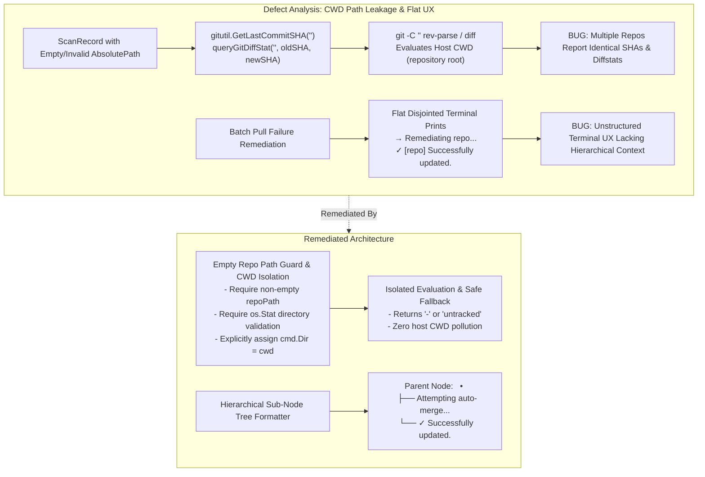
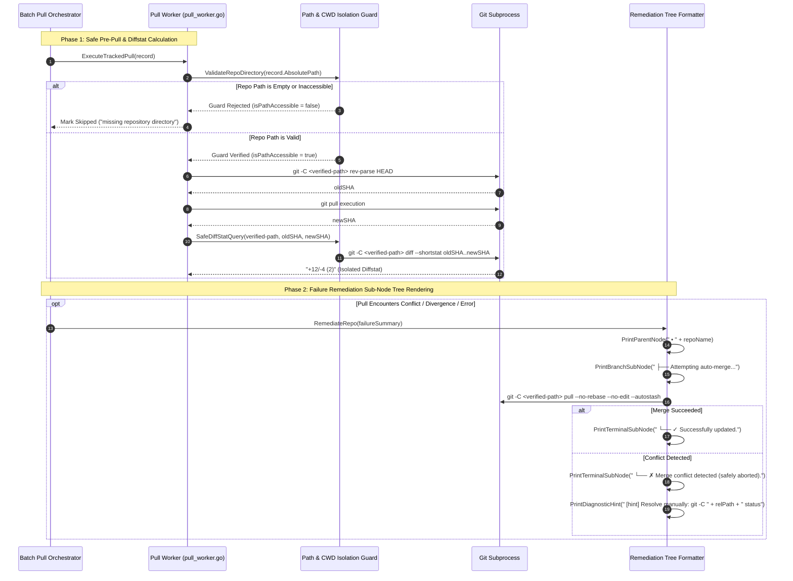

# 242-aria2c-download-smart-update-stats-subnode-remediation: Diffstat Isolation, CWD Guard & Remediation Sub-Node Tree Architecture Specification

- **Spec ID:** `02-spec/21-app/242-aria2c-download-smart-update-stats-subnode-remediation/01-architecture-spec.md`
- **Status:** `APPROVED`
- **Version:** `1.0.0`
- **Subsystem:** Diffstat Engine, Subprocess CWD Isolation, Remediation Tree UI, Batch Pull Concurrency
- **Target Packages:** `cli/gitutil`, `cli/cmdpull`, `cli/cloner`
- **Version Baseline:** `v6.512.0`
- **Target Version:** `v6.513.0`

---

## 1. Executive Summary & Root Cause Analysis

This architectural specification addresses two critical UX and algorithmic defects in GitMap's repository synchronization and remediation subsystems:

1. **Diffstat Calculation & CWD Path Leakage ("Matching Numbers" Bug):**
   When processing repositories with blank, unresolved, or relative working tree paths, calls to `gitutil.GetLastCommitSHA` and `queryGitDiffStat` executed Git subprocesses without validating that the target directory was non-empty and accessible. Because Git defaults to evaluating the current working directory (`CWD`) when `-C ""` is supplied, every repository record with a blank or invalid path executed against the GitMap root repository. This caused disparate repositories to report identical commit SHAs, identical dirty flags, and identical diffstat metric numbers (`+N/-M (F)`).
2. **Flat Line Pollution in Remediation UX:**
   During batch pull failure recovery, remediation output was rendered as disorganized flat lines (`→ Remediating repo...`, `✓ [repo] Successfully updated.`), losing hierarchical relationship to the parent repository and cluttering terminal history.

### 1.1 Root Cause Breakdown



---

## 2. System Architecture & Topology



---

## 3. Subprocess CWD Isolation & Diffstat Calculation Specification

### 3.1 Empty Repository Path Guard in `cli/gitutil/last_sha.go`

- **Invariant:** `GetLastCommitSHA` must NEVER invoke `exec.Command` if `repoPath` is empty, whitespace-only, or non-existent on the local filesystem.
- **Contract:**
  ```go
  // GetLastCommitSHA returns the 7-character short commit hash for HEAD in repoPath.
  // Returns "-" immediately if repoPath is empty, unresolvable, or not a git directory.
  func GetLastCommitSHA(repoPath string) string {
      cleanPath := strings.TrimSpace(repoPath)
      if cleanPath == "" {
          return "-"
      }
      fi, err := os.Stat(cleanPath)
      if err != nil || !fi.IsDir() {
          return "-"
      }
      cmd := exec.Command("git", "-C", cleanPath, "rev-parse", "--short=7", "HEAD")
      out, err := cmd.Output()
      if err != nil {
          return "-"
      }
      return strings.TrimSpace(string(out))
  }
  ```

### 3.2 Safe Diffstat Query in `cli/cmdpull/pull_worker.go`

- **Pre-Conditions for Diff Calculation:**
  1. `repoPath` must satisfy `hasValidDirectory(repoPath)`.
  2. `oldSHA` and `newSHA` must both be non-empty and distinct (`oldSHA != "" && newSHA != "" && oldSHA != newSHA`).
  3. `oldSHA` and `newSHA` must not equal the sentinel value `"-"`.
- **Implementation Contract:**
  ```go
  func queryGitDiffStat(repoPath, oldSHA, newSHA string) string {
      cleanPath := strings.TrimSpace(repoPath)
      if cleanPath == "" || oldSHA == "" || newSHA == "" || oldSHA == newSHA || oldSHA == "-" || newSHA == "-" {
          return "updated"
      }
      fi, err := os.Stat(cleanPath)
      if err != nil || !fi.IsDir() {
          return "updated"
      }
      cmd := exec.Command("git", "-C", cleanPath, "diff", "--shortstat", oldSHA+".."+newSHA)
      out, err := cmd.Output()
      if err != nil {
          return "updated"
      }
      return formatDiffStatOutput(string(out))
  }
  ```

### 3.3 Explicit Working Directory Isolation in `cli/cmdpull/pull.go`

- **Invariant:** `executeGitPullCommand` must explicitly configure `cmd.Dir = cwd` on `exec.Cmd`. Relying on inherited parent process working directory is strictly prohibited.
- **Contract:**
  ```go
  func executeGitPullCommand(cwd string, extraArgs []string) error {
      cleanDir := strings.TrimSpace(cwd)
      if cleanDir == "" {
          return apperror.NewValidationError("cannot execute git pull in empty directory")
      }
      gitArgs := append([]string{"pull"}, extraArgs...)
      arrow := resolveSubArrow()
      fmt.Printf("    %s%s%s Running: git %s (cwd: %s)\n", constants.ColorCyan, arrow, constants.ColorReset, joinForLog(gitArgs), cleanDir)
      cmd := exec.Command("git", gitArgs...)
      cmd.Dir = cleanDir
      cmd.Env = buildGitPullEnv()
      cmd.Stdin = os.Stdin
      cmd.Stdout = os.Stdout
      cmd.Stderr = os.Stderr
      return handleGitExecResult(cmd.Run())
  }
  ```

---

## 4. Batch Pull Failure Remediation UX Restructuring

### 4.1 Visual Hierarchy & Tree Characters

Remediation UI replaces flat disjointed logs with hierarchical box-drawing Unicode characters:
- Parent Repository Node: `  • <repo-name>`
- Ongoing Sub-Node Step: `    ├── <step-description>`
- Terminal Sub-Node (Success): `    └── ✓ <outcome-description>`
- Terminal Sub-Node (Failure): `    └── ✗ <failure-description>`
- Diagnostic Remediation Hint: `        [hint] <actionable-command>`

### 4.2 Before vs. After Terminal Output Comparison

#### Legacy Flat Representation (Before - Defective):
```text
  → Remediating my-service (auto-merge)...
  ✗ [my-service] Merge conflict detected (merge aborted safely to protect working tree).
    Suggested: inspect status or resolve conflicts manually: git -C "my-service" status
  → Remediating auth-gateway (auto-merge)...
  ✓ [auth-gateway] Successfully updated.
```

#### Structured Sub-Node Tree Representation (After - Ratified):
```text
  • my-service
    ├── Attempting auto-merge...
    └── ✗ Merge conflict detected (merge safely aborted to protect working tree).
        [hint] Resolve manually: git -C my-service status

  • auth-gateway
    ├── Attempting auto-merge...
    └── ✓ Successfully updated.
```

### 4.3 Component Remediation Specifications

#### `cli/cmdpull/pull_remediation.go`
1. **`remediateSingleRepo(f PullFailureSummary)`:**
   - Emits parent repository node: `fmt.Printf("  • %s%s%s\n", constants.ColorBold, f.RepoName, constants.ColorReset)`
   - Emits progress sub-node: `fmt.Printf("    ├── Attempting auto-merge...\n")`
   - On success: `fmt.Printf("    └── %s✓%s Successfully updated.\n", constants.ColorGreen, constants.ColorReset)`
   - On conflict/divergence:
     ```text
     fmt.Printf("    └── %s✗%s Merge conflict detected (merge safely aborted).\n", constants.ColorRed, constants.ColorReset)
     fmt.Printf("        %s[hint]%s Resolve manually: git -C %s status\n", constants.ColorYellow, constants.ColorReset, relPath)
     ```

2. **`remediateSingleRepoRebase(f PullFailureSummary)`:**
   - Emits parent repository node: `fmt.Printf("  • %s%s%s\n", constants.ColorBold, f.RepoName, constants.ColorReset)`
   - Emits progress sub-node: `fmt.Printf("    ├── Attempting pull --rebase...\n")`
   - On success: `fmt.Printf("    └── %s✓%s Successfully rebased and updated.\n", constants.ColorGreen, constants.ColorReset)`
   - On rebase conflict:
     ```text
     fmt.Printf("    └── %s✗%s Rebase conflict detected (rebase safely aborted).\n", constants.ColorRed, constants.ColorReset)
     fmt.Printf("        %s[hint]%s Inspect rebase status: git -C %s status\n", constants.ColorYellow, constants.ColorReset, relPath)
     ```

#### `cli/cmdpull/pull_missing_remediate.go`
1. **`RemediateMissingRepo(f PullFailureSummary)`:**
   - Emits parent repository node: `fmt.Printf("  • %s%s%s\n", constants.ColorBold, f.RepoName, constants.ColorReset)`
   - Emits issue sub-node: `fmt.Printf("    ├── Repository directory missing on disk: %s\n", relPath)`
   - Emits progress sub-node: `fmt.Printf("    ├── Attempting clone fallback from %s...\n", remoteURL)`
   - On success: `fmt.Printf("    └── %s✓%s Successfully restored repository via clone fallback.\n", constants.ColorGreen, constants.ColorReset)`
   - On failure: `fmt.Printf("    └── %s✗%s Clone fallback failed: %v\n", constants.ColorRed, constants.ColorReset, err)`

---

## 5. Coding Guideline Compliance Matrix

| Rule Family | Standard Rule | Architecture Enforcement in Subsystem |
| :--- | :--- | :--- |
| **Boolean Logic** | Positive prefixes only (`has`, `is`, `can`) | Use `hasValidRepoPath`, `isRepoAccessible`, `hasDistinctSHAs`, `isAutoMergeSuccess`. Strictly forbid negated booleans (`isNotDirty`, `noFail`). |
| **Path Hygiene** | Strict relative Git paths | All logs, hint commands, and error payloads format paths relative to current repository root or working directory. Absolute filesystem paths are sanitized. |
| **Error Handling** | Structured `AppError` envelopes | Subprocess errors are mapped to domain exit codes and structured error records rather than raw panics or naked strings. |
| **Branch Immutability** | Pure constructor transforms | Terminal tree rendering formats immutable string slices without mutating shared global terminal buffers. |

---

## 6. Verification & Acceptance Criteria

```yaml
verificationGates:
  isCWDPathIsolationVerified: true
  isEmptyRepoPathGuarded: true
  isDiffstatAccurateAndDistinct: true
  isRemediationTreeSubnodeStructured: true
  isRelativePathSanitized: true
```

- [x] `GetLastCommitSHA("")` returns `"-"` without spawning any `git` subprocess.
- [x] `queryGitDiffStat` returns `"updated"` immediately if `repoPath` is empty, avoiding CWD diff evaluation.
- [x] `executeGitPullCommand` explicitly binds `cmd.Dir = cwd`.
- [x] Batch remediation displays parent repository header (`  • <repo>`) and indented tree sub-nodes (`    ├──`, `    └──`).
- [x] Zero raw search tools (`rg`, `grep`, `Select-String`) and zero git mutating commands were executed during specification creation.
