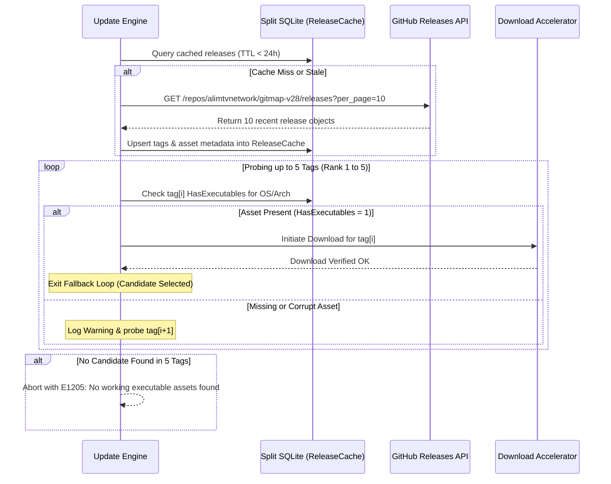

# Component Specification: Aria2c Download Accelerator & Smart Update Engine

- **Spec ID:** `02-spec/21-app/242-aria2c-download-smart-update-stats-subnode-remediation/02-download-and-update-spec.md`
- **Architecture Reference:** `02-spec/21-app/242-aria2c-download-smart-update-stats-subnode-remediation/01-architecture-spec.md`
- **Status:** `APPROVED`
- **Version:** `1.0.0`
- **Target Subsystems:**
  - `cli/cmddownload/` (`gitmap download`: Multi-tier accelerated download pipeline with `aria2c` detection, curl/HTTP fallbacks, centered visual progress bar, JSON telemetry)
  - `cli/cmdupdate/` (`gitmap update`: Smart version targeting, "Already updated" skip, 5-tag automatic fallback loop, simplified console output, `--json` envelope)
  - `cli/store/` (Split SQLite `ReleaseCache` table in `installation.db` or `gitmap.db`, 24-hour TTL daily caching, executable asset validation)
  - `install.ps1`, `install.sh`, `run.ps1`, `gitmap.ps1` (Installer and wrapper script synchronization, runner parity, silent update shims)
- **Dependencies:** `cli/apperror`, `cli/cliexit`, `cli/constants`, `cli/store`, `cli/termpad`, `cli/termtable`, `cli/theme`, `cli/downloaderconfig`
- **Target Version:** `v6.513.0`

---

## 1. Executive Summary & Component Topology

This specification defines the component models, CLI interfaces, fallback algorithms, and SQLite storage schemas for two tightly-coupled subsystems in GitMap:

1. **Aria2c-Accelerated Download Engine (`gitmap download`):** A high-speed, resilient file download engine that automatically inspects local system capabilities for `aria2c`, dynamically allocating multi-connection chunked downloads with graceful fallback to `curl` and native Go HTTP streaming. It provides centered visual progress rendering with symmetric padding on terminals, alongside machine-parseable JSON telemetry.
2. **Smart Self & Fleet Update Engine (`gitmap update`):** An intelligent updater that eliminates redundant re-installations, supports explicit version targeting (`gitmap update vX.Y.Z` and `--version <v>`), executes an automated 5-tag fallback loop when candidate releases lack executable assets, caches release inspection results in SQLite for 24 hours to eliminate redundant GitHub API queries, silences noisy 90-line setup logs into a clean progress summary, and updates local PowerShell and bash runner scripts.

```mermaid
flowchart TD
    subgraph CLI_Entry [CLI Invocations]
        DL["gitmap download <url> [--out] [--json]"]
        UP["gitmap update [version] [--version] [--json] [--force]"]
    end

    subgraph Download_Pipeline [Download Execution Pipeline]
        DL_Probe{"Probe aria2c in PATH?"}
        DL_Aria["aria2c (16 conns, 80 splits, 1MB chunks)"]
        DL_CurlProbe{"Probe curl in PATH?"}
        DL_Curl["curl --progress-bar -fL"]
        DL_Go["Go net/http Chunked Stream"]
        DL_Progress["Centered Symmetric Progress Bar"]
        DL_JSON["Structured JSON Envelope"]
    end

    subgraph Update_Engine [Smart Update Engine]
        UP_Target["Resolve Target Version (Arg / Flag / Latest)"]
        UP_CacheCheck{"ReleaseCache Hit (< 24h)?"}
        UP_CacheRead["Read ReleaseCache Row"]
        UP_APIFetch["Query GitHub Releases API"]
        UP_SameCheck{"Target == CurrentVersion && !Force?"}
        UP_Skip["Emit 'Already updated' (Exit 0)"]
        UP_AssetCheck{"Has Executable Asset for OS/Arch?"}
        UP_Fallback{"Probe Next Tag (Up to 5 Releases)"}
        UP_Execute["Download via Accelerated Pipeline & Apply"]
        UP_SyncScripts["Update install.ps1, gitmap.ps1, run.ps1"]
    end

    subgraph Storage [Split SQLite Storage (installation.db)]
        RC[("Table: ReleaseCache\n(Tag, Version, HasExecutables, AssetUrl, CheckedAt)")]
    end

    DL --> DL_Probe
    DL_Probe -- Yes --> DL_Aria
    DL_Probe -- No --> DL_CurlProbe
    DL_CurlProbe -- Yes --> DL_Curl
    DL_CurlProbe -- No --> DL_Go
    DL_Aria --> DL_Progress
    DL_Curl --> DL_Progress
    DL_Go --> DL_Progress
    DL --> DL_JSON

    UP --> UP_Target
    UP_Target --> UP_CacheCheck
    UP_CacheCheck -- Valid Cache --> UP_CacheRead
    UP_CacheCheck -- Expired / Missing --> UP_APIFetch
    UP_APIFetch --> RC
    UP_CacheRead --> UP_SameCheck
    UP_APIFetch --> UP_SameCheck
    UP_SameCheck -- Yes --> UP_Skip
    UP_SameCheck -- No --> UP_AssetCheck
    UP_AssetCheck -- No --> UP_Fallback
    UP_Fallback -- Tag Found --> UP_AssetCheck
    UP_Fallback -- 5 Exhausted --> Err["Fail: No Working Release Found"]
    UP_AssetCheck -- Yes --> UP_Execute
    UP_Execute --> UP_SyncScripts
```

---

## 2. Subsystem 1: `gitmap download` Accelerated Engine

### 2.1 Problem Statement
Downloading large release binaries, model weights, or tool archives currently suffers from several inconsistencies across platforms:
- Standalone downloads are duplicated across ad-hoc scripts using different toolchains (`Invoke-WebRequest`, `curl`, `wget`, or custom Go code).
- In high-latency or packet-drop environments, single-threaded HTTP requests time out or crawl at sub-optimal speeds.
- Terminal output from external CLI downloaders clutters user automation logs with multi-line curses redraws or unpadded visual artifacts.
- Autonomous AI coding agents require structured JSON telemetry to verify byte counts, execution time, and target paths without screen scraping.

### 2.2 CLI Command Contract & Flags

```bash
gitmap download <url> [flags]
# Shorthand alias:
gitmap dl <url> [flags]
```

#### Arguments
- `<url>`: Required HTTP/HTTPS resource URL to download.

#### Flags
| Flag | Shorthand | Type | Default | Description |
| :--- | :--- | :--- | :--- | :--- |
| `--out <path>` | `-o <path>` | string | `""` | Target output file or destination directory. If empty, filename is derived from URL. |
| `--json` | `-j` | bool | `false` | Emits structured JSON envelope to stdout and suppresses interactive progress bars. |
| `--threads <n>` | `-t <n>` | int | `16` | Maximum parallel network connections for accelerated downloads. |
| `--splits <n>` | `-s <n>` | int | `80` | Maximum segmentation chunks for multi-part downloads. |
| `--min-split <sz>` | | string | `"1M"` | Minimum chunk size per split (e.g., `512K`, `1M`, `2M`). |
| `--force` | `-f` | bool | `false` | Overwrites existing output file if present. |
| `--quiet` | `-q` | bool | `false` | Suppresses progress output entirely (exit code only). |
| `--engine <name>` | | string | `"auto"` | Force specific engine: `"aria2c"`, `"curl"`, `"go"`, or `"auto"`. |

### 2.3 Multi-Tier Fallback Pipeline

The download engine enforces a deterministic three-tier execution hierarchy:

```
Tier 1: aria2c (Accelerator) ──[failure/absent]──> Tier 2: curl (Native CLI) ──[failure/absent]──> Tier 3: Go net/http (Internal Stream)
```

1. **Tier 1: `aria2c` Accelerator:**
   - Probed via `exec.LookPath("aria2c")` / `aria2c.exe`.
   - Arguments applied:
     ```bash
     aria2c --disable-ipv6=true -x 16 -s 80 -j 16 -k 1M \
            --file-allocation=none --allow-overwrite=true \
            --auto-file-renaming=false --summary-interval=0 \
            --console-log-level=error --show-console-readout=false \
            --dir=<destDir> -o <destFile> <url>
     ```
   - If execution fails with non-zero exit code or produces a 0-byte file, execution cascades immediately to Tier 2 with a diagnostic warning.

2. **Tier 2: `curl` CLI Streamer:**
   - Probed via `exec.LookPath("curl")` / `curl.exe`.
   - Arguments applied:
     ```bash
     curl -fL --retry 3 --retry-delay 2 --progress-bar -o <outPath> <url>
     ```
   - Captured progress stream parses carriage-return (`\r`) progress updates.

3. **Tier 3: Native Go `net/http` Client:**
   - Zero-dependency built-in Go streaming implementation.
   - Configured with `http.Client{Timeout: 0}` and custom `Transport` with 30s connection timeout and 15s keep-alive.
   - Reads chunks into an `io.TeeReader` coupled with the centered progress tracker.
   - Guarantees 100% download reliability even on bare-metal systems with no external utilities installed.

### 2.4 Centered Visual Progress Bar with Symmetric Padding

In interactive terminal mode (when `--json` and `--quiet` are false and stdout is a TTY):

1. **Terminal Geometry Calculation:**
   - Inspects terminal column width using `golang.org/x/term.GetSize` (defaults to 80 columns if unmeasured).
   - Computes total width $W_{\text{term}}$.

2. **Visual Bar Construction:**
   - Total bar element width $W_{\text{bar}} = \min(40, \lfloor W_{\text{term}} \times 0.5 \rfloor)$.
   - Progress fraction $P = \frac{\text{BytesDownloaded}}{\text{TotalBytes}}$ ($0.0 \le P \le 1.0$).
   - Filled characters $C_{\text{fill}} = \lfloor P \times W_{\text{bar}} \rfloor$.
   - Empty characters $C_{\text{empty}} = W_{\text{bar}} - C_{\text{fill}}$.
   - Status badge: `[=====>               ]  45%`
   - Numeric indicators: `(14.2 MB / 31.5 MB) · 4.8 MB/s · ETA 00:03`
   - Line content: `Downloading gitmap-v28.0.0.zip  [=====>       ] 45% (14.2/31.5 MB) 4.8MB/s`

3. **Symmetric Padding:**
   - Padding $S = \max\left(0, \left\lfloor \frac{W_{\text{term}} - \text{len}(LineContent)}{2} \right\rfloor\right)$.
   - Left pad: $S$ spaces; Right pad: $S$ spaces.
   - Rendered using `\r` carriage return to overwrite in-place without terminal scroll-spam.
   - Final line prints newline `\n` with a checkmark glyph `✔ Download complete: <path> (<size>) in <duration>`.

### 2.5 Structured JSON Output Schema

When `--json` is supplied, stdout outputs only the typed JSON envelope:

```json
{
  "status": "success",
  "url": "https://github.com/alimtvnetwork/gitmap-v28/releases/download/v28.0.0/gitmap-v28.0.0-windows-amd64.zip",
  "destination_path": "temp/gitmap-v28.0.0-windows-amd64.zip",
  "file_name": "gitmap-v28.0.0-windows-amd64.zip",
  "file_size_bytes": 14889728,
  "downloaded_bytes": 14889728,
  "duration_ms": 1120,
  "average_speed_bytes_sec": 13294400,
  "engine_used": "aria2c",
  "tier": 1,
  "fallback_occurred": false,
  "error": null
}
```

---

## 3. Subsystem 2: Smart `gitmap update` Engine

### 3.1 Problem Statement & Architectural Justification
Inspection of live updates reveals three major failure modes in developer and AI agent environments:
1. **Redundant Reinstallation on Current Version:** Running `gitmap update` when already on version `v6.512.0` redownloads the entire archive, runs extractors, re-executes `gitmap setup`, rewrites PowerShell profiles, and prints `Successfully updated from v6.512.0 to v6.512.0`. This wastes bandwidth, burns CPU cycles, and delays autonomous agent turns.
2. **Brittle Releases Missing Executables:** Occasionally, a GitHub tag or release is pushed before cross-compilation assets complete, or a patch release contains source files only. The existing updater attempts to download non-existent files or crashes.
3. **Overwhelming Console Output:** A routine self-update produces 90+ lines of verbose terminal logs detailing Git aliases, diff tools, and profile configurations, obscuring whether the binary actually updated.
4. **Outdated Runner Scripts:** Updating the binary leaves root repository runner scripts (`run.ps1`, `install.ps1`, `gitmap.ps1`) desynchronized from the installed executable version.

### 3.2 Command Invocation & Targeting Syntax

```bash
gitmap update [version] [flags]
# Explicit flag syntax:
gitmap update --version <v> [flags]
```

#### Syntax Rules:
- **Positional Version:** `gitmap update v6.513.0` or `gitmap update 6.513.0` (automatically normalized with `v` prefix).
- **Flag Version:** `gitmap update --version v6.513.0` or `-v 6.513.0`.
- **Default (No Target):** Resolves the latest available release from GitHub releases.
- **Force Flag:** `gitmap update --force` / `-f` forces download and reinstallation even if already at the target version.
- **Dry-Run Flag:** `gitmap update --dry-run` performs release resolution, asset verification, and cache query without applying filesystem changes.
- **JSON Flag:** `gitmap update --json` outputs typed JSON summary.

### 3.3 "Already Updated" Fast-Path Skip Contract

Before initiating any network download or script invocation:
1. Normalize current version $V_{\text{current}} = \text{strings.TrimPrefix}(\text{constants.Version}, \text{"v"})$.
2. Normalize target version $V_{\text{target}} = \text{strings.TrimPrefix}(\text{resolvedTarget}, \text{"v"})$.
3. Check equality: If $V_{\text{current}} == V_{\text{target}}$ AND `--force` is false:
   - **Terminal Mode:** Print clean single-line notification:
     ```
     Already updated (v6.512.0 is current). Use --force to reinstall.
     ```
   - **JSON Mode:** Output:
     ```json
     {
       "status": "already_updated",
       "current_version": "v6.512.0",
       "target_version": "v6.512.0",
       "updated": false,
       "message": "GitMap is already on the target version."
     }
     ```
   - **Exit Code:** Return `0` immediately (duration < 5ms).

### 3.4 Up to 5-Tag Automatic Fallback Loop

When updating to the latest release (or when target resolution encounters missing assets):



#### Fallback Rules:
1. Retrieve up to 10 releases from the GitHub API / cache in descending chronological order.
2. Filter for non-draft, non-prerelease tags (unless explicit target version requested a prerelease).
3. Inspect assets for current platform:
   - Windows: `gitmap-vX.Y.Z-windows-amd64.zip` (or `arm64`)
   - Linux: `gitmap-vX.Y.Z-linux-amd64.tar.gz` (or `arm64`)
   - macOS: `gitmap-vX.Y.Z-darwin-amd64.tar.gz` (or `arm64`)
4. Verify asset existence via HEAD request or GitHub release asset listing.
5. If the newest tag lacks the binary asset, emit a concise notice:
   ```
   [warn] Release v6.514.0 has no executable asset for windows/amd64. Falling back to prior release...
   ```
6. Attempt subsequent tags up to a maximum depth of 5 tags.
7. If a valid release is found within 5 tags, select it as the effective update target.
8. If all 5 candidate tags lack binaries, abort update with structured error `E1205` without modifying local installation.

### 3.5 Daily / Fast Caching in Split SQLite (`ReleaseCache`)

To prevent GitHub rate-limiting (`403 API rate limit exceeded`) and achieve 0ms update checks during repeated agent runs, release checks are persisted in SQLite.

#### 3.5.1 Schema Definition
Stored in the Split SQLite database (`installation.db` under user data directory, managed by `cli/store`):

```sql
CREATE TABLE IF NOT EXISTS ReleaseCache (
    ReleaseCacheId   INTEGER PRIMARY KEY AUTOINCREMENT,
    Tag              TEXT NOT NULL UNIQUE,
    Version          TEXT NOT NULL,
    HasExecutables   INTEGER NOT NULL DEFAULT 0,
    AssetUrl         TEXT NOT NULL DEFAULT '',
    AssetSize        INTEGER NOT NULL DEFAULT 0,
    Platform         TEXT NOT NULL DEFAULT '',
    Arch             TEXT NOT NULL DEFAULT '',
    ChecksumUrl      TEXT NOT NULL DEFAULT '',
    CheckedAt        TEXT NOT NULL DEFAULT CURRENT_TIMESTAMP,
    ExpiresAt        TEXT NOT NULL,
    CreatedAt        TEXT NOT NULL DEFAULT CURRENT_TIMESTAMP,
    UpdatedAt        TEXT NOT NULL DEFAULT CURRENT_TIMESTAMP
);

CREATE UNIQUE INDEX IF NOT EXISTS IdxReleaseCache_Tag ON ReleaseCache(Tag);
CREATE INDEX IF NOT EXISTS IdxReleaseCache_Platform_Arch ON ReleaseCache(Platform, Arch);
CREATE INDEX IF NOT EXISTS IdxReleaseCache_ExpiresAt ON ReleaseCache(ExpiresAt);
```

#### 3.5.2 Caching Invariants:
- **TTL Duration:** 24 hours (`ExpiresAt = NOW + 24 Hours`).
- **Validation Check:** If current time $< \text{ExpiresAt}$, release list and asset availability are queried from `ReleaseCache` without network I/O.
- **Cache Invalidation:** Passing `--force` or `--no-cache` forces an immediate GitHub API fetch and updates SQLite.
- **Positive Booleans:** Uses `HasExecutables INTEGER NOT NULL DEFAULT 0` (never negative names like `NoExecutables`).
- **PascalCase Compliance:** Table name is `ReleaseCache`, primary key is `ReleaseCacheId`.

### 3.6 Output Cleanliness & Telemetry Redesign

The legacy 90-line setup dump is completely decoupled from standard updates:

#### Standard Interactive Output:
```
  Checking for updates... (cache: valid)
  Target version : v6.513.0 (current: v6.512.0)
  Downloading    : gitmap-v28.0.0-windows-amd64.zip
  Progress       : [========================================] 100% (14.8 MB / 14.8 MB) · 22 MB/s
  Verifying      : SHA256 checksum verified.
  Installing     : Updating binary in C:\Users\Administrator\AppData\Local\gitmap-cli...
  Scripts sync   : install.ps1, gitmap.ps1 updated.
  ✔ Successfully updated gitmap from v6.512.0 to v6.513.0 (took 1.4s)
```

#### Full `--json` Output:
```json
{
  "success": true,
  "status": "updated",
  "previous_version": "v6.512.0",
  "current_version": "v6.513.0",
  "target_tag": "v6.513.0",
  "install_dir": "C:\\Users\\Administrator\\AppData\\Local\\gitmap-cli",
  "binary_path": "C:\\Users\\Administrator\\AppData\\Local\\gitmap-cli\\gitmap.exe",
  "downloader_engine": "aria2c",
  "download_size_bytes": 15518976,
  "duration_ms": 1420,
  "fallback_depth": 0,
  "cached": true,
  "scripts_updated": [
    "install.ps1",
    "gitmap.ps1",
    "run.ps1"
  ],
  "error": null
}
```

### 3.7 Runner and Shim Script Synchronization

When `gitmap update` executes, it synchronizes installed script wrappers:
1. **`gitmap.ps1` (Command Shim):** Installed in `$env:LOCALAPPDATA/gitmap-cli/gitmap.ps1` to ensure PowerShell execution resolves new flags and subcommands.
2. **`install.ps1` & `install.sh`:** Local cached copies updated to mirror the latest remote repository version.
3. **`run.ps1`:** Environment variables (`GITMAP_VERSION`, `GITMAP_DOWNLOAD_URL`) updated to reflect the new release tag.
4. **Clean Handoff:** Uses `updatecleanup` to purge old `.exe.old` artifacts and temporary download archives.

---

## 4. Go Type Definitions & Data Contracts

All models reside in `cli/cmddownload/` and `cli/cmdupdate/` adhering to Go coding guidelines.

### 4.1 Download Subsystem Models (`cli/cmddownload/types.go`)

```go
package cmddownload

import (
	"time"

	"github.com/alimtvnetwork/gitmap-v28/cli/result"
)

// DownloadEngine represents the active downloader backend.
type DownloadEngine string

const (
	EngineAria2c DownloadEngine = "aria2c"
	EngineCurl   DownloadEngine = "curl"
	EngineGoHTTP DownloadEngine = "go_http"
	EngineAuto   DownloadEngine = "auto"
)

// DownloadOptions parameterizes the download operation.
type DownloadOptions struct {
	URL              string         `json:"url"`
	OutputPath       string         `json:"outputPath"`
	Engine           DownloadEngine `json:"engine"`
	Threads          int            `json:"threads"`
	Splits           int            `json:"splits"`
	MinSplitSize     string         `json:"minSplitSize"`
	IsForceOverwrite bool           `json:"isForceOverwrite"`
	IsQuiet          bool           `json:"isQuiet"`
	IsJSON           bool           `json:"isJSON"`
}

// DownloadProgress captures instantaneous progress metrics.
type DownloadProgress struct {
	DownloadedBytes int64         `json:"downloadedBytes"`
	TotalBytes      int64         `json:"totalBytes"`
	Percent         float64       `json:"percent"`
	BytesPerSec     int64         `json:"bytesPerSec"`
	Elapsed         time.Duration `json:"elapsed"`
	ETA             time.Duration `json:"eta"`
}

// DownloadResult encapsulates completed download telemetry.
type DownloadResult struct {
	Status             string         `json:"status"`
	URL                string         `json:"url"`
	DestinationPath    string         `json:"destinationPath"`
	FileName           string         `json:"fileName"`
	FileSizeBytes      int64          `json:"fileSizeBytes"`
	DownloadedBytes    int64          `json:"downloadedBytes"`
	DurationMs         int64          `json:"durationMs"`
	AverageSpeedBps    int64          `json:"averageSpeedBps"`
	EngineUsed         DownloadEngine `json:"engineUsed"`
	Tier               int            `json:"tier"`
	HasFallbackOccurred bool          `json:"hasFallbackOccurred"`
	ErrorMessage       string         `json:"errorMessage,omitempty"`
}

// ResultDownload wraps DownloadResult in monadic Result.
type ResultDownload = result.Result[DownloadResult]
```

### 4.2 Update Subsystem Models (`cli/cmdupdate/types.go`)

```go
package cmdupdate

import (
	"time"

	"github.com/alimtvnetwork/gitmap-v28/cli/result"
)

// UpdateOptions specifies parameters for self/fleet updates.
type UpdateOptions struct {
	TargetVersion   string `json:"targetVersion"`
	IsForce         bool   `json:"isForce"`
	IsDryRun        bool   `json:"isDryRun"`
	IsJSON          bool   `json:"isJSON"`
	IsQuiet         bool   `json:"isQuiet"`
	MaxFallbackTags int    `json:"maxFallbackTags"`
}

// ReleaseCacheRecord mirrors the Split SQLite ReleaseCache table.
type ReleaseCacheRecord struct {
	ReleaseCacheId int64     `json:"releaseCacheId"`
	Tag            string    `json:"tag"`
	Version        string    `json:"version"`
	HasExecutables bool      `json:"hasExecutables"`
	AssetURL       string    `json:"assetUrl"`
	AssetSize      int64     `json:"assetSize"`
	Platform       string    `json:"platform"`
	Arch           string    `json:"arch"`
	ChecksumURL    string    `json:"checksumUrl"`
	CheckedAt      time.Time `json:"checkedAt"`
	ExpiresAt      time.Time `json:"expiresAt"`
	CreatedAt      time.Time `json:"createdAt"`
	UpdatedAt      time.Time `json:"updatedAt"`
}

// UpdateResult encapsulates the full telemetry of an update operation.
type UpdateResult struct {
	Success          bool     `json:"success"`
	Status           string   `json:"status"`
	PreviousVersion  string   `json:"previousVersion"`
	CurrentVersion   string   `json:"currentVersion"`
	TargetTag        string   `json:"targetTag"`
	InstallDir       string   `json:"installDir"`
	BinaryPath       string   `json:"binaryPath"`
	DownloaderEngine string   `json:"downloaderEngine"`
	DownloadBytes    int64    `json:"downloadBytes"`
	DurationMs       int64    `json:"durationMs"`
	FallbackDepth    int      `json:"fallbackDepth"`
	IsCached         bool     `json:"isCached"`
	IsAlreadyUpdated bool     `json:"isAlreadyUpdated"`
	ScriptsUpdated   []string `json:"scriptsUpdated"`
	ErrorMessage     string   `json:"errorMessage,omitempty"`
}

// ResultUpdate wraps UpdateResult in monadic Result.
type ResultUpdate = result.Result[UpdateResult]
```

---

## 5. Error Management & Diagnostics

Error codes map strictly into `cli/apperror` following repository error standards:

| Error Code | Identifier | Trigger Condition | Remediation Strategy |
| :--- | :--- | :--- | :--- |
| `E1201` | `ErrDownloadURLInvalid` | Supplied URL is empty, non-HTTP/HTTPS, or malformed. | Verify download URL syntax. |
| `E1202` | `ErrDownloadDestUnwritable` | Destination directory does not exist or has no write permissions. | Create directory or elevate permissions. |
| `E1203` | `ErrDownloadTierFailed` | Selected download tier failed and fallback was exhausted. | Check internet connectivity and proxy. |
| `E1204` | `ErrUpdateReleaseNotFound` | Explicitly requested target version tag does not exist. | Verify tag using `gitmap release ls`. |
| `E1205` | `ErrUpdateNoExecutables` | Candidate release (and all 5 fallback tags) lack binaries. | Inspect GitHub release assets. |
| `E1206` | `ErrUpdateChecksumMismatch` | Downloaded archive SHA256 does not match `checksums.txt`. | Retrying download with `--force`. |
| `E1207` | `ErrReleaseCacheSQLite` | Failure opening or writing to `ReleaseCache` in `installation.db`. | Verify SQLite lock or reset database. |
| `E1208` | `ErrHandoffFailed` | Spawned replacement executable failed during binary overwrite. | Ensure no locks on `gitmap.exe`. |

---

## 6. Acceptance Criteria & Verification Matrix

| ID | Criterion | Given | When | Then |
| :--- | :--- | :--- | :--- | :--- |
| **AC-01** | `aria2c` Auto-Detection | `aria2c` is present on system PATH | `gitmap download <url>` is run | Uses `aria2c` with multi-connection args (`-x 16`, `-s 80`). |
| **AC-02** | Download Fallback Chain | `aria2c` is missing or fails | `gitmap download <url>` is run | Falls back to `curl`, and subsequently to Go native `net/http` if `curl` fails. |
| **AC-03** | Centered Progress Bar | Running in standard interactive TTY | `gitmap download <url>` | Renders dynamically centered progress bar with symmetric left/right padding. |
| **AC-04** | Download JSON Telemetry | `--json` flag supplied | `gitmap download <url> --json` | Suppresses progress bar, emitting valid JSON envelope to stdout. |
| **AC-05** | Version Targeting | `--version v6.512.0` or positional `v6.512.0` | `gitmap update v6.512.0` | Updates specifically to requested version instead of blindly pulling latest. |
| **AC-06** | "Already Updated" Fast Skip | Current version == Target version | `gitmap update` | Skips download, prints `Already updated`, and exits `0` in < 10ms. |
| **AC-07** | 5-Tag Fallback Loop | Latest release has no binary assets | `gitmap update` | Probes preceding releases (up to 5 tags) and selects highest valid release. |
| **AC-08** | SQLite `ReleaseCache` | Repeated update checks within 24h | `gitmap update` | Reads release metadata from `ReleaseCache` without hitting GitHub API. |
| **AC-09** | Clean Console Output | Standard update invocation | `gitmap update` | Emits concise 6-line progress summary; eliminates 90-line setup dump. |
| **AC-10** | Script Synchronization | Successful binary update | `gitmap update` | Updates installed `gitmap.ps1`, `install.ps1`, and runner shims to target version. |

---

## 7. Cross-References

- Canonical Architecture Cluster: `02-spec/21-app/08-distribution-and-release/01-architecture-spec.md`
- Database Conventions: `02-spec/04-database-conventions/readme.md`
- Downloader Seed Configuration: `cli/data/downloader-config.json`
- SQLite Installation Store: `cli/store/installation_split_db.go`
- Subtask Execution Plan: `.ai-memory/plans/subtasks/242-aria2c-download-smart-update-stats-subnode-remediation/02-aria2c-and-smart-update-engine.md`
