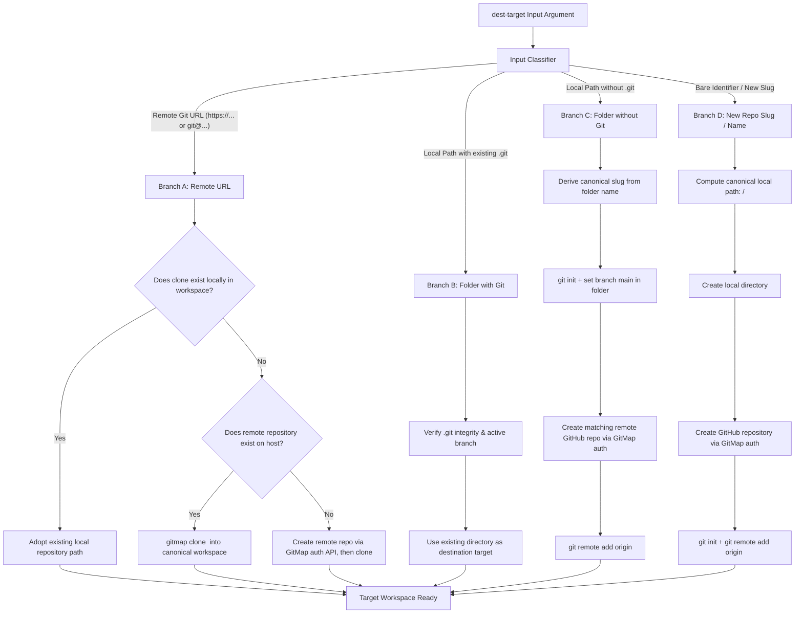

# Specification: Universal "Repo Feature" Destination Resolver

**Document ID:** `02-spec/21-app/269-summary-nodes-merge-ai-and-repo-feature/repo-feature.md`  
**Classification:** Core Application Specification (`02-spec/21-app`)  
**Feature Name:** `repo feature` (Universal Destination Target Resolution Engine)  
**Status:** `ratified`  
**Related Commands:** `gitmap merge-ai` (`gitmap ma`), `gitmap clone`, `gitmap init`, `gitmap workspace`  

---

## 1. Overview & Definition

Anytime the term **"repo feature"** is invoked in GitMap architecture, specifications, or AI instructions, it refers to the **Universal Destination Target Resolution Engine**.

The purpose of **repo feature** is to accept any arbitrary destination identifier (`<dest-target>`) and automatically resolve, authenticate, create, clone, or initialize it into a fully functional local and remote Git repository without requiring manual multi-step configuration.

---

## 2. Supported Target Types & Resolution Semantics

### Branch A: Remote Git URL
* **Input Examples:**
  * `https://github.com/my-org/my-target-repo.git`
  * `git@github.com:my-org/my-target-repo.git`
* **Resolution Logic:**
  1. Parse the organization/owner and repository slug from the URL.
  2. Query `gitmap.db` to check if a clone of this URL already exists in the local workspace.
  3. **If exists locally:** Resolve destination to that existing local directory.
  4. **If not present locally:**
     * Probe remote URL using GitMap's authenticated credential token.
     * If repository exists remotely: Execute high-speed clone into `<workspace>/<slug>`.
     * If repository does *not* exist remotely: Create the repository under the authenticated user's organization on GitHub, initialize the local directory, and configure remote origin.

### Branch B: Local Folder with Existing `.git`
* **Input Examples:**
  * `d:/work/existing-project`
  * `./relative/path/to/my-repo`
* **Resolution Logic:**
  1. Inspect directory for `.git` directory or file (supporting both standard repos and worktrees).
  2. Verify repository health (`git status`, active branch).
  3. Use the directory directly as the destination workspace.
  4. Preserve all existing history, branches, and working tree files.

### Branch C: Local Folder without `.git`
* **Input Examples:**
  * `d:/work/unversioned-folder`
  * `C:/scratch/my-legacy-app`
* **Resolution Logic:**
  1. Detect that directory exists but contains no `.git` structure.
  2. Extract folder base name as the `slug` (normalized to kebab-case).
  3. Execute `git init -b main` inside the folder.
  4. Query active logged-in GitHub account via GitMap (`gitmap login --status`).
  5. Call GitHub API to create a remote repository matching the slug under the authenticated account.
  6. Execute `git remote add origin <created-remote-url>`.
  7. Return initialized local path.

### Branch D: Bare Repository Name / Slug
* **Input Examples:**
  * `new-microservice`
  * `payment-router-v2`
* **Resolution Logic:**
  1. Detect that the input is a single token containing no path separators (`/`, `\`) and no protocol scheme (`https://`, `git@`).
  2. Normalize slug (lowercase, alphanumeric with hyphens).
  3. Resolve destination workspace path: `<configured-workspace-root>/<slug>` (e.g. `d:/work/<slug>`).
  4. Create local folder.
  5. Check authenticated Git credentials from GitMap vault.
  6. Create new GitHub repository under authenticated account via API.
  7. Execute `git init -b main` in the created folder and link origin to remote.
  8. Return local path.

---

## 3. Authentication & Credential Invariant

1. **Zero Interactive Prompts:** The resolver must never prompt the user interactively in headless or AI-agent environments.
2. **Credential Vault Integration:** Uses credentials stored in GitMap's secure credential vault (`gitmap login --token` or global git configuration) to authenticate with GitHub/Git hosts.
3. **Multi-User Context:** When multiple accounts are configured, the resolver selects the default active account unless overridden by `AGY_ACCOUNT` or `--account <name>`.
4. **Scope Requirements:** Remote repo creation requires `repo` or `admin:org` OAuth scopes. If scopes are insufficient, the resolver returns an actionable `appfault.AppError` explaining the missing permission.

---

## 4. Preservation & Non-Destructive Invariant

1. **Never Delete Existing Files:** If a target folder contains files prior to resolution, **repo feature** must never clean, wipe, or overwrite existing content. It must adopt the existing files as the base staging state.
2. **Deterministic Workspace Location:** All generated directories must reside strictly within the workspace boundaries established in `gitmap.db` (e.g., `d:/work/`).
3. **Audit Trail:** Every resolution action (cloning, initializing, creating remote) must be logged with timestamp and target path to `.gitmap/audit.db`.

---

## 5. Usage in Downstream GitMap Commands

Commands consuming **repo feature** syntax:
* `gitmap merge-ai <dest-target> <sources...>`
* `gitmap ma <dest-target> <sources...>`
* `gitmap clone-as <dest-target> <source-url>`
* `gitmap init-remote <dest-target>`

Whenever an AI agent or specification references `<dest-target>` with the tag `(repo feature)`, it signifies that the target resolution strictly follows the rules codified in this document.
