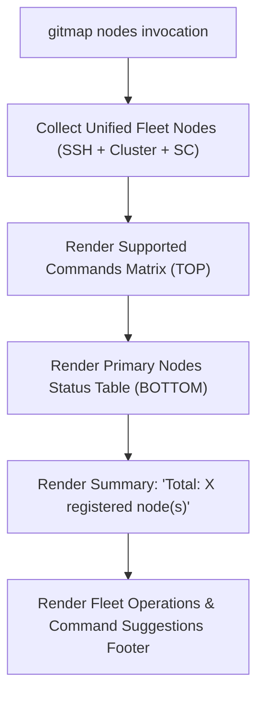
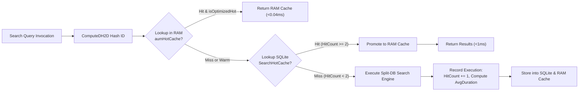
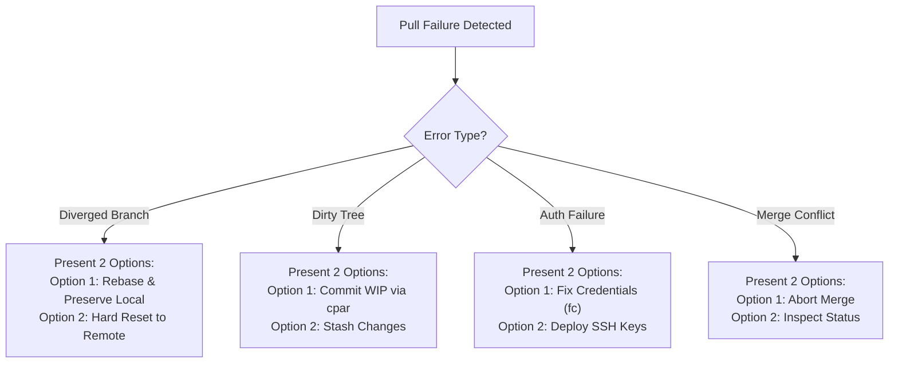

# Architecture Specification: GitMap Nodes Reordering, AUM Search Cache Lifecycle & Repo Deduplication Sub-Node Solutions

> **Document ID:** `02-spec/21-app/65-gitmap-update-all-zip-and-fixes/01-architecture-spec.md`  
> **Topic Area:** Fleet Nodes Table Sequence, AUM Search Split-DB Cache Engine, and Pull Repository Deduplication & Remediation  
> **Status:** `Active`  
> **Target Package Areas:** `cli/cmd/`, `cli/searcher/`, `cli/cmdpull/`, `cli/tests/e2e/`  
> **Related Plan:** [.ai-memory/plans/pending/65-gitmap-update-all-zip-and-fixes.md](../../../.ai-memory/plans/pending/65-gitmap-update-all-zip-and-fixes.md)

---

## User Request (Verbatim)

```text
gitmap update all --include-others
gitmap update all zip --include-others
gitmap update-all-zip --include-others (uaz)

So I think we need to fix some of the Git map issues. First of all, if we do the Git map nodes, it shows this table. I think the top table that we see, that should be in the bottom part. That's the first thing. Second is that the aliasing worker and things like that, we don't need the worker role in the second table. That's the first thing. Second subsystem is fine. Okay. All right. So you can actually, if you reduce the roles column, the table looks nice. Okay, that's the first observation. The second thing is that in the Git map, there is no way to update all the ADM exe. That's another issue I think you need to work on. Okay? Another command that I want you to introduce is the update all zip. Okay? Update all zip. You can also use include others with the update zip, or let's say Git map update all. If we use the include others, then it will try to download the AGM package on all other machines as well.


So how this update all in Zipl will work? The first time, so we need to have a system that I think you need to make updates in other installer with some flags. Way that it's going to work is that it's going to update first time in the current machine and zip the uploaded package and deliver to all these other machines using SCP, okay? And put it to a temp directory and then run installer script, depending on the OS. It could be PowerShell, it could be Shell, and it would install an update in all these machine together. So that is powerful because that also saves the network and other stuff, to reduce traffic, and that is quite powerful. Can we do that? That's the first thing. Second is that can you design this system, and can you make sure that it works? You can also test it in other machines, other worker machines, okay? 


Also for the Git map, I want you to test and understand how the cache is removed and let's say, updated during the AUM search. And also I want you to check these searches that originally works are now. So I want you to find out similar, so what you can find a test case in our system, it's not like these images needs to be even I request you not to put like Amazon, Prize of Asia, do not put these names. Just put different names that you get the idea, and I will make sure that it will work. Now, for the prompt section. Now for the prompt section, I'm coding that into the V6 prompt. As I mean, execute the current task with the n8n steps V6, that prompt. I think that already has the Git map to run the command through Git map. So I think this type of code example needs to be there. So rather than writing like this, one needs to write, or AI needs to write like using Git map so that everything is available. But one more thing I do see here is that why do we have the same package repeated twice?


If let's say package is repeated, then the best way to deal with it is to use its two different paths so that I can understand. That's the first thing. Second, if a package failed, and you mentioned that it failed, next step, you do a sub-command-- I mean, sub-node, and then provide the solution if you have two different solutions. Okay? Try to do that. That would be effective and helpful. One more thing. The .git map should not be ignored. Inside the .git map, the backup folder should be ignored. Okay? But user can choose to ignore if they like. Does this make sense?


So, a little bit you need to work on the AGM package as well, because AGM, this represents Anti-Gravity Manager, so that you can see that the Anti-Gravity Manager is also exported. First download it and then export it using SCP, and then download on all these machines. You can test it from one machine to the another, which is absolutely fine. So let me know your thoughts. What do you think? And can you implement this? Firstly, start all these tasks as I have mentioned. Write your spec first and then also 3D plan modes. This is very important. And do you understand
```

---

## 1. Domain Overview & Scope Separation

This specification governs three modular architectural capabilities assigned to Spec Author 01:
1. **Fleet Nodes Table Sequence Inversion & Column Pruning**: Reordering `gitmap nodes` display so the Commands Matrix appears first, pruning redundant `ROLE` columns from the matrix, and placing the primary status table and summary count at the bottom.
2. **AUM Search Cache Lifecycle & Safe Test Fixtures**: Clarifying in-memory `MemoryCache` and SQLite `SearchHotCache` transitions, implementing explicit `gitmap search clean` cache purges with database vacuuming, and writing hermetic tests with synthetic entity names.
3. **Repository Deduplication & Structured Sub-Node Solutions**: Eliminating duplicate repositories caused by Windows path case variations, disambiguating identical repository names with distinct path annotations, and rendering hierarchical sub-node options (Option 1 vs Option 2) for pull remediation.

*(Multi-node update engine with zip SCP distribution, prompt guidelines replacing raw `rg` with `gitmap`, and `.gitignore` policies are authored in disjoint specification documents by Author 02).*

---

## 2. GitMap `nodes` Command Table Layout & Role Pruning

### 2.1 Problem Analysis
Currently, `gitmap nodes` renders the output in the following order:
1. Primary Node Status Table: Shows individual nodes (`ALIAS`, `ROLE`, `HOST (IP:PORT)`, `USER`, `STATUS`, `ENROLLED`) followed immediately by `Total: %d registered node(s)`.
2. Supported Commands Matrix: Shows `NODE (ALIAS)`, `ROLE`, `SUBSYSTEMS`, and `SUPPORTED COMMANDS & CLUSTERS`.
3. Command suggestions and tips footer.

This ordering has two UX drawbacks:
- The Commands Matrix separates the primary node list from the summary footer, making the table look disconnected.
- In the Commands Matrix, repeating the `ROLE` column (`worker`, `control`) adds visual clutter because the node's cluster role is already detailed in the status table and does not affect the commands syntax.

### 2.2 Target Sequence & Visual Hierarchy
The rendering sequence in `renderUnifiedNodesTable(out io.Writer, nodes []UnifiedFleetNode)` is inverted:



### 2.3 Commands Matrix Header & Column Alignment
The `ROLE` column is removed from the Commands Matrix. The recovered horizontal space (14 characters) is allocated to the `SUPPORTED COMMANDS & CLUSTERS` column and `SUBSYSTEMS` column while preserving the 110-character line width divider:

#### Prior Header:
```text
  NODE (ALIAS)     ROLE           SUBSYSTEMS           SUPPORTED COMMANDS & CLUSTERS
  --------------------------------------------------------------------------------------------------------------
```

#### New Header:
```text
  NODE (ALIAS)     SUBSYSTEMS             SUPPORTED COMMANDS & CLUSTERS
  --------------------------------------------------------------------------------------------------------------
```

#### Column Width Allocations:
- `colAlias`: 16 characters (`padCell(..., 16)`)
- `colSubsys`: 22 characters (`padCell(..., 22)`)
- `colCmds`: 70 characters (`padCell(..., 70)`)
- Total Width: $16 + 1 + 22 + 1 + 70 = 110$ characters (accounting for inter-column spaces).

### 2.4 Primary Status Table Preservation
The primary status table is rendered below the matrix table and retains all columns:
- `ALIAS` (16)
- `ROLE` (14)
- `HOST (IP:PORT)` (22)
- `USER` (14)
- `STATUS` (21)
- `ENROLLED` (19)
- Total summary line: `  Total: %d registered node(s)` printed immediately after the last row.

---

## 3. AUM Search Cache Lifecycle & Safe Test Fixtures

### 3.1 Two-Tier Cache Architecture
AUM search operates across two distinct caching tiers to deliver sub-millisecond keyword and symbol lookups across multi-repository workspaces:



1. **Tier 1: In-Memory Hot Cache (`aumHotCache`)**:
   - Resides in package `cli/searcher` protected by `sync.RWMutex`.
   - Maps `SearchHashID` (`DH2D-<8-char-hex>`) to `AUMSearchStatRecord`.
   - Active when `IsOptimizedHot = true` (`HitCount >= 2`).
   - Serves query responses in $< 0.04\text{ ms}$ with zero I/O allocations.
2. **Tier 2: SQLite Split-DB Persistent Store (`SearchHotCache`)**:
   - Located in `.gitmap/data/search/sql.db` (opened via `store.OpenSearchSplitDB()`).
   - Stores query text, search type, hit count, latency averages, and JSON-encoded match results (`CachedResultsJson`).
   - Survives process restarts; queries loaded from SQLite are promoted to memory upon access.

### 3.2 Deterministic Hash Identifiers (`DH2D`)
Deterministic identifiers are generated by `ComputeDH2D(queryText, searchType string) string`:
- Input string: `strings.ToLower(strings.TrimSpace(searchType)) + ":" + strings.TrimSpace(queryText)`
- Algorithm: SHA-256 truncated to first 4 bytes.
- Format: `DH2D-` prefix followed by 8 uppercase hexadecimal characters (e.g., `DH2D-E8B1A24C`).
- Guarantee: Exact match queries generate identical keys across runs and nodes.

### 3.3 Cache Promotion Lifecycle
- **Query 1 (Cold / Warm Index)**:
  - Cache miss in `LookupHotCachedSearch`.
  - Full search performed across repository index.
  - Recorded via `RecordAUMSearchExecution`: `HitCount = 1`, `IsOptimizedHot = false`, tier is `WARM_INDEX (<1ms)`.
- **Query 2+ (Hot Cache Promotion)**:
  - SQLite record updated: `HitCount = 2`, `IsOptimizedHot = 1`.
  - In-memory record updated: `OptimizationTier = "HOT_MEMORY_CACHE (<0.04ms)"`.
  - Next invocation returns cached matches instantly without query scanning.

### 3.4 Explicit Purge Protocol (`gitmap search clean`)
While individual caches expire or update on repository re-indexing, users must be able to explicitly reset the search cache lifecycle:
- Command: `gitmap search clean`
- Execution Flow:
  1. Acquire write lock on `aumHotCacheMu`.
  2. Clear in-memory map: `aumHotCache = make(map[string]AUMSearchStatRecord)`.
  3. Release write lock.
  4. Open `store.OpenSearchSplitDB()`.
  5. Execute SQL transactional purge:
     ```sql
     DELETE FROM SearchHotCache;
     DELETE FROM SearchQueryLog;
     VACUUM;
     ```
  6. Return count of purged cache entries.
  7. CLI output:
     ```text
     ✓ Search cache purged and database vacuumed (X entries cleared).
     ```

### 3.5 Safe Synthetic Test Fixtures
Tests verifying the search cache lifecycle in `cli/tests/e2e/ssh_agy_nodes_agm_aum_tempe2e_test.go` must strictly observe confidentiality policies:
- **Strict Ban**: NEVER use proprietary, client, or vendor names (no "Amazon", no "Prize of Asia", no proprietary URLs).
- **Mandatory Synthetic Conventions**:
  - Node aliases: `sample_service_node`, `worker_mock_node`, `telemetry_node_alpha`
  - Repository names: `generic_alpha_repo`, `test_fixture_beta`, `mock_service_core`
  - Code search symbols: `TestFixtureService`, `ProcessMockTelemetry`, `AlphaWorkerHandle`

---

## 4. Repository Deduplication & Sub-Node Diagnostic Solutions

### 4.1 Windows Path Variation & Deduplication
On Windows systems, filesystem paths can enter the SQLite database (`store.ListRepos()`) with slight variations in case or separators:
- `<drive>:\work\gitmap` vs `<DRIVE>:\work\gitmap`
- `<drive>:\work\gitmap\` vs `<drive>:\work\gitmap`

In batch operations (`gitmap pull-all`, `gitmap pas`, `gitmap pae`, `gitmap status`), unnormalized paths cause the same repository to be evaluated and rendered multiple times.

#### Architectural Fix:
1. In `cli/cmdpull/pull_efficient.go` inside `resolveAllTrackedRecords()`:
   - Normalize every record path using `filepath.Clean(strings.ToLower(r.AbsolutePath))`.
   - Maintain a `seenPaths := make(map[string]bool)` set.
   - Filter out duplicate records, preserving the first canonical occurrence.

```go
func resolveAllTrackedRecords() []model.ScanRecord {
    db, err := store.OpenDefault()
    if err != nil {
        return nil
    }
    defer db.Close()

    records, err := db.ListRepos()
    if err != nil {
        return nil
    }

    seenPaths := make(map[string]bool, len(records))
    unique := make([]model.ScanRecord, 0, len(records))
    for _, r := range records {
        canonical := filepath.Clean(strings.ToLower(r.AbsolutePath))
        if seenPaths[canonical] {
            continue
        }
        seenPaths[canonical] = true
        unique = append(unique, r)
    }
    return unique
}
```

### 4.2 Disambiguation of Distinct Repositories with Same Name
If two repositories legitimately have the same base folder name but different paths (e.g., `./frontend` and `D:\external\frontend`):
- In `cli/cmdpull/pull_efficient_render.go`, when formatting results:
- Detect duplicate repository names across `allRecords`.
- If a repository name is ambiguous (`nameCount > 1`), format the display line with its distinct path:
  ```text
  • frontend (./frontend)         up-to-date
  • frontend (D:\external\frontend)     +1/-0
  ```

### 4.3 Structured Sub-Node Failure Solutions (Option 1 vs Option 2)
When repository pull or status operations encounter errors, single-line hints are insufficient. The CLI must output structured sub-nodes presenting two concrete alternatives:



#### Data Model (`cli/cmdpull/pull_remediation_hint.go`):
```go
type RemediationSolutionOption struct {
    OptionNumber int    `json:"option_number"`
    Title        string `json:"title"`
    Command      string `json:"command"`
    Description  string `json:"description"`
}

type PullFailureRemediation struct {
    Reason  string                      `json:"reason"`
    Options []RemediationSolutionOption `json:"options"`
}
```

#### Terminal Rendering Specification (`cli/cmdpull/pull_efficient_render.go`):
For failed or dirty repositories:
```text
  Failed Repositories (1):
    • alpha-backend                     failed
        ↳ Reason: Cannot fast-forward - local and remote branches have diverged
        ↳ Sub-node Option 1 (Preserve Local / Rebase):
          Command: gitmap pull --rebase alpha-backend
          (or: git -C "./alpha-backend" pull --rebase)
        ↳ Sub-node Option 2 (Discard Local / Hard Reset):
          Command: git -C "./alpha-backend" reset --hard origin/main
```

For dirty working trees:
```text
  Dirty Repositories (1):
    • beta-api                          dirty
        ↳ Reason: working tree has uncommitted changes
        ↳ Sub-node Option 1 (Commit WIP):
          Command: gitmap cpar "wip: save local work"
        ↳ Sub-node Option 2 (Stash Changes):
          Command: gitmap stash (or: git -C "./beta-api" stash)
```

---

## 5. Acceptance Criteria & Quality Gates

1. **Nodes Table Sequence**:
   - `gitmap nodes` renders the Supported Commands Matrix above the Primary Status Table.
   - The matrix table contains columns `NODE (ALIAS)`, `SUBSYSTEMS`, and `SUPPORTED COMMANDS & CLUSTERS` without any `ROLE` column.
   - The primary status table contains `ALIAS`, `ROLE`, `HOST (IP:PORT)`, `USER`, `STATUS`, `ENROLLED`.
   - The line `Total: %d registered node(s)` appears at the bottom of the primary status table.
   - All tests in `cli/cmd/nodes_cmd_test.go` pass.

2. **AUM Search Cache Lifecycle**:
   - First search execution logs warm query metrics.
   - Second search execution returns results from `aumHotCache` in $< 0.04\text{ ms}$ with `isHot = true`.
   - `gitmap search clean` purges `aumHotCache`, deletes records in `SearchHotCache`, vacuums SQLite database, and reports count.
   - E2E tests in `cli/tests/e2e/ssh_agy_nodes_agm_aum_tempe2e_test.go` pass using only synthetic fixtures.

3. **Repository Deduplication & Sub-Nodes**:
   - Repositories whose absolute paths differ only by case on Windows are deduplicated into a single entry during `pull` and `status`.
   - Repositories sharing identical names render distinct path annotations.
   - Pull failures output structured sub-node options (Option 1 vs Option 2).
   - All tests in `cli/cmdpull/` pass.

---

## 6. Subtask Cross-Reference

| Subtask ID | File | Focus Area | Target Code Files |
|:---|:---|:---|:---|
| **Task-01** | [.ai-memory/plans/subtasks/65-gitmap-update-all-zip-and-fixes/01-nodes-table-reordering.md](../../../.ai-memory/plans/subtasks/65-gitmap-update-all-zip-and-fixes/01-nodes-table-reordering.md) | Nodes Table Sequence Inversion & Role Removal | `cli/cmd/nodes_cmd.go`, `cli/cmd/nodes_cmd_test.go` |
| **Task-03** | [.ai-memory/plans/subtasks/65-gitmap-update-all-zip-and-fixes/03-aum-search-cache-lifecycle.md](../../../.ai-memory/plans/subtasks/65-gitmap-update-all-zip-and-fixes/03-aum-search-cache-lifecycle.md) | Search Cache Lifecycle & Clean Purge | `cli/cmd/search.go`, `cli/searcher/search_history_db.go`, `cli/tests/e2e/ssh_agy_nodes_agm_aum_tempe2e_test.go` |
| **Task-05** | [.ai-memory/plans/subtasks/65-gitmap-update-all-zip-and-fixes/05-repo-dedup-subnode-solutions.md](../../../.ai-memory/plans/subtasks/65-gitmap-update-all-zip-and-fixes/05-repo-dedup-subnode-solutions.md) | Repo Canonical Path Dedup & Sub-Node Options | `cli/cmdpull/pull_efficient.go`, `cli/cmdpull/pull_efficient_render.go`, `cli/cmdpull/pull_remediation_hint.go` |
