# Architecture Specification: Database Schema Collation, Deduplication Migration & Case-Insensitive Path Normalization

> **Document ID:** `02-spec/21-app/66-fix-gitmap-pa-duplicate-repos/01-architecture-spec.md`  
> **Topic Area:** SQLite Schema Collation, Deduplication Migration, Path Normalization & Pruning  
> **Status:** `Active`  
> **Target Package Areas:** `cli/constants/`, `cli/store/`, `cli/cmd/`, `cli/fsutil/`  
> **Related Plan:** [.ai-memory/plans/pending/66-fix-gitmap-pa-duplicate-repos.md](../../../.ai-memory/plans/pending/66-fix-gitmap-pa-duplicate-repos.md)  
> **Subtask Plan:** [.ai-memory/plans/subtasks/66-fix-gitmap-pa-duplicate-repos/01-database-schema-deduplication.md](../../../.ai-memory/plans/subtasks/66-fix-gitmap-pa-duplicate-repos/01-database-schema-deduplication.md)

---

## 1. Problem Statement & Root Cause Analysis

### 1.1 User Problem Statement (Verbatim)

```text
most of the packages seems like repeated when did the pull-all or pa 

gitmap pa

Failed Repositories (37):
    • ai-empathy-prompt-tuner-v1             failed
        ↳ Reason: fatal: Cannot fast-forward to multiple branches.
...
    • wp-onboarding-v17                      failed
        ↳ Reason: fatal: Cannot fast-forward to multiple branches.

  ✓ Pull all complete: 139 pulled (97 active, 42 up-to-date) (55.5s)

  ⚠ Detected .gitignore issues in 32 repository(ies):
    • cat-my-v12
...
Can you please find the root cause and try to fix it as well
```

### 1.2 Root Cause Analysis

An end-to-end investigation of the GitMap database layer, scan lifecycle, and pull pipeline identified three interconnected root causes:

1. **SQLite Default Binary Collation on Unique Path Indexes**:
   In `cli/constants/constants_store.go`, the unique index on `Repo.AbsolutePath` is defined as:
   ```sql
   CREATE UNIQUE INDEX IF NOT EXISTS IdxRepo_AbsolutePath ON Repo(AbsolutePath)
   ```
   Similarly, in `cli/constants/constants_scan_folder.go`, the index is defined as:
   ```sql
   CREATE UNIQUE INDEX IF NOT EXISTS IdxScanFolder_AbsolutePath ON ScanFolder(AbsolutePath)
   ```
   SQLite text columns default to `BINARY` collation. Under `BINARY` collation, string comparisons evaluate raw byte values (`'D'` is `0x44` while `'d'` is `0x64`). On Windows, drive letters and directory paths frequently differ in casing depending on how they were launched (e.g. `d:\repos\myproject` from bash vs `D:\repos\myproject` from cmd/powershell, or absolute path resolution via `filepath.Abs`). Because the unique index was case-sensitive, SQLite's `INSERT ... ON CONFLICT(AbsolutePath) DO UPDATE` failed to recognize `./...` as a conflict against `./...`. As a direct consequence, 61 physical repositories were inserted twice, inflating the `Repo` table from 78 physical repositories to 139 database records.

2. **Concurrent Worker Collision on Identical Working Directories**:
   When `gitmap pa` runs, it executes `db.ListRepos()`, retrieving all 139 database rows. Because each duplicate pair (`./repo` and `./repo`) references the exact same physical folder on the Windows NTFS filesystem, the concurrent worker pool dispatched parallel `git pull` commands to both instances simultaneously. Two separate `git` processes concurrently executed fetch and fast-forward merges inside the same `.git` directory, corrupting `.git/FETCH_HEAD` and causing Git to abort with:
   ```text
   fatal: Cannot fast-forward to multiple branches.
   ```

3. **Flawed Subpath and Path Equality in `reconcile_db.go`**:
   In `cli/cmd/reconcile_db.go`, `isSubPath` was implemented as:
   ```go
   func isSubPath(parent, child string) bool {
       return len(child) > len(parent) && child[:len(parent)] == parent
   }
   ```
   This implementation suffers from two defects:
   - **Case Sensitivity**: Byte equality fails when drive letters differ (`d:\work` vs `D:\work`).
   - **Missing Separator Boundary**: Sibling directories with shared prefixes (e.g., `parent = "d:\work"` and `child = "d:\work-extra\repo"`) return `true`, causing false positives.
   Additionally, `pruneStaleRecords` used a case-sensitive map (`validPaths[r.AbsolutePath] = true`), causing valid repos with minor casing differences to be misidentified as stale entries.

---

## 2. Technical Architecture & System Design

```mermaid
flowchart TD
    subgraph S1["1. Database Migration (Schema Version 32 -> 33)"]
        A["db.Migrate() Invoked"] --> B{"readSchemaVersion() == 33?"}
        B -- Yes --> C["Fast Path: Skip Migration Pipeline"]
        B -- No --> D["Remap Foreign Keys (Release, GroupRepo, VersionProbe)"]
        D --> E["Deduplicate Repo: Delete duplicates preserving MIN(RepoId)"]
        E --> F["Drop & Recreate IdxRepo_AbsolutePath with COLLATE NOCASE"]
        F --> G["Remap Repo.ScanFolderId to surviving ScanFolderId"]
        G --> H["Deduplicate ScanFolder: Delete duplicates preserving MIN(ScanFolderId)"]
        H --> I["Drop & Recreate IdxScanFolder_AbsolutePath with COLLATE NOCASE"]
        I --> J["Record SchemaVersionCurrent = 33"]
    end

    subgraph S2["2. Path Normalization & Ingestion"]
        K["Incoming AbsolutePath"] --> L["NormalizePathForStorage()"]
        L --> M["Canonical Drive Letter & Forward Slashes"]
        M --> N["Upsert into Repo with COLLATE NOCASE Index"]
    end

    subgraph S3["3. Reconcile & Stale Pruning"]
        O["gitmap scan / prune"] --> P["Boundary-Safe Case-Insensitive isSubPath()"]
        P --> Q["Case-Folded Map Lookup validPaths"]
        Q --> R["Safe Stale Pruning Without False Deletions"]
    end
```



---

## 3. Schema Collation & DDL Specification

### 3.1 `cli/constants/constants_store.go` Updates

The unique index definition in `constants_store.go` is updated to include `COLLATE NOCASE`:

```go
// SQL: create unique index on AbsolutePath with case-insensitive collation (IdxRepo_AbsolutePath).
const SQLCreateAbsPathIndex = "CREATE UNIQUE INDEX IF NOT EXISTS IdxRepo_AbsolutePath ON Repo(AbsolutePath COLLATE NOCASE)"

// SQL: drop existing index prior to collation recreation.
const SQLDropRepoAbsPathIndex = "DROP INDEX IF EXISTS IdxRepo_AbsolutePath"

// SQL: deduplicate Repo entries by lowercase AbsolutePath, preserving the oldest RepoId.
const SQLDeduplicateRepos = `DELETE FROM Repo
WHERE RepoId NOT IN (
	SELECT MIN(RepoId)
	FROM Repo
	GROUP BY LOWER(AbsolutePath)
)`
```

### 3.2 `cli/constants/constants_scan_folder.go` Updates

The unique index definition in `constants_scan_folder.go` is updated to include `COLLATE NOCASE`:

```go
// SQL: unique index on AbsolutePath with case-insensitive collation (IdxScanFolder_AbsolutePath).
const SQLCreateScanFolderPathIndex = "CREATE UNIQUE INDEX IF NOT EXISTS IdxScanFolder_AbsolutePath ON ScanFolder(AbsolutePath COLLATE NOCASE)"

// SQL: drop existing index prior to collation recreation.
const SQLDropScanFolderPathIndex = "DROP INDEX IF EXISTS IdxScanFolder_AbsolutePath"

// SQL: deduplicate ScanFolder entries by lowercase AbsolutePath, preserving the oldest ScanFolderId.
const SQLDeduplicateScanFolders = `DELETE FROM ScanFolder
WHERE ScanFolderId NOT IN (
	SELECT MIN(ScanFolderId)
	FROM ScanFolder
	GROUP BY LOWER(AbsolutePath)
)`
```

### 3.3 `cli/constants/constants_settings.go` Schema Version Bump

The target schema version integer is incremented to trigger the migration across all environments:

```go
// SchemaVersionCurrent is bumped from 32 to 33 for COLLATE NOCASE index migration.
const SchemaVersionCurrent = 33
```

---

## 4. Deduplication Migration Implementation

### 4.1 Migration Orchestration: `cli/store/migrate_path_collation.go`

A dedicated migration module `migrate_path_collation.go` is introduced in package `store`. It executes in a transactional wrapper or sequential atomic statements following the detect-then-act pattern:

#### Step 1: Foreign Key Child Table Remapping
Before duplicate rows are removed from `Repo`, child tables referencing `Repo.RepoId` (`Release`, `GroupRepo`, `VersionProbe`) must have their foreign key references remapped to the surviving `MIN(RepoId)`:

```go
func remapRepoChildReferences(conn *sql.DB) error {
	// 1. Remap Release records to the surviving RepoId
	const sqlRemapRelease = `
		UPDATE Release SET RepoId = (
			SELECT MIN(r2.RepoId)
			FROM Repo r1
			JOIN Repo r2 ON LOWER(r1.AbsolutePath) = LOWER(r2.AbsolutePath)
			WHERE r1.RepoId = Release.RepoId
		)
		WHERE RepoId IN (
			SELECT RepoId FROM Repo WHERE RepoId NOT IN (
				SELECT MIN(RepoId) FROM Repo GROUP BY LOWER(AbsolutePath)
			)
		)`
	if _, err := conn.Exec(sqlRemapRelease); err != nil {
		return apperror.WrapSimple(err, "remapRepoChildReferences:Release")
	}

	// 2. Remap GroupRepo records to surviving RepoId (insert or ignore duplicates)
	const sqlRemapGroupRepo = `
		INSERT OR IGNORE INTO GroupRepo (GroupId, RepoId)
		SELECT gr.GroupId, (
			SELECT MIN(r2.RepoId)
			FROM Repo r1
			JOIN Repo r2 ON LOWER(r1.AbsolutePath) = LOWER(r2.AbsolutePath)
			WHERE r1.RepoId = gr.RepoId
		)
		FROM GroupRepo gr
		WHERE gr.RepoId IN (
			SELECT RepoId FROM Repo WHERE RepoId NOT IN (
				SELECT MIN(RepoId) FROM Repo GROUP BY LOWER(AbsolutePath)
			)
		)`
	if _, err := conn.Exec(sqlRemapGroupRepo); err != nil {
		return apperror.WrapSimple(err, "remapRepoChildReferences:GroupRepo")
	}

	// 3. Remap VersionProbe records
	const sqlRemapVersionProbe = `
		UPDATE VersionProbe SET RepoId = (
			SELECT MIN(r2.RepoId)
			FROM Repo r1
			JOIN Repo r2 ON LOWER(r1.AbsolutePath) = LOWER(r2.AbsolutePath)
			WHERE r1.RepoId = VersionProbe.RepoId
		)
		WHERE RepoId IN (
			SELECT RepoId FROM Repo WHERE RepoId NOT IN (
				SELECT MIN(RepoId) FROM Repo GROUP BY LOWER(AbsolutePath)
			)
		)`
	if _, err := conn.Exec(sqlRemapVersionProbe); err != nil {
		return apperror.WrapSimple(err, "remapRepoChildReferences:VersionProbe")
	}

	return nil
}
```

#### Step 2: Repo Row Deduplication
Delete duplicate `Repo` rows, preserving the row with `MIN(RepoId)`:
```go
func deduplicateRepoRows(conn *sql.DB) error {
	if _, err := conn.Exec(constants.SQLDeduplicateRepos); err != nil {
		return apperror.WrapSimple(err, "deduplicateRepoRows")
	}
	return nil
}
```

#### Step 3: Recreate `IdxRepo_AbsolutePath` with `COLLATE NOCASE`
Because `CREATE UNIQUE INDEX IF NOT EXISTS` is a no-op if the index already exists, the old index must be dropped first:
```go
func recreateRepoPathIndex(conn *sql.DB) error {
	if _, err := conn.Exec(constants.SQLDropRepoAbsPathIndex); err != nil {
		return apperror.WrapSimple(err, "dropRepoAbsPathIndex")
	}
	if _, err := conn.Exec(constants.SQLCreateAbsPathIndex); err != nil {
		return apperror.WrapSimple(err, "createRepoAbsPathIndex")
	}
	return nil
}
```

#### Step 4: ScanFolder Child Reference Remapping & Deduplication
Remap `Repo.ScanFolderId` pointers before deleting duplicate `ScanFolder` rows:
```go
func remapScanFolderReferences(conn *sql.DB) error {
	const sqlRemapScanFolder = `
		UPDATE Repo SET ScanFolderId = (
			SELECT MIN(sf2.ScanFolderId)
			FROM ScanFolder sf1
			JOIN ScanFolder sf2 ON LOWER(sf1.AbsolutePath) = LOWER(sf2.AbsolutePath)
			WHERE sf1.ScanFolderId = Repo.ScanFolderId
		)
		WHERE ScanFolderId IS NOT NULL AND ScanFolderId IN (
			SELECT ScanFolderId FROM ScanFolder WHERE ScanFolderId NOT IN (
				SELECT MIN(ScanFolderId) FROM ScanFolder GROUP BY LOWER(AbsolutePath)
			)
		)`
	if _, err := conn.Exec(sqlRemapScanFolder); err != nil {
		return apperror.WrapSimple(err, "remapScanFolderReferences")
	}
	return nil
}

func deduplicateScanFolderRows(conn *sql.DB) error {
	if _, err := conn.Exec(constants.SQLDeduplicateScanFolders); err != nil {
		return apperror.WrapSimple(err, "deduplicateScanFolderRows")
	}
	return nil
}

func recreateScanFolderPathIndex(conn *sql.DB) error {
	if _, err := conn.Exec(constants.SQLDropScanFolderPathIndex); err != nil {
		return apperror.WrapSimple(err, "dropScanFolderPathIndex")
	}
	if _, err := conn.Exec(constants.SQLCreateScanFolderPathIndex); err != nil {
		return apperror.WrapSimple(err, "createScanFolderPathIndex")
	}
	return nil
}
```

#### Step 5: Migration Pipeline Entrypoint in `cli/store/store.go`
In `db.Migrate()`, `db.migratePathCollationAndDeduplication()` is invoked after the standard v15 rebuild passes and before schema version stamping:
```go
func (db *DB) migratePathCollationAndDeduplication() error {
	if err := remapRepoChildReferences(db.conn); err != nil {
		return err
	}
	if err := deduplicateRepoRows(db.conn); err != nil {
		return err
	}
	if err := recreateRepoPathIndex(db.conn); err != nil {
		return err
	}
	if err := remapScanFolderReferences(db.conn); err != nil {
		return err
	}
	if err := deduplicateScanFolderRows(db.conn); err != nil {
		return err
	}
	return recreateScanFolderPathIndex(db.conn)
}
```

---

## 5. Ingestion-Time Path Normalization in `cli/store/repo.go`

In addition to the database collation constraint, path normalization at write-time prevents subtle path variations from being stored in the first place:

```go
// NormalizeStoragePath produces a canonical, clean absolute path for database persistence.
// On Windows, drive letters are capitalized to ensure consistent visual presentation.
func NormalizeStoragePath(pathStr string) string {
	clean := filepath.Clean(strings.TrimSpace(pathStr))
	vol := filepath.VolumeName(clean)
	if len(vol) >= 2 && vol[1] == ':' {
		clean = strings.ToUpper(string(vol[0])) + clean[1:]
	}
	return clean
}
```

In `cli/store/repo.go:upsertOneRepo`:
```go
func upsertOneRepo(runner sqlExecutor, r model.ScanRecord) error {
	normalizedPath := NormalizeStoragePath(r.AbsolutePath)
	_, err := ExecWrapper(runner, constants.SQLUpsertRepoByPath,
		r.Slug, r.RepoName, r.HTTPSUrl, r.SSHUrl,
		r.Branch, r.RelativePath, normalizedPath,
		r.CloneInstruction, r.Notes, r.IdentifiedTransport,
	).Destruct()

	return err
}
```

---

## 6. Case-Insensitive Subpath Comparison & Pruning in `cli/cmd/reconcile_db.go`

### 6.1 Boundary-Safe `isSubPath` Specification

The previous buggy substring check is replaced with a boundary-safe, separator-aware, case-insensitive comparison function:

```go
// isSubPath reports whether child is located within parent directory.
// Handles Windows drive letter casing and enforces trailing directory separators.
func isSubPath(parent, child string) bool {
	p := strings.ToLower(filepath.ToSlash(filepath.Clean(parent)))
	c := strings.ToLower(filepath.ToSlash(filepath.Clean(child)))

	if p == c {
		return false
	}
	if !strings.HasSuffix(p, "/") {
		p += "/"
	}

	return strings.HasPrefix(c, p)
}
```

### 6.2 Case-Folded Map Set in `pruneStaleRecords`

To prevent casing mismatches between scanned file paths and database paths from falsely pruning valid repositories:

```go
func pruneStaleRecords(db *store.DB, dir string, currentRecords []model.ScanRecord) int {
	validPaths := make(map[string]bool, len(currentRecords))
	for _, r := range currentRecords {
		key := strings.ToLower(filepath.ToSlash(filepath.Clean(r.AbsolutePath)))
		validPaths[key] = true
	}

	allRepos, err := db.ListRepos()
	if err != nil {
		fmt.Printf(" [failed: load repos]\n")
		return 0
	}

	return deleteStaleEntries(db, dir, allRepos, validPaths)
}

func deleteStaleEntries(db *store.DB, dir string, allRepos []model.ScanRecord, validPaths map[string]bool) int {
	removed := 0
	for _, repo := range allRepos {
		key := strings.ToLower(filepath.ToSlash(filepath.Clean(repo.AbsolutePath)))
		if !isSubPath(dir, repo.AbsolutePath) || validPaths[key] {
			continue
		}

		if _, err := db.DeleteByPath(repo.AbsolutePath); err == nil {
			removed++
		}
	}

	return removed
}
```

---

## 7. Verification Protocol & Acceptance Criteria

### 7.1 Verification Criteria

1. **Collation Verification**:
   - Given an empty database, inserting `'./repo'` followed by `'./repo'` results in exactly **1** row in table `Repo`.
   - The row's attributes are updated via `ON CONFLICT(AbsolutePath) DO UPDATE`.
2. **Deduplication Migration Verification**:
   - Given a database containing duplicate rows (`RepoId=1, AbsolutePath="D:\repos\myproject"` and `RepoId=2, AbsolutePath="d:\repos\myproject"`):
     - Running `db.Migrate()` deletes `RepoId=2`.
     - `RepoId=1` is preserved.
     - Any records in `Release` or `GroupRepo` originally tied to `RepoId=2` are remapped to `RepoId=1`.
     - `IdxRepo_AbsolutePath` is created with `COLLATE NOCASE`.
3. **Subpath & Pruning Verification**:
   - `isSubPath("D:\\work", "d:\\work\\repo")` returns `true`.
   - `isSubPath("d:\\work", "d:\\work-other\\repo")` returns `false`.
   - `isSubPath("D:\\work\\repo", "d:\\work\\repo")` returns `false`.
   - `pruneStaleRecords` does NOT delete any repo when casing differs between filesystem scan and stored database record.
4. **End-to-End Pull Verification**:
   - Running `gitmap pa` against the migrated database pulls exactly 78 repositories (no duplicates).
   - Zero `fatal: Cannot fast-forward to multiple branches` errors occur.

---

## 8. Coding Guideline Compliance

| Guideline | Implementation Strategy |
|---|---|
| **Positive Booleans** | All boolean identifiers use affirmative prefixes (`isValid`, `hasDuplicates`, `isSub`, `isClean`). No negated booleans (`isNotStale`, `unmatched`). |
| **AppError Wrapping** | All SQL execution errors are wrapped using `apperror.WrapSimple(err, "context")` with descriptive error codes (`E_DB_MIGRATION_FAILED`). |
| **Function Length <= 15 Lines** | Migration sequence is decomposed into 6 discrete atomic helpers, each strictly under 15 lines. |
| **No-Build / No-Test Subagent Rule** | Subagents author specifications and subtask plans without running manual test builds or git operations. |
