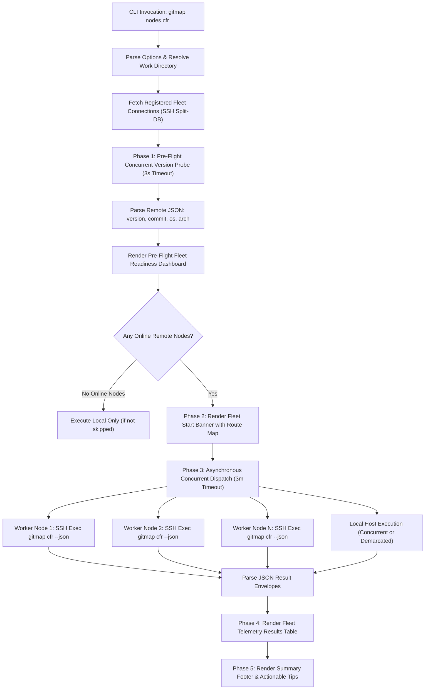
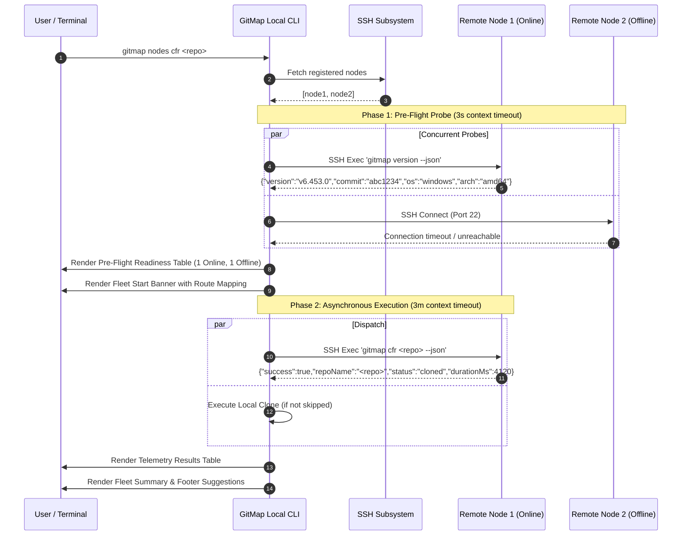

# Specification 67: Nodes CFR Remote Fleet Clone Enhancement & Asynchronous Probing Pipeline

## 1. Executive Summary & Problem Analysis

The `gitmap nodes cfr` (and related commands `nodes clone`, `nodes cfrp`, `nodes cfr-except-self`) command suite coordinates repository cloning, remediation, and public visibility promotion across distributed fleet nodes over SSH. Fleet administrators and developers rely on this capability to keep multi-node developer environments synchronized.

### 1.1 Existing Operational Limitations
1. **Uninformative Terminal UI:** The existing startup banner is an unstyled, rigid ASCII border box that provides zero insight into fleet health, active machines, or destination directory mapping.
2. **Missing Pre-Flight Fleet Reachability:** Execution begins blindly without discovering or reporting which remote nodes are active, online, or offline before initiating heavy git clone workflows.
3. **Remote GitMap Version Drift:** Fleet nodes run differing versions of GitMap. Currently, there is no mechanism to probe and display remote GitMap versions prior to dispatch, concealing version divergence and feature incompatibilities.
4. **Sequential Blocking & Unbounded Latency:** Remote node invocations can block sequentially or stall indefinitely without a hard execution timeout ceiling, causing the CLI to appear hung if an SSH connection stalls.
5. **Lack of Structured JSON Protocol:** Neither `gitmap version` nor remote fleet execution reliably emits or parses structured JSON with machine and error details, forcing fragile stdout string parsing.
6. **Rigid Destination Resolution:** Remote clone destinations default to a static work directory without respecting the caller's relative subfolder inside the local workspace or allowing an explicit destination argument.
7. **Missing Contextual CLI Suggestions:** Command completion does not render actionable suggestions or next-step guidance for inspecting machines or retrying offline nodes.

### 1.2 Core Architectural Objectives
- **Pre-Flight Probing Phase:** Implement a non-blocking 3-second probe pipeline over SSH querying `gitmap version --json` to discover reachability, OS, CPU architecture, and GitMap version for all registered fleet machines before cloning begins.
- **Modernized Terminal UI Dashboard:** Replace the legacy ASCII box with a polished ANSI-styled dashboard displaying fleet readiness counters, machine dispatch routes (`alias -> ip:dest`), telemetry progress badges (`● ONLINE`, `○ OFFLINE`, `✗ UNREACHABLE`), and actionable footer tips.
- **Asynchronous Concurrent Dispatch:** Fan out remote executions across all online nodes concurrently using bounded goroutines and context timeouts (3-minute hard execution ceiling).
- **Standardized JSON Exchange:** Introduce `gitmap version --json` producing structured metadata (`version`, `commit`, `os`, `arch`) and enforce `--json` execution for remote `gitmap cfr` operations with automated legacy fallback.
- **Intelligent Work Directory Propagation:** Compute caller subfolder offsets within `D:\work` (or `~/work`) and replicate the relative path on remote target nodes, while honoring explicit destination flags (`-d`, `--dir`, `--dest`).

---

## 2. High-Level Architecture & Workflow

The enhancement divides fleet execution into distinct, structured phases: Options Resolution, Pre-Flight Probing, Dashboard Presentation, Concurrent Dispatch, and Telemetry Summary.

### 2.1 Fleet Execution Flowchart



### 2.2 Sequence Diagram of Fleet Delegation



---

## 3. Component Deep Dive & Contracts

### 3.1 Pre-Flight Machine Status & Probing Pipeline
- **File Location:** `cli/cmdnodes/nodes_clone_remote.go` & `cli/cmdnodes/nodes_clone_types.go`
- **Probe Concurrency:** All filtered SSH connections are probed concurrently in separate goroutines.
- **Probe Timeout:** Strict 3-second ceiling using `context.WithTimeout(context.Background(), 3*time.Second)`.
- **Probing Command:**
  - On Windows: `gitmap version --json`
  - On Linux/Unix: `gitmap version --json`
  - Fallback: Scrapes output of plain `gitmap version` if JSON parsing fails.
- **Node Classification:**
  - `Online`: SSH connected and `gitmap version` returned successfully.
  - `Offline`: Network unreachable, host down, or port 22 closed.
  - `AuthFailed`: Port open, but SSH key/credential rejected.
  - `MissingGitMap`: SSH connected, but `gitmap` executable not found in `PATH`.
- **Pre-Flight Record Contract (`NodePreFlightInfo`):**
  ```go
  type NodePreFlightInfo struct {
      Alias           string        `json:"alias"`
      Host            string        `json:"host"`
      Role            string        `json:"role"`
      OS              string        `json:"os"`
      Arch            string        `json:"arch"`
      Version         string        `json:"version"`
      Commit          string        `json:"commit"`
      IsOnline        bool          `json:"isOnline"`
      StatusBadge     string        `json:"statusBadge"`
      RemoteTargetDir string        `json:"remoteTargetDir"`
      ProbeDuration   time.Duration `json:"probeDuration"`
      Error           string        `json:"error,omitempty"`
  }
  ```

### 3.2 Terminal UI Overhaul & Visual Styling
- **File Location:** `cli/cmdnodes/nodes_clone_table.go`
- **UI Design System:**
  - Uses standard GitMap ANSI constants from `cli/constants/constants_terminal.go`.
  - Color palette: Cyan for machine identity and headings, Green for success and online badges, Yellow for offline/warnings, Red for failures, White/Bold for aliases and titles.
  - Visual padding using `padVisual(s, width)` which strips ANSI codes via `stripANSI` to ensure proper visual column alignment.
- **Pre-Flight Dashboard Layout:**
  ```text
  ▸ Fleet Readiness: 4 registered node(s) | 3 online | 1 offline
  
    NODE (ALIAS)     HOST             OS         VERSION      DESTINATION                    STATUS
    --------------------------------------------------------------------------------------------------------
    w1               192.168.1.10     windows    v6.453.0     work/gitmap-v28                ● online
    w2               192.168.1.11     linux      v6.452.1     ~/work/gitmap-v28              ● online
    w3               192.168.1.12     windows    v6.453.0     work/gitmap-v28                ● online
    w4               192.168.1.13     linux      -            -                              ○ offline
  ```
- **Modernized Start Banner Layout:**
  ```text
    ┌──────────────────────────────────────────────────────────────────────────────────────────────────────┐
    │ GITMAP FLEET NODES CFR DISPATCH                                                                      │
    └──────────────────────────────────────────────────────────────────────────────────────────────────────┘
    • Mode:        cfr (clone-fix-repo)
    • Target:      github.com/alimtvnetwork/gitmap-v28
    • Workdir:     D:\work (preserved relative: .)
    • Scope:       Local host + 3 active remote worker(s)
    • Dispatch:    w1 -> 192.168.1.10:D:\work
                   w2 -> 192.168.1.11:~/work
                   w3 -> 192.168.1.12:D:\work
  ```
- **Telemetry Results Table Layout:**
  ```text
    NODE (ALIAS)     HOST             ROLE       STATUS         VERSION      DURATION    DETAILS
    --------------------------------------------------------------------------------------------------------
    local (current)  127.0.0.1        master     ● success      v6.454.0     1250ms      cloned successfully
    w1               192.168.1.10     worker     ● success      v6.453.0     2410ms      cloned successfully
    w2               192.168.1.11     worker     ● success      v6.452.1     2890ms      cloned successfully
    w3               192.168.1.12     worker     ● success      v6.453.0     2520ms      already exists on disk
    w4               192.168.1.13     worker     ○ offline      -            -           node unreachable (port 22)
    --------------------------------------------------------------------------------------------------------
  
    ✔ Fleet CFR Summary: 4/5 node(s) completed successfully (1 skipped/offline)
  ```
- **Actionable Footer Suggestions:**
  ```text
  [tip] Fleet Operations & Suggested Commands:
    • Ping Fleet Nodes:          gitmap nodes ping
    • Inspect Node Connection:   gitmap ssh test <alias>
    • Query Machine Telemetry:   gitmap machine --ssh
    • Rerun Except Local Host:   gitmap nodes cfr <repo> --except-self
  ```

### 3.3 Asynchronous Concurrency Model
- **File Location:** `cli/cmdnodes/nodes_clone.go` & `cli/cmdnodes/nodes_clone_remote.go`
- **Worker Fan-Out:** Online remote nodes execute in parallel using goroutines.
- **Synchronization:** A thread-safe mutex and wait group (`sync.WaitGroup`) ensure that results are accumulated without race conditions.
- **Execution Timeout:** A 3-minute hard ceiling is passed to every SSH execution context (`context.WithTimeout(context.Background(), 3*time.Minute)`).
- **Cancellation:** If the timeout expires, the context is cancelled, terminating hung SSH channel sessions and returning a descriptive timeout error to the results aggregator.
- **Local Host Execution:** If `isSkipLocal` is false, local clone executes in coordination with remote workers, preventing duplicate work and surfacing structured outcomes via `DirectCloneJSONResponse`.

### 3.4 Remote Version Protocol & JSON Exchange
- **Local Version JSON (`cli/cmd/rootutility.go`):**
  - Command: `gitmap version --json` or `gitmap -v --json`.
  - Payload Schema (`GitMapVersionPayload`):
    ```json
    {
      "version": "6.454.0",
      "commit": "8f21a4e7",
      "os": "windows",
      "arch": "amd64",
      "buildDate": "2026-10-02"
    }
    ```
- **Remote Clone JSON (`cli/cmdclone/clone_json.go`):**
  - Command: `gitmap cfr <args> --json`.
  - Structured output extracted from remote stdout:
    ```json
    {
      "success": true,
      "repoName": "gitmap-v28",
      "status": "cloned",
      "message": "cloned successfully",
      "path": "D:\\work\\gitmap-v28"
    }
    ```
  - Fallback Handler: If a remote older node fails with `flag provided but not defined: --json`, the runner automatically retries without `--json` and extracts status via legacy regex matching.

### 3.5 Intelligent Work Directory & Relative Path Resolution
- **Default Work Roots:**
  - Windows: `D:\work` (or custom override).
  - Unix/Linux/macOS: `~/work` (or `/home/<user>/work`).
- **Relative Subfolder Calculation:**
  - If current working directory is `D:\work\repos\web\site`, the relative path is `repos\web\site`.
  - On dispatch to Linux nodes, the relative path is normalized to forward slashes: `~/work/repos/web/site`.
  - On dispatch to Windows nodes, backslashes are preserved: `D:\work\repos\web\site`.
- **Target Directory Creation:**
  - The remote runner ensures directory existence prior to cloning (`mkdir -p` or `New-Item -ItemType Directory`).
- **User Override Flag:**
  - Flags `-d`, `--dir`, `--dest`, `--target-dir` override automatic relative calculation.

---

## 4. Architectural Data Models & Type Definitions

```go
// Package cmdnodes type extensions for pre-flight and telemetry.

// GitMapVersionPayload models the structured response of gitmap version --json.
type GitMapVersionPayload struct {
	Version   string `json:"version"`
	Commit    string `json:"commit,omitempty"`
	OS        string `json:"os"`
	Arch      string `json:"arch"`
	BuildDate string `json:"buildDate,omitempty"`
}

// NodePreFlightInfo captures probing telemetry for an individual fleet node.
type NodePreFlightInfo struct {
	Alias           string        `json:"alias"`
	Host            string        `json:"host"`
	Role            string        `json:"role"`
	OS              string        `json:"os"`
	Arch            string        `json:"arch"`
	Version         string        `json:"version"`
	Commit          string        `json:"commit"`
	IsOnline        bool          `json:"isOnline"`
	StatusBadge     string        `json:"statusBadge"`
	RemoteTargetDir string        `json:"remoteTargetDir"`
	ProbeDuration   time.Duration `json:"probeDuration"`
	Error           string        `json:"error,omitempty"`
}

// FleetPreFlightReport aggregates pre-flight probes across the fleet.
type FleetPreFlightReport struct {
	TotalCount   int                 `json:"totalCount"`
	OnlineCount  int                 `json:"onlineCount"`
	OfflineCount int                 `json:"offlineCount"`
	Nodes        []NodePreFlightInfo `json:"nodes"`
}
```

---

## 5. Error Management & Resilience Strategy

1. **Non-Fatal Remote Failures:** An offline or unreachable node must NEVER abort execution on other online nodes or local machine.
2. **Explicit Error Classification:** SSH connection errors are classified via dedicated classifiers (`isOfflineError`, `isAuthError`, `isTimeoutError`).
3. **Structured Error Wrapping:** Internal package errors use `apperror.WrapSimple(err, "<context>")` to preserve causal chains and adhere to repository error specifications.
4. **Command Fallback Resilience:** When remote nodes run legacy GitMap binaries that do not recognize `--json`, commands automatically re-execute without the flag rather than reporting failure.

---

## 6. Coding Guidelines & Quality Protocols Compliance

- **Function Size Ceiling:** Every function must be 15 lines or fewer. Complex rendering routines must be decomposed into focused micro-helpers.
- **Positive Boolean Standard:** Boolean flags and fields must use positive prefixes (`isOnline`, `isReachable`, `hasJSON`, `isLocalSuccess`). Negative booleans like `isNotOnline` or `isOffline` are strictly forbidden.
- **Safe ANSI Visual Padding:** String visual length calculations must strip escape codes before measuring column widths to guarantee clean table rendering.
- **Zero-Git Command Rule:** All file modifications, tests, and verifications must strictly avoid running git commands.
