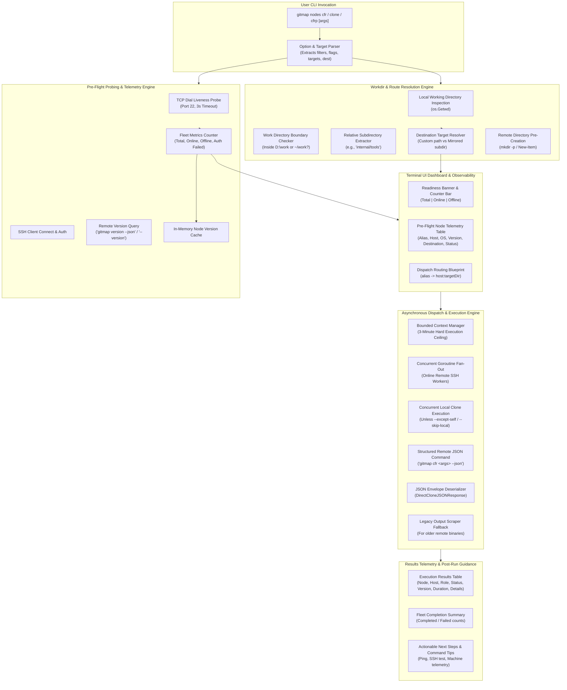

# Architecture Specification: Fleet Nodes CFR Terminal UI, Pre-Flight Probing & Asynchronous Delegation

> **Specification Identifier:** `02-spec/21-app/69-nodes-cfr-ui-async-delegation/01-architecture-spec.md`  
> **Parent Initiative:** `69-nodes-cfr-ui-async-delegation`  
> **Component Scope:** [`cli/cmdnodes`](file:///d:/work/gitmap/cli/cmdnodes), [`cli/cmdssh`](file:///d:/work/gitmap/cli/cmdssh), [`cli/cmdclone`](file:///d:/work/gitmap/cli/cmdclone), [`cli/cmd`](file:///d:/work/gitmap/cli/cmd)  
> **Release Target:** Minor Version Bump (`v6.454.0` / Next Minor Release)  
> **Status:** APPROVED & SPECIFIED  

---

## 1. Executive Summary & Problem Definition

GitMap's fleet orchestration subsystem provides multi-node cloning and automated repository remediation (`cfr`: clone-fix-repo; `cfrp`: clone-fix-repo-pub) across heterogeneous local and remote SSH machines. In real-world enterprise deployments, operators manage fleets of dozens of developer workstations, continuous integration runners, and edge build servers.

However, the existing implementation exhibits several critical architectural and user experience shortcomings:

1. **Terminal UI Degradation & Observability Void:**  
   The terminal dashboard renders rudimentary ASCII tables with inadequate progress visibility. Operators receive no feedback on what nodes exist, their live reachability status, or where operations are executing.
2. **Missing Pre-Flight Metrics & Telemetry:**  
   There is no pre-flight handshake or validation. Operators have no visibility into the count of active, online, or offline machines before long-running clone tasks begin.
3. **Absence of Route Mapping:**  
   The system fails to display dispatch destination mapping (`alias -> host:targetDir`), leaving operators blind as to which directories on remote nodes are receiving repositories.
4. **Unvalidated Remote Binaries & Version Mismatches:**  
   Remote commands are executed without probing whether GitMap is installed on the remote target or which version is present. Version disparities between master and worker nodes trigger silent flag incompatibilities.
5. **Rigid Working Directory Handling:**  
   The CLI lacks intelligent local working directory inspection. If an operator invokes `gitmap nodes cfr` from within a subdirectory of the work directory (e.g. `D:\work\internal\microservices`), the system fails to preserve and replicate this relative path on remote targets. Furthermore, custom destination paths provided by the user are not consistently propagated.
6. **Inefficient Synchronous or Unbounded Dispatch:**  
   Delegation across remote machines must be executed fully asynchronously in parallel with deterministic timeout bounds and structured JSON responses (`--json`) rather than unparsed raw stdout.
7. **Incomplete Command Guidance & Missing Suggestions:**  
   The CLI help lacks rich examples for clone, except-self/accept options, remote machine queries, and contextual post-execution command suggestions.

This specification defines the comprehensive architecture to overhaul the fleet node orchestration subsystem. It establishes pre-flight probing, route resolution, a modernized terminal UI dashboard, asynchronous concurrent dispatch with `--json` envelopes, rich CLI help, and the release ceremony for a minor version bump.

---

## 2. High-Level Architecture & System Flow

### 2.1 Subsystem Block Architecture



---

### 2.2 End-to-End Execution Sequence

```mermaid
sequenceDiagram
    autonumber
    actor Operator as Operator / User
    participant CLI as GitMap CLI (cmdnodes)
    participant Route as Route Resolver
    participant Probe as Pre-Flight Prober
    participant SSHStore as SQLite SSH Store
    participant RemoteWin as Remote Worker (Windows)
    participant RemoteUnix as Remote Worker (Linux/macOS)
    participant LocalHost as Local Host Engine
    participant UI as Terminal UI Renderer

    Operator->>CLI: gitmap nodes cfr repo1,repo2 [dest]
    CLI->>SSHStore: FetchAllSSHConnections()
    SSHStore-->>CLI: Return registered connections
    CLI->>Route: ResolveWorkDirectory(dest)
    Route-->>CLI: NodesCloneDestination (TargetDir, RelativeSubdir, IsInsideWorkDir)

    rect rgb(240, 248, 255)
        Note over CLI,Probe: Phase 1: Pre-Flight Probing & Handshake (Concurrent)
        par Probe Remote Windows Node
            Probe->>RemoteWin: TCP Dial :22 & SSH Handshake
            RemoteWin-->>Probe: Connection OK
            Probe->>RemoteWin: Exec: gitmap version --json
            RemoteWin-->>Probe: Return GitMapVersionPayload JSON
        and Probe Remote Unix Node
            Probe->>RemoteUnix: TCP Dial :22 & SSH Handshake
            RemoteUnix-->>Probe: Connection OK
            Probe->>RemoteUnix: Exec: gitmap version --json
            RemoteUnix-->>Probe: Return GitMapVersionPayload JSON
        end
        Probe-->>CLI: FleetPreFlightReport (Total: 2, Online: 2, Offline: 0)
    end

    rect rgb(245, 255, 250)
        Note over CLI,UI: Phase 2: Terminal Dashboard Presentation
        CLI->>UI: Render Readiness Metrics Bar & Pre-Flight Table
        CLI->>UI: Render Dispatch Routing Blueprint (alias -> host:targetDir)
    end

    rect rgb(255, 250, 240)
        Note over CLI,LocalHost: Phase 3: Asynchronous Parallel Dispatch
        par Local Execution
            CLI->>LocalHost: ExecuteLocalClone(opts, dest)
            LocalHost-->>CLI: Local Success / Failure Payload
        and Remote Windows Dispatch
            CLI->>RemoteWin: Exec: Set-Location "D:\work\sub"; gitmap cfr ... --json
            RemoteWin-->>CLI: Return DirectCloneJSONResponse
        and Remote Unix Dispatch
            CLI->>RemoteUnix: Exec: cd ~/work/sub && gitmap cfr ... --json
            RemoteUnix-->>CLI: Return DirectCloneJSONResponse
        end
    end

    rect rgb(248, 248, 255)
        Note over CLI,UI: Phase 4: Telemetry Aggregation & Guidance
        CLI->>UI: Render Results Telemetry Table (Statuses, Versions, Durations)
        CLI->>UI: Render Summary Count (e.g. 3/3 nodes completed)
        CLI->>UI: Render Actionable Suggestion Footers
        UI-->>Operator: Formatted Terminal Dashboard Output
    end
```

---

## 3. Detailed Component Specifications

### 3.1 Machine Status Metrics & Pre-Flight Probing Engine

To eliminate blind dispatch, the pre-flight probing engine assesses fleet reachability before executing any clone operations.

#### 3.1.1 Concurrency Model & Timeouts
- **Probe Timeout Ceiling:** Each individual node probe is bounded by a strict `3 * time.Second` context timeout to prevent sluggish nodes from holding up the fleet.
- **Concurrent Fan-Out:** Probing executes concurrently using goroutines synchronized by `sync.WaitGroup` and a thread-safe collector using `sync.Mutex`.
- **Target Filtering:** The engine respects `--target <alias|ip>` and `--exclude <alias|ip>` filters prior to initiating network dials.

#### 3.1.2 Communication Handshake Protocol
Before dispatching heavy git operations, the engine probes the remote machine's GitMap installation via SSH:
1. **Primary Protocol:** Execute `gitmap version --json` (or `gitmap version -j`).
   - If the remote binary is modern, it returns a structured JSON payload:
     ```json
     {
       "version": "6.454.0",
       "commit": "a1b2c3d",
       "os": "windows",
       "arch": "amd64",
       "buildDate": "2026-10-02T11:00:00Z"
     }
     ```
2. **Secondary Protocol (Fallback):** If the remote binary does not support `--json` (emits error `"flag provided but not defined: --json"` or returns plain text), the prober executes `gitmap --version` or `gitmap version` and extracts the SemVer string using a regular expression (`v?[0-9]+\.[0-9]+\.[0-9]+`).
3. **Missing Binary Protocol:** If the remote system returns `"gitmap: command not found"` or `"'gitmap' is not recognized"`, the status is recorded as `not installed` (`isOnline = true`, `isInstalled = false`).
4. **Version Caching:** Probed versions are stored in an in-memory thread-safe map (`nodeVersionCache`) indexed by node alias, allowing subsequent table formatters to display versions without re-querying.

#### 3.1.3 Metrics Aggregation
The engine computes four deterministic fleet metrics:
- **Total Registered Nodes:** Total candidate machines configured in the SSH store.
- **Active / Online Count:** Nodes responding to port 22 and successfully authenticating over SSH.
- **Offline / Unreachable Count:** Nodes failing TCP handshake or connection refused.
- **Auth Failed Count:** Nodes rejecting SSH credentials.

---

### 3.2 Work Directory Detection & Destination Routing Engine

A central design requirement is deterministic path resolution across master and worker environments.

#### 3.2.1 Local Working Directory Inspection
The engine inspects the current working directory (`os.Getwd()`):
- **Inside Work Directory:**  
  If the local path resides within a recognized work root (`D:\work` on Windows or `~/work` / `/home/<user>/work` on Unix):
  - The relative subdirectory is extracted.  
    *Example:* Local CWD is `D:\work\frontend\portal` -> Relative Subdir is `frontend\portal` (or `frontend/portal`).
  - The destination engine mirrors this relative path on remote machines.
- **Outside Work Directory:**  
  If the local path is outside the work directory (e.g. `C:\Users\Admin\Desktop` or `/tmp`):
  - The destination engine defaults to the root of the remote work directory (`D:\work` for Windows; `~/work` for Unix).
- **User-Provided Destination Path (Priority 1):**  
  If the user explicitly specifies a destination directory via positional argument (`gitmap nodes cfr <repo> <dest>`) or flags (`-d`, `--dest`, `--dir`, `--target-dir`):
  - The explicit destination overrides all automatic detection and is applied directly to remote nodes.

#### 3.2.2 Cross-Platform Destination Normalization
Destination paths are resolved per target node based on its registered OS:
- **Windows Worker:** Target path normalized to backslashes (`D:\work\<relativeSubdir>`).
- **Unix / Linux / macOS Worker:** Target path normalized to POSIX forward slashes (`~/work/<relativeSubdir>`).

#### 3.2.3 Remote Directory Pre-Creation
Prior to launching clone commands, the remote executor ensures the destination directory exists:
- **Windows:** Executes `if (-not (Test-Path -Path "%s")) { New-Item -ItemType Directory -Path "%s" -Force }`.
- **Unix:** Executes `mkdir -p "%s"`.

#### 3.2.4 Destination Route Mapping Blueprint
The route resolution produces a route map for every active node:
```text
Dispatch Routes:
  • w1 -> 192.168.1.10:D:\work\frontend\portal
  • w2 -> 192.168.1.11:~/work/frontend/portal
```

---

### 3.3 Modernized Terminal UI Dashboard

The terminal output must be intuitive, visually aligned, and informative.

#### 3.3.1 Pre-Flight Readiness Summary Table
Rendered immediately after pre-flight probing:
```text
  ▸ Fleet Readiness: 3 registered node(s) | 2 online | 1 offline

    NODE (ALIAS)     HOST               OS         VERSION        DESTINATION                      STATUS        
    --------------------------------------------------------------------------------------------------------
    w1               192.168.1.10       windows    v6.454.0       D:\work\internal\tool            ● online      
    w2               192.168.1.11       linux      v6.453.0       ~/work/internal/tool             ● online      
    edge-03          192.168.1.25       linux      -              -                                ○ offline     
    --------------------------------------------------------------------------------------------------------
```

#### 3.3.2 Modernized Dispatch Banner & Routing Card
```text
    ┌──────────────────────────────────────────────────────────────────────────────────────────────────────┐
    │ GITMAP FLEET NODES CFR (CLONE-FIX-REPO) DISPATCH                                                     │
    └──────────────────────────────────────────────────────────────────────────────────────────────────────┘
    • Mode:        cfr (clone-fix-repo)
    • Target:      https://github.com/org/repo.git
    • Workdir:     D:\work (preserved relative: internal\tool)
    • Scope:       Local host + 2 active remote worker(s)
    • Dispatch:    w1 -> 192.168.1.10:D:\work\internal\tool
                   w2 -> 192.168.1.11:~/work\internal\tool
```

#### 3.3.3 Telemetry Results Table
Rendered upon completion of all parallel tasks:
```text
    NODE (ALIAS)     HOST               ROLE       STATUS         VERSION      DURATION     DETAILS
    --------------------------------------------------------------------------------------------------------
    local (current)  127.0.0.1          master     ● success      v6.454.0     1250ms       executed directly on host machine
    w1               192.168.1.10       worker     ● success      v6.454.0     1840ms       cloned successfully into D:\work\internal\tool
    w2               192.168.1.11       worker     ● success      v6.453.0     2120ms       cloned successfully into ~/work/internal/tool
    --------------------------------------------------------------------------------------------------------

  ✔ Fleet CFR Summary: 3/3 node(s) completed successfully (0 failed)

  [tip] Fleet Operations & Suggested Commands:
    • Ping Fleet Nodes:          gitmap nodes ping
    • Inspect Node Connection:   gitmap ssh test <alias>
    • Query Machine Telemetry:   gitmap machine --ssh
    • Rerun Except Local Host:   gitmap nodes cfr <target> --except-self
```

#### 3.3.4 Visual Alignment & ANSI Escape Rules
- All terminal tables compute visual length using `stripANSI()` to remove escape codes before calculating column padding (`padVisual()`).
- High-contrast, standard ANSI color codes:
  - `ColorGreen` for `● online`, `● success`.
  - `ColorYellow` for `○ offline`.
  - `ColorMagenta` for `▲ auth_failed`.
  - `ColorRed` for `✗ unreachable`, `✗ failed`.
  - `ColorCyan` for `○ skipped`.

---

### 3.4 Asynchronous Parallel Dispatch Engine

Executing commands sequentially introduces unacceptable delays when scaling across multiple machines.

#### 3.4.1 Asynchronous Concurrency Architecture
1. **Parallel Worker Pool:**  
   Every confirmed online remote node is allocated an independent goroutine worker.
2. **Local Host Concurrency:**  
   The local host operation is executed concurrently alongside remote workers using a dedicated goroutine, rather than running sequentially before or after remote tasks. If the operator provides `--except-self`, `--no-self`, or `--skip-local`, local execution is skipped immediately.
3. **Execution Deadline:**  
   A parent `context.WithTimeout(context.Background(), 3*time.Minute)` bounds all parallel activities. Any worker exceeding the 3-minute threshold is terminated cleanly with a timeout status.
4. **Thread-Safe Result Aggregation:**  
   Worker outcomes are collected in a synchronized slice protected by `sync.Mutex`.

#### 3.4.2 Structured Remote Command Invocation (`--json`)
Remote execution always injects the `--json` flag to ensure structured telemetry:
- **Windows Command Form:**  
  `Set-Location "<targetDir>"; gitmap <kind> <args> --json`
- **Unix Command Form:**  
  `cd <targetDir> && gitmap <kind> <args> --json`

#### 3.4.3 Remote JSON Deserialization & Error Handling
1. **Direct JSON Parsing:**  
   The worker passes the captured stdout to `cmdclone.ParseCloneJSONResponse(stdout)`.
   ```go
   type DirectCloneJSONResponse struct {
       Success   bool   `json:"success"`
       Message   string `json:"message"`
       TargetDir string `json:"targetDir,omitempty"`
       Repo      string `json:"repo,omitempty"`
   }
   ```
2. **Success Evaluation:**  
   - If `Success == true`, the node status is set to `"success"` and details to `Message`.
   - If `Success == false`, the node status is set to `"failed"` and error to `Message`.
3. **Legacy Fallback Handling:**  
   If the remote node runs an older GitMap release lacking `--json` flag support, the worker automatically retries without `--json` and parses legacy human-readable output (`"already exists on disk"`, `"cloned successfully"`).

---

### 3.5 Rich CLI Help & Suggestion Footers

#### 3.5.1 Enhanced Help Content (`cli/cmdnodes/nodes_clone_help.go`)
The help screen provides comprehensive guidance, parameter descriptions, and concrete usage examples:
- **Subcommands:** `clone`, `cfr` (clone-fix-repo), `cfrp` (clone-fix-repo-pub).
- **Target Formats:** Repository name (`owner/repo`), Git HTTPS URL, comma-separated lists, and staged JSON manifest files.
- **Flags:**
  - `-t, --target <alias|ip>`: Target specific nodes.
  - `--exclude <alias|ip>`: Exclude specific nodes.
  - `-d, --dest, --dir, --target-dir <path>`: Explicit destination path.
  - `--except-self, --no-self, --skip-local`: Run strictly on remote workers.
  - `--dry-run`: Preview execution without modifying disk.
  - `-j, --json`: Output machine-readable JSON telemetry.
- **Rich Examples:**
  - Standard fleet clone: `gitmap nodes cfr ChrisTitusTech/winutil`
  - URL with custom destination: `gitmap nodes clone https://github.com/u/repo D:\work\custom`
  - Remote-only clone: `gitmap nodes cfr except-self owner/repo`
  - Query machine telemetry: `gitmap machine --ssh`
  - Single target filter: `gitmap nodes cfr --target w1 user/repo`

#### 3.5.2 Actionable Next-Step Footers
At the end of every execution, the CLI renders recommended next-step commands helping operators verify node state, troubleshoot failures, or inspect telemetry.

---

### 3.6 Release Ceremony & Version Management

Upon implementation and verification of this specification:
1. **Target Bump:** Minor version increment (e.g. `v6.453.0` -> `v6.454.0`).
2. **Automated Version Tooling:** Execution of `python 03-ai-scripts/37-bump-version.py --tier minor`.
3. **Artifact Synchronization:** Version synchronization across `cli/constants/version.go`, `package.json`, and root documentation.
4. **Git Hygiene:** Atomic commit message adhering to standard format: `feat(nodes): overhaul cfr terminal ui, preflight probing and async delegation`.

---

## 4. Data Structures & Type Definitions

The subsystem relies on concrete data contracts across probing, routing, and execution:

```go
// PreFlightNodeInfo captures probing telemetry for an individual fleet node.
type PreFlightNodeInfo struct {
    Alias           string        `json:"alias"`
    Host            string        `json:"host"`
    Role            string        `json:"role"`
    OS              string        `json:"os"`
    Arch            string        `json:"arch"`
    Version         string        `json:"version"`
    Commit          string        `json:"commit"`
    IsOnline        bool          `json:"isOnline"`
    StatusBadge     string        `json:"statusBadge"`
    RemoteTargetDir string        `json:"remoteTargetDir"`
    ProbeDuration   time.Duration `json:"probeDuration"`
    Error           string        `json:"error,omitempty"`
}

// FleetPreFlightReport aggregates pre-flight probes across the fleet.
type FleetPreFlightReport struct {
    TotalCount   int                 `json:"totalCount"`
    OnlineCount  int                 `json:"onlineCount"`
    OfflineCount int                 `json:"offlineCount"`
    Nodes        []PreFlightNodeInfo `json:"nodes"`
}

// NodesCloneDestination describes resolved destination directory settings.
type NodesCloneDestination struct {
    TargetDir          string `json:"targetDir,omitempty"`
    RelativeSubdir     string `json:"relativeSubdir,omitempty"`
    HasCustomTargetDir bool   `json:"hasCustomTargetDir"`
    IsInsideWorkDir    bool   `json:"isInsideWorkDir"`
}

// GitMapVersionPayload represents the JSON output from 'gitmap version --json'.
type GitMapVersionPayload struct {
    Version   string `json:"version"`
    Commit    string `json:"commit,omitempty"`
    OS        string `json:"os"`
    Arch      string `json:"arch"`
    BuildDate string `json:"buildDate,omitempty"`
}

// RemoteCloneNodeResult captures the execution output from an individual node.
type RemoteCloneNodeResult struct {
    Alias      string        `json:"alias"`
    Host       string        `json:"host"`
    Role       string        `json:"role"`
    Status     string        `json:"status"`
    Duration   time.Duration `json:"duration"`
    DurationMs int64         `json:"durationMs"`
    Stdout     string        `json:"stdout,omitempty"`
    Stderr     string        `json:"stderr,omitempty"`
    Error      string        `json:"error,omitempty"`
    Details    string        `json:"details,omitempty"`
}
```

---

## 5. Error Handling, Edge Cases & Resilience Matrix

| Scenario | Detection Mechanism | System Behavior / Mitigation | User-Facing Output |
| :--- | :--- | :--- | :--- |
| **Node Powered Off / Port 22 Closed** | TCP dial timeout (`3s`) or `connection refused` | Marked `isOnline = false`, skipped during execution phase | Displayed as `○ offline` in preflight table; skipped in dispatch |
| **SSH Authentication Rejection** | SSH handshake error (`ssh: handshake failed`) | Marked `isOnline = false`, error classified as `auth_failed` | Displayed as `▲ auth_failed` in magenta badge |
| **Remote GitMap Not Installed** | Remote command returns `not found` or exit code 127 | Node marked online but version `not installed`; execution attempted | Displayed as `Version: -`, error recorded in results table |
| **Remote Binary Outdated (No `--json`)** | Remote output contains `flag provided but not defined: --json` | Automatic fallback to execute without `--json`; output parsed via string heuristics | Transparent execution; results parsed cleanly |
| **Slow Remote Node / Network Freeze** | Context deadline exceeded (`3m`) | Remote SSH session closed; worker terminates with timeout error | Displayed as `✗ failed` with `duration: 180000ms`, `timeout exceeded` |
| **Invoked Outside Local Workdir** | Local CWD path inspection fails to match `D:\work` / `~/work` | Default to remote work root (`D:\work` or `~/work`) | Banner shows `Workdir: D:\work (default work root)` |
| **Explicit Destination Flag Provided** | User passes `-d <path>` or positional dest | Overrides CWD detection across all nodes; remote dir created | Banner shows `Workdir: <path> (custom destination)` |

---

## 6. Verification & Quality Gates

### 6.1 Testing Requirements
1. **Unit Test Coverage:**
   - Pre-flight probing logic with mock SSH and TCP servers (`cli/cmdnodes/nodes_clone_probe_test.go`).
   - Work directory and relative path resolution across Windows and Unix path styles (`cli/cmdnodes/nodes_clone_test.go`).
   - Table visual alignment, ANSI padding, and badge formatting (`cli/cmdnodes/nodes_clone_table_test.go`).
   - JSON version emission and parsing (`cli/cmd/rootutility_test.go`).
2. **Quality Rules:**
   - **Function Length Cap:** Every new or refactored function must strictly not exceed 15 lines.
   - **Positive Boolean Semantics:** Enforce positive variable names (`isOnline`, `isLocalOk`, `hasFile`).
   - **Zero Git Command Ban:** Automated testing and execution scripts must NEVER invoke git commands.
   - **Linting & Hygiene:** Pass all repository linters (`05-guideline-autofixer.py`, `check-relative-paths.py`).

---

## 7. Subtask Plan Index

This architecture specification is implemented through decomposed subtask plans:
- **Subtask 01:** [Pre-Flight Probing, Metrics & Remote Version Discovery](file:///d:/work/gitmap/.ai-memory/plans/subtasks/69-nodes-cfr-ui-async-delegation/01-preflight-probe-and-metrics.md)  
  *Files:* `cli/cmdnodes/nodes_clone_probe.go`, `cli/cmdnodes/nodes_clone_remote.go`
- **Subtask 02:** [Asynchronous Concurrent Multi-Node Dispatch & JSON Envelopes](file:///d:/work/gitmap/.ai-memory/plans/subtasks/69-nodes-cfr-ui-async-delegation/02-async-parallel-dispatch.md)  
  *Files:* `cli/cmdnodes/nodes_clone.go`, `cli/cmdnodes/nodes_clone_remote.go`
- **Subtask 03:** Work Directory Resolution & Relative Subdir Mirroring (Phase 2 Worker 02)
- **Subtask 04:** Terminal UI Dashboard Modernization & Route Blueprint Rendering (Phase 2 Worker 01)
- **Subtask 05:** Nodes Help Synchronization, Catalog Registration & Suggestions (Phase 2 Worker 02)
- **Subtask 06:** Quality Verification, Targeted Linting & Minor Version Bump (Phase 3)
