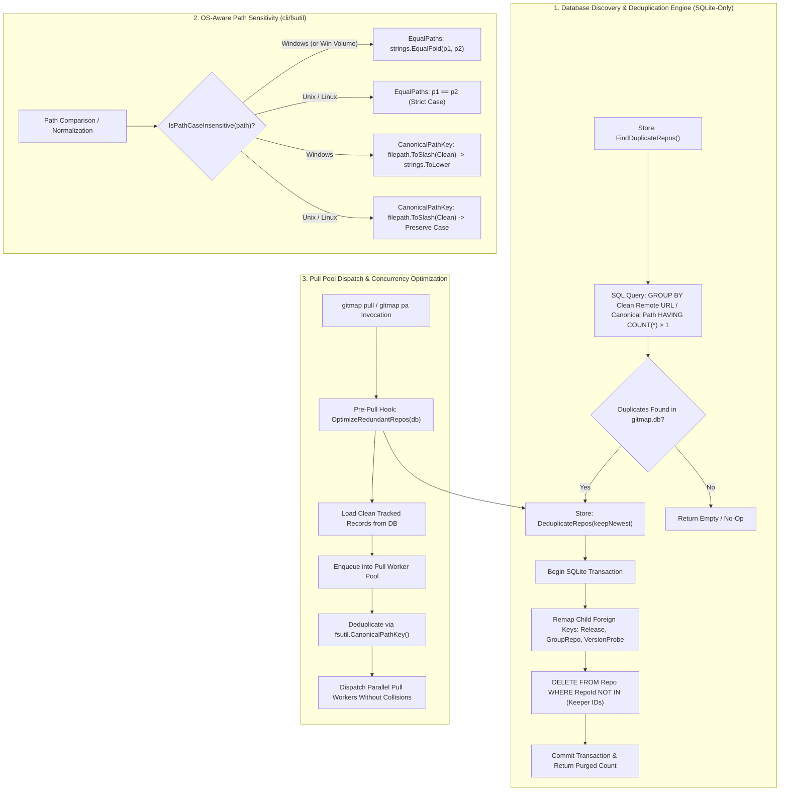
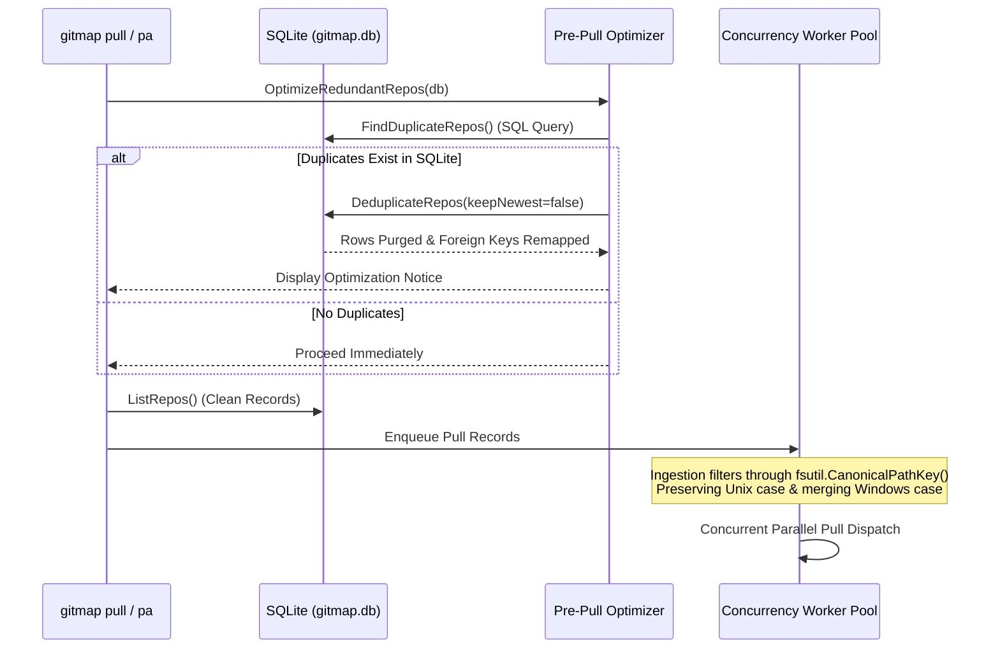

# Architecture Specification: SQLite-Driven Redundant Repository Deduplication, OS-Aware Path Sensitivity & Concurrency Pull Pool Optimization

> **Document ID:** `02-spec/21-app/70-redundant-repos-and-equalfold-os-fix/01-architecture-spec.md`  
> **Topic Area:** SQLite Repository Deduplication, OS-Aware Path Normalization, Concurrency Pull Pool Optimization  
> **Status:** `Active / Approved`  
> **Target Package Areas:** `cli/store/`, `cli/fsutil/`, `cli/cmdpull/`, `cli/cmd/`  
> **Related Plans:**  
> - Primary Plan: [.ai-memory/plans/pending/70-redundant-repos-and-equalfold-os-fix.md](../../../.ai-memory/plans/pending/70-redundant-repos-and-equalfold-os-fix.md)  
> - Subtask Plan: [.ai-memory/plans/subtasks/70-redundant-repos-and-equalfold-os-fix/01-sqlite-dedup-and-os-paths.md](../../../.ai-memory/plans/subtasks/70-redundant-repos-and-equalfold-os-fix/01-sqlite-dedup-and-os-paths.md)  
> **Author:** Spec Author 01 (Task-01 & Task-03 Lead)

---

## 1. Executive Summary & Problem Formulation

### 1.1 User Problem Statement (Verbatim)

```text
Do you have the code to improve the optimize the redundant repos that has been created? That's it. Do you have the code to do that? Confirm it. And also, I've seen in the code you are trying to compare the code in lowercase. Try not to do that. the specific method strings unfold, which is a lot more faster. Try to use that when you are comparing two strings without the case sensitivity. So try to apply that in terms of check-in, because in Unix, the different paths, different cases actually mean same thing. So you can only check ignoring the path in Windows. So you need to understand which OS you are in. So I think that is a bug we need to fix, and again, make a release and make sure you also optimize in the next pool if there is a redundancy. Okay? You can find the redundancy from your SQLite database, not from file system. Okay, so in future, when you add new files, you make sure that it is unique. Do you understand?
```

### 1.2 Confirmation of Existing Code State

A rigorous audit of the GitMap codebase confirms the following:

1. **Absence of SQLite-Level Duplicate Optimization**:
   - GitMap does **not** possess automatic database-level optimization for redundant repositories.
   - `cli/cmd/find_duplicates_git.go` executes an in-memory grouping over `mainDB.ListRepos()` and merely outputs informational CLI remediation hints suggesting manual removal (`gitmap rm --db-only <id>`). It does not prune or optimize the SQLite database.
   - While migration 33 (`cli/store/migrations.go`) provided a one-time DDL cleanup for `LOWER(AbsolutePath)`, `cli/store/` exposes no runtime API (`FindDuplicateRepos`, `DeduplicateRepos`) for querying or resolving duplicate repositories in `gitmap.db`.
   - Neither `gitmap pull` nor `gitmap pull-all` performs pre-pull database deduplication, allowing redundant records to persist in SQLite and trigger duplicate worker jobs.

2. **Flawed Path Normalization & OS Casing Sensitivity**:
   - `cli/fsutil/path_normalize.go:EqualPaths(p1, p2)` evaluates `NormalizeToForwardSlashes(p1) == NormalizeToForwardSlashes(p2)`. Because it performs strict byte equality (`==`) without OS awareness, path comparisons on Windows fail when drive letters or directories differ in casing (e.g. `d:/work/repo` vs `D:/work/repo`).
   - `cli/cmdpull/pull.go:CanonicalRepoPathKey(path)` and `cli/cmdpull/pull_efficient.go:deduplicateTrackedRecords(records)` unconditionally invoke `strings.ToLower(...)` on filesystem paths. On Unix/Linux, paths differing only by case (e.g., `/home/user/Project` and `/home/user/project`) are distinct directories. Lowercasing them causes distinct repositories to collide into the same key, dropping records or corrupting pull state.
   - Repetitive calls to `strings.ToLower(a) == strings.ToLower(b)` cause needless heap allocations and garbage collection overhead, whereas `strings.EqualFold(a, b)` provides zero-allocation ASCII and Unicode case-folding.

3. **Core Mandates & Architectural Requirements**:
   - **Database-Only Redundancy Discovery**: Redundant repository detection must execute purely against SQLite (`gitmap.db`), completely bypassing filesystem directory traversals.
   - **OS-Aware Path Sensitivity**: Path equality and canonical keys must respect host OS semantics: case-insensitive on Windows (using `strings.EqualFold`), case-sensitive on Unix/Linux.
   - **Pre-Pull Optimization ("Next Pool / Pull")**: Before enqueuing repositories into the concurrency worker pool during `gitmap pull` / `gitmap pa`, GitMap must automatically detect and optimize redundant records in SQLite.

---

## 2. High-Level Architectural Design



---

## 3. SQLite-Driven Redundant Repository Deduplication Engine

### 3.1 Architectural Principles: SQLite vs Filesystem

1. **Zero Filesystem I/O**:
   - Scanning disk trees (`filepath.WalkDir`) to identify duplicates is slow, non-deterministic, and bound to disk latency or network drives.
   - All repository metadata is already recorded in the SQLite `Repo` table in `gitmap.db`.
   - Identifying redundancy directly within SQLite executes in sub-millisecond time via indexed B-trees and SQL aggregation.

2. **ACID Transactional Guarantees**:
   - Deletion of redundant rows must never leave orphaned child records in related tables (`Release`, `GroupRepo`, `VersionProbe`).
   - SQLite foreign key remapping and row deletion must execute inside an explicit database transaction (`dbengine.WithTransaction`).

### 3.2 Duplicate Definition & Grouping Criteria

A repository is defined as **redundant** in `gitmap.db` if:
1. **Remote URL Redundancy**: Multiple `Repo` rows possess identical remote repository URLs (ignoring protocol casing, trailing `.git`, and trailing slashes).
   - Example: `https://github.com/org/repo.git`, `https://github.com/org/repo`, and `git@github.com:org/repo.git`.
2. **Canonical Path Redundancy**: Multiple `Repo` rows reference the same physical path when evaluated through OS-aware path semantics (e.g. drive letter casing differences on Windows).

### 3.3 SQL Queries & Schema Contracts

The following SQL queries are introduced in `cli/constants/constants_store.go`:

```sql
-- Query: Find duplicate repository groups by normalized remote URL (HTTPS or SSH)
SELECT 
    LOWER(RTRIM(REPLACE(COALESCE(NULLIF(HttpsUrl, ''), SshUrl), '.git', ''), '/')) AS CleanRemote,
    COUNT(*) AS DuplicateCount
FROM Repo
WHERE HttpsUrl != '' OR SshUrl != ''
GROUP BY CleanRemote
HAVING DuplicateCount > 1;

-- Query: Retrieve all rows belonging to duplicate remote groups
SELECT 
    RepoId, Slug, RepoName, HttpsUrl, SshUrl, Branch, 
    RelativePath, AbsolutePath, CloneInstruction, Notes, IdentifiedTransport
FROM Repo
WHERE LOWER(RTRIM(REPLACE(COALESCE(NULLIF(HttpsUrl, ''), SshUrl), '.git', ''), '/')) IN (
    SELECT LOWER(RTRIM(REPLACE(COALESCE(NULLIF(HttpsUrl, ''), SshUrl), '.git', ''), '/'))
    FROM Repo
    WHERE HttpsUrl != '' OR SshUrl != ''
    GROUP BY LOWER(RTRIM(REPLACE(COALESCE(NULLIF(HttpsUrl, ''), SshUrl), '.git', ''), '/'))
    HAVING COUNT(*) > 1
)
ORDER BY CleanRemote, RepoId ASC;
```

### 3.4 Data Models & Engine Interface (`cli/store/repo_duplicates.go`)

```go
package store

import (
	"github.com/alimtvnetwork/gitmap-v28/cli/model"
)

// DuplicateRepoGroup represents a cluster of redundant database records.
type DuplicateRepoGroup struct {
	CleanKey    string             // Normalized remote URL or canonical path
	Count       int                // Total records in group
	Keeper      model.ScanRecord   // Surviving primary record
	Duplicates  []model.ScanRecord // Redundant records targeted for pruning
}

// DeduplicationSummary aggregates the outcome of a deduplication pass.
type DeduplicationSummary struct {
	GroupsFound  int
	RowsPurged   int64
	KeeperRepoIDs []int64
	PurgedRepoIDs []int64
}
```

#### Core Engine Methods:

1. `FindDuplicateRepos() ([]DuplicateRepoGroup, error)`:
   - Queries `gitmap.db` using SQL grouping.
   - Assembles `DuplicateRepoGroup` clusters, designating `MIN(RepoId)` (oldest) or `MAX(RepoId)` (newest) as the primary keeper.
   - Performs zero disk I/O.

2. `DeduplicateRepos(keepNewest bool) (*DeduplicationSummary, error)`:
   - Discovers duplicate clusters.
   - Opens a database transaction.
   - For each group:
     - Remaps `Release.RepoId` pointing to duplicates over to `Keeper.RepoId`.
     - Remaps `GroupRepo.RepoId` pointing to duplicates over to `Keeper.RepoId` (`INSERT OR IGNORE` to prevent composite PK collisions).
     - Remaps `VersionProbe.RepoId` over to `Keeper.RepoId`.
     - Deletes duplicate `Repo` rows: `DELETE FROM Repo WHERE RepoId IN (...)`.
   - Commits transaction and returns `DeduplicationSummary`.

---

## 4. OS-Aware Path Sensitivity Architecture (`cli/fsutil`)

### 4.1 Cross-Platform Path Semantics

| Operating System | Path Case Sensitivity | Equality Strategy | Canonical Key Strategy |
|---|---|---|---|
| **Windows** (`windows`) | Case-Insensitive (NTFS / FAT32) | `strings.EqualFold(p1, p2)` | `strings.ToLower(filepath.ToSlash(Clean(p)))` |
| **Linux** (`linux`) | Case-Sensitive (ext4 / XFS / btrfs) | Exact byte equality `p1 == p2` | `filepath.ToSlash(Clean(p))` (Preserve Case) |
| **macOS** (`darwin`) | Case-Preserving, insensitive default | Fallback POSIX or runtime flag | `filepath.ToSlash(Clean(p))` |

### 4.2 Defect Analysis of Prior Implementations

1. **Defect 1: Unconditional Lowercasing in Pull Keying**:
   ```go
   // Previous cli/cmdpull/pull.go
   func CanonicalRepoPathKey(path string) string {
       return strings.ToLower(slashed) // BUG: Destroys Unix case distinction
   }
   ```
   *Impact:* On Linux systems hosting `/repos/MyService` and `/repos/myservice`, the second repository collided with the first in `seenPath`, causing silent pull suppression or race conditions.

2. **Defect 2: Strict Byte Equality in `fsutil.EqualPaths`**:
   ```go
   // Previous cli/fsutil/path_normalize.go
   func EqualPaths(p1, p2 string) bool {
       return NormalizeToForwardSlashes(p1) == NormalizeToForwardSlashes(p2) // BUG: Fails on Windows drive casing
   }
   ```
   *Impact:* On Windows, `c:/work/app` and `C:/work/app` evaluated to `false`, breaking path resolvers (`cli/cmd/resolver_path.go`), working directory detection (`cli/cmd/resolver_pwd.go`), and deletion pre-checks (`cli/cmd/rm.go`).

3. **Defect 3: Allocation Overhead of `strings.ToLower`**:
   Evaluating equality via `strings.ToLower(a) == strings.ToLower(b)` allocates two new byte slices on the heap for every comparison. Across hundreds of repositories and paths, this creates GC pressure. In contrast, `strings.EqualFold` compares UTF-8/ASCII bytes sequentially in-place without heap allocations.

### 4.3 Specification of `cli/fsutil/path_normalize.go` API

```go
package fsutil

import (
	"path/filepath"
	"runtime"
	"strings"
)

// IsPathCaseInsensitive returns true if the host operating system or path format
// treats filesystem paths as case-insensitive (Windows).
func IsPathCaseInsensitive(p string) bool {
	if runtime.GOOS == "windows" {
		return true
	}
	// Also detect Windows-style drive letters in paths even if running in cross-platform test
	clean := filepath.Clean(p)
	vol := filepath.VolumeName(clean)
	return len(vol) >= 2 && vol[1] == ':'
}

// EqualPaths checks if two paths are identical after normalization,
// applying OS-aware case sensitivity rules (case-insensitive on Windows, case-sensitive on Unix).
func EqualPaths(p1, p2 string) bool {
	n1 := NormalizeToForwardSlashes(p1)
	n2 := NormalizeToForwardSlashes(p2)

	if IsPathCaseInsensitive(p1) || IsPathCaseInsensitive(p2) {
		return strings.EqualFold(n1, n2)
	}

	return n1 == n2
}

// CanonicalPathKey produces a normalized forward-slash path key suited for map lookups.
// On Windows, the key is converted to lowercase for case-insensitive indexing.
// On Unix/Linux, path casing is strictly preserved.
func CanonicalPathKey(path string) string {
	if strings.TrimSpace(path) == "" {
		return ""
	}
	clean := filepath.Clean(path)
	slashed := filepath.ToSlash(clean)

	if IsPathCaseInsensitive(slashed) {
		return strings.ToLower(slashed)
	}

	return slashed
}
```

---

## 5. Pull Pool Architecture & Concurrency Optimization

### 5.1 The Concurrency Pull Lifecycle ("Next Pool / Pull")

The pull execution pipeline in `cli/cmdpull/` is upgraded with a two-tier deduplication defense:



### 5.2 Pre-Pull SQLite Deduplication Hook (`cli/cmdpull/pull_dedup.go`)

Prior to invoking `loadAllRecordsDB()` or `loadAllRecordsEfficient()`:
1. `OptimizeRedundantRepos(db *store.DB, isQuiet bool) (*store.DeduplicationSummary, error)` is executed.
2. If redundant rows are detected in SQLite, they are pruned immediately in a transaction before records are loaded into memory.
3. The user sees a clear, elegant terminal message:
   ```text
   ✓ SQLite: Optimized 2 redundant repository record(s) in database before pull.
   ```
4. This ensures that the subsequent call to `db.ListRepos()` returns strictly canonical, non-redundant records.

### 5.3 OS-Aware Ingestion & Collision Avoidance

In `cli/cmdpull/pull.go` and `cli/cmdpull/pull_efficient.go`:
- `CanonicalRepoPathKey` delegates directly to `fsutil.CanonicalPathKey(path)`.
- `deduplicateTrackedRecords` in `pull_efficient.go` replaces:
  ```go
  // Old:
  canonical := filepath.Clean(strings.ToLower(r.AbsolutePath))
  // Upgraded:
  canonical := fsutil.CanonicalPathKey(r.AbsolutePath)
  ```
- This guarantees:
  - On **Windows**: `d:\work\repo` and `D:\work\repo` map to the identical key `d:/work/repo`. One is pulled, preventing the fatal Git error: `Cannot fast-forward to multiple branches`.
  - On **Unix/Linux**: `/work/repo` and `/work/Repo` map to distinct keys `/work/repo` and `/work/Repo`. Both are legitimately pulled without false duplicate suppression.

---

## 6. CLI Command Interfaces & Developer Workflows

### 6.1 Upgraded `gitmap find-duplicates git --fix`

`cli/cmd/find_duplicates_git.go` is upgraded:
- Replaces in-memory scan with `mainDB.FindDuplicateRepos()`.
- Supports the `--fix` flag:
  ```powershell
  gitmap find-duplicates git --fix
  ```
- When `--fix` is passed, `mainDB.DeduplicateRepos(false)` is invoked directly, purging redundant database rows and outputting:
  ```text
  ✓ GitMap SQLite: Successfully purged 3 redundant repository records across 2 duplicate groups.
  ```

### 6.2 Automatic Pull Pipeline Integration

When the user runs:
```powershell
gitmap pull
# or
gitmap pa
# or
gitmap pull-all
```
Redundancies are automatically checked against SQLite and optimized before the worker pool initializes.

---

## 7. Architectural Invariants & Quality Gates

1. **SQLite Query Exclusivity**: Redundant repository discovery MUST execute via SQL queries against SQLite `Repo` table, NEVER via `os.Stat` or filesystem walkers.
2. **Zero In-Memory Casing Mutations for Storage**: Storage paths must maintain standard casing; canonicalization is applied only at comparison or key generation time.
3. **Zero Heap Allocation for Comparisons**: All case-insensitive string equality checks MUST use `strings.EqualFold`, never `strings.ToLower(a) == strings.ToLower(b)`.
4. **POSIX Preservation on Non-Windows**: Under `runtime.GOOS != "windows"`, path keys MUST preserve casing to prevent filesystem collisions on Linux and macOS.
5. **Atomic Commit & Rollback**: Any database deduplication MUST occur inside a transaction with foreign key remapping for `Release`, `GroupRepo`, and `VersionProbe`.
