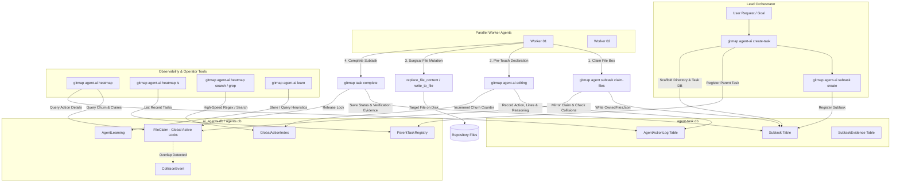

# Architecture Specification: Antigravity & GitMap AI Agent Telemetry & Heatmap Engine

- **Feature Slug:** `agent-ai-telemetry-and-heatmap`
- **Module:** `cli/cmdagent`, `cli/cmdagentai`, `03-ai-scripts/46-agent-sqlite-task-manager.py`
- **Specification Version:** 2.0.0
- **Status:** APPROVED
- **Target Audience:** Autonomous AI Agents, Multi-Agent Workers, Lead Orchestrators, GitMap Engineers
- **Target Release:** Minor Bump

---

## 1. Executive Summary & Architectural Motivation

In high-concurrency autonomous software engineering, multiple AI agents execute in parallel across shared repository worktrees. Without deterministic telemetry, coordinated file claiming, and granular in-flight action logging, multi-agent workflows suffer from four catastrophic failure modes:

1. **Working Tree Collisions & Windows File Lock Contention:**
   When two concurrent agents attempt to modify or format the same source file simultaneously, the host operating system encounters file lock contention, causing write truncation, merge corruption, or abrupt process crashes (exit code 128 / permission denied).

2. **In-Flight Crash Blindness (Zero-Forensic Failure):**
   When an AI worker crashes due to an unhandled panic, context budget exhaustion, or tool timeout, standard chat interfaces lose all diagnostic state. Operators cannot determine which subtask was in-flight, which file was being touched, which line range was targeted, or what operational reasoning was being pursued.

3. **Multi-Task Telemetry Fragmentation:**
   Storing all agent telemetry inside isolated per-task SQLite databases prevents cross-task search, global file churn analysis, and aggregate repository heatmaps. Conversely, storing all telemetry in a single monolithic database creates severe SQLite writer-lock bottlenecking during heavy multi-agent parallel execution.

4. **Transient Context Loss Across Sessions:**
   Architectural patterns, learned edge cases, and repo-specific heuristics discovered by worker agents are frequently lost when subagent conversation contexts terminate, forcing subsequent agents to repeatedly re-discover identical failure modes.

To definitively solve these challenges, the **Antigravity & GitMap AI Agent Telemetry Engine** establishes an enterprise-grade **Two-Tier Split-DB Architecture**, a mandatory **Pre-Touch In-Flight Editing Declaration Protocol**, and a real-time **Heatmap & Action Analysis Suite** exposed through the `gitmap agent-ai` and `gitmap agent` CLI command families.

---

## 2. System Topology: Two-Tier SQLite Split-DB Architecture

The telemetry engine decouples long-lived global indexing from high-frequency ephemeral worker mutations using a two-tier database topology:

```
.ai-memory/temp-agents/
├── ai_agents.db                           <-- Tier 1: Master Registry DB (Global index, cross-task queries, heatmaps)
│   (alias: agents.db)
└── <task-slug>/
    ├── agent-task.db                      <-- Tier 2: Per-Task Ephemeral DB (High-frequency subtask mutations & action logs)
    └── ledger.md                          <-- Human-readable Markdown audit ledger
```



### 2.1 Tier 1: Master Registry Database (`.ai-memory/temp-agents/ai_agents.db`)
- **Lifecycle:** Persistent across tasks within the repository workspace.
- **Concurrency Settings:** `PRAGMA journal_mode = WAL; PRAGMA busy_timeout = 5000; PRAGMA synchronous = NORMAL;`.
- **Primary Responsibilities:**
  1. Global index of all parent tasks (`ParentTaskRegistry`).
  2. Workspace-wide active file claims and collision tracking (`FileClaim`, `CollisionEvent`).
  3. High-speed global action and file churn indexing (`GlobalActionIndex`).
  4. Repository-scoped AI agent learning and heuristic retention (`AgentLearning`).

### 2.2 Tier 2: Per-Task Ephemeral Database (`.ai-memory/temp-agents/<slug>/agent-task.db`)
- **Lifecycle:** Scaffolding occurs upon `create-task`; scoped strictly to the execution lifecycle of the parent task.
- **Concurrency Settings:** `PRAGMA journal_mode = WAL; PRAGMA busy_timeout = 5000; PRAGMA synchronous = NORMAL;`.
- **Primary Responsibilities:**
  1. Granular subtask definitions and state machines (`Subtask`).
  2. Microsecond-resolution in-flight action and editing audit records (`AgentActionLog`).
  3. Verification outputs, linter execution logs, and acceptance evidence (`SubtaskEvidence`).

---

## 3. Database Schema Definitions (PascalCase & Positive Booleans)

All database tables strictly follow GitMap's architectural data standards:
- **PascalCase** table and column names.
- **Positive Booleans only:** columns prefixed with `Is*` or `Has*`, storing integer values `1` (true) or `0` (false).
- **Strict Relative Git Paths:** All stored filesystem paths are repository-relative forward-slash paths (`cli/cmd/root.go`, not absolute paths).

### 3.1 Tier 1 Master Registry Schema (`ai_agents.db`)

```sql
-- Parent task registration across all workspace sessions
CREATE TABLE IF NOT EXISTS ParentTaskRegistry (
    ParentTaskId INTEGER PRIMARY KEY AUTOINCREMENT,
    TaskSlug TEXT NOT NULL UNIQUE,
    TaskName TEXT NOT NULL,
    RunDirectory TEXT NOT NULL,
    Status TEXT NOT NULL DEFAULT 'ACTIVE',
    IsActive INTEGER NOT NULL DEFAULT 1,
    HasCompleted INTEGER NOT NULL DEFAULT 0,
    TotalStepsBudget INTEGER NOT NULL DEFAULT 300,
    CurrentStep INTEGER NOT NULL DEFAULT 1,
    TotalSubtasks INTEGER NOT NULL DEFAULT 0,
    CompletedSubtasks INTEGER NOT NULL DEFAULT 0,
    CreatedAt TEXT NOT NULL,
    UpdatedAt TEXT NOT NULL
);

-- Workspace-wide active file claims for collision detection
CREATE TABLE IF NOT EXISTS FileClaim (
    ClaimId INTEGER PRIMARY KEY AUTOINCREMENT,
    ParentTaskSlug TEXT NOT NULL,
    SubtaskId INTEGER NOT NULL,
    AgentRole TEXT NULL,
    FilePath TEXT NOT NULL,
    ClaimKind TEXT NOT NULL DEFAULT 'write',
    Status TEXT NOT NULL DEFAULT 'active',
    CreatedAt TEXT NOT NULL,
    ReleasedAt TEXT NULL
);

-- Detected write collisions across concurrent subtasks
CREATE TABLE IF NOT EXISTS CollisionEvent (
    EventId INTEGER PRIMARY KEY AUTOINCREMENT,
    ParentTaskSlug TEXT NOT NULL,
    FilePath TEXT NOT NULL,
    OwnerA TEXT NOT NULL,
    OwnerB TEXT NOT NULL,
    DetectedAt TEXT NOT NULL,
    IsResolved INTEGER NOT NULL DEFAULT 0,
    ResolutionNotes TEXT NULL
);

-- Fast cross-task search index for actions and touched files
CREATE TABLE IF NOT EXISTS GlobalActionIndex (
    IndexId INTEGER PRIMARY KEY AUTOINCREMENT,
    ParentTaskSlug TEXT NOT NULL,
    SubtaskId INTEGER NOT NULL,
    AgentRole TEXT NOT NULL,
    ActionType TEXT NOT NULL,
    FilePath TEXT NOT NULL,
    StartLine INTEGER NOT NULL DEFAULT 0,
    EndLine INTEGER NOT NULL DEFAULT 0,
    Reasoning TEXT NOT NULL,
    CreatedAt TEXT NOT NULL
);

-- Repository-scoped AI agent learning and heuristic memory
CREATE TABLE IF NOT EXISTS AgentLearning (
    LearningId INTEGER PRIMARY KEY AUTOINCREMENT,
    ParentTaskSlug TEXT NULL,
    Tag TEXT NOT NULL DEFAULT 'general',
    Content TEXT NOT NULL,
    ConfidenceScore REAL NOT NULL DEFAULT 1.0,
    IsVerified INTEGER NOT NULL DEFAULT 1,
    CreatedAt TEXT NOT NULL
);

CREATE INDEX IF NOT EXISTS idx_parent_slug ON ParentTaskRegistry(TaskSlug);
CREATE INDEX IF NOT EXISTS idx_claim_lookup ON FileClaim(FilePath, Status);
CREATE INDEX IF NOT EXISTS idx_global_action_file ON GlobalActionIndex(FilePath);
CREATE INDEX IF NOT EXISTS idx_learning_tag ON AgentLearning(Tag);
```

### 3.2 Tier 2 Per-Task Schema (`<slug>/agent-task.db`)

```sql
CREATE TABLE IF NOT EXISTS ParentTask (
    ParentTaskId INTEGER PRIMARY KEY AUTOINCREMENT,
    TaskName TEXT NOT NULL,
    TaskSlug TEXT NOT NULL UNIQUE,
    RunDirectory TEXT NOT NULL,
    Status TEXT NOT NULL DEFAULT 'ACTIVE',
    IsActive INTEGER NOT NULL DEFAULT 1,
    HasCompleted INTEGER NOT NULL DEFAULT 0,
    TotalStepsBudget INTEGER NOT NULL DEFAULT 300,
    CurrentStep INTEGER NOT NULL DEFAULT 1,
    Notes TEXT NULL,
    CreatedAt TEXT NOT NULL,
    UpdatedAt TEXT NOT NULL
);

CREATE TABLE IF NOT EXISTS Subtask (
    SubtaskId INTEGER PRIMARY KEY AUTOINCREMENT,
    ParentTaskId INTEGER NOT NULL,
    TaskCode TEXT NOT NULL,
    Title TEXT NOT NULL,
    AssignedAgentRole TEXT NULL,
    OwnedFilesJson TEXT NOT NULL DEFAULT '[]',
    Status TEXT NOT NULL DEFAULT 'PENDING',
    IsBlocked INTEGER NOT NULL DEFAULT 0,
    HasCompleted INTEGER NOT NULL DEFAULT 0,
    Evidence TEXT NULL,
    CreatedAt TEXT NOT NULL,
    UpdatedAt TEXT NOT NULL,
    FOREIGN KEY (ParentTaskId) REFERENCES ParentTask(ParentTaskId)
);

CREATE TABLE IF NOT EXISTS AgentActionLog (
    ActionLogId INTEGER PRIMARY KEY AUTOINCREMENT,
    SubtaskId INTEGER NOT NULL,
    AgentRole TEXT NOT NULL,
    ActionType TEXT NOT NULL,
    TargetFile TEXT NULL,
    StartLine INTEGER NOT NULL DEFAULT 0,
    EndLine INTEGER NOT NULL DEFAULT 0,
    Reasoning TEXT NOT NULL,
    Status TEXT NOT NULL DEFAULT 'IN_PROGRESS',
    DurationMs INTEGER NOT NULL DEFAULT 0,
    CreatedAt TEXT NOT NULL,
    FOREIGN KEY (SubtaskId) REFERENCES Subtask(SubtaskId)
);

CREATE TABLE IF NOT EXISTS SubtaskEvidence (
    EvidenceId INTEGER PRIMARY KEY AUTOINCREMENT,
    SubtaskId INTEGER NOT NULL,
    CommandRun TEXT NOT NULL,
    ExitCode INTEGER NOT NULL DEFAULT 0,
    FilesScannedCount INTEGER NOT NULL DEFAULT 0,
    OutputSnippet TEXT NULL,
    CreatedAt TEXT NOT NULL,
    FOREIGN KEY (SubtaskId) REFERENCES Subtask(SubtaskId)
);

CREATE INDEX IF NOT EXISTS idx_subtask_status ON Subtask(Status);
CREATE INDEX IF NOT EXISTS idx_subtask_code ON Subtask(TaskCode);
CREATE INDEX IF NOT EXISTS idx_action_subtask ON AgentActionLog(SubtaskId);
CREATE INDEX IF NOT EXISTS idx_action_file ON AgentActionLog(TargetFile);
```

---

## 4. The Mandatory Pre-Touch In-Flight Editing Invariant

To guarantee 100% crash forensics and prevent file collisions across parallel workers, all AI agents operate under a non-negotiable **Pre-Touch Editing Invariant**:

> [!CRITICAL]
> **RULE R-PRETOUCH (MANDATORY IN-FLIGHT ACTION LOGGING):**
> Before invoking any file mutation or inspection tool (`write_to_file`, `replace_file_content`, or substantive `view_file` deep audits), an AI agent MUST FIRST execute `gitmap agent-ai editing` (or the Python fallback `46-agent-sqlite-task-manager.py log-action`).
> 
> The declaration MUST include:
> 1. Target Subtask identifier or Parent Task slug.
> 2. Relative repository file path.
> 3. Targeted line numbers (`--lines <start,end>`).
> 4. Concrete technical reasoning (`--reasoning "<detailed rationale>"`).
> 
> **Failing to declare an action before modifying a file is an automatic protocol violation.**

### 4.1 Forensic Recovery Lifecycle
If a worker subagent crashes mid-execution (due to process killed, token limit reached, or tool error), the orchestrator or replacement worker immediately executes:
```bash
gitmap agent diagnose
```
The diagnostic engine inspects the latest in-flight rows in `AgentActionLog` where `Status = 'IN_PROGRESS'`. Because the file path, line numbers, and reasoning were committed to SQLite WAL storage *before* the crash occurred, the replacement worker can resume the exact micro-operation with zero loss of context.

---

## 5. Heatmap Generation & Activity Analytics

The heatmap engine aggregates file modification frequency and claim density across tasks, computing operational heat scores for terminal rendering and JSON telemetry.

### 5.1 Heat Score Algorithm
For any file $f$, the Heat Score $H(f)$ is calculated as:
$$H(f) = W_{claim} \times C(f) + W_{action} \times A(f)$$
Where:
- $C(f)$ = Total active write claims in `FileClaim` ($W_{claim} = 2.0$).
- $A(f)$ = Total in-flight editing touches in `AgentActionLog` ($W_{action} = 1.0$).

### 5.2 Terminal Visual Heat Badges
Files are classified into heat tiers rendered in high-contrast ANSI styling:
- **CRITICAL HEAT ($H \ge 10$):** `[🔥🔥 CRITICAL]` (Bold Red) — high-conflict nexus; multiple subtasks or intensive iterative editing.
- **WARM HEAT ($4 \le H < 10$):** `[🔥 ACTIVE]` (Vibrant Yellow) — active feature implementation.
- **COOL HEAT ($1 \le H < 4$):** `[• TOUCHED]` (Cyan) — single-pass update or verification touch.

---

## 6. Heuristic Retention & Continuous Learning (`agent-ai learn`)

AI agents operating in large codebases discover domain-specific architectural nuances (e.g., "always use `captureStdout()` in Windows tests to prevent deadlock", "GitMap CLI flags must use positive booleans").

The `gitmap agent-ai learn` engine stores these insights into the Tier 1 `AgentLearning` table. During Phase 1 preflight, orchestrators automatically query `AgentLearning` matching the task domain, priming worker briefs with grounded project memory.
