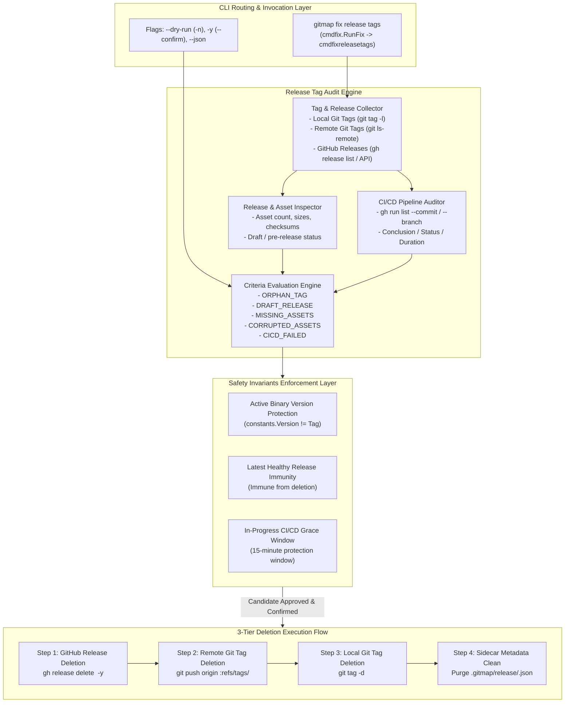
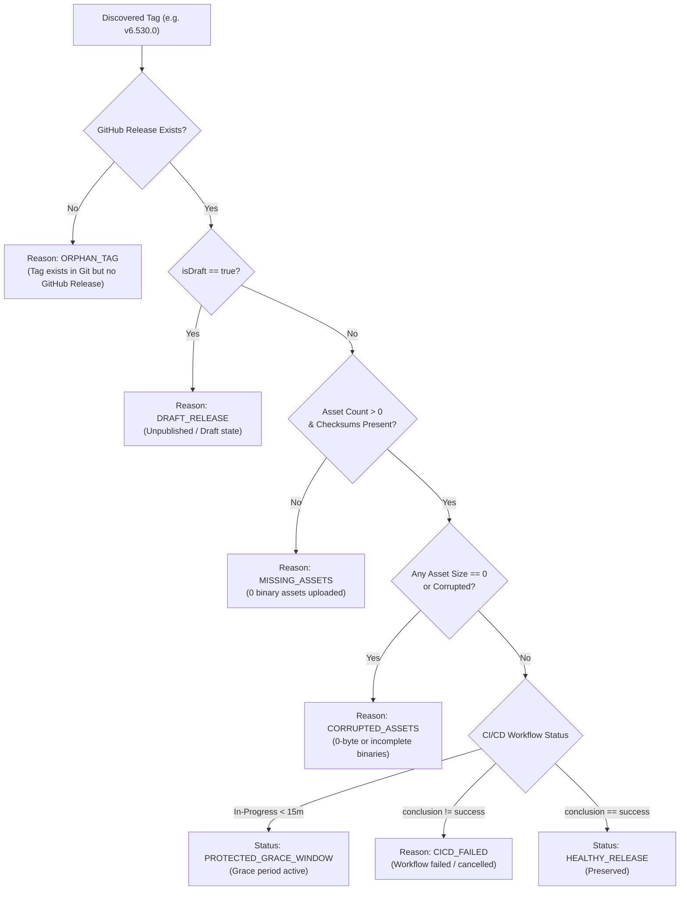
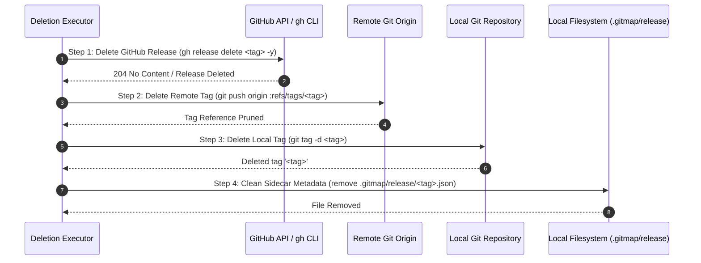

# Architecture Specification: Release Tag Management & Automated Deletion Engine (`gitmap fix release tags`)

**Document ID:** `02-spec/21-app/command-development-for-release-tag-management/01-architecture-and-audit-engine-spec.md`  
**Classification:** Core Application Specification (`02-spec/21-app`)  
**Version:** 1.0.0  
**Updated:** 2026-10-10  
**Milestone:** `command-development-for-release-tag-management`  
**Status:** `ratified`  
**AI Confidence:** High  
**Ambiguity:** None  
**Companion Documents:**  
- [Master Plan: Command Development for Release Tag Management](../../../.ai-memory/plans/command-development-for-release-tag-management.md)  
- [Subtask Plan 01: Release Tag Audit & Deletion Engine](../../../.ai-memory/plans/subtasks/command-development-for-release-tag-management/01-release-tags-audit-and-deletion-engine.md)  
- [Subtask Plan 02: CLI Routing, Help UI & Documentation](../../../.ai-memory/plans/subtasks/command-development-for-release-tag-management/02-cli-routing-help-ui-and-documentation.md)  
- [CLI Architecture Specification](../01-cli-architecture/01-architecture-spec.md)  

---

## Keywords

`release-tags` · `audit-engine` · `tag-deletion` · `orphan-tag` · `draft-release` · `missing-assets` · `corrupted-assets` · `cicd-failed` · `3-tier-deletion` · `safety-invariants` · `active-version-protection` · `grace-window` · `positive-booleans` · `gitmap-fix-release-tags`

---

## Specification Scoring & Audit Ledger

| Criterion | Status | Notes |
| :--- | :---: | :--- |
| System Architecture Defined | ✅ | Full architecture of Release Tag Audit and Deletion Engine documented |
| Audit Criteria Specified | ✅ | Exhaustive specifications for `ORPHAN_TAG`, `DRAFT_RELEASE`, `MISSING_ASSETS`, `CORRUPTED_ASSETS`, `CICD_FAILED` |
| 3-Tier Deletion Flow Specified | ✅ | Step 1 (GH Release), Step 2 (Remote Git Tag), Step 3 (Local Git Tag), Step 4 (Sidecar Metadata) |
| Safety Invariants Guaranteed | ✅ | Active binary version protection, latest healthy release immunity, 15-min CI/CD grace window |
| CLI Interaction & Modes Covered | ✅ | Dry-run (`-n`, `--dry-run`), interactive confirmation, non-interactive (`-y`, `--confirm`), JSON output (`--json`) |
| Architectural Diagrams Included | ✅ | Mermaid lifecycle flowchart, component topology, and sequence diagrams |
| Go Type Models Defined | ✅ | Strongly-typed structs with positive booleans and JSON serialization tags |
| Verification Gates Detailed | ✅ | VG-01 through VG-07 with explicit preconditions, inputs, and validation assertions |
| Relative Paths Enforced | ✅ | 100% relative Git paths; zero absolute paths or `file:///` URIs |
| Positive Booleans Enforced | ✅ | Strictly positive boolean fields (`IsValid`, `HasAssets`, `IsProtected`, `IsHealthy`) |

---

## 1. Executive Summary & Core Intent

### 1.1 Problem Statement
In continuous delivery workflows, automated release processes regularly create git release tags before or during CI/CD build matrix runs. When unexpected pipeline failures, network timeouts, or configuration regressions occur, repositories are left in inconsistent and corrupted release states:
1. **Orphan Git Tags:** Git release tags pushed to the remote tracking repository (and local cloned branches) without a corresponding GitHub Release object.
2. **Draft / Unpublished Releases:** Releases left in draft state on GitHub indefinitely after a release script or agent crashed before publishing.
3. **Missing Binary Assets:** Releases created on GitHub where the binary compilation step failed, leaving a release with zero uploaded archives or checksum files.
4. **Corrupted Binary Assets:** Uploaded binary assets with zero-byte size or truncated payload bytes that fail verification checks during downstream installations.
5. **CI/CD Failed Releases:** Releases where associated GitHub Actions build workflows failed (`conclusion != "success"`), yet tags and broken releases remain visible.

These broken states confuse downstream auto-updaters (e.g. `gitmap update`), pollute release history, mislead users, and trigger false positives in release monitoring dashboards.

### 1.2 Core Intent & Command Definition
The `gitmap fix release tags` command (`cmdfixreleasetags` subsystem) provides an autonomous, safe, and reproducible engine to audit all repository release tags, detect broken release states against five rigorous audit criteria, enforce non-negotiable safety invariants, and surgically remove invalid releases across all three tiers (GitHub, remote git repository, local git repository) along with local sidecar metadata.

---

## 2. System Architecture & Topology



---

## 3. Release Tag Audit Engine: Criteria & Detection Logic

The audit engine iterates across all discoverable semantic version tags in the target repository and checks each against five standardized audit criteria:



### 3.1 Criteria Specifications

#### 1. `ORPHAN_TAG`
- **Definition:** A git tag exists in either the local repository refs (`refs/tags/<tag>`) or the remote tracking repository refs (`refs/remotes/origin/tags/<tag>`), but no corresponding GitHub release object is published on GitHub.
- **Root Cause:** A release workflow was aborted before creating the GitHub release, or an operator created a manual tag without publishing a release.
- **Eligibility:** Eligible for deletion unless blocked by safety invariants.

#### 2. `DRAFT_RELEASE`
- **Definition:** A release exists in the GitHub releases registry where the `draft` flag is `true`.
- **Root Cause:** A multi-stage release script staged a release draft but terminated prematurely due to an error before asset upload or release finalization.
- **Eligibility:** Eligible for deletion unless protected.

#### 3. `MISSING_ASSETS`
- **Definition:** A published GitHub release exists (`isDraft == false`), but the count of attached binary assets is zero, or mandatory checksum files (`checksums.txt` or `*.sha256`) are absent.
- **Root Cause:** The GitHub release was created, but binary build or asset upload jobs failed or timed out.
- **Eligibility:** Eligible for deletion unless protected.

#### 4. `CORRUPTED_ASSETS`
- **Definition:** A published GitHub release exists with attached assets, but one or more assets have a reported size of 0 bytes, or archive inspection reveals a corrupted/truncated payload.
- **Root Cause:** Network dropouts during artifact upload, premature process kills during HTTP multipart transfer, or empty build artifacts uploaded.
- **Eligibility:** Eligible for deletion unless protected.

#### 5. `CICD_FAILED`
- **Definition:** The GitHub Actions workflow run triggered by the release tag or associated commit SHA terminated with a failing conclusion (`failure`, `cancelled`, `timed_out`, or `startup_failure`), where `conclusion != "success"`.
- **Root Cause:** Unit tests failed, linter checks failed, build compilation failed, or deployment steps crashed.
- **Eligibility:** Eligible for deletion unless protected.

---

## 4. Safety Invariants & Immunity Rules

The deletion engine MUST strictly enforce three safety rules. Safety checks take absolute precedence over deletion candidates.

### 4.1 Invariant 1: Active Binary Version Protection
- **Rule:** The version of the currently running `gitmap` binary (`constants.Version`, e.g. `6.529.0` or `v6.529.0`) MUST NEVER be deleted under any circumstances.
- **Rationale:** Deleting the release or tags corresponding to the executing binary can destabilize self-updating mechanisms and delete active diagnostic baselines.
- **Status:** If matched, the candidate is marked `PROTECTED_ACTIVE_VERSION` and excluded from deletion.

### 4.2 Invariant 2: Latest Valid / Healthy Release Immunity
- **Rule:** The most recent semver release that is valid and healthy (`TagReasonHealthy`) is permanently immune from deletion.
- **Rationale:** The repository must always maintain a valid baseline production release for consumers and cloning tools.
- **Status:** If matched, the candidate is marked `PROTECTED_LATEST_HEALTHY` and excluded from deletion.

### 4.3 Invariant 3: In-Progress CI/CD Grace Window (15 Minutes)
- **Rule:** If a release tag was created within the last 15 minutes and has an associated GitHub Actions run that is currently `queued`, `in_progress`, or `waiting`, it MUST NOT be deleted.
- **Rationale:** Build workflows require time to compile polyglot binaries across operating system matrices (Windows, macOS, Linux). Premature deletion during an active build would invalidate in-flight releases.
- **Grace Threshold:** `time.Since(run.CreatedAt) < 15 * time.Minute` or `run.Status != "completed"`.
- **Status:** If within the window, the candidate is marked `PROTECTED_GRACE_WINDOW` and excluded from deletion.

---

## 5. 3-Tier Deletion Execution Flow

When a tag is evaluated as broken and passes all safety invariant checks, deletion executes through a strict 4-step sequence:



### 5.1 Step 1: GitHub Release Deletion
- **Command:** `gh release delete <tag> -y` or GitHub REST API `DELETE /repos/{owner}/{repo}/releases/{id}`.
- **Verification:** Confirm release is no longer queryable via `gh release view <tag>`.
- **Error Handling:** If release does not exist (e.g. `ORPHAN_TAG`), Step 1 records `StepStatusSkipped` and proceeds to Step 2.

### 5.2 Step 2: Remote Git Tag Deletion
- **Command:** `git push origin :refs/tags/<tag>` or `git push --delete origin <tag>`.
- **Verification:** Confirm remote reference `refs/tags/<tag>` is purged.
- **Error Handling:** If remote tag is already removed or origin is unreachable in offline mode, log warning, record step status, and continue to Step 3.

### 5.3 Step 3: Local Git Tag Deletion
- **Command:** `git tag -d <tag>`.
- **Verification:** Execute `git rev-parse --verify refs/tags/<tag>` to confirm reference resolution failure.
- **Error Handling:** If tag does not exist locally, mark as `StepStatusSkipped`.

### 5.4 Step 4: Clean Sidecar Metadata
- **Path:** `.gitmap/release/<tag>.json` and temporary staging artifacts under `.gitmap/release/temp/`.
- **Action:** Safely remove sidecar files via `os.Remove`.
- **Verification:** Verify `os.Stat(path)` returns `os.ErrNotExist`.

---

## 6. Go Type Definitions & Data Models

All models must reside in `cli/cmdfixreleasetags/types.go` and use positive boolean naming conventions:

```go
package cmdfixreleasetags

import "time"

// AuditReason identifies the primary cause for flagging a release tag.
type AuditReason string

const (
	ReasonHealthy         AuditReason = "HEALTHY"
	ReasonOrphanTag       AuditReason = "ORPHAN_TAG"
	ReasonDraftRelease    AuditReason = "DRAFT_RELEASE"
	ReasonMissingAssets   AuditReason = "MISSING_ASSETS"
	ReasonCorruptedAssets AuditReason = "CORRUPTED_ASSETS"
	ReasonCICDFailed      AuditReason = "CICD_FAILED"
)

// ProtectionStatus indicates whether a tag is immune to deletion.
type ProtectionStatus string

const (
	StatusEligible          ProtectionStatus = "ELIGIBLE"
	StatusProtectedActive   ProtectionStatus = "PROTECTED_ACTIVE_VERSION"
	StatusProtectedLatest   ProtectionStatus = "PROTECTED_LATEST_HEALTHY"
	StatusProtectedGrace    ProtectionStatus = "PROTECTED_GRACE_WINDOW"
)

// StepStatus tracks execution outcomes for individual deletion steps.
type StepStatus string

const (
	StepPending   StepStatus = "PENDING"
	StepSuccess   StepStatus = "SUCCESS"
	StepSkipped   StepStatus = "SKIPPED"
	StepFailed    StepStatus = "FAILED"
)

// ReleaseAssetInfo details an uploaded asset file.
type ReleaseAssetInfo struct {
	Name      string `json:"name"`
	Size      int64  `json:"size"`
	State     string `json:"state"`
	IsValid   bool   `json:"isValid"`
}

// CIWorkflowRunInfo summarizes a GitHub Actions workflow run for a tag/commit.
type CIWorkflowRunInfo struct {
	RunId       uint64    `json:"runId"`
	WorkflowName string   `json:"workflowName"`
	Status      string    `json:"status"`
	Conclusion  string    `json:"conclusion"`
	CreatedAt   time.Time `json:"createdAt"`
	Duration    time.Duration `json:"duration"`
	IsSuccessful bool     `json:"isSuccessful"`
	IsInProgress bool     `json:"isInProgress"`
}

// ReleaseTagAuditRecord contains the complete audit diagnosis for a single tag.
type ReleaseTagAuditRecord struct {
	Tag               string             `json:"tag"`
	CommitSha         string             `json:"commitSha"`
	HasLocalTag       bool               `json:"hasLocalTag"`
	HasRemoteTag      bool               `json:"hasRemoteTag"`
	HasGitHubRelease  bool               `json:"hasGitHubRelease"`
	IsDraft           bool               `json:"isDraft"`
	AssetCount        int                `json:"assetCount"`
	Assets            []ReleaseAssetInfo `json:"assets,omitempty"`
	HasChecksumFile   bool               `json:"hasChecksumFile"`
	WorkflowRuns      []CIWorkflowRunInfo `json:"workflowRuns,omitempty"`
	AuditReason       AuditReason        `json:"auditReason"`
	ProtectionStatus  ProtectionStatus   `json:"protectionStatus"`
	IsEligibleForDeletion bool           `json:"isEligibleForDeletion"`
}

// StepExecutionResult tracks the outcome of an individual deletion step.
type StepExecutionResult struct {
	StepName string     `json:"stepName"`
	Status   StepStatus `json:"status"`
	Detail   string     `json:"detail,omitempty"`
}

// ReleaseTagDeletionResult tracks the full 4-tier execution for a tag.
type ReleaseTagDeletionResult struct {
	Tag          string                `json:"tag"`
	AuditReason  AuditReason           `json:"auditReason"`
	Steps        []StepExecutionResult `json:"steps"`
	IsCompleted  bool                  `json:"isCompleted"`
	ErrorMessage string                `json:"errorMessage,omitempty"`
}

// AuditSummary aggregates counts across the repository audit.
type AuditSummary struct {
	TotalTagsChecked       int `json:"totalTagsChecked"`
	HealthyReleasesCount   int `json:"healthyReleasesCount"`
	OrphanTagsCount        int `json:"orphanTagsCount"`
	DraftReleasesCount     int `json:"draftReleasesCount"`
	MissingAssetsCount     int `json:"missingAssetsCount"`
	CorruptedAssetsCount   int `json:"corruptedAssetsCount"`
	CICDFailedCount        int `json:"cicdFailedCount"`
	ProtectedTagsCount     int `json:"protectedTagsCount"`
	EligibleDeletionsCount int `json:"eligibleDeletionsCount"`
}

// AuditReport is the top-level payload for audit and deletion runs.
type AuditReport struct {
	RepoPath         string                     `json:"repoPath"`
	ActiveVersion    string                     `json:"activeVersion"`
	LatestHealthyTag string                     `json:"latestHealthyTag"`
	Summary          AuditSummary               `json:"summary"`
	Records          []ReleaseTagAuditRecord    `json:"records"`
	DeletionResults  []ReleaseTagDeletionResult `json:"deletionResults,omitempty"`
}
```

---

## 7. CLI Interaction Flow & Output Modes

### 7.1 Dry-Run Mode (`--dry-run` / `-n`)
When `--dry-run` or `-n` is supplied:
1. Performs full audit across local tags, remote tags, releases, assets, and CI/CD runs.
2. Applies safety invariants.
3. Renders a formatted two-column/tabular diagnostic display previewing candidate tags, reason codes, and protection statuses.
4. Explains what would be deleted without executing any modifications.
5. Exit code: 0.

### 7.2 Interactive Mode (Default without `-y`)
When executed without flags:
1. Executes audit and renders diagnostic preview.
2. If 0 eligible tags found: displays green checkmark `✓ No broken release tags require remediation.` and exits cleanly.
3. If N eligible tags found: prompts user:
   ```text
   Found 2 broken release tag(s) eligible for deletion.
   Proceed with 3-tier deletion? [y/N]: 
   ```
4. If user inputs `y` or `yes`, executes 3-tier deletion and sidecar metadata cleanup.
5. If user cancels or inputs `n`, aborts without making modifications.

### 7.3 Non-Interactive / Force Mode (`-y`, `--yes`, `--confirm`)
When automated execution is required:
1. Runs audit.
2. Bypasses confirmation prompt.
3. Executes 3-tier deletion for all eligible candidates.
4. Emits detailed progress log for each step.

### 7.4 JSON Mode (`--json`)
When machine-readable output is requested:
1. Suppresses interactive prompts.
2. Emits typed JSON envelope complying with GitMap envelope standards:
   ```json
   {
     "version": "2.0",
     "gitmapVersion": "6.529.0",
     "command": "fix release tags",
     "status": "success",
     "data": {
       "repoPath": ".",
       "activeVersion": "6.529.0",
       "latestHealthyTag": "v6.528.0",
       "summary": {
         "totalTagsChecked": 12,
         "healthyReleasesCount": 10,
         "orphanTagsCount": 1,
         "draftReleasesCount": 0,
         "missingAssetsCount": 0,
         "corruptedAssetsCount": 0,
         "cicdFailedCount": 1,
         "protectedTagsCount": 2,
         "eligibleDeletionsCount": 2
       },
       "records": [...],
       "deletionResults": [...]
     }
   }
   ```

---

## 8. Verification Gates & Test Scenarios

| Gate ID | Test Case | Precondition | Input / Trigger | Expected Outcome |
| :--- | :--- | :--- | :--- | :--- |
| **VG-01** | Orphan Tag Audit & Deletion | Git tag `v6.520.0` exists in local/remote refs; no GitHub release | `gitmap fix release tags -y` | Audit assigns `ORPHAN_TAG`. Deletion prunes remote and local tags. Step 1 skipped cleanly. |
| **VG-02** | Draft Release Audit & Deletion | Release `v6.521.0` exists with `isDraft == true` | `gitmap fix release tags -y` | Audit assigns `DRAFT_RELEASE`. Deletion deletes GH release, remote tag, local tag, sidecar. |
| **VG-03** | Missing Assets Audit & Deletion | Release `v6.522.0` has 0 assets uploaded | `gitmap fix release tags -y` | Audit assigns `MISSING_ASSETS`. Deletion prunes all 3 tiers. |
| **VG-04** | Corrupted Assets Audit & Deletion | Release `v6.523.0` has binary asset of size 0 bytes | `gitmap fix release tags -y` | Audit assigns `CORRUPTED_ASSETS`. Tag and release deleted. |
| **VG-05** | CI/CD Failure Audit & Deletion | Actions run for tag `v6.524.0` has `conclusion: "failure"` | `gitmap fix release tags -y` | Audit assigns `CICD_FAILED`. Tag and release deleted. |
| **VG-06** | Active Version Immunity | Tag `v6.529.0` matches `constants.Version` | `gitmap fix release tags -y` | Audit flags `PROTECTED_ACTIVE_VERSION`. Tag is NOT deleted. |
| **VG-07** | Latest Healthy Release Immunity | Tag `v6.528.0` is highest valid healthy release | `gitmap fix release tags -y` | Audit flags `PROTECTED_LATEST_HEALTHY`. Tag is NOT deleted. |
| **VG-08** | In-Progress CI/CD Grace Window | Workflow run for `v6.530.0` is `in_progress` created 5m ago | `gitmap fix release tags -y` | Audit flags `PROTECTED_GRACE_WINDOW`. Tag is NOT deleted. |
| **VG-09** | Dry-Run Non-Destructive Invariant | 2 tags eligible for deletion | `gitmap fix release tags --dry-run` | Preview table printed. Zero API calls made for deletion. Git tags remain intact. |
| **VG-10** | JSON Envelope Compliance | Valid repository state | `gitmap fix release tags --json` | Valid JSON payload emitted with complete `AuditReport`. |
