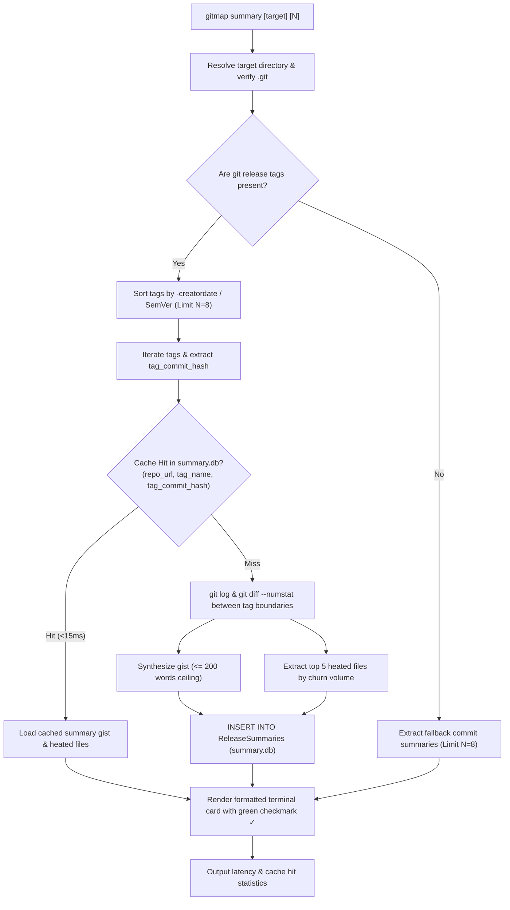
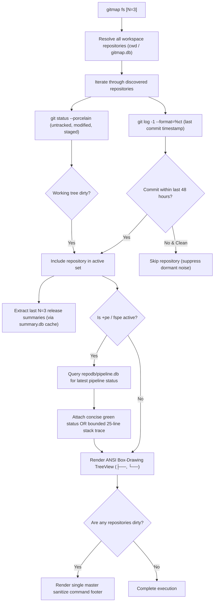
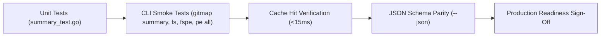

# Architecture Specification: GitMap Summary, Workspace Heatmap & Pipeline Telemetry Suite

**Document ID:** `02-spec/21-app/gitmap-command-enhancements/01-architecture-spec.md`  
**Classification:** Core Application Specification (`02-spec/21-app`)  
**Version:** 1.0.0  
**Updated:** 2026-10-10  
**Milestone:** `gitmap-command-enhancements` (Run 82)  
**Status:** `ratified`  
**AI Confidence:** High  
**Ambiguity:** None  
**Companion Documents:**  
- [Component Specification: Distributed Fleet Nodes & AI Merge Orchestrator](02-component-spec.md)  
- [Universal "Repo Feature" Destination Resolver](repo-feature.md)  
- [Specification Catalog Readme](readme.md)  
- [Engineering Subtask Plan: Summary Engine](../../../.ai-memory/plans/subtasks/gitmap-command-enhancements/01-summary-engine.md)  
- [Engineering Subtask Plan: Nodes & Merge-AI](../../../.ai-memory/plans/subtasks/gitmap-command-enhancements/02-nodes-and-merge-ai.md)  

---

## Keywords

`summary` · `full-summary` · `fs` · `fspe` · `pe-all` · `pipe-error-all` · `split-db` · `summary.db` · `heated-files` · `activity-heatmap` · `treeview` · `dirty-state` · `sanitize-all` · `pipeline-telemetry` · `concise-green` · `incremental-delta`

---

## Scoring

| Criterion | Status | Notes |
| :--- | :---: | :--- |
| `readme.md` present in module | ✅ | Registered in `02-spec/21-app/gitmap-command-enhancements/readme.md` |
| AI Confidence assigned | ✅ | High |
| Ambiguity assigned | ✅ | None |
| Keywords present | ✅ | Indexed above |
| Scoring table present | ✅ | Validated |
| Normalized Split-DB Schema defined | ✅ | `summary.db` schema and views included |
| Strict relative paths | ✅ | Zero absolute paths or `file:///` URIs |

---

## Purpose

This document specifies the authoritative system architecture, data models, Split-DB caching protocol, and command grammar for the GitMap Summary, Workspace Activity Heatmap, and CI/CD Pipeline Telemetry subsystem. It defines the operational contracts for `gitmap summary`, `gitmap full summary` (`fs`), `gitmap full summary+pe` (`fspe`), and `gitmap pe all` (`pipe-error-all`), enabling developers and autonomous AI coding agents to evaluate multi-repository health, release trajectories, file churn, and CI/CD status within milliseconds.

---

## User Request (Verbatim)

```text
gitmap full summary N # default N = 3
gitmap full status N # default N = 3
gitmap fs N # default N = 3
gitmap summary ($repo/currently in the repo) N # default N = 8

gitmap nodes fs
gitmap nodes full status
gitmap nodes full summary
gitmap nodes summary $repoName/alias

gitmap full summary+pe
gitmap full status+pe
gitmap fs+pe --json
gitmap fspe (full summary with pipeline error)

gitmap nodes fs+pe --json
gitmap nodes fspe --json
gitmap nodes pe all --json
gitmap nodes pipe-error-all --json


gitmap pe all --json
gitmap pe all --force-all

gitmap merge-ai <dest repo url/folder with git/ folder without git/or new repo name> file.txt
gitmap merge-ai <dest repo url/folder with git/ folder without git/or new repo name> url1, url2, url3
gitmap merge-ai <dest create new or exist repo url/folder with git/ folder without git/or new repo name/repo future> url1 url2 url3 
gitmap merge-ai (ma) config.json


Make sure you release at the end and check if gitmap pe okay


# GitMap Command Enhancements: high priority instruction, non-negotiable task

Hi there. So in this case, I want to have the new commands, which I have listed. Now, these new commands, let me explain one by one. Basically, there is a group of commands, same commands in different forms or different meaning. Let me get into one by one. The first one is the gitmap full summary or full status, which is the short form of fs. Now in any case, if there are things that have been done, and if we run the fs, there'd be another version, like summary, the gitmap summary. So if we run the gitmap summary on a repo, we can give a repo path, repo URL, or currently in the repo dir. By default, the number is 20. This can be customizable for the git summary. Let's discuss what the summary should do. Summary should sum up the last eight releases. It means that last eight releases have the change log. It would sum up the release versions and the change logs that have been collected as short as possible, not too much. There should be a character or word limit, 200 words, so not to include too many file names or things like that. Just try to have the gist of it. Every version that recently has released, that would be there. That's the first thing, based on the repo summary, if we just take the summary. Repo summary or gitmap summary on a repo is going to do the eight version of it. So last eight releases, it will sum up and heated files, files which have most changes and what it has done. The gitmap should have the ability to summarize in the terminal and tell the user so that they feel like what is done in a very natural way. It should have a split DB of summary where it would write those summaries so that if the user again asks it to check the git hash, the last one, if that matches every one of the git hashes on the releases, on the last release tags and the last hash that we have, then it'll just return from the cache. If we have new changes other than the last cache, then it has to, again, calculate the stuff based on what we have in the cache, because the cache releases are not going to change. What we have and what the new changes are, then it has to summarize that algorithm and nicely print it out. Remember to have the database as much as normalized as possible, SQLite DB, so that we can reduce the spaces. Every time we view the data, we should have a database view so that the query is simpler everywhere. That's the summary. Now, what is the full summary? Full summary is all the repos that we have, we would try to figure out the heat map repos. That means the repo that at least have any changes in last 48 hours. That can also be changed based on the settings. You should have settings for this as well. Let's say last 48 hours. Let's take 48 hours as default. Let's say there are five repos that have changes in last 48 hours. It has some commits. That could be one way. Another could be repos that recently have worked on, have some uncommitted files or some dirty state. What we are collecting here in this summary, any repo that has a dirty state and any repo that has a change in last 48 hours. All this repo we collect, and we at least give three releases, last three releases summary. Summary means what we already learned, how the summary works, but in this case, if we do the full summary, then every repo will have three, and it would show as a tree view. Subtree would have the changes and the items, how it has done. If a repo is dirty, then there would be a command to commit all, or there could be a full command, a single command at the end that user can run to commit all the pending stuff. Full summary also tells us if there are pending changes. It will tell us what the releases are done, what it has completed so far. Now then we have nodes FS that would actually go to all the nodes and give the same full summary process. We also have summary git-map, full summary plus PE, that means pipeline with errors. We can have a short version of it, git-map FS plus PE. That is basically going to include the error logs from the CI/CD if there is any, and compile into the terminal so that any AI can read and fix. If we use the PE version, we can have nodes PE that is going to PE all or PE any. Nodes PE space all or nodes pipe error all. In both of these cases, it's going to give current machine as well, current machines all the repos pipeline errors, and it would combine to a JSON. All of these actually communicate with the JSON parallelly. There is one more point, I think, in the pipeline all error that we have to consider because if we are running on all the machines, so all machines will have similar repos. The first thing it should do is the main machine would count how many repos that they have based on the repo URL. Based on this, if the current machine has all the repos, then it does not need to run each one of the repo errors on separate machines. It can run on the current machine and get the full error first, and the repos which are missing or different on different machines, only the different ones will only be collected as a pipeline error and send it back. In the pipeline all should also respect the 48 hours rules because it is not possible to bring all the pipeline errors for 78 or 70 repos. It needs to be very efficient. We also have the pipe git-map PE all. PE all needs to be also efficient. It should only give the errors which we have worked on last 48 hours. If a repo does not have any error, it just says green. Do not use too much verbose stuff because it's a very summarized version that we're looking for. User can actually do force all, another flag. If they do that, then it basically going to go and try to find all the repos, CI/CD errors. If only which has the error or has the pipeline ready, they will be coming back with a summary in the terminal nicely. It can also be shown as a JSON. All these sections should have a JSON flag to see the notices and things in JSON format as well. When we are doing the trust machine or full summary, we run the full summary. Full summary is basically what is pending and what is committed, what is resulted. The full summary on nodes, this will also be very efficient. That means it has to know current machines, all the repos, because now it can get the summary from the current machine, all the repos. That's the first thing. Second, the repos which are not in the current machine but exist in other machines, only those would be requested to those machines. The git-map should have a way to understand which machine contains which repo. The first thing the git-map would send to the nodes that send me back your repo URL. Repo URL and path and machine information. That is a JSON summary that it would receive first. Based on that, it would take the decision, like where the next request will come to collect the git-map FS summary, the pipeline universe. I hope you understand how it's going to work. If you have any question or confusion, we can discuss that. This is a very detailed and delicate situation that you need to understand and complete. Whenever we have a summary, try to have a green check in the terminal so that it looks nice, like what is done for the done commands. I hope these are very detailed. It's helpful for you to optimize the decision making and understanding of it. If not, let me know. First, you have to plan it right, the details of the planning of each command, because I'm just giving you from top level, so you need to write, break it down, how it's going to work, what it's going to help, examples and things like that.
```

---

## 1. Executive Summary & Problem Statement

### 1.1 Engineering Challenges in Polyglot Fleet Management
In high-velocity engineering teams and autonomous AI coding environments managing 40+ repositories across multiple machines, developers and AI agents encounter four acute architectural bottlenecks:

1. **Context Fragmentation & Cognitive Overload:**
   - Determining the recent direction, features, and active files across dozens of repositories requires executing hundreds of manual `git log`, `git tag`, and `git diff` operations.
   - Standard changelogs and git logs produce sprawling, unstructured file listings that overwhelm context windows without conveying the semantic intent of releases.

2. **Decoupled CI/CD Telemetry:**
   - Pipeline statuses live in external web portals or cloud runner logs (GitHub Actions, GitLab CI). When an automated pipeline fails, developers and AI agents must leave the terminal, authenticate to cloud interfaces, and parse massive megabyte log outputs to extract simple syntax errors or compilation failures.

3. **Subprocess Latency & Redundant Disk Scans:**
   - Running live git status checks and log queries across an entire workspace incurs repetitive process spawning, file system traversal, and git lock overhead. Repeated queries waste CPU cycles when git commits and release tags have not changed.

4. **Multi-Machine Duplication in Remote SSH Fleets:**
   - Developers frequently clone identical sets of core repositories across local workstations, dev boxes, and CI nodes. Querying every node blindly generates redundant network traffic, causes SSH connection latency, and floods the terminal with duplicate information.

### 1.2 The GitMap Solution Architecture
This specification formalizes the architectural contracts for an integrated summary, heatmap, and telemetry engine:

- **Single-Repo Release Gist Engine (`gitmap summary`):** Produces human- and AI-readable release gists ($\le 200$ words) across the last $N$ releases (default $N=8$), isolates top 5 heated files by churn volume with functional modification rationale, and caches results in a normalized SQLite Split-DB (`summary.db`) with $<15\text{ms}$ retrieval latency.
- **Workspace Activity Heatmap TreeView (`gitmap full summary` / `gitmap fs`):** Filters repositories by a configurable 48-hour activity window or dirty working tree state, displays an ANSI box-drawing tree view with the last $N$ releases (default $N=3$), provides individual repo commit commands, and ends with an authoritative master sanitize footer command.
- **CI/CD Pipeline Telemetry Fusion (`+pe` / `fspe` / `pe all`):** Interrogates the local Split-DB pipeline store (`repodb/pipeline.db`), applies the **Concise Green Rule** for passing builds, and extracts bounded 25-line stack traces with line numbers and file paths for failing steps to enable instant Root Cause Analysis (RCA).
- **Distributed Fleet Protocol (`gitmap nodes ...`):** Implements a two-phase handshake with strict **Local-Machine Precedence**, delegating queries only for repositories hosted exclusively on remote machines (see [Component Specification](02-component-spec.md)).

---

## 2. Command Architecture & Syntax Grammar

### 2.1 Master Command Routing Matrix

| Category | Canonical Command | Aliases / Short Forms | Default Parameters | Primary Purpose |
| :--- | :--- | :--- | :--- | :--- |
| **Single Repo Summary** | `gitmap summary [$repo] [N]` | — | Target = `.`, $N = 8$ | Summarizes last $N$ releases ($\le 200$ words gist), top 5 heated files, Split-DB cached. |
| **Workspace Full Summary** | `gitmap full summary [N]` | `gitmap full status [N]`, `gitmap fs [N]` | $N = 3$, Window = 48h | Box-drawing TreeView of repos active in 48h or dirty, with master sanitize footer. |
| **Full Summary + CI/CD Errors** | `gitmap full summary+pe` | `gitmap full status+pe`, `gitmap fs+pe`, `gitmap fspe` | $N = 3$, Window = 48h | Fuses pipeline error stack traces directly into the workspace TreeView nodes. |
| **Fleet Pipeline Errors** | `gitmap pe all` | `gitmap pipe-error-all` | Window = 48h | High-speed CI/CD check. Concise green for passing; detailed 25-line stack traces for failures. |
| **Distributed Fleet Full** | `gitmap nodes fs` | `gitmap nodes full status`, `gitmap nodes full summary` | $N = 3$, Window = 48h | Distributed full summary with local-machine precedence deduplication. |
| **Distributed Single Repo** | `gitmap nodes summary $repo` | — | $N = 8$ | Queries remote fleet cluster for summary of a specific target repository. |
| **Distributed Full + Errors** | `gitmap nodes fs+pe` | `gitmap nodes fspe` | $N = 3$, Window = 48h | Distributed summary with pipeline error telemetry across fleet nodes. |
| **Distributed Errors All** | `gitmap nodes pe all` | `gitmap nodes pipe-error-all` | Window = 48h | Distributed pipeline diagnostics across all nodes with deduplication. |

### 2.2 CLI Flags and Modifiers

| Flag | Supported Commands | Description |
| :--- | :--- | :--- |
| `--json`, `-j` | `fs`, `fspe`, `pe all`, `nodes ...` | Formats output into a machine-readable JSON envelope conforming to the `attributes` and `data` schema. |
| `--force-all`, `--all`, `-a` | `fs`, `fspe`, `pe all` | Bypasses the 48-hour activity window, scanning every indexed repository in the workspace. |
| `+pe`, `--pe` | `fs`, `full summary` | Enables CI/CD telemetry extraction and error log fusion. |
| `--verbose`, `-v` | `summary`, `fs` | Surfaces debug metrics, full commit ranges, and database execution timings. |

### 2.3 CLI Argument Parsing & Multi-Word Rewriting
The GitMap root CLI router (`cli/cmd/roottooling.go`, `cli/cmd/rootutility.go`) intercepts multi-word commands before standard Cobra dispatch:
- `gitmap full summary` -> routes to `cmdsummary.RunFullSummary(args)`
- `gitmap full status` -> routes to `cmdsummary.RunFullSummary(args)`
- `gitmap fs` -> routes to `cmdsummary.RunFullSummary(args)`
- `gitmap fspe`, `gitmap fs+pe`, `gitmap full summary+pe` -> routes to `cmdsummary.RunFullSummary(append([]string{"+pe"}, args...))`
- `gitmap pe all` -> intercepts `all` subverb in `cmdpipeline` and routes to `cmdsummary.RunPipelineErrorsAll(args)`
- `gitmap pipe-error-all` -> routes directly to `cmdsummary.RunPipelineErrorsAll(args)`

---

## 3. Subsystem 1: Single-Repo Summary Engine (`gitmap summary`)



### 3.1 Target Evaluation & Path Resolution
The single-repo summary engine accepts an optional repository target (`$repo`) and integer limit ($N$):
- If `$repo` is omitted, target defaults to the current working directory (`.`).
- If `$repo` is a relative or absolute filesystem path, it must contain a valid `.git` directory.
- If `$repo` is a known repository slug or remote URL, the engine resolves it through the local `gitmap.db` workspace index to locate its local checkout path.
- Remote URL is derived from `git config --get remote.origin.url` or `git remote get-url origin`. If unconfigured, the directory base name is used as the canonical fallback identifier.

### 3.2 Release Tag Discovery & Fallback Strategy
1. **Tag Discovery:** Executes `git tag --sort=-creatordate` to obtain an ordered list of release tags.
2. **Limit Enforcement:** Limits analysis to the last $N$ tags (default $N = 8$).
3. **Fallback Commit Summarization:** If a repository contains zero tags:
   - The engine falls back to inspecting the last $N$ commits via `git log -N --pretty=format:%h|%cs|%s`.
   - Each commit hash acts as a virtual release boundary, ensuring summary visibility even in tagless or trunk-based development repositories.

### 3.3 Changelog Delta & Executive Gist Generation
For each release tag boundary (between $T_{i+1}$ and $T_i$):
1. **Commit Log Extraction:** Inspects commit subjects via `git log <range> --oneline -n 30`.
2. **Semantic Gist Synthesis:**
   - Commit subjects are aggregated and normalized into high-level declarative prose.
   - Narrative focus highlights feature expansion, architectural refactoring, and bug remediation.
   - **Hard Word Ceiling ($\le 200$ words):** The synthesized gist is strictly constrained to a maximum of 200 words. If the aggregated narrative exceeds 180 words, it is gracefully truncated at sentence or phrase boundaries with an ellipsis (`...`).
   - **Suppression of File Lists:** Raw file paths are strictly forbidden from the prose gist narrative to preserve executive clarity. File churn is delegated exclusively to the heated files analyzer.

### 3.4 Heated Files Churn Analysis
To identify concentrated points of code modification within each release:
1. **Diffstat Extraction:** Executes `git diff --numstat <range>` across the release boundary.
2. **Metric Calculation:** For each modified file:
   - $\text{Insertions}$: Lines added (`+`).
   - $\text{Deletions}$: Lines removed (`-`).
   - $\text{ChangesCount} = \text{Insertions} + \text{Deletions}$.
3. **Top 5 Selection:** Files are sorted in descending order of $\text{ChangesCount}$; the top 5 highest-churn files are selected.
4. **Functional Modification Rationale Heuristics:**
   Based on file path extension and insertion/deletion ratio, the engine assigns a functional rationale:
   - `.go`, `.ts`, `.rs`, `.py`:
     - $\text{Insertions} > 2 \times \text{Deletions}$ -> `"Feature expansion and new logic implementation"`
     - $\text{Deletions} > 2 \times \text{Insertions}$ -> `"Refactoring, pruning, and dead code elimination"`
     - Otherwise -> `"Iterative feature enhancements and logic adjustments"`
   - `.md`: `"Documentation and architecture updates"`
   - `.json`, `.yaml`, `.yml`: `"Configuration, schema, and dependency updates"`
   - Other extensions: `"Codebase maintenance"`

### 3.5 Split-DB Cache Mechanics & Incremental Delta Calculation
1. **Database Location:** Stored in `<workspace>/.gitmap/summary.db` (with fallback to `~/.gitmap/summary.db`).
2. **Cache Key Composite:** Keyed on `(repo_url, tag_name, tag_commit_hash)`.
3. **Sub-15ms Retrieval:** When a query matches an existing record in `ReleaseSummaries`, the gist and JSON-encoded heated files are deserialized directly from SQLite. Execution bypasses git subprocess calls, returning in $< 15\text{ms}$.
4. **Incremental Delta Processing:**
   - Historical release tags are immutable; once written to `summary.db`, their records never change.
   - If commits exist between the latest release tag and git `HEAD`, the engine calculates only the incremental delta (`tag..HEAD`), updates `RepoHeadStates`, and renders unreleased work alongside cached release gists.

### 3.6 Terminal Output Design
The output formats single-repo summary cards with clean ANSI styling:

```text
[GitMap] Repository: gitmap (https://github.com/alimtvnetwork/gitmap-v28.git)
Branch: main | HEAD: a1b2c3d4

✓ Release v6.520.0 (2026-10-10) (cached)
  Summary: Implemented workspace full summary treeview and CI/CD error fusion; enhanced split-db caching engine.
  Heated Files:
    - cli/cmdsummary/full_summary_core.go (+261, -0): Feature expansion and new logic implementation
    - cli/cmdsummary/summary_cache.go (+142, -18): Iterative feature enhancements and logic adjustments
    - 02-spec/21-app/gitmap-command-enhancements/01-architecture-spec.md (+350, -12): Documentation and architecture updates

✓ Release v6.519.0 (2026-10-09) (cached)
  Summary: Refactored terminal output handlers and consolidated root tooling dispatch entries.
  Heated Files:
    - cli/cmd/roottooling.go (+45, -80): Refactoring, pruning, and dead code elimination

[GitMap] Completed in 0.01s (Cache: 2/2 hits).
```

---

## 4. Subsystem 2: Workspace Full Summary Engine (`gitmap full summary` / `gitmap fs`)



### 4.1 Activity Heatmap Filter (The 48-Hour Invariant)
In multi-repo workspaces with 40–100 repositories, displaying every repository creates immense cognitive clutter. The Full Summary engine enforces the **48-Hour Activity Rule**:
- **Inclusion Criteria:** A repository is included in the full summary output if and only if:
  1. It has at least one git commit within the last **48 hours** (`time.Now() - lastCommitTime <= 48h`).
  2. **OR** it is in a **dirty state** (contains unstaged modifications, staged changes, or untracked files).
- **Suppression:** Clean repositories with no commits in the last 48 hours are suppressed from terminal rendering.
- **Configurability:** The 48-hour window is configurable via `Settings.ActivityWindowHours`.
- **Force All Override:** The `--force-all` flag overrides the filter, inspecting every repository in the workspace index.

### 4.2 High-Speed Dirty State Inspection
The engine executes `git status --porcelain` to classify uncommitted changes:
- `??`: Untracked files.
- Index character (`line[0]`) $\neq$ `' '` and $\neq$ `'?'`: Staged modifications.
- Worktree character (`line[1]`) $\neq$ `' '` and $\neq$ `'?'`: Unstaged working tree modifications.
- **Total Uncommitted Calculation:** $\text{DirtyFilesCount} = \text{Untracked} + \text{Modified} + \text{Staged}$.
- File paths are captured to populate the `PendingFiles` tree hierarchy.

### 4.3 ANSI Box-Drawing TreeView Representation
The output renders a structured hierarchical tree utilizing standard Unicode box-drawing characters:
- Parent nodes: `├── 📁 <RepoName> (<RemoteURL>) <StatusBadge>`
- Terminating parent: `└── 📁 <RepoName> (<RemoteURL>) <StatusBadge>`
- Subtree branch indentation: `│   ├──` and `│   └──`
- **Status Badges:**
  - Clean: `[CLEAN]` in green.
  - Dirty: `[DIRTY: N uncommitted]` in yellow.
- Subtree components rendered per active repository:
  1. **Pending Changes:** Lists modified, added, and untracked files.
  2. **Releases:** Lists the last $N$ releases (default $N = 3$) with tag name, release date, and summary gist.
  3. **CI/CD Telemetry (if `+pe` enabled):** Clean indicator or failure box.
  4. **Suggested Commit Hint:** Provides a copy-pasteable command to commit the specific repository:
     `gitmap -C <repoPath> cpf "wip: save active progress"`

### 4.4 Master Sanitize Command Footer
If one or more repositories contain dirty working trees, the terminal rendering terminates with a prominent, bounded master remediation box:

```text
========================================================================================
[Pending Work Notice]: 2 repositories have uncommitted changes.
To commit all pending changes in one shot, run:
  gitmap sanitize-all --message "wip: save active progress across dirty repos"
========================================================================================
```

This ensures that developers and automated agents can commit all outstanding work across repositories in a single atomic pass.

---

## 5. Subsystem 3: CI/CD Pipeline Telemetry Fusion (`+pe` / `fspe` / `pe all`)

### 5.1 Split-DB Pipeline Architecture Integration
GitMap maintains repository-specific CI/CD pipeline databases located at `<workspace>/.gitmap/repodb/<slug>/pipeline.db`.
- The telemetry engine resolves the database path via `pipelinedb.ResolvePipelineDbPath(slug)`.
- It opens the database using `pipelinedb.OpenPipelineSplitDb(slug)` in read-only WAL mode.
- It queries the latest pipeline run using `QueryRunByNegativeOffset(-1)`.

### 5.2 The Concise Green Rule
To maintain minimal output size and maximum signal-to-noise ratio:
- If `run.IsSuccess == true` or `strings.EqualFold(run.Conclusion, "success")`:
  - In `gitmap fs+pe`: Emits a single indented line: `│   ├── ✓ CI/CD Pipeline PASSING`.
  - In `gitmap pe all`: Emits a single line: `✓ [<repoSlug>] green (all checks passed)`.
  - Zero verbose logs, timestamps, or job IDs are emitted for green pipelines.

### 5.3 Failing Pipeline Extraction & Bounded 25-Line Stack Trace
When a pipeline failure is detected (`run.IsSuccess == false`):
1. **Metadata Extraction:** Extracts `WorkflowName`, `RunUrl`, `JobName`, `StepName`, and `ExitCode`.
2. **Compact Log Extraction:** Executes `QueryCompactErrorLogsByRunId(run.RunId)` to retrieve the recorded failure lines.
3. **25-Line Bounded Window:** The engine strictly truncates the error trace to the **last 25 lines** of the failure output:
   ```go
   if len(traceLines) > 25 {
       traceLines = traceLines[len(traceLines)-25:]
   }
   ```
4. **AI-Ready Diagnostic Output:** Stack traces preserve explicit file paths and line numbers, formatted so downstream AI agents can immediately formulate Root Cause Analysis (RCA) and generate surgical code patches without leaving the terminal:

```text
├── ❌ CI/CD Pipeline FAILED (ci-test-suite)
│   Job: workflow-job | Step: test-unit | Exit Code: 1
│   Summary: FAIL: TestSplitDBCacheRoundTrip (0.04s)
│   Stack Trace (last 25 lines):
│     summary_test.go:94: SaveCachedRelease failed: table locked
│     FAIL
│     exit status 1
```

### 5.4 Fleet Diagnostics (`gitmap pe all` / `pipe-error-all`)
`gitmap pe all` provides workspace-wide CI/CD monitoring:
- Applies the 48-hour activity window by default (querying only active repositories).
- Respects the `--force-all` flag to inspect all indexed repositories.
- Displays passing builds concisely in green, and expands failing builds with 25-line stack traces.
- Concludes with a clean tally: `Summary: X clean, Y failed out of Z active repos.`

---

## 6. Normalized SQLite Split-DB Specification (`summary.db`)

### 6.1 Database Location & Storage Governance
- **Primary Location:** `<workspace>/.gitmap/summary.db`.
- **Global Fallback:** `~/.gitmap/summary.db`.
- **Database Engine:** SQLite 3 utilizing `modernc.org/sqlite` (pure Go, CGO-free).

### 6.2 SQLite Concurrency & Pragma Configuration
To prevent database locking (`SQLITE_BUSY`) under concurrent CLI execution:
```sql
PRAGMA journal_mode = WAL;
PRAGMA busy_timeout = 5000;
PRAGMA synchronous = NORMAL;
PRAGMA foreign_keys = ON;
```
In Go, connection pooling is constrained to a single writer:
```go
db.SetMaxOpenConns(1)
db.SetMaxIdleConns(1)
db.SetConnMaxLifetime(10 * time.Minute)
```

### 6.3 Relational Schema Definition

```sql
-- Table: Repositories (Master catalog of indexed repositories)
CREATE TABLE IF NOT EXISTS Repositories (
    repo_id INTEGER PRIMARY KEY AUTOINCREMENT,
    repo_url TEXT UNIQUE NOT NULL,
    canonical_slug TEXT NOT NULL,
    local_path TEXT NOT NULL,
    created_at DATETIME DEFAULT CURRENT_TIMESTAMP
);

-- Table: ReleaseSummaries (Immutable changelog gists and heated file churn per release)
CREATE TABLE IF NOT EXISTS ReleaseSummaries (
    summary_id INTEGER PRIMARY KEY AUTOINCREMENT,
    repo_id INTEGER NOT NULL REFERENCES Repositories(repo_id) ON DELETE CASCADE,
    tag_name TEXT NOT NULL,
    tag_commit_hash TEXT NOT NULL,
    release_date DATETIME NOT NULL,
    summary_gist TEXT NOT NULL,
    heated_files_json TEXT NOT NULL,
    word_count INTEGER NOT NULL,
    created_at DATETIME DEFAULT CURRENT_TIMESTAMP,
    UNIQUE(repo_id, tag_name, tag_commit_hash)
);

-- Table: RepoHeadStates (Mutable head state, dirty metrics, and last activity)
CREATE TABLE IF NOT EXISTS RepoHeadStates (
    repo_id INTEGER PRIMARY KEY REFERENCES Repositories(repo_id) ON DELETE CASCADE,
    head_commit_hash TEXT NOT NULL,
    is_dirty BOOLEAN NOT NULL DEFAULT 0,
    dirty_files_count INTEGER NOT NULL DEFAULT 0,
    last_activity_at DATETIME NOT NULL,
    last_scanned_at DATETIME DEFAULT CURRENT_TIMESTAMP
);

-- Indices for sub-millisecond lookups
CREATE INDEX IF NOT EXISTS idx_release_summaries_lookup 
ON ReleaseSummaries (repo_id, tag_name, tag_commit_hash);

CREATE INDEX IF NOT EXISTS idx_repo_head_states_activity 
ON RepoHeadStates (last_activity_at);
```

### 6.4 Normalized Database View (`ViewRepoReleaseSummaries`)
A unified view simplifies multi-table reporting across the application:

```sql
CREATE VIEW IF NOT EXISTS ViewRepoReleaseSummaries AS
SELECT 
    r.repo_url,
    r.canonical_slug,
    r.local_path,
    h.head_commit_hash,
    h.is_dirty,
    h.dirty_files_count,
    h.last_activity_at,
    s.tag_name,
    s.tag_commit_hash,
    s.release_date,
    s.summary_gist,
    s.heated_files_json,
    s.word_count
FROM Repositories r
JOIN RepoHeadStates h ON r.repo_id = h.repo_id
LEFT JOIN ReleaseSummaries s ON r.repo_id = s.repo_id
ORDER BY r.canonical_slug ASC, s.release_date DESC;
```

---

## 7. Data Structures & Go Domain Contracts

### 7.1 Single-Repo Domain Models (`cli/cmdsummary/summary_types.go`)

```go
package cmdsummary

import "time"

// HeatedFileMetric models churn volume and functional rationale for a high-churn file.
type HeatedFileMetric struct {
	Path         string `json:"path"`
	ChangesCount int    `json:"changesCount"`
	Insertions   int    `json:"insertions"`
	Deletions    int    `json:"deletions"`
	Description  string `json:"description"`
}

// ReleaseSummaryRecord represents a summarized git release tag and its changelog gist.
type ReleaseSummaryRecord struct {
	TagName       string             `json:"tagName"`
	TagCommitHash string             `json:"tagCommitHash"`
	ReleaseDate   string             `json:"releaseDate"`
	SummaryGist   string             `json:"summaryGist"`
	WordCount     int                `json:"wordCount"`
	HeatedFiles   []HeatedFileMetric `json:"heatedFiles,omitempty"`
	IsCacheHit    bool               `json:"isCacheHit,omitempty"`
}

// RepoPipelineError models an extracted CI/CD failure trace for a repository.
type RepoPipelineError struct {
	RepoSlug     string `json:"repoSlug"`
	WorkflowName string `json:"workflowName"`
	JobName      string `json:"jobName"`
	StepName     string `json:"stepName"`
	ExitCode     int    `json:"exitCode"`
	ErrorSummary string `json:"errorSummary"`
	StackTrace   string `json:"stackTrace"`
	RunURL       string `json:"runUrl,omitempty"`
}

// RepoSummaryRecord models the complete summary state of an individual repository.
type RepoSummaryRecord struct {
	RepoName        string                 `json:"repoName"`
	CanonicalSlug   string                 `json:"canonicalSlug"`
	LocalPath       string                 `json:"localPath"`
	RemoteURL       string                 `json:"remoteUrl"`
	CurrentBranch   string                 `json:"currentBranch"`
	HeadCommitHash  string                 `json:"headCommitHash"`
	IsDirty         bool                   `json:"isDirty"`
	DirtyFilesCount int                    `json:"dirtyFilesCount"`
	PendingFiles    []string               `json:"pendingFiles,omitempty"`
	LastActivityAt  time.Time              `json:"lastActivityAt"`
	Releases        []ReleaseSummaryRecord `json:"releases,omitempty"`
	PipelineError   *RepoPipelineError     `json:"pipelineError,omitempty"`
	IsPipelineClean bool                   `json:"isPipelineClean,omitempty"`
	SuggestedCommit string                 `json:"suggestedCommit,omitempty"`
}
```

### 7.2 JSON Envelope Payloads

```go
// FullSummaryPayload represents the root aggregated response envelope for full summary.
type FullSummaryPayload struct {
	Attributes struct {
		GeneratedAt   string `json:"generatedAt"`
		GitMapVersion string `json:"gitMapVersion"`
		Command       string `json:"command"`
		ActivityHours int    `json:"activityHours"`
	} `json:"attributes"`
	Data struct {
		TotalReposDiscovered int                 `json:"totalReposDiscovered"`
		ActiveReposCount     int                 `json:"activeReposCount"`
		DirtyReposCount      int                 `json:"dirtyReposCount"`
		MasterSanitizeCmd    string              `json:"masterSanitizeCmd,omitempty"`
		Repositories         []RepoSummaryRecord `json:"repositories"`
	} `json:"data"`
}

// PipelineAllPayload models the workspace-wide CI/CD telemetry payload for pe all.
type PipelineAllPayload struct {
	Attributes struct {
		GeneratedAt   string `json:"generatedAt"`
		TotalScanned  int    `json:"totalScanned"`
		ActiveScanned int    `json:"activeScanned"`
		ForceAll      bool   `json:"forceAll"`
	} `json:"attributes"`
	Data struct {
		CleanCount  int               `json:"cleanCount"`
		FailedCount int               `json:"failedCount"`
		Items       []PipelineAllItem `json:"items"`
	} `json:"data"`
}
```

---

## 8. Performance, Latency & Concurrency Invariants

| Operational Metric | Target Threshold | Architectural Mechanism |
| :--- | :--- | :--- |
| **Cache Hit Latency (`gitmap summary`)** | $< 15\text{ms}$ | Bypasses all `git` subprocesses; reads deserialized records directly from indexed SQLite tables in WAL mode. |
| **Cold Scan Latency (`gitmap summary`)** | $< 800\text{ms}$ | Single-pass `git log` and `git diff --numstat` range calculation capped at $N=8$ tags. |
| **Workspace Heatmap Discovery (`gitmap fs`)** | $< 2.0\text{s}$ (50 repos) | High-speed porcelain status parsing; filters dormant repos by last commit epoch timestamp. |
| **Telemetry Fusion Latency (`+pe`)** | $< 50\text{ms}$ / repo | Reads local Split-DB `pipeline.db` using negative offset index (`QueryRunByNegativeOffset(-1)`). |
| **SQLite Concurrency & Non-Blocking Reads** | Zero table locks | SQLite WAL mode (`PRAGMA journal_mode=WAL`) allows concurrent non-blocking reads while a background scan writes. |

---

## 9. Verification, Quality Gates & Acceptance Matrix



| ID | Verification Check | Input Command | Expected Outcome | Pass Criteria |
| :--- | :--- | :--- | :--- | :--- |
| **VR-01** | Single Repo Summary Default | `gitmap summary 3` | Summarizes last 3 releases, prints gist $\le 200$ words, surfaces top heated files. | Output contains `✓ Release`, word count verified. |
| **VR-02** | Split-DB Cache Hit | `gitmap summary 3` (second run) | Returns instantly from cache. | Reports `(cached)`, latency $< 15\text{ms}$, cache hits $3/3$. |
| **VR-03** | Workspace Activity Window | `gitmap fs` | Displays repositories active within 48h or dirty. | Dormant clean repositories are excluded. |
| **VR-04** | Master Sanitize Command | `gitmap fs` (with dirty repos) | Prints individual commit hints and the consolidated footer command. | Footer contains `gitmap sanitize-all --message ...`. |
| **VR-05** | CI/CD Telemetry Fusion | `gitmap fs+pe` | Displays passing pipelines concisely; failing pipelines expand with 25-line stack trace. | Traces bounded to 25 lines with step and exit code. |
| **VR-06** | Fleet Diagnostics Concise Green | `gitmap pe all` | Active repos without failures output a single green line. | Outputs `✓ [<slug>] green (all checks passed)`. |
| **VR-07** | Fleet Diagnostics Force All | `gitmap pe all --force-all` | Bypasses 48h window to inspect every repository in workspace. | Active scanned equals total discovered repositories. |
| **VR-08** | Machine-Readable JSON | `gitmap fs --json` | Emits valid JSON envelope. | Conforms to `attributes` and `data` specification. |

---

## 10. Cross-References

- [Component Specification: Distributed Fleet Nodes & AI Merge Orchestrator](02-component-spec.md)
- [Universal "Repo Feature" Destination Resolver](repo-feature.md)
- [Specification Catalog Readme](readme.md)
- [Engineering Subtask Plan: Summary Engine](../../../.ai-memory/plans/subtasks/gitmap-command-enhancements/01-summary-engine.md)
- [Engineering Subtask Plan: Nodes & Merge-AI](../../../.ai-memory/plans/subtasks/gitmap-command-enhancements/02-nodes-and-merge-ai.md)
- [Canonical Database Split-DB Architecture](../06-database-and-split-db/01-architecture-spec.md)
- [Canonical Pipeline Diagnostics Architecture](../07-pipeline-and-diagnostics/01-architecture-spec.md)
