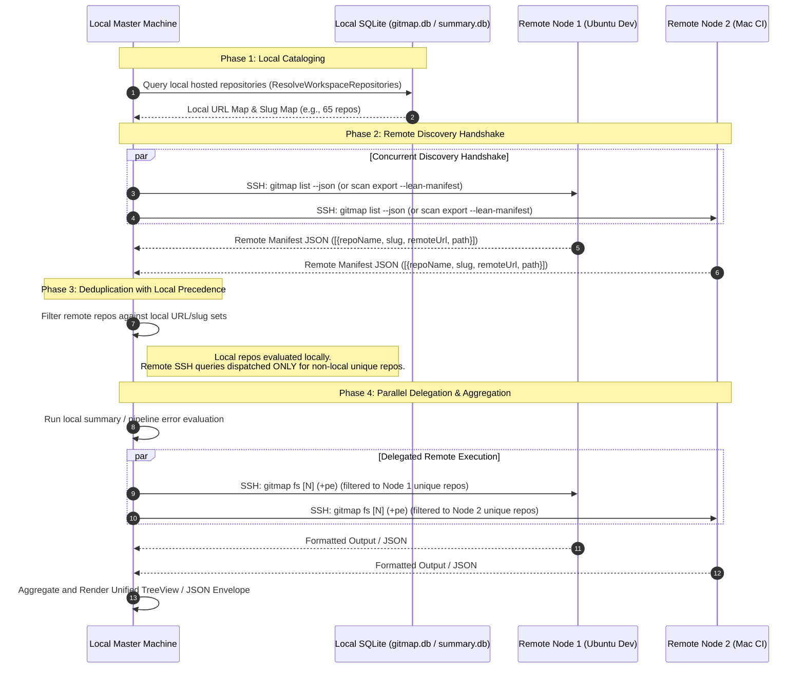
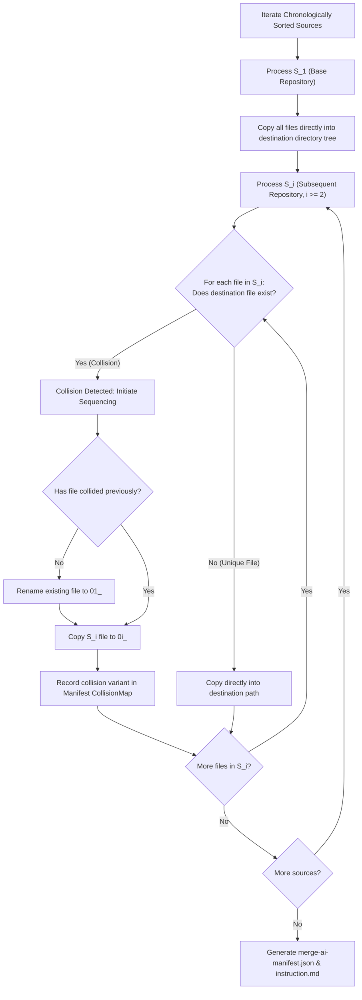

# Component Specification: Distributed Fleet Nodes & AI Merge Orchestrator

**Document ID:** `02-spec/21-app/gitmap-command-enhancements/02-component-spec.md`  
**Classification:** Core Application Component Specification (`02-spec/21-app`)  
**Task Association:** `82-gitmap-command-enhancements` / Subtask 02  
**Status:** `ratified`  
**Companion Documents:**  
- [Universal Repo Feature Resolver](repo-feature.md)  
- [Architecture Spec](01-architecture-spec.md)  
- [Engineering Subtask Plan](../../../.ai-memory/plans/subtasks/gitmap-command-enhancements/02-nodes-and-merge-ai.md)  

---

## User Request (Verbatim)

```text
gitmap full summary N # default N = 3
gitmap full status N # default N = 3
gitmap fs N # default N = 3
gitmap summary ($repo/currently in the repo) N # default N = 8

gitmap nodes fs
gitmap nodes full status
gitmap nodes full summary
gitmap nodes summary $repoName/alias

gitmap full summary+pe
gitmap full status+pe
gitmap fs+pe --json
gitmap fspe (full summary with pipeline error)

gitmap nodes fs+pe --json
gitmap nodes fspe --json
gitmap nodes pe all --json
gitmap nodes pipe-error-all --json


gitmap pe all --json
gitmap pe all --force-all

gitmap merge-ai <dest repo url/folder with git/ folder without git/or new repo name> file.txt
gitmap merge-ai <dest repo url/folder with git/ folder without git/or new repo name> url1, url2, url3
gitmap merge-ai <dest create new or exist repo url/folder with git/ folder without git/or new repo name/repo future> url1 url2 url3 
gitmap merge-ai (ma) config.json


Make sure you release at the end and check if gitmap pe okay


# GitMap Command Enhancements: high priority instruction, non-negotiable task

Hi there. So in this case, I want to have the new commands, which I have listed. Now, these new commands, let me explain one by one. Basically, there is a group of commands, same commands in different forms or different meaning. Let me get into one by one. The first one is the gitmap full summary or full status, which is the short form of fs. Now in any case, if there are things that have been done, and if we run the fs, there'd be another version, like summary, the gitmap summary. So if we run the gitmap summary on a repo, we can give a repo path, repo URL, or currently in the repo dir. By default, the number is 20. This can be customizable for the git summary. Let's discuss what the summary should do. Summary should sum up the last eight releases. It means that last eight releases have the change log. It would sum up the release versions and the change logs that have been collected as short as possible, not too much. There should be a character or word limit, 200 words, so not to include too many file names or things like that. Just try to have the gist of it. Every version that recently has released, that would be there. That's the first thing, based on the repo summary, if we just take the summary. Repo summary or gitmap summary on a repo is going to do the eight version of it. So last eight releases, it will sum up and heated files, files which have most changes and what it has done. The gitmap should have the ability to summarize in the terminal and tell the user so that they feel like what is done in a very natural way. It should have a split DB of summary where it would write those summaries so that if the user again asks it to check the git hash, the last one, if that matches every one of the git hashes on the releases, on the last release tags and the last hash that we have, then it'll just return from the cache. If we have new changes other than the last cache, then it has to, again, calculate the stuff based on what we have in the cache, because the cache releases are not going to change. What we have and what the new changes are, then it has to summarize that algorithm and nicely print it out. Remember to have the database as much as normalized as possible, SQLite DB, so that we can reduce the spaces. Every time we view the data, we should have a database view so that the query is simpler everywhere. That's the summary. Now, what is the full summary? Full summary is all the repos that we have, we would try to figure out the heat map repos. That means the repo that at least have any changes in last 48 hours. That can also be changed based on the settings. You should have settings for this as well. Let's say last 48 hours. Let's take 48 hours as default. Let's say there are five repos that have changes in last 48 hours. It has some commits. That could be one way. Another could be repos that recently have worked on, have some uncommitted files or some dirty state. What we are collecting here in this summary, any repo that has a dirty state and any repo that has a change in last 48 hours. All this repo we collect, and we at least give three releases, last three releases summary. Summary means what we already learned, how the summary works, but in this case, if we do the full summary, then every repo will have three, and it would show as a tree view. Subtree would have the changes and the items, how it has done. If a repo is dirty, then there would be a command to commit all, or there could be a full command, a single command at the end that user can run to commit all the pending stuff. Full summary also tells us if there are pending changes. It will tell us what the releases are done, what it has completed so far. Now then we have nodes FS that would actually go to all the nodes and give the same full summary process. We also have summary git-map, full summary plus PE, that means pipeline with errors. We can have a short version of it, git-map FS plus PE. That is basically going to include the error logs from the CI/CD if there is any, and compile into the terminal so that any AI can read and fix. If we use the PE version, we can have nodes PE that is going to PE all or PE any. Nodes PE space all or nodes pipe error all. In both of these cases, it's going to give current machine as well, current machines all the repos pipeline errors, and it would combine to a JSON. All of these actually communicate with the JSON parallelly. There is one more point, I think, in the pipeline all error that we have to consider because if we are running on all the machines, so all machines will have similar repos. The first thing it should do is the main machine would count how many repos that they have based on the repo URL. Based on this, if the current machine has all the repos, then it does not need to run each one of the repo errors on separate machines. It can run on the current machine and get the full error first, and the repos which are missing or different on different machines, only the different ones will only be collected as a pipeline error and send it back. In the pipeline all should also respect the 48 hours rules because it is not possible to bring all the pipeline errors for 78 or 70 repos. It needs to be very efficient. We also have the pipe git-map PE all. PE all needs to be also efficient. It should only give the errors which we have worked on last 48 hours. If a repo does not have any error, it just says green. Do not use too much verbose stuff because it's a very summarized version that we're looking for. User can actually do force all, another flag. If they do that, then it basically going to go and try to find all the repos, CI/CD errors. If only which has the error or has the pipeline ready, they will be coming back with a summary in the terminal nicely. It can also be shown as a JSON. All these sections should have a JSON flag to see the notices and things in JSON format as well. When we are doing the trust machine or full summary, we run the full summary. Full summary is basically what is pending and what is committed, what is resulted. The full summary on nodes, this will also be very efficient. That means it has to know current machines, all the repos, because now it can get the summary from the current machine, all the repos. That's the first thing. Second, the repos which are not in the current machine but exist in other machines, only those would be requested to those machines. The git-map should have a way to understand which machine contains which repo. The first thing the git-map would send to the nodes that send me back your repo URL. Repo URL and path and machine information. That is a JSON summary that it would receive first. Based on that, it would take the decision, like where the next request will come to collect the git-map FS summary, the pipeline universe. I hope you understand how it's going to work. If you have any question or confusion, we can discuss that. This is a very detailed and delicate situation that you need to understand and complete. Whenever we have a summary, try to have a green check in the terminal so that it looks nice, like what is done for the done commands. I hope these are very detailed. It's helpful for you to optimize the decision making and understanding of it. If not, let me know. First, you have to plan it right, the details of the planning of each command, because I'm just giving you from top level, so you need to write, break it down, how it's going to work, what it's going to help, examples and things like that. Now, we will have another command that's called git merge -i or MA. In this case, we have two different, all sorts of options that we could do. We could pass many URLs and put the destination folder. That's the first thing. Now, in the merge AI or MA short for this, it would have two flags for sure. One is the all commits, another is single commits. What do I mean by all commits? If we use all commits, it would behave like the commit in, so it would actually commit all of these repos sequentially based on first understanding which one is the earliest one, which one is the second earliest one. It would have a mind mapping first, dry run first, understanding which one is which, and it needs to be doing that parallelly first to get a quick run on last branch. That's the first thing that it would run on all of these repos automatically, last branch or recent branch command. From this, it would know when did the last commit happen, and based on that, it would try to find what was the last commit on other repos, and it would show in the terminal what it is doing, every decision making. Then, it would find that whichever is the latest, let's say, Git is, it would try to put that first as a single commit or all the commits that it has. Then it would do the second one, third one, and so on. In this case, it is a bit different than commit in command, because commit in usually tries to put a stack on top of another. Now, the merge AI would be a little bit different. In this case, if it finds the same file in the different repo folders, it would try to do in a different way. If the destination is a repo URL, if that repo URL exists, it could be exist new repo URL. It could be an existing URL or new URL, that means new repo, just name. That would also work. That means that it is very powerful that we could just give a URL in the Git with the account permission, actually, the account which is already logged in using `gitmap`. That needs to be mentioned in the command description, so that any AI can learn as well. Also, you need to update the `gitmap` skills as well. The way that it is going to work is that the destination, if it is an existing one, an existing repo does not exist in the machine, then it would clone first. If it is a new one, then it would create that Git. If it is a folder with Git, that means already the Git is already there, then it would try to use that as a Git. If it is a folder without a Git, then it would understand that, based on this folder, the similar slug and the Git repo needs to be created. Or we could just give a name of the repo folder, and that would create the folder, GitHub repo, and then do all these things. We should call this a name. I think we should name this as repo feature. So anytime I say repo feature, you understand all these things. I hope that needs to be very much dedicated, and we should have a file for this repo feature in the spec so that anytime I can refer back, it is repo feature. Now, we have the repo feature, and then you can have a bunch of URL using space, using comma space, using a JSON file, using a text file. I'll give you the text file example. The text file can have a bunch of URLs. Based on the URLs, it's going to follow the same merge pattern. Now coming to the merge pattern, how it's going to work. For the merge AI, it's going to create a JSON file on the root of the repo, again, following the pattern attributes and data. Inside the data, we will have the term called repo sequence, and repo sequence is an object inside the JSON that would have the URL from the first repo, and the commit it has, all the commits have a little bit of summary like, from this one to the last commit, and the branches that it has. Something like it's a little bit of summary of the repo, the repo description. If there's a release, then release information. Also, the folder tree should be inside the JSON. When we bring it on, I think we can only do a single commit. We cannot do multi commits with this. You have to be careful. You cannot do. By default, we will always have a single commit. We cannot have multi commits like this. Because the way that it's going to work is that it's going to put all these files into the root folder first. If the same folder or file is found in the different, let's say, different URL repo, then it would create simply the 01, 02 sequence and then create the folder structure. With the instruction for the AI to merge it by consolidating. It's not us who is going to merge, it's the AI is going to merge. Our job is to create the instruction. We will put this into the JSON. The first one would be the flat. It will be put on top of the folder as a flat. If it has existing file or existing already repo that has files, the same one, same place. If that's the case, then it would just create a 01, 02 with the file name and also marked it inside the JSON file. This is the copy from this repo, from this commit information and for AI to read it. It would write it like this. Every one of the, let's say, merge, it would try to do these things. At the end, it should also have a summary, and also an instruction.md file for the AI to read and follow. That instruction.md basically is going to point that JSON file to understand the full tree and have a request to overview and merge it and make it a flat tree view and try to have consolidated items. Do not remove anything. Try to have very concise merging so that it understands where the files are changes, how it needs to be merged. Altogether, this is the job that it needs to create. Instruction needs to be very solid so that there is a checklist that AI needs to follow. Also, the checklist should have the JSON, JSON items, how the flat tree should look like. Flat does not mean that it will take everything out of the folder. Remember that flat means just the folder structured as it was. It just needs to keep that V1, V2, the sequence, it needs to be flattened out to the original file names. But during the merge, if that folder, that file does not exist, then it would just, by default, put it to the folder. If it is a new file to the new repo, it would automatically put there to the flat structure. I hope it makes sense. It's a very detailed one. If you don't understand or have any issues, let me know afterwards.
```

---

## 1. System Overview & Component Boundaries

This specification defines the implementation and runtime contracts for two core components within the GitMap command architecture:
1. **Component A: Distributed Fleet Nodes Engine (`cli/cmdnodes`)**:
   Coordinates workspace summaries, release gists, and CI/CD pipeline error telemetry across heterogeneous multi-machine clusters using a 4-phase distributed protocol with local-precedence deduplication.
2. **Component B: AI Merge Orchestrator (`cli/cmdmergeai`)**:
   Coordinates multi-repository amalgamation, single-commit staging, chronological source sorting, collision sequencing (`01_`, `02_`), manifest creation, and AI handover generation.

```mermaid
flowchart TD
    subgraph FleetNodesEngine["Component A: Distributed Fleet Nodes Engine (cli/cmdnodes)"]
        CLI_Nodes["CLI Invocation: gitmap nodes fs / pe all / summary"]
        Phase1["Phase 1: Local Master Cataloging"]
        Phase2["Phase 2: Remote Discovery Handshake"]
        Phase3["Phase 3: Local Precedence Deduplication"]
        Phase4["Phase 4: Parallel Delegation & Aggregation"]
        CLI_Nodes --> Phase1 --> Phase2 --> Phase3 --> Phase4
    end

    subgraph MergeAIEngine["Component B: AI Merge Orchestrator (cli/cmdmergeai)"]
        CLI_Merge["CLI Invocation: gitmap merge-ai <dest> <src...> / ma"]
        RepoFeature["Universal Repo Feature Destination Resolver"]
        InspectSources["Parallel Chronological Source Inspection"]
        StagingEngine["Single-Commit Staging & 01_/02_ Collision Sequencer"]
        Artifacts["Manifest (merge-ai-manifest.json) & Checklist (instruction.md)"]
        CLI_Merge --> RepoFeature
        CLI_Merge --> InspectSources
        RepoFeature --> StagingEngine
        InspectSources --> StagingEngine
        StagingEngine --> Artifacts
    end
```



---

## 2. Component A: Distributed Fleet Nodes Protocol

### 2.1 Command Grammar & Routing Matrix

The distributed fleet subsystem is accessed via `gitmap nodes` subcommands. Each command is routed deterministically through `cli/cmdnodes/nodes_cmd.go`:

| Command Signature | Aliases | Parameters & Defaults | Output Format | Description |
| :--- | :--- | :--- | :--- | :--- |
| `gitmap nodes fs [N]` | `nodes full status`, `nodes full summary` | $N = 3$ (default) | ANSI TreeView or `--json` | Distributed workspace full summary across fleet. |
| `gitmap nodes summary $repo [N]` | `nodes summary $repo` | $N = 8$ (default) | Natural prose gist | Queries fleet for summary of a specific repo name or alias. |
| `gitmap nodes fs+pe [N]` | `nodes fspe`, `nodes full summary+pe` | $N = 3$ (default) | TreeView + CI/CD errors | Full summary with pipeline error stack traces across fleet. |
| `gitmap nodes pe all` | `nodes pipe-error-all` | 48h active filter default | Concise table / `--json` | Fleet-wide CI/CD check. Concise green check for passing, detailed traces for failing. |

### 2.2 CLI Router Argument Slicing Bug & Remediation

#### Defect Root Cause Analysis (RCA)
In `cli/cmdnodes/nodes_cmd.go`, previous command dispatch logic evaluated `isNodesFullSummary(args)` and incorrectly stripped subcommands through naive slicing:
```go
// DEFECTIVE IMPLEMENTATION:
} else if isNodesFullSummary(args) {
    if strings.EqualFold(args[0], "full") && len(args) > 1 {
        return RunNodesFullSummary(args[2:]) // args[2:] stripped 'summary+pe'
    }
    return RunNodesFullSummary(args[1:])     // args[1:] stripped 'fs+pe' or 'fspe'
}
```
When invoked as `gitmap nodes fs+pe`, `args[0]` was `"fs+pe"`. Slicing `args[1:]` produced an empty slice `[]string{}`, resulting in `RunNodesFullSummary` losing the `+pe` flag and executing a vanilla `fs` without pipeline diagnostics.

#### Remediation Contract
`RunUnifiedNodesCLI` must preserve command tokens indicating pipeline error intent (`+pe`, `fspe`, `pipe-error-all`) by passing the full argument slice or an explicitly reconstructed flag slice into downstream handlers:

```go
// REMEDIATED CONTRACT:
func RunUnifiedNodesCLI(args []string) error {
    // Normalization and routing...
    if isNodesFullSummary(args) {
        return RunNodesFullSummary(args) // pass complete args so +pe and fspe are preserved
    }
    if isNodesPipelineAll(args) {
        return RunNodesPipelineErrorsAll(args)
    }
    // ...
}
```

### 2.3 Four-Phase Distributed Protocol Architecture



#### Phase 1: Local Master Cataloging
1. Local master inspects current workspace and queries SQLite repository catalog (`gitmap.db` via `cmdpending.ResolveWorkspaceRepositories(cwd)`).
2. Builds two in-memory hash index sets:
   - `localURLMap`: Case-folded normalized URLs (HTTPS, SSH, git://).
   - `localSlugMap`: Case-folded canonical slugs and repository directory basenames.
3. Logs telemetry: `[Phase 1] Cataloged N repositories on local master machine.`

#### Phase 2: Remote Discovery Handshake
1. Master retrieves all enrolled fleet connections from `dbpkg.GetSSHConnections` and `dbpkg.ListClusterNodes`.
2. Master launches concurrent lightweight discovery queries over SSH (`currentSSHExecutor.Execute`):
   - Linux/macOS nodes: `gitmap list --json`
   - Windows nodes: `gitmap.exe list --json` via PowerShell
3. Discovery payload conforms to `RemoteRepoManifestItem`:
   ```json
   [
     {
       "repoName": "backend-auth",
       "slug": "backend-auth",
       "remoteUrl": "git@github.com:my-org/backend-auth.git",
       "path": "/home/dev/work/backend-auth"
     }
   ]
   ```

#### Phase 3: Deduplication with Local Precedence
1. **Local Precedence Invariant:** If a repository URL or slug exists on the local master machine, it MUST be evaluated locally. Under no circumstances should an SSH call be issued to evaluate a repository that is already hosted locally.
2. For each remote node, master computes the set difference:
   $$\text{UniqueRemoteRepos}(N_i) = \{ R \in \text{Manifest}(N_i) \mid R.\text{URL} \notin \text{LocalURLMap} \land R.\text{Slug} \notin \text{LocalSlugMap} \}$$
3. If $\text{UniqueRemoteRepos}(N_i)$ is empty, the node is marked as having zero unique repositories and skipped during execution.
4. Logs telemetry: `[Phase 3] Deduplication applied: %d local repos evaluated locally; %d remote-unique repos delegated.`

#### Phase 4: Parallel Execution & JSON/Tree Aggregation
1. Master executes local evaluation first (`cmdsummary.RunFullSummary` or `cmdsummary.RunPipelineErrorsAll`).
2. Concurrent worker pool issues targeted commands to nodes hosting unique repositories:
   - For summary: `gitmap fs N [--json] [+pe]`
   - For errors: `gitmap pe all [--json] [--force-all]`
3. Aggregates results:
   - **Terminal Mode:** Renders node section headers (`[Node: Local Machine]`, `[Node: worker-1 (192.168.1.50) - Delegated M Unique Repositories]`) followed by ANSI TreeView branches.
   - **JSON Mode:** Returns unified `FleetNodesEnvelope` containing metadata and aggregated node items.

### 2.4 Data Models & JSON Schema

```go
// RemoteRepoManifestItem models discovery output from fleet nodes.
type RemoteRepoManifestItem struct {
    RepoName  string `json:"repoName"`
    Slug      string `json:"slug"`
    RemoteURL string `json:"remoteUrl"`
    Path      string `json:"path"`
}

// FleetNodesEnvelope models root JSON envelope for distributed commands.
type FleetNodesEnvelope struct {
    Attributes FleetNodesAttributes `json:"attributes"`
    Data       FleetNodesData       `json:"data"`
}

type FleetNodesAttributes struct {
    GeneratedAt     string `json:"generatedAt"`
    TotalNodes      int    `json:"totalNodes"`
    ReachableNodes  int    `json:"reachableNodes"`
    LocalReposCount int    `json:"localReposCount"`
    DelegatedCount  int    `json:"delegatedCount"`
}

type FleetNodesData struct {
    LocalNode   NodeSummaryResult   `json:"localNode"`
    RemoteNodes []NodeSummaryResult `json:"remoteNodes"`
}

type NodeSummaryResult struct {
    NodeAlias       string      `json:"nodeAlias"`
    Host            string      `json:"host"`
    IsOnline        bool        `json:"isOnline"`
    IsLocalMaster   bool        `json:"isLocalMaster"`
    UniqueRepoCount int         `json:"uniqueRepoCount"`
    Payload         interface{} `json:"payload,omitempty"`
    ErrorMessage    string      `json:"errorMessage,omitempty"`
}
```

---

## 3. Component B: AI Merge Orchestrator (`gitmap merge-ai` / `ma`)

### 3.1 Command Grammar & Input Modalities

The AI Merge Orchestrator accepts four flexible input patterns:

```bash
# Pattern 1: Space-separated source URLs / paths
gitmap merge-ai <dest-target> https://github.com/org/repo-a.git https://github.com/org/repo-b.git

# Pattern 2: Comma-separated source URLs / paths
gitmap merge-ai <dest-target> url1, url2, url3

# Pattern 3: Text file containing line-delimited sources
gitmap merge-ai <dest-target> sources.txt

# Pattern 4: Declarative JSON configuration file
gitmap merge-ai config.json
# Alias: gitmap ma config.json
```

#### Input Sources Grammar & Normalization
1. **JSON Config File (`config.json`):**
   ```json
   {
     "destination": "new-unified-service",
     "sources": [
       "https://github.com/org/service-auth.git",
       "https://github.com/org/service-billing.git",
       "d:/work/legacy-core"
     ]
   }
   ```
2. **Text File (`sources.txt`):**
   Lines beginning with `#` or whitespace are stripped. Blank lines are ignored.
3. **Comma/Space Delimited Tokens:**
   Parsed by splitting on commas, trimming whitespace, and flattening argument lists.

### 3.2 Target Resolution Delegation
Every destination target `<dest-target>` is resolved strictly through the Universal "Repo Feature" resolver (`cmdresolver.ResolveRepoFeature`). The orchestrator never assumes destination existence or structure prior to resolution. (See [repo-feature.md](repo-feature.md) for complete specification).

### 3.3 Single-Commit Staging Invariant

> [!IMPORTANT]
> **Single-Commit Staging Invariant:**
> Multi-commit stacking, synthetic fast-forwarding, or rebasing histories across disparate source repositories is STRICTLY FORBIDDEN.
>
> Multi-commit rebasing risks silent regressions, loss of intermediate file states, and branch corruption.
> `gitmap merge-ai` stages all files into a unified working tree designed for a **single atomic commit** representing the baseline amalgamation.

### 3.4 Chronological Source Inspection & Sorting

To preserve architectural provenance, source repositories are inspected in parallel to determine their chronological commit timestamp:
1. Each source is cloned with `--depth 50` into a temporary staging workspace (`%TEMP%/gitmap-merge-ai-staging/<slug>`) or read directly if already a local directory.
2. Master inspects `HEAD` commit date via `git log -1 --format=%ct`.
3. Sources are sorted chronologically from earliest to latest:
   $$\text{Sources} = [S_1, S_2, \dots, S_k] \quad \text{where} \quad \text{Time}(S_1) \le \text{Time}(S_2) \le \dots \le \text{Time}(S_k)$$
4. The earliest repository ($S_1$) serves as the foundation base repository.

### 3.5 Collision Sequencing Architecture (`01_`, `02_`)



#### Collision Sequencing Rules:
1. **Base Repository ($S_1$):** All tracked files from $S_1$ are copied directly to their target paths within the destination repository.
2. **Subsequent Repositories ($S_i$, $i \ge 2$):**
   - **Case 1 (Non-Colliding File):** If `<dest>/<relPath>` does not exist, the file is copied directly into `<dest>/<relPath>`.
   - **Case 2 (First Collision):** If `<dest>/<relPath>` already exists and has not yet been sequenced:
     - The existing file is renamed in-place to `01_<filename>`.
     - The incoming file from $S_i$ is copied as `%02d_<filename>` (e.g. `02_<filename>`).
     - A `FileCollisionRecord` is instantiated in the collision map.
   - **Case 3 (Subsequent Collisions):** If `<dest>/<relPath>` has already experienced collisions, the incoming file is copied as `%02d_<filename>` (e.g. `03_<filename>`) and appended to `FileCollisionRecord.Variants`.
3. **Directory Structure Preservation:** Files retain their relative subdirectory placement. Prefixes are prepended strictly to the leaf file name (e.g. `pkg/auth/01_jwt.go` and `pkg/auth/02_jwt.go`).

### 3.6 Generated Artifact Specifications

#### 1. Root Manifest: `merge-ai-manifest.json`
Located at `<dest-repo-root>/merge-ai-manifest.json`:

```json
{
  "attributes": {
    "generatedAt": "2026-10-10T11:42:00Z",
    "gitmapVersion": "6.520.0",
    "tool": "gitmap-merge-ai",
    "collisionStrategy": "prefixed-sequence"
  },
  "data": {
    "destination": {
      "targetType": "bare-slug",
      "slug": "billing-consolidated",
      "resolvedPath": "d:/work/billing-consolidated",
      "originUrl": "git@github.com:my-org/billing-consolidated.git"
    },
    "repoSequence": [
      {
        "sequenceOrder": 1,
        "repoUrl": "https://github.com/my-org/billing-legacy.git",
        "branch": "main",
        "commitRange": "9a3f120..f82b410",
        "lastCommitDate": "2026-08-14T08:30:00Z",
        "description": "feat: legacy billing v1",
        "releaseInfo": {
          "lastTag": "v1.4.0"
        },
        "folderTree": [
          "cmd/server/main.go",
          "pkg/config/config.go",
          "pkg/invoice/pdf.go"
        ]
      },
      {
        "sequenceOrder": 2,
        "repoUrl": "https://github.com/my-org/billing-stripe.git",
        "branch": "main",
        "commitRange": "3c12d44..e77a102",
        "lastCommitDate": "2026-09-20T14:15:00Z",
        "description": "feat: stripe integration v2",
        "releaseInfo": {
          "lastTag": "v2.1.0"
        },
        "folderTree": [
          "cmd/server/main.go",
          "pkg/config/config.go",
          "pkg/stripe/webhook.go"
        ]
      }
    ],
    "fileCollisions": [
      {
        "canonicalPath": "cmd/server/main.go",
        "status": "pending_ai_consolidation",
        "variants": [
          {
            "sequence": "01",
            "file": "cmd/server/01_main.go",
            "sourceRepo": "billing-legacy",
            "commit": "f82b410"
          },
          {
            "sequence": "02",
            "file": "cmd/server/02_main.go",
            "sourceRepo": "billing-stripe",
            "commit": "e77a102"
          }
        ]
      },
      {
        "canonicalPath": "pkg/config/config.go",
        "status": "pending_ai_consolidation",
        "variants": [
          {
            "sequence": "01",
            "file": "pkg/config/01_config.go",
            "sourceRepo": "billing-legacy",
            "commit": "f82b410"
          },
          {
            "sequence": "02",
            "file": "pkg/config/02_config.go",
            "sourceRepo": "billing-stripe",
            "commit": "e77a102"
          }
        ]
      }
    ],
    "uniqueFilesDirectlyPlaced": 2
  }
}
```

#### 2. Root Instruction Checklist: `instruction.md`
Located at `<dest-repo-root>/instruction.md`:

```markdown
# AI Merge Consolidation Instruction & Verification Guide

This repository has been prepared by `gitmap merge-ai`. Multiple source repositories have been assembled into this staging tree.

## Non-Negotiable Instructions for the Consolidating AI Agent:
1. **Preserve All Business Logic:** Do NOT delete features, endpoints, or data models. Consolidate overlapping files (`01_*`, `02_*`) into the single canonical file name (e.g. synthesize `01_main.go` and `02_main.go` into `main.go`).
2. **Flatten Sequence Prefixes:** Once consolidated, remove temporary `01_` and `02_` files so the repository strictly reflects canonical filenames.
3. **Reference the Manifest:** Open and read `merge-ai-manifest.json` to inspect the source repositories, commit histories, and collision map.
4. **Zero Code Deletion:** When resolving duplicate utilities, favor additive composition, interface unions, and modern patterns.

## Detected File Collisions:
- **cmd/server/main.go**:
  - Variant: `cmd/server/01_main.go` (Source: `billing-legacy`, Commit: `f82b410`)
  - Variant: `cmd/server/02_main.go` (Source: `billing-stripe`, Commit: `e77a102`)
- **pkg/config/config.go**:
  - Variant: `pkg/config/01_config.go` (Source: `billing-legacy`, Commit: `f82b410`)
  - Variant: `pkg/config/02_config.go` (Source: `billing-stripe`, Commit: `e77a102`)

## Step-by-Step AI Action Checklist:
- [ ] Read `merge-ai-manifest.json` and inventory all entries in `fileCollisions`.
- [ ] For each collision:
  - [ ] Analyze differences between `01_<file>` and `02_<file>`.
  - [ ] Synthesize unified implementation into `<file>`.
  - [ ] Delete `01_<file>` and `02_<file>` after verified synthesis.
- [ ] Ensure non-colliding files maintain correct imports and package names.
- [ ] Verify that no `01_` or `02_` prefixed files remain in the repository tree.
- [ ] Update `merge-ai-manifest.json` setting `fileCollisions[].status = "consolidated"`.
- [ ] Stage and commit the consolidated repository:
      `gitmap cpf "feat: consolidate multi-repo merge into unified codebase"`
```

---

## 4. Error Handling & Quality Gates

### 4.1 Error Codes
The subsystem introduces structured error codes adhering to GitMap `apperror`:

| Code | Name | Scenario |
| :--- | :--- | :--- |
| `E9080` | `ErrFleetRepoNotFound` | Specific repository requested in `nodes summary $repo` not found across any node. |
| `E9081` | `ErrFleetHandshakeFailed` | Remote node unreachable or failed discovery manifest export. |
| `E9082` | `ErrMergeNoSources` | `gitmap merge-ai` invoked with no valid source repositories. |
| `E9083` | `ErrMergeCloneFailed` | Failed to clone source repository into temporary staging directory. |
| `E9084` | `ErrManifestWriteFailed` | Failed to write `merge-ai-manifest.json` or `instruction.md`. |
| `E9085` | `ErrRepoFeatureFailed` | Destination resolution failure in Universal Repo Feature resolver. |

### 4.2 Quality Gates
1. **Zero Redundant SSH Execution:** In a test cluster where Node 1 and Node 2 host identical repositories, zero calls for common repositories are made to Node 2.
2. **Collision Safety:** No source repository file is silently overwritten. Every duplicate is preserved with sequence prefixes and registered in the manifest.
3. **No Build / No Test Spec Invariant:** During spec phase, all operations are purely architectural documentation and plan authoring.
