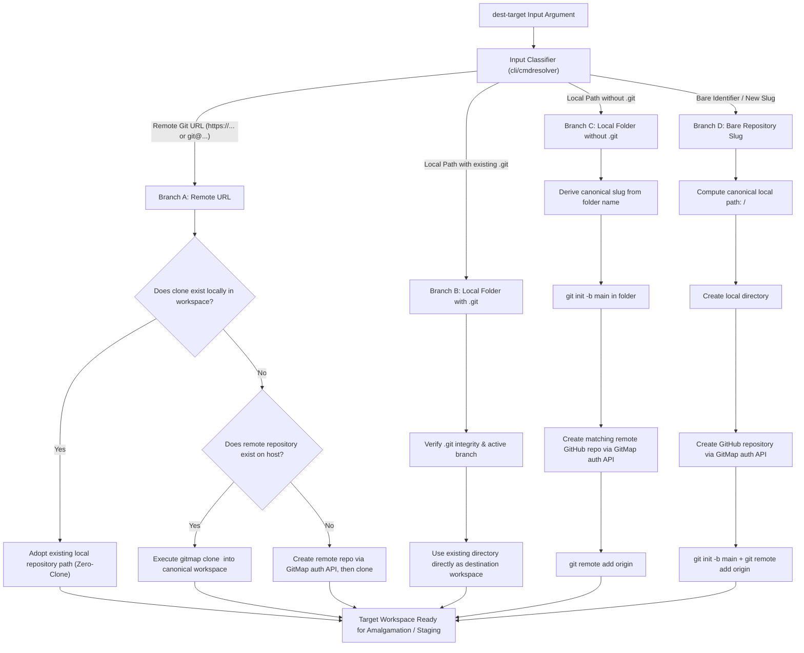
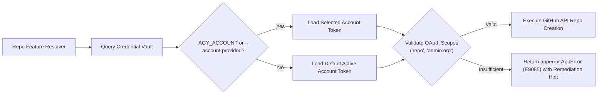

# Specification: Universal "Repo Feature" Destination Resolver

**Document ID:** `02-spec/21-app/gitmap-command-enhancements/repo-feature.md`  
**Classification:** Core Application Specification (`02-spec/21-app`)  
**Task Association:** `82-gitmap-command-enhancements` / Subtask 02  
**Feature Name:** `repo feature` (Universal Destination Target Resolution Engine)  
**Status:** `ratified`  
**Related Commands:** `gitmap merge-ai` (`gitmap ma`), `gitmap clone-as`, `gitmap init-remote`, `gitmap workspace`  
**Companion Documents:**  
- [Component Spec](02-component-spec.md)  
- [Architecture Spec](01-architecture-spec.md)  
- [Engineering Subtask Plan](../../../.ai-memory/plans/subtasks/gitmap-command-enhancements/02-nodes-and-merge-ai.md)  

---

## User Request (Verbatim)

```text
gitmap merge-ai <dest repo url/folder with git/ folder without git/or new repo name> file.txt
gitmap merge-ai <dest repo url/folder with git/ folder without git/or new repo name> url1, url2, url3
gitmap merge-ai <dest create new or exist repo url/folder with git/ folder without git/or new repo name/repo future> url1 url2 url3 
gitmap merge-ai (ma) config.json

Now, the merge AI would be a little bit different. In this case, if it finds the same file in the different repo folders, it would try to do in a different way. If the destination is a repo URL, if that repo URL exists, it could be exist new repo URL. It could be an existing URL or new URL, that means new repo, just name. That would also work. That means that it is very powerful that we could just give a URL in the Git with the account permission, actually, the account which is already logged in using `gitmap`. That needs to be mentioned in the command description, so that any AI can learn as well. Also, you need to update the `gitmap` skills as well. The way that it is going to work is that the destination, if it is an existing one, an existing repo does not exist in the machine, then it would clone first. If it is a new one, then it would create that Git. If it is a folder with Git, that means already the Git is already there, then it would try to use that as a Git. If it is a folder without a Git, then it would understand that, based on this folder, the similar slug and the Git repo needs to be created. Or we could just give a name of the repo folder, and that would create the folder, GitHub repo, and then do all these things. We should call this a name. I think we should name this as repo feature. So anytime I say repo feature, you understand all these things. I hope that needs to be very much dedicated, and we should have a file for this repo feature in the spec so that anytime I can refer back, it is repo feature.
```

---

## 1. Overview & Formal Architectural Definition

Anytime the term **"repo feature"** (or phonetically *"repo future"*) is invoked in GitMap specifications, CLI help, or AI directives, it refers to the **Universal Destination Target Resolution Engine** implemented in `cli/cmdresolver/repo_feature.go`.

The design objective of **repo feature** is to accept any arbitrary destination identifier (`<dest-target>`) and automatically resolve, authenticate, create, clone, or initialize it into a fully functional local and remote Git repository without requiring manual multi-step configuration, interactive prompts, or developer cognitive overhead.



---

## 2. Supported Target Branches & Resolution Semantics

### Branch A: Remote Git URL (`TargetTypeRemoteURL`)
* **Input Patterns:**
  * HTTPS: `https://github.com/my-org/my-target-repo.git`
  * SSH / SCP: `git@github.com:my-org/my-target-repo.git`
  * Custom SSH Port: `ssh://git@github.com:22/my-org/my-target-repo.git`
* **Resolution Pipeline:**
  1. **Slug & Org Extraction:** Parse organization/owner and repository slug from URL.
  2. **Local Workspace Probe:** Query SQLite database (`gitmap.db` via `store.OpenDefault().ListRepos()`) and match against `HTTPSUrl`, `SSHUrl`, `DiscoveredURL`, or normalized `Slug`.
  3. **Case A.1 (Already Local):** If matching repository exists locally and contains a healthy `.git` folder, adopt existing local path directly (`IsCloned = false`, `IsNewRepo = false`).
  4. **Case A.2 (Remote Exists, Not Local):** Probe remote host via authenticated GitMap credentials:
     - If remote repository exists on GitHub/host, execute high-speed shallow clone into `<workspace-root>/<slug>` (`IsCloned = true`).
  5. **Case A.3 (Remote Does Not Exist):**
     - Authenticate via GitMap credential vault (`AGY_ACCOUNT` or default token).
     - Call GitHub API (`POST /user/repos` or `POST /orgs/{org}/repos`) to provision the repository remotely.
     - Create local directory `<workspace-root>/<slug>`.
     - Execute `git init -b main`, configure `origin`, and return (`IsNewRepo = true`, `IsCloned = true`).

### Branch B: Local Folder with Existing `.git` (`TargetTypeLocalGit`)
* **Input Patterns:**
  * Absolute or relative path: `./my-existing-app`, `d:/work/payment-service`, `../shared-lib`
* **Resolution Pipeline:**
  1. Detect that target path exists as a directory and contains `.git` (directory or worktree pointer file).
  2. Inspect repository health (`git status`, active branch).
  3. Extract `remote.origin.url` via `git -C <dir> remote get-url origin`.
  4. Adopt directory directly as destination workspace (`IsNewRepo = false`, `IsCloned = false`).
  5. **Non-Destructive Invariant:** All existing git history, unstaged files, branches, and commits are strictly preserved.

### Branch C: Local Folder without `.git` (`TargetTypeLocalNoGit`)
* **Input Patterns:**
  * Unversioned folder: `d:/work/scratch-prototype`, `./legacy-codebase`
* **Resolution Pipeline:**
  1. Detect that target path exists as a directory but does NOT contain `.git`.
  2. Derive canonical slug from directory base name (normalized to kebab-case).
  3. Execute `git -C <dir> init -b main`.
  4. Query active logged-in GitHub account via GitMap credential vault.
  5. Call GitHub API to provision a new remote repository matching the slug.
  6. Execute `git -C <dir> remote add origin <created-remote-url>`.
  7. Return initialized local directory (`IsNewRepo = true`, `IsCloned = false`).
  8. **File Preservation:** Any files already present in the folder are retained as the base uncommitted working tree.

### Branch D: Bare Repository Name / Slug (`TargetTypeBareSlug`)
* **Input Patterns:**
  * Bare identifier: `new-microservice`, `billing-engine-v2`, `analytics-worker`
* **Resolution Pipeline:**
  1. Detect that input contains no path separators (`/`, `\`), no dot extensions (`.git`), and no URI schemes (`https://`, `git@`).
  2. Normalize slug (lowercase, trim whitespace, replace spaces/underscores with hyphens).
  3. Determine destination directory path: `<configured-workspace-root>/<canonical-slug>`.
  4. Create destination directory if not present (`os.MkdirAll(..., 0755)`).
  5. If directory does not contain `.git`, execute `git init -b main`.
  6. Authenticate with GitMap credential vault and provision matching remote repository on GitHub.
  7. Execute `git remote add origin <created-remote-url>`.
  8. Return resolved path (`IsNewRepo = true`, `IsCloned = false`).

---

## 3. Authentication & Credential Vault Invariants

The Universal Repo Feature resolver interacts with external Git hosting platforms (GitHub, GitLab, Gitea) subject to strict authentication invariants:



### Invariant 1: Zero Interactive Prompts
Under no circumstances may the resolver emit an interactive CLI prompt (e.g. `Enter GitHub Username: ` or `Confirm repository creation [y/n]`). In automated AI agent environments and CI/CD pipelines, interactive prompts cause terminal hangs. If authentication credentials are missing, the resolver must immediately return a structured `apperror.AppError`.

### Invariant 2: Secure Vault Integration
Credentials are read dynamically from GitMap's unified credential store:
- `gitmap login --token <pat>`
- Environment variable `GITHUB_TOKEN` or `GITMAP_GITHUB_TOKEN`
- AGY account manager configuration (`~/.gemini/antigravity/auth.json` or local vault `installation.db`)

### Invariant 3: Multi-Account Context Selection
When multiple accounts are registered (e.g., Personal vs Enterprise Org), the resolver selects the account based on:
1. Environment variable `AGY_ACCOUNT=<account_alias>`
2. Command flag `--account <account_alias>`
3. Active default account set via `gitmap account set-default <alias>`

### Invariant 4: Required OAuth Scopes & Error Diagnostics
Remote repository creation requires `repo` (Full control of private repositories) or `admin:org` (if creating under an organization). If permissions are missing, resolver returns error code `E9085` with actionable guidance:
```text
[GitMap Error E9085] Insufficient token scopes to create remote repository 'billing-engine-v2'.
Required scopes: 'repo' or 'admin:org'.
Run: 'gitmap login --token <PAT>' with updated scopes.
```

---

## 4. Preservation & Non-Destructive Invariants

1. **Strict Non-Destructive File Retention:**  
   If a destination folder contains pre-existing files (e.g., Branch B, Branch C, or a pre-populated Branch D directory), the resolver **never wipes, cleans, or overwrites** any existing file. Pre-existing files are adopted as the initial baseline tree.
2. **Workspace Boundary Confinement:**  
   When provisioning directories for Branch D or cloning for Branch A, destination paths are strictly confined to the workspace root recorded in `gitmap.db` (e.g., `d:/work/` or configured `WorkspaceRoots`). Arbitrary system paths (`/tmp`, `C:\Windows`) are rejected with `apperror.ErrInvalidPath`.
3. **Structured Audit Logging:**  
   Every resolution event is logged atomically to `.gitmap/audit.db` recording:
   - `timestamp`: UTC ISO-8601 timestamp
   - `input_target`: Original string passed to resolver
   - `resolved_type`: `remote-url` | `local-git` | `local-no-git` | `bare-slug`
   - `local_path`: Resolved local filesystem path
   - `remote_url`: Associated remote origin URL
   - `is_new_repo`: Boolean flag

---

## 5. Go Data Contract & Interface Definitions

```go
// Package cmdresolver implements the Universal 'Repo Feature' destination target resolution engine.
package cmdresolver

// RepoFeatureTargetType enumerates classification modes for destination targets.
type RepoFeatureTargetType string

const (
    TargetTypeRemoteURL   RepoFeatureTargetType = "remote-url"
    TargetTypeLocalGit    RepoFeatureTargetType = "local-git"
    TargetTypeLocalNoGit  RepoFeatureTargetType = "local-no-git"
    TargetTypeBareSlug    RepoFeatureTargetType = "bare-slug"
)

// ResolvedRepoFeature represents the resolved workspace destination for a 'repo feature' target.
type ResolvedRepoFeature struct {
    OriginalInput string                `json:"originalInput"`
    TargetType    RepoFeatureTargetType `json:"targetType"`
    CanonicalSlug string                `json:"canonicalSlug"`
    LocalPath     string                `json:"localPath"`
    RemoteURL     string                `json:"remoteUrl,omitempty"`
    IsNewRepo     bool                  `json:"isNewRepo"`
    IsCloned      bool                  `json:"isCloned"`
}

// ResolverInterface defines the contract for destination resolution.
type ResolverInterface interface {
    ResolveRepoFeature(target string) (*ResolvedRepoFeature, error)
}
```

---

## 6. Downstream Command Consumption & AI Skill Integration

The following GitMap commands and workflows strictly consume destination targets formatted under the **repo feature** specification:

| Command Signature | Parameter Position | Semantics |
| :--- | :--- | :--- |
| `gitmap merge-ai <dest-target> <sources...>` | Positional Arg 1 | Resolves `<dest-target>` via repo feature; stages amalgamated multi-repo sources into resolved directory. |
| `gitmap ma <dest-target> <sources...>` | Positional Arg 1 | Short alias for `merge-ai`. |
| `gitmap clone-as <dest-target> <source-url>` | Positional Arg 1 | Clones source repo into target directory resolved via repo feature. |
| `gitmap init-remote <dest-target>` | Positional Arg 1 | Initializes and creates remote GitHub repo for bare slug or local folder. |

### Skill Reference Contract
In `.agents/skills/gitmap/SKILL.md` and related AI instruction sets, whenever an instruction states:
> *"Pass the destination identifier as a repo feature"*

It denotes that the agent may supply any of the 4 supported input types (URL, existing git directory, unversioned directory, or bare slug), and GitMap will resolve it automatically according to the rules defined in this specification.
