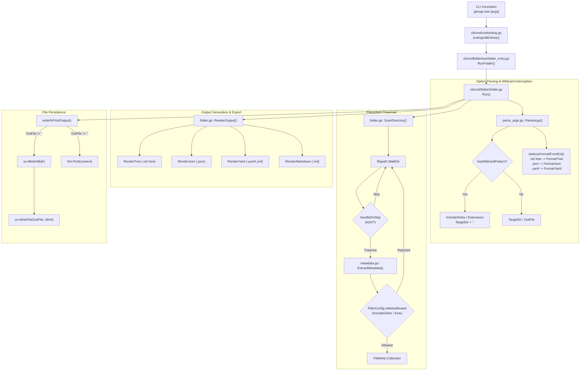
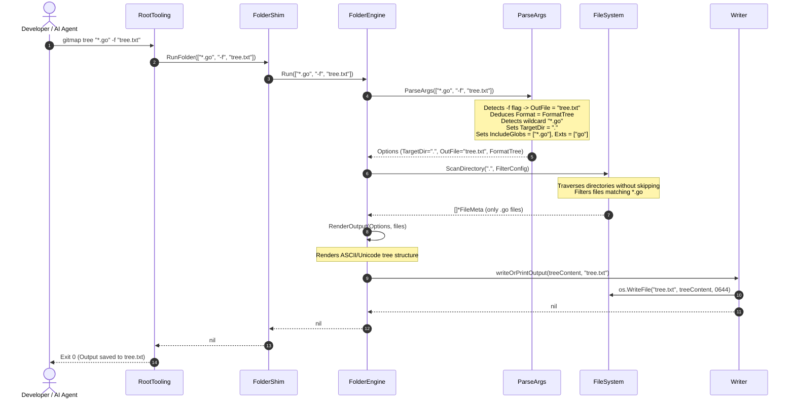

# Architecture Specification: GitMap Tree Suite, Export Flags & High-Speed Navigation Engine

**Document ID:** `02-spec/21-app/gitmap-command-implementation/01-architecture-spec.md`  
**Classification:** Core Application Specification (`02-spec/21-app`)  
**Version:** 1.0.0  
**Updated:** 2026-10-10  
**Milestone:** `gitmap-command-implementation` (Task 83)  
**Status:** `ratified`  
**AI Confidence:** High  
**Ambiguity:** None  
**Companion Documents:**  
- [Component Specification: Tree Search Suite, Multi-Format Parser & Tree Learn Split-DB](02-component-spec.md)  
- [Master Plan: GitMap Tree Commands & Tree Search/Learn Engine Implementation](../../../.ai-memory/plans/gitmap-command-implementation.md)  
- [Subtask Plan 01: Tree Export Flags & Wildcard Glob Fix](../../../.ai-memory/plans/subtasks/gitmap-command-implementation/01-tree-flags-and-glob-fix.md)  
- [Subtask Plan 02: Tree Search Suite & Tree Learn Split-DB Engine](../../../.ai-memory/plans/subtasks/gitmap-command-implementation/02-tree-search-and-learn-engine.md)  

---

## Keywords

`tree` · `folder-tree` · `file-export` · `format-deduction` · `wildcard-glob` · `include-globs` · `roottooling` · `cmdfoldertree` · `writeOrPrintOutput` · `crash-prevention` · `positive-booleans` · `ascii-tree`

---

## Specification Scoring & Audit Ledger

| Criterion | Status | Notes |
| :--- | :---: | :--- |
| System Architecture Defined | ✅ | Full architecture of GitMap Tree Suite and High-Speed Navigation Engine documented |
| Command Flow Analyzed | ✅ | Traced `roottooling -> cmdfoldertree.RunFolder -> folder.Run` |
| 4-Part RCA Completed | ✅ | Wildcard glob crash (`gitmap tree "*.go"`) thoroughly diagnosed |
| Architectural Remediation Specified | ✅ | Non-flag wildcard interception, `TargetDir` default `.`, `IncludeGlobs` and `Extensions` integration |
| Export Flags Specified | ✅ | `--file` and `-f` flags, format deduction (`.txt`, `.tree`, `.json`, `.yaml`, `.md`), direct write |
| Diagrams Included | ✅ | Mermaid component architecture, sequence diagram, and path resolution flow |
| Verification Gates Defined | ✅ | VG-01 through VG-04 detailed with preconditions, inputs, and acceptance assertions |
| Relative Paths Enforced | ✅ | 100% relative Git paths; zero absolute paths or `file:///` URIs |
| Positive Booleans | ✅ | Strictly positive boolean field names and predicates |

---

## 1. System Architecture & Purpose

### 1.1 Executive Overview
The GitMap Tree Suite and High-Speed Navigation Engine provides developers and autonomous AI agents with instantaneous, hierarchical filesystem visualization, analytical file metadata extraction, and multi-format structured export. The engine bridges fast terminal directory exploration with machine-readable representations (JSON, YAML, Markdown, and ASCII/Unicode Tree) required by downstream AI reasoning loops, search indices, and split SQLite databases.

### 1.2 Architectural Layers
The GitMap Tree Suite consists of four distinct architectural tiers:

1. **CLI Dispatch & Argument Normalization Tier (`cli/cmd/roottooling.go`, `cli/cmdfoldertree/folder_entry.go`):**
   - Intercepts root command invocation `gitmap tree` and `gitmap folder`.
   - Bridges CLI execution into the dedicated `cli/cmd/folder` subsystem.
   - Enforces help menu routing and argument normalization.

2. **Options Parsing & Wildcard Interception Tier (`cli/cmd/folder/parse_args.go`):**
   - Parses flags and positional parameters into strongly-typed `Options` and `FilterConfig`.
   - Intercepts wildcard glob patterns (`*`, `?`) in non-flag arguments, preventing OS-level path syntax failures.
   - Extracts explicit file export targets (`--file`, `-f`, `-o`, `--out`) and automatically deduces output formats based on file extensions.

3. **Filesystem Traversal & Metadata Scanner Tier (`cli/cmd/folder/folder.go`, `filter.go`, `metadata.go`):**
   - Performs rapid directory hierarchy scanning using `filepath.WalkDir`.
   - Evaluates path exclusions (`ExceptGlobs`), extensions (`Extensions`), and inclusion patterns (`IncludeGlobs`).
   - Extracts file metadata: line counts (LOC), file sizes, byte formatting, sequence prefixes, and binary encoding detection.

4. **Output Rendering & File Persistence Tier (`cli/cmd/folder/render_*.go`, `folder.go`):**
   - Transforms flat `FileMeta` slices into hierarchical `TreeNode` graphs.
   - Renders target formats: ASCII/Unicode Tree (`RenderTree`), Markdown nested lists (`RenderMarkdown`), JSON Analytical Reports (`RenderJson`), YAML Reports (`RenderYaml`), and Flat Path lists (`RenderFlat`).
   - Persists content directly to disk via `writeOrPrintOutput` with atomic directory creation, or streams to standard output.

---

## 2. Command Flow Analysis

### 2.1 Invocation Path: `roottooling -> cmdfoldertree.RunFolder -> folder.Run`
The execution pipeline for `gitmap tree` follows a clear three-stage lifecycle:

```text
User Command: gitmap tree [flags] [args]
      │
      ▼
[Stage 1: Root Dispatch]
cli/cmd/roottooling.go -> toolingUtilEntries()
  Entry: {[]string{constants.CmdFolder, "tree"}, func() error { return cmdfoldertree.RunFolder(argsTail()) }}
      │
      ▼
[Stage 2: Bridge Shim]
cli/cmdfoldertree/folder_entry.go -> RunFolder(args []string)
  - Checks help documentation via checkHelp(constants.CmdFolder, args)
  - Invokes folder.Run(args)
  - Wraps any returned error with apperror.WrapSimple(err, "Error:")
      │
      ▼
[Stage 3: Subsystem Execution]
cli/cmd/folder/folder.go -> Run(args []string)
  1. opts, err := ParseArgs(args)
  2. files, err := ScanDirectory(opts.TargetDir, opts.Filter)
  3. content, err := RenderOutput(opts, files)
  4. err := writeOrPrintOutput(content, opts.OutFile)
```

### 2.2 Trace Analysis of Stage Responsibilities

#### Stage 1: CLI Dispatch in `cli/cmd/roottooling.go`
In `cli/cmd/roottooling.go`, the tooling registry maps command tokens:
```go
{[]string{constants.CmdFolder, "tree"}, func() error { return cmdfoldertree.RunFolder(argsTail()) }}
```
When `gitmap tree` is invoked, `argsTail()` strips the subverb `tree` and forwards any trailing flags and arguments (e.g. `["*.go"]`, `["-f", "out.json"]`) to `cmdfoldertree.RunFolder`.

#### Stage 2: Bridge Shim in `cli/cmdfoldertree/folder_entry.go`
The bridge function decouples the root CLI package from the internal folder engine:
```go
func RunFolder(args []string) error {
	checkHelp(constants.CmdFolder, args)
	if err := folder.Run(args); err != nil {
		return apperror.WrapSimple(err, "Error:")
	}
	return nil
}
```
If `--help` or `-h` is passed, `checkHelp` intercepts execution and prints documentation. Otherwise, control delegates directly to `folder.Run`.

#### Stage 3: Folder Engine in `cli/cmd/folder/folder.go`
`folder.Run` controls the complete pipeline:
```go
func Run(args []string) error {
	opts, err := ParseArgs(args)
	if err != nil {
		return err
	}

	files, err := ScanDirectory(opts.TargetDir, opts.Filter)
	if err != nil {
		return apperror.Wrap(err, fmt.Sprintf("scan directory %s", opts.TargetDir), nil)
	}

	content, err := RenderOutput(opts, files)
	if err != nil {
		return err
	}

	return writeOrPrintOutput(content, opts.OutFile)
}
```

---

## 3. Root Cause Analysis (RCA) & Architectural Remediation

### 3.1 Root Cause Analysis: Wildcard Glob Crash

#### Symptom
When a developer or AI agent executes:
```powershell
gitmap tree "*.go"
```
The command terminates with an unexpected filesystem error:
```text
Error: scan directory *.go: CreateFile <workspace>\*.go: The filename, directory name, or volume label syntax is incorrect.
```

#### 4-Part Grounded RCA
1. **Direct Failure Point:**  
   `cli/cmd/folder/folder.go: ScanDirectory(opts.TargetDir, opts.Filter)` invokes `filepath.Abs(opts.TargetDir)` and `filepath.WalkDir(absRoot, ...)`. On Windows, passing a path containing wildcard characters (`*` or `?`) causes the Win32 API `FindFirstFileW` / `CreateFileW` to fail immediately with `ERROR_INVALID_NAME` (code 123: incorrect syntax).
2. **Immediate Trigger:**  
   In `cli/cmd/folder/parse_args.go: resolveNonFlags(opts, nonFlags)`:
   ```go
   func resolveNonFlags(opts Options, nonFlags []string) (Options, error) {
       if len(nonFlags) > 0 {
           opts.TargetDir = nonFlags[0]
       }
       if len(nonFlags) > 1 {
           opts.OutFile = nonFlags[1]
           opts.Format = deduceFormatFromExt(opts.OutFile, opts.Format)
       }
       return opts, nil
   }
   ```
   When the user runs `gitmap tree "*.go"`, the non-flag slice is `["*.go"]`. The parser naively assigns `opts.TargetDir = "*.go"`, assuming the first positional argument is always a directory path.
3. **Underlying Architectural Gap:**  
   `parse_args.go` lacks pattern recognition for wildcard globs. In command-line interface conventions, users frequently provide wildcard filters as positional parameters (e.g. `tree *.go`, `ls *.ts`). The parser failed to distinguish between concrete directory paths (e.g. `src`, `pkg`, `.`) and filtering patterns (e.g. `*.go`, `*test*`).
4. **Cascading Side Effects:**  
   If a user executes `gitmap tree src "*.go"`, `nonFlags[0]` becomes `src`, but `nonFlags[1]` (`"*.go"`) is erroneously assigned as `opts.OutFile`, causing the rendered tree output to be written to a file named `*.go` (which also fails Win32 syntax validation upon creation).

---

### 3.2 Architectural Remediation for Positional Wildcards

To resolve the crash and provide a seamless developer experience, `parse_args.go` and `filter.go` are architecturally enhanced as follows:

#### Pattern Detection Predicate
Introduce `hasWildcardPattern(pattern string) bool` in `cli/cmd/folder/parse_args.go`:
```go
func hasWildcardPattern(pattern string) bool {
	return strings.ContainsAny(pattern, "*?")
}
```

#### Non-Flag Resolution Logic in `resolveNonFlags`
`resolveNonFlags` partitions `nonFlags` into directory targets, output files, and wildcard globs:
1. Iterate over `nonFlags`.
2. If an argument satisfies `hasWildcardPattern(arg)`:
   - Append to `opts.Filter.IncludeGlobs`.
   - If the pattern matches an extension pattern (e.g. `strings.HasPrefix(arg, "*.")` or `strings.HasPrefix(arg, ".")`), extract the clean extension and append to `opts.Filter.Extensions`.
   - Do **NOT** assign this argument to `opts.TargetDir` or `opts.OutFile`.
3. If an argument does **NOT** contain wildcards:
   - If `opts.TargetDir` has not been set (or remains default `.` and no directory was assigned yet), set `opts.TargetDir = arg`.
   - Otherwise, if `opts.OutFile` is empty, set `opts.OutFile = arg` and deduce format.
4. Guarantee that `opts.TargetDir` defaults to `.` if no concrete directory was provided.

#### Filter Configuration Enhancement in `cli/cmd/folder/filter.go`
Expand `FilterConfig` to include `IncludeGlobs []string`:
```go
type FilterConfig struct {
	ExceptGlobs  []string
	IncludeGlobs []string
	Extensions   []string
	MaxDepth     int
	OnlyText     bool
	OnlyBinary   bool
}
```

#### Directory Descent vs. File Matching Invariant
- **Directory Traversal Rule:** In `handleDirSkip(rel, filter)`, directories must **NEVER** be evaluated against `IncludeGlobs`. Evaluating directories against `*.go` would prune all directories immediately since directory names do not end in `.go`. Directories are skipped only when matching `ExceptGlobs` or exceeding `MaxDepth`.
- **File Matching Rule:** In `IsMetaAllowed(meta *FileMeta)`, if `len(fc.IncludeGlobs) > 0`, the file path or base name must match at least one glob pattern in `IncludeGlobs`.
```go
func (fc *FilterConfig) IsMetaAllowed(meta *FileMeta) bool {
	if fc.OnlyText && meta.IsBinary {
		return false
	}
	if fc.OnlyBinary && !meta.IsBinary {
		return false
	}
	if len(fc.Extensions) > 0 && !hasMatchingExtension(meta.Extension, fc.Extensions) {
		return false
	}
	if len(fc.IncludeGlobs) > 0 && !matchAnyIncludeGlob(meta.Path, meta.Filename, fc.IncludeGlobs) {
		return false
	}
	return true
}
```

---

## 4. Architectural Specification for Export Flags (`--file` / `-f`)

### 4.1 Export Flags Grammar
The GitMap Tree command supports direct file export via the following flags:
- `--file <path>`
- `-f <path>`
- `-o <path>` (preserved for backward compatibility)
- `--out <path>` (preserved for backward compatibility)

Examples:
```bash
gitmap tree --file "a.txt"
gitmap tree -f "a.json"
gitmap tree -f "a.yaml"
gitmap tree -f "a.yml"
gitmap tree --file "report.md"
```

### 4.2 Format Deduction Matrix

When `opts.OutFile` is specified (via flags `--file`, `-f`, `-o`, `--out`, or positional argument) and the user has **NOT** passed an explicit format override flag (`--json`, `--yaml`, `--md`, `--tree`, `--flat`), the output format is automatically deduced from the file extension:

| File Extension | Deduced Format (`OutputFormat`) | Rendering Handler | Architectural Behavior |
| :--- | :--- | :--- | :--- |
| `.json` | `FormatJson` | `RenderJson(report)` | Emits structured JSON analytical report with file metrics and metadata. |
| `.yaml`, `.yml` | `FormatYaml` | `RenderYaml(report)` | Emits structured YAML analytical report. |
| `.txt`, `.tree` | `FormatTree` | `RenderTree(treeRoot, opts.IsDetailed)` | **Preserves hierarchical ASCII/Unicode branch layout** (`├──`, `└──`). |
| `.md`, `.markdown` | `FormatMd` | `RenderMarkdown(treeRoot, opts.IsDetailed)` | Emits nested Markdown unordered list. |
| *(unknown / no ext)* | `fallback` (`FormatTree`) | `RenderTree(...)` | Defaults to formatted tree output. |

> [!IMPORTANT]
> **Preserving Tree Layout for `.txt` and `.tree`:**  
> In prior legacy implementations, `.txt` inadvertently mapped to `FormatFlat` (a bare list of relative paths). Under this specification, `.txt` and `.tree` strictly deduce `FormatTree` so that `gitmap tree -f "a.txt"` captures the complete visual tree hierarchy. If a user explicitly requires a flat list, they may specify `gitmap tree --flat -f "a.txt"`.

### 4.3 Explicit Format Override Invariant
Explicit format flags take absolute precedence over extension deduction:
- `gitmap tree --flat -f "a.txt"` -> Outputs `FormatFlat` into `a.txt`.
- `gitmap tree --json -f "a.txt"` -> Outputs `FormatJson` into `a.txt`.
- `gitmap tree --md -f "export.log"` -> Outputs `FormatMd` into `export.log`.

### 4.4 File Persistence Subsystem (`writeOrPrintOutput`)
Output persistence is centralized in `writeOrPrintOutput(content, outFile string) error`:
1. If `outFile` is empty (`""`): Output is streamed directly to stdout via `fmt.Print(content)`.
2. If `outFile` is non-empty:
   - Extract destination directory: `dir := filepath.Dir(outFile)`.
   - If `dir` is not `"."` and not empty, execute `os.MkdirAll(dir, 0755)` to guarantee parent directories exist.
   - Write file atomically using `os.WriteFile(outFile, []byte(content), 0644)`.
   - Return any I/O error wrapped cleanly without crashing.

---

## 5. Architecture & Sequence Diagrams

### 5.1 Component Architecture Diagram



### 5.2 Command Execution & Export Sequence Diagram



---

## 6. Verification Gates (VG-01 to VG-04)

### VG-01: Positional Wildcard Glob Handling (Crash Prevention)
- **Requirement:** `gitmap tree "*.go"` (and variants such as `gitmap tree *.go`, `gitmap tree "*.ts"`, `gitmap tree src "*.go"`) must execute cleanly with exit code 0 without filesystem syntax crashes.
- **Precondition:** Workspace contains directories and `.go` source files.
- **Command Under Test:** `gitmap tree "*.go"`
- **Expected Outcome:**
  1. No `CreateFile ... incorrect syntax` or Win32 path crash.
  2. `TargetDir` defaults to `.` if no other folder was given.
  3. Rendered tree includes exclusively matching `.go` files; all non-matching files (e.g. `.md`, `.json`, `.ts`) are filtered out.
- **Validation Assertion:** `ScanDirectory` returns only files with `Extension == ".go"`.

### VG-02: Plain Text Tree Export via `--file` / `-f`
- **Requirement:** `gitmap tree --file "a.txt"` and `gitmap tree -f "a.txt"` (and extension `.tree`) must write formatted tree output directly to the specified file.
- **Precondition:** Target write path is valid.
- **Command Under Test:** `gitmap tree --file "a.txt"`
- **Expected Outcome:**
  1. `opts.OutFile` is set to `"a.txt"`.
  2. Extension `.txt` automatically deduces `FormatTree`.
  3. File `"a.txt"` is created on disk.
  4. Content contains hierarchical tree formatting markers (`├── `, `└── `) rather than flat path lines.
- **Validation Assertion:** `os.ReadFile("a.txt")` contains tree branch connectors and root header.

### VG-03: JSON Analytical Report Export via `-f "a.json"`
- **Requirement:** `gitmap tree -f "a.json"` must automatically deduce `FormatJson` and write structured JSON analytics to the target file.
- **Precondition:** Target write path is valid.
- **Command Under Test:** `gitmap tree -f "a.json"`
- **Expected Outcome:**
  1. `opts.OutFile` is set to `"a.json"`.
  2. Extension `.json` automatically deduces `FormatJson`.
  3. File `"a.json"` is created on disk.
  4. Content is valid JSON matching `Report` structure with `totalFiles`, `totalLinesOfCode`, and `files` array.
- **Validation Assertion:** `json.Unmarshal` succeeds on `"a.json"` with valid fields.

### VG-04: YAML Analytical Report Export via `-f "a.yaml"`
- **Requirement:** `gitmap tree -f "a.yaml"` (and `-f "a.yml"`) must automatically deduce `FormatYaml` and write structured YAML analytics to the target file.
- **Precondition:** Target write path is valid.
- **Command Under Test:** `gitmap tree -f "a.yaml"`
- **Expected Outcome:**
  1. `opts.OutFile` is set to `"a.yaml"`.
  2. Extension `.yaml` or `.yml` automatically deduces `FormatYaml`.
  3. File `"a.yaml"` is created on disk.
  4. Content contains valid YAML structure.
- **Validation Assertion:** `"a.yaml"` contains top-level YAML keys (`targetDir:`, `totalFiles:`, `files:`).

---

## 7. Architectural Invariants & Safety Protocols

1. **Crash Prevention Invariant:**  
   Wildcard characters (`*`, `?`) must never be passed to `filepath.Abs` or `filepath.WalkDir` as directory roots. Any non-flag argument containing `*` or `?` must be intercepted in `resolveNonFlags` and routed to `FilterConfig.IncludeGlobs`.
2. **Directory Traversal Invariant:**  
   During filesystem traversal in `filepath.WalkDir`, directories must never be filtered out by `IncludeGlobs`. `IncludeGlobs` filtering applies exclusively to files (`!d.IsDir()`).
3. **Format Precedence Invariant:**  
   Explicit format flags (`--tree`, `--json`, `--yaml`, `--md`, `--flat`) always supersede file extension deduction. If no explicit format flag is given, file extension deduction governs.
4. **Tree Visual Integrity Invariant:**  
   `.txt` and `.tree` file extensions deduce `FormatTree`, preserving ASCII/Unicode tree layout markers (`├── `, `└── `). Flat listings are generated only when the `--flat` flag is explicitly requested.
5. **Strict Relative Paths Invariant:**  
   All documentation, test fixtures, and code references must use forward-slash paths relative to repository root (`02-spec/...`, `.ai-memory/...`, `cli/...`). Zero absolute filesystem paths or `file:///` URIs.
6. **Positive Booleans Invariant:**  
   All configuration fields, predicates, and local variables must use positive boolean naming (`isAllowed`, `isMatch`, `isDir`, `isText`, `isBinary`). Avoid double negatives and inverted boolean semantics.
