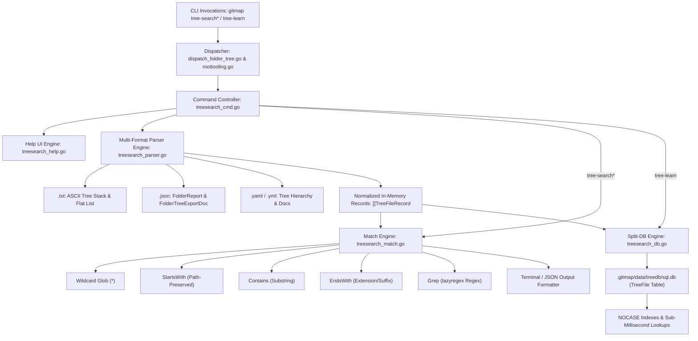
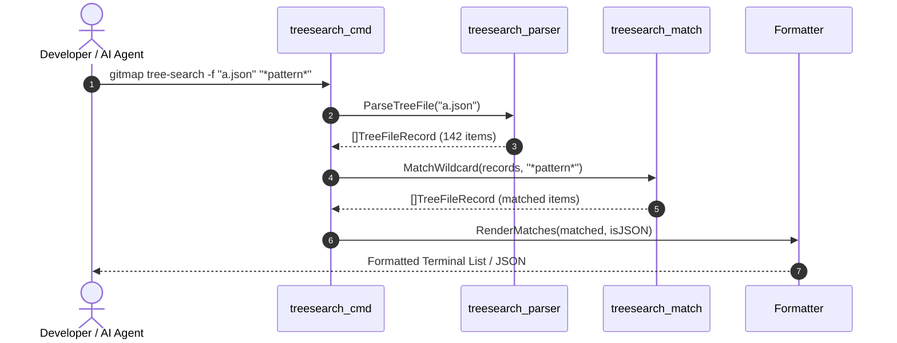
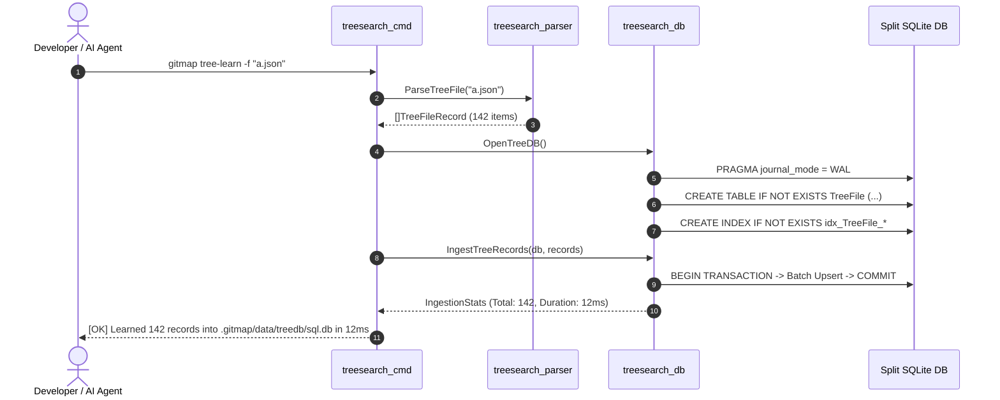
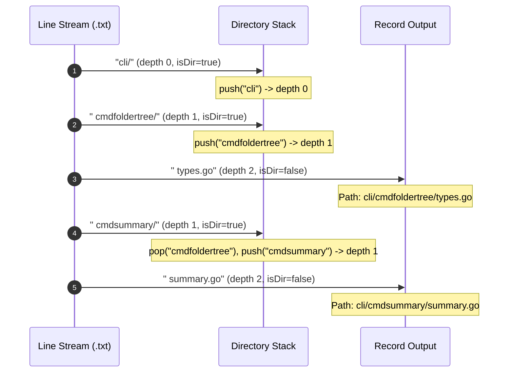

# Component Specification: GitMap Tree Search Family & Tree Learn Split-DB Engine

**Document ID:** `02-spec/21-app/gitmap-command-implementation/02-component-spec.md`  
**Classification:** Core Application Component Specification (`02-spec/21-app`)  
**Task Association:** `gitmap-command-implementation` / Subtask 02 (`Task-02-TreeSearch-TreeLearn`)  
**Status:** `ratified`  
**Version:** 1.0.0  
**Updated:** 2026-10-10  
**AI Confidence:** High  
**Ambiguity:** None  
**Companion Documents:**  
- [01-architecture-spec.md](01-architecture-spec.md)  
- [Engineering Subtask Plan: Tree Search and Learn Engine](../../../.ai-memory/plans/subtasks/gitmap-command-implementation/02-tree-search-and-learn-engine.md)  
- [Master Plan: GitMap Command Implementation](../../../.ai-memory/plans/gitmap-command-implementation.md)  

---

## Keywords

`tree-search` · `tree-search-startsWith` · `tree-search-contains` · `tree-search-endsWith` · `tree-search-grep` · `tree-learn` · `split-db` · `treedb` · `TreeFile` · `FolderReport` · `FolderTreeExportDoc` · `directory-stack` · `wildcard-glob` · `nocase-index` · `terminal-help-ui`

---

## Scoring

| Criterion | Status | Notes |
| :--- | :---: | :--- |
| Subtask Association | ✅ | Assigned to Subtask 02 (`Task-02-TreeSearch-TreeLearn`) |
| AI Confidence assigned | ✅ | High |
| Ambiguity assigned | ✅ | None |
| Keywords present | ✅ | Indexed above |
| Scoring table present | ✅ | Validated |
| Normalized Split-DB Schema defined | ✅ | `TreeFile` table, NOCASE indexes, and `ViewTreeFiles` included |
| Multi-Format Parser defined | ✅ | `.txt` (ASCII tree + flat), `.json` (dual schema), `.yaml` |
| Verification Gates specified | ✅ | VG-05 through VG-10 defined with explicit commands |
| Strict relative paths | ✅ | Zero absolute paths or `file:///` URIs |
| Positive boolean design | ✅ | `IsDir`, `IsLearned`, `IsMatch`, `HasError`, `CanParse` |

---

## Purpose

This document specifies the authoritative component architecture, data models, parsing algorithms, matching primitives, SQLite Split-DB storage engine, and CLI dispatch routing for the GitMap `tree-search` command family and the `tree-learn` indexing engine. It establishes the operational contracts for:
1. `gitmap tree-search -f <file> <wildcard-pattern>`: Wildcard pattern matching (`*` and `?`).
2. `gitmap tree-search-startsWith -f <file> <prefix>`: Prefix matching with directory path preservation.
3. `gitmap tree-search-contains -f <file> <substring>`: Substring matching across paths and file names.
4. `gitmap tree-search-endsWith -f <file> <suffix>`: Suffix and extension matching.
5. `gitmap tree-search-grep -f <file> <regex>`: Regular expression evaluation using `lazyregex`.
6. `gitmap tree-learn -f <file>`: High-speed ingestion into SQLite Split DB (`.gitmap/data/treedb/sql.db` or `.gitmap/treedb/tree_cache.db`) with normalized NOCASE indexes.
7. Universal multi-format parser for `.txt` (indented ASCII tree with directory stack + flat path lists), `.json` (`FolderReport` and `FolderTreeExportDoc`), and `.yaml`.
8. Rich terminal help UI design and dispatch wiring in `cli/cmdfoldertree/dispatch_folder_tree.go` and `cli/cmd/roottooling.go`.

---

## User Request (Verbatim)

```text
# GitMap Command Implementation: high priority instruction, non-negotiable task

make sure these commands are implemented and also

gitmap tree --file/f "a.txt"
gitmap tree --file/f "a.json"
gitmap tree --file/f "a.yaml"

gitmap tree-search -f "a.txt/a.json" "search pattern*ends*" # * meaning wildcard
gitmap tree-search-startsWith -f "a.txt/a.json" "search pattern" # meaning applying text and ends with * that means don't care, also respect fodler path if given
gitmap tree-search-contains -f "a.txt/a.json" "search pattern"
gitmap tree-search-endsWith -f "a.txt/a.json" "search pattern"
gitmap tree-search-grep -f "a.txt/a.json" "search pattern"
gitmap tree-learn -f "a.txt/a.json"  # save as split db with proper info to find files fast, clear???

Please also include the help text

## slug: gitmap-command-implementation
```

---

## 1. System Overview & Component Boundaries

The tree search and learn engine operates within the `cli/cmdfoldertree/` package and connects directly to the root CLI routing layer. It decomposes into five decoupled, cohesive modules:



### Module Responsibilities & Source File Mapping

| Module | Source File | Responsibilities |
| :--- | :--- | :--- |
| **Command Controller** | `cli/cmdfoldertree/treesearch_cmd.go` | Argument parsing, flag resolution (`-f`, `--file`, `--db`, `--json`, `-n`), execution orchestration. |
| **Multi-Format Parser** | `cli/cmdfoldertree/treesearch_parser.go` | Ingestion of `.txt` (ASCII tree + flat), `.json` (dual schema), and `.yaml` into `[]TreeFileRecord`. |
| **Match Engine** | `cli/cmdfoldertree/treesearch_match.go` | Evaluates wildcard, prefix, substring, suffix, and regex filters with folder path preservation. |
| **Split-DB Storage Engine** | `cli/cmdfoldertree/treesearch_db.go` | Initializes `.gitmap/data/treedb/sql.db`, executes transactional batch upserts, queries via NOCASE indexes. |
| **Terminal Help UI** | `cli/cmdfoldertree/treesearch_help.go` | Renders rich ANSI help screens, usage examples, syntax options, and badge highlights. |
| **Routing Dispatcher** | `cli/cmdfoldertree/dispatch_folder_tree.go` | Intercepts `tree-search*` and `tree-learn` subcommands from `root.go` and routes to `treesearch_cmd.go`. |
| **Root Tooling Registration** | `cli/cmd/roottooling.go` | Registers all command aliases and routing entries in `toolingUtilEntries()`. |

---

## 2. Component A: Multi-Format Parser Engine (`treesearch_parser.go`)

### 2.1 Format Auto-Detection Protocol
The parser must ingest diverse tree formats exported by GitMap or external tools. It resolves the format via a two-tier strategy:
1. **File Extension Check:** Inspects `filepath.Ext(filePath)`:
   - `.txt`, `.text`, `.log` $\rightarrow$ Plain Text Parser.
   - `.json` $\rightarrow$ JSON Parser.
   - `.yaml`, `.yml` $\rightarrow$ YAML Parser.
2. **Content Sniffing Fallback:** When the extension is generic or absent, the parser reads the first 512 bytes:
   - If starting with `{` or `[` after whitespace trimming $\rightarrow$ JSON.
   - If containing key markers like `rootPath:` or `tree:` $\rightarrow$ YAML.
   - Otherwise $\rightarrow$ Plain Text.

### 2.2 Text Parser Architecture: Directory Stack & Flat List
Plain text input can arrive in two distinct structures:
1. **ASCII Hierarchy Tree:** Indented with box-drawing glyphs (`├── `, `└── `, `│   `, `    `, tabs, spaces).
2. **Flat Relative Path List:** One normalized path per line (e.g. `cli/cmd/root.go`).

#### Directory Stack Algorithm for Indented ASCII Trees
To reconstruct full relative paths from visual trees without losing parent context:

```go
type treeStackEntry struct {
    depth int
    name  string
}
```

1. **Line Cleansing:** Strip leading/trailing carriage returns and line feeds. Skip empty lines or banner comments (`#`, `===`).
2. **Indentation Depth Calculation:**
   - Detect box-drawing characters: replace `├── `, `└── `, `│   `, `    ` with 4 spaces per depth level.
   - Count leading spaces or tab characters ($1 \text{ tab} = 4 \text{ spaces}$). Compute `depth = indentCount / 4`.
3. **Clean File/Directory Name:** Strip box-drawing runes (`├`, `─`, `└`, `│`, ` `) from the line prefix.
4. **Directory Detection:** A node is marked as `IsDir = true` if:
   - It ends with a trailing slash `/` or `\`.
   - It is indicated by directory prefixes or lacks a file extension while having child indentations.
5. **Stack Synchronization:**
   - While `len(stack) > 0` and `stack[len(stack)-1].depth >= depth`, pop the stack.
   - The current parent directory path is formed by joining names in `stack[0...len(stack)-1]`.
   - Compute `RelPath`: `filepath.ToSlash(filepath.Join(parentPath, cleanName))`.
   - If `IsDir = true`, push `{depth: depth, name: cleanName}` onto the stack.

#### Flat Path List Processing
If a text file contains lines with forward or backward slashes without indentation prefixes (e.g. `cli/cmdfoldertree/export.go`), it is parsed as a flat list:
- Normalize backslashes `\` to forward slashes `/`.
- Trim leading `./` or `.\`.
- Derive `DirPath = filepath.Dir(relPath)`, `FileName = filepath.Base(relPath)`, `Extension = filepath.Ext(fileName)`.
- Derive `Depth` by counting `/` separators.

### 2.3 JSON Parser Architecture: Dual Schema Support
The JSON parser handles two native GitMap document formats seamlessly:

#### Schema 1: `FolderReport` (`cli/cmd/folder/render_json.go`)
```json
{
  "root": ".",
  "totalFiles": 142,
  "totalLines": 18230,
  "totalSizeBytes": 492011,
  "totalSizeFormatted": "480.5 KB",
  "files": [
    {
      "path": "cli/cmd/root.go",
      "filename": "root.go",
      "directory": "cli/cmd",
      "extension": ".go",
      "sizeBytes": 29368,
      "sizeFormatted": "28.7 KB",
      "linesOfCode": 1034,
      "isBinary": false,
      "sequence": 0
    }
  ]
}
```
Mapped directly:
- `RelPath` $\leftarrow$ `file.Path` (normalized to forward slash).
- `FileName` $\leftarrow$ `file.Filename`.
- `DirPath` $\leftarrow$ `file.Directory`.
- `Extension` $\leftarrow$ `file.Extension`.
- `SizeBytes` $\leftarrow$ `file.SizeBytes`.
- `IsDir` $\leftarrow$ `false`.
- `Depth` $\leftarrow$ calculated from path segment count.

#### Schema 2: `FolderTreeExportDoc` (`cli/cmdfoldertree/types.go`)
```json
{
  "rootPath": ".",
  "rootName": "gitmap",
  "totalNodes": 210,
  "totalDirs": 45,
  "totalFiles": 165,
  "tree": {
    "name": "cli",
    "path": "./cli",
    "relPath": "cli",
    "isDir": true,
    "children": [
      {
        "name": "cmdfoldertree",
        "relPath": "cli/cmdfoldertree",
        "isDir": true,
        "children": [
          {
            "name": "types.go",
            "relPath": "cli/cmdfoldertree/types.go",
            "isDir": false
          }
        ]
      }
    ]
  }
}
```
Traversed recursively:
- A recursive walker traverses `node.Children`, extracting each `node.RelPath`, `node.Name`, `node.IsDir`.
- Directory paths and file extensions are extracted deterministically.
- Both directory nodes (`IsDir = true`) and file nodes (`IsDir = false`) are registered.

#### Schema 3: Raw Array Fallback
If the JSON root is an array `[]string` or `[]map[string]any`, each item is converted to a `TreeFileRecord`.

### 2.4 YAML Parser Architecture
The YAML parser reads `.yaml` and `.yml` documents:
- Unmarshals into generic map or attempts `FolderReport` / `FolderTreeExportDoc` struct mapping.
- Maps keys `rootPath`, `tree`, `files`, or flat lists recursively into normalized `[]TreeFileRecord`.

### 2.5 In-Memory Normalized Tree Model (`TreeFileRecord`)

```go
package cmdfoldertree

import "time"

// TreeFileRecord represents a normalized file or directory entry extracted from any tree format.
type TreeFileRecord struct {
    ID        int64     `json:"id,omitempty"`
    RelPath   string    `json:"relPath"`
    FileName  string    `json:"fileName"`
    DirPath   string    `json:"dirPath"`
    Extension string    `json:"extension"`
    SizeBytes int64     `json:"sizeBytes"`
    IsDir     bool      `json:"isDir"`
    Depth     int       `json:"depth"`
    UpdatedAt time.Time `json:"updatedAt"`
}
```

---

## 3. Component B: Tree Search Match Engine (`treesearch_match.go`)

### 3.1 Wildcard Pattern Matcher (`tree-search`)
- **Syntax:** `gitmap tree-search -f "a.txt/a.json" "<pattern*ends*>"`
- **Wildcard Semantics:**
  - `*` matches zero or more characters.
  - `?` matches exactly one character.
- **Matching Scope:**
  - If the pattern contains a `/` slash (e.g. `cli/*.go` or `*cmd*/*`), matching is performed against `RelPath`.
  - If the pattern has no slash (e.g. `*test*` or `*.go`), matching is performed against `FileName` and `RelPath`.
- **Implementation:**
  - Uses `filepath.Match(pattern, target)` after case folding (`strings.ToLower`).
  - For complex multi-wildcard expressions (e.g. `*cmd*root*`), converts the glob pattern into an optimized regular expression:
    ```go
    func WildcardToRegex(pattern string) string {
        var sb strings.Builder
        sb.WriteString("(?i)^")
        for i := 0; i < len(pattern); i++ {
            c := pattern[i]
            switch c {
            case '*':
                sb.WriteString(".*")
            case '?':
                sb.WriteString(".")
            case '.', '+', '(', ')', '[', ']', '{', '}', '^', '$', '|', '\\':
                sb.WriteByte('\\')
                sb.WriteByte(c)
            default:
                sb.WriteByte(c)
            }
        }
        sb.WriteString("$")
        return sb.String()
    }
    ```

### 3.2 Prefix Matcher with Folder Path Preservation (`tree-search-startsWith`)
- **Syntax:** `gitmap tree-search-startsWith -f "a.txt/a.json" "search pattern"`
- **Contract:**
  - Matches paths or files starting with the specified prefix: `strings.HasPrefix(strings.ToLower(target), strings.ToLower(pattern))`.
  - **Folder Path Preservation:** When a prefix matches a folder (e.g. `cli/cmd` or `cli`), all descendant files under that folder are matched and their complete relative path hierarchy is displayed (e.g. `cli/cmd/root.go`, `cli/cmd/roottooling.go`).
  - If given a bare prefix (e.g. `doc`), matches both paths starting with `doc/` and file names starting with `doc` across any directory, always printing the full `RelPath`.

### 3.3 Substring Matcher (`tree-search-contains`)
- **Syntax:** `gitmap tree-search-contains -f "a.txt/a.json" "search pattern"`
- **Contract:**
  - Case-insensitive substring evaluation: `strings.Contains(strings.ToLower(record.RelPath), strings.ToLower(pattern))`.
  - Matches anywhere within the directory path or file name.

### 3.4 Suffix Matcher (`tree-search-endsWith`)
- **Syntax:** `gitmap tree-search-endsWith -f "a.txt/a.json" "search pattern"`
- **Contract:**
  - Case-insensitive suffix evaluation: `strings.HasSuffix(strings.ToLower(record.RelPath), strings.ToLower(pattern))` or matching `record.Extension`.
  - If pattern is `.go`, matches all Go source files. If pattern is `_test.go`, matches all unit tests.

### 3.5 Regular Expression Grep Matcher (`tree-search-grep`)
- **Syntax:** `gitmap tree-search-grep -f "a.txt/a.json" "search pattern"`
- **Contract:**
  - Compiles regular expression using `lazyregex.Compile(pattern)` or `regexp.Compile(pattern)`.
  - Evaluates regex against `record.RelPath`.
  - Returns syntax errors gracefully without panics.

### 3.6 Match Options & Filters
```go
type TreeSearchFilter struct {
    Pattern       string
    SearchMode    string // "wildcard", "startsWith", "contains", "endsWith", "grep"
    DirsOnly      bool   // positive boolean: match directories only
    FilesOnly     bool   // positive boolean: match files only
    CaseSensitive bool   // positive boolean: enforce strict case sensitivity
    Limit         int    // maximum results (0 = unlimited)
}
```

### 3.7 Output Rendering & JSON Serialization
The match engine supports two output formats:
1. **ANSI Terminal Output:**
   - Prints a styled header with match count and search parameters.
   - Formats each match as:
     `[DIR]  cli/cmdfoldertree/` or `[FILE] cli/cmdfoldertree/types.go (1.8 KB)`
   - Color coded: Cyan for directories, Green for matched files, Gray for file sizes.
2. **JSON Output (`--json`):**
   - Emits structured JSON array of matching `TreeFileRecord` objects for automated machine consumption.

---

## 4. Component C: SQLite Split-DB Engine for `tree-learn` (`treesearch_db.go`)

### 4.1 Storage Topology & Multi-Tier Resolution
The `tree-learn` engine persists parsed file trees into a dedicated SQLite Split DB to enable sub-millisecond querying without re-reading or re-parsing source files on subsequent runs.

Storage path resolution order:
1. **Local Repository Data Directory (Primary):**
   - Check if `<cwd>/.gitmap/data/treedb/` exists or can be created $\rightarrow$ `<cwd>/.gitmap/data/treedb/sql.db`.
2. **Local Repository Cache Directory (Secondary / Fallback):**
   - `<cwd>/.gitmap/treedb/tree_cache.db`.
3. **User Home Fallback:**
   - `<userHome>/.gitmap/data/treedb/sql.db`.

### 4.2 SQLite Connection Configuration & PRAGMA Settings
- Driver: Pure-Go SQLite driver `modernc.org/sqlite` via `sql.Open("sqlite", dsn)`.
- DSN Pragmas:
  ```go
  dsn := fmt.Sprintf("%s?_pragma=busy_timeout(5000)&_pragma=journal_mode(WAL)&_pragma=synchronous(NORMAL)&_pragma=foreign_keys(1)", dbPath)
  ```
- Connection Pool Limits:
  ```go
  db.SetMaxOpenConns(1)
  db.SetMaxIdleConns(1)
  db.SetConnMaxLifetime(10 * time.Minute)
  ```

### 4.3 DDL Schema: `TreeFile` Table, NOCASE Indexes, and `ViewTreeFiles`

```sql
-- TreeFile Table
CREATE TABLE IF NOT EXISTS TreeFile (
    id INTEGER PRIMARY KEY AUTOINCREMENT,
    RelPath TEXT NOT NULL UNIQUE,
    FileName TEXT NOT NULL,
    DirPath TEXT NOT NULL,
    Extension TEXT NOT NULL,
    SizeBytes INTEGER NOT NULL DEFAULT 0,
    IsDir BOOLEAN NOT NULL DEFAULT 0,
    Depth INTEGER NOT NULL DEFAULT 0,
    UpdatedAt DATETIME DEFAULT CURRENT_TIMESTAMP
);

-- Case-Insensitive B-Tree Indexes for Ultra-Fast Retrieval
CREATE INDEX IF NOT EXISTS idx_TreeFile_RelPath ON TreeFile(RelPath COLLATE NOCASE);
CREATE INDEX IF NOT EXISTS idx_TreeFile_FileName ON TreeFile(FileName COLLATE NOCASE);
CREATE INDEX IF NOT EXISTS idx_TreeFile_DirPath ON TreeFile(DirPath COLLATE NOCASE);
CREATE INDEX IF NOT EXISTS idx_TreeFile_Extension ON TreeFile(Extension COLLATE NOCASE);
CREATE INDEX IF NOT EXISTS idx_TreeFile_IsDir ON TreeFile(IsDir);

-- Database View for Clean Normalized Queries
CREATE VIEW IF NOT EXISTS ViewTreeFiles AS
SELECT 
    id,
    RelPath,
    FileName,
    DirPath,
    Extension,
    SizeBytes,
    IsDir,
    Depth,
    UpdatedAt
FROM TreeFile
ORDER BY DirPath, FileName;
```

### 4.4 High-Speed Transactional Batch Ingestion & Upsert
When ingesting thousands of records from an exported tree:
- Ingestion runs inside a single atomic SQLite transaction (`tx, err := db.Begin()`).
- Executes batch upserts using parameterized queries in chunks of 500 records:
  ```sql
  INSERT INTO TreeFile (
      RelPath, FileName, DirPath, Extension, SizeBytes, IsDir, Depth, UpdatedAt
  ) VALUES (?, ?, ?, ?, ?, ?, ?, CURRENT_TIMESTAMP)
  ON CONFLICT(RelPath) DO UPDATE SET
      FileName = excluded.FileName,
      DirPath = excluded.DirPath,
      Extension = excluded.Extension,
      SizeBytes = excluded.SizeBytes,
      IsDir = excluded.IsDir,
      Depth = excluded.Depth,
      UpdatedAt = CURRENT_TIMESTAMP;
  ```
- Commits transaction: `err := tx.Commit()`.
- Latency Benchmark Target: $< 80\text{ms}$ for 10,000 files.

### 4.5 Split-DB Query Primitives & Fallback Querying
If `tree-search` is invoked without a `-f` file argument, it checks if `.gitmap/data/treedb/sql.db` exists. If present, it executes the search directly against the database using SQL queries leveraging the NOCASE indexes:
- **Wildcard:** `SELECT * FROM ViewTreeFiles WHERE RelPath LIKE ? ESCAPE '\'`
- **StartsWith:** `SELECT * FROM ViewTreeFiles WHERE RelPath LIKE (? || '%')`
- **Contains:** `SELECT * FROM ViewTreeFiles WHERE RelPath LIKE ('%' || ? || '%')`
- **EndsWith:** `SELECT * FROM ViewTreeFiles WHERE Extension = ? OR RelPath LIKE ('%' || ?)`

---

## 5. Component D: Command Routing, CLI Flags & Dispatch Architecture

### 5.1 CLI Grammar & Routing Matrix

| Command Signature | Aliases | Mode / Operation | Default Target | Output Format |
| :--- | :--- | :--- | :--- | :--- |
| `gitmap tree-search -f <file> <pattern>` | `treesearch`, `ts` | Wildcard match (`*`, `?`) | File `-f` or Split DB | Text table / `--json` |
| `gitmap tree-search-startsWith -f <file> <prefix>` | `tree-search-startswith`, `tree-search-prefix` | Prefix match with path preservation | File `-f` or Split DB | Text table / `--json` |
| `gitmap tree-search-contains -f <file> <substr>` | `tree-search-contain`, `tree-search-substr` | Substring match | File `-f` or Split DB | Text table / `--json` |
| `gitmap tree-search-endsWith -f <file> <suffix>` | `tree-search-endswith`, `tree-search-suffix` | Suffix / extension match | File `-f` or Split DB | Text table / `--json` |
| `gitmap tree-search-grep -f <file> <regex>` | `tree-search-regex` | Regex evaluation | File `-f` or Split DB | Text table / `--json` |
| `gitmap tree-learn -f <file>` | `treelearn`, `tl` | Ingest into Split SQLite DB | File `-f` | Ingestion status badge |

### 5.2 Root Dispatch Wiring

#### Wiring in `cli/cmdfoldertree/dispatch_folder_tree.go`
`DispatchFolderTree` is invoked in `cli/cmd/root.go:553` before other toolings. It intercepts all `tree-search*` and `tree-learn` invocations:

```go
func DispatchFolderTree(command string) (bool, error) {
    if isFolderTreeCommand(command) {
        args := os.Args[2:]
        return true, RunFolderTree(args)
    }
    if isTreeSearchCommand(command) {
        args := os.Args[2:]
        return true, RunTreeSearchDispatch(command, args)
    }
    if isTreeLearnCommand(command) {
        args := os.Args[2:]
        return true, RunTreeLearn(args)
    }
    return false, nil
}
```

#### Routing in `cli/cmd/roottooling.go`
Registered in `toolingUtilEntries()`:
```go
{[]string{"tree-search", "treesearch", "ts"}, func() error { return cmdfoldertree.RunTreeSearchDispatch("tree-search", argsTail()) }},
{[]string{"tree-search-startsWith", "tree-search-startswith", "tree-search-prefix"}, func() error { return cmdfoldertree.RunTreeSearchDispatch("tree-search-startsWith", argsTail()) }},
{[]string{"tree-search-contains", "tree-search-contain", "tree-search-substr"}, func() error { return cmdfoldertree.RunTreeSearchDispatch("tree-search-contains", argsTail()) }},
{[]string{"tree-search-endsWith", "tree-search-endswith", "tree-search-suffix"}, func() error { return cmdfoldertree.RunTreeSearchDispatch("tree-search-endsWith", argsTail()) }},
{[]string{"tree-search-grep", "tree-search-regex"}, func() error { return cmdfoldertree.RunTreeSearchDispatch("tree-search-grep", argsTail()) }},
{[]string{"tree-learn", "treelearn", "tl"}, func() error { return cmdfoldertree.RunTreeLearn(argsTail()) }},
```

### 5.3 CLI Flags Specification
- `-f`, `--file <path>`: Required or optional path to tree file (`.txt`, `.json`, `.yaml`).
- `--db <path>`: Custom Split-DB path override (defaults to `.gitmap/data/treedb/sql.db`).
- `--json`: Format matching results as clean JSON array.
- `-n`, `--limit <int>`: Max results to display (default: `1000`).
- `--dirs`: Filter to directory entries only (`IsDir = true`).
- `--files`: Filter to file entries only (`IsDir = false`).
- `-h`, `--help`: Display rich terminal help UI.

---

## 6. Component E: Rich Terminal Help UI Design (`treesearch_help.go`)

### 6.1 Layout & Visual Hierarchy
Help displays are styled using GitMap terminal guidelines:
- Cyan/Bold headers for section titles.
- Green checkmarks `[OK]` and command names.
- Yellow for parameters and options.
- Dark gray for syntax brackets and examples.

### 6.2 Master Tree Search Help Menu
```text
GITMAP TREE SEARCH & LEARN SUITE
=================================
High-speed pattern search, regular expression grep, and SQLite Split-DB
indexing across exported directory trees and hierarchies.

USAGE:
  gitmap tree-search -f <file> <pattern*ends*>       Wildcard pattern matching (* and ?)
  gitmap tree-search-startsWith -f <file> <prefix>   Prefix matching (preserves folder path)
  gitmap tree-search-contains -f <file> <substring>  Substring search across paths
  gitmap tree-search-endsWith -f <file> <suffix>     Suffix and extension matching
  gitmap tree-search-grep -f <file> <regex>          Regular expression search
  gitmap tree-learn -f <file>                        Ingest tree into SQLite Split DB

OPTIONS:
  -f, --file <file>      Input tree file (.txt, .json, .yaml)
  --db <path>            Override SQLite Split-DB database path
  --json                 Output matching results as JSON array
  -n, --limit <num>      Limit number of matching results (default: 1000)
  --dirs                 Match directories only
  --files                Match files only
  -h, --help             Show this help screen

SUPPORTED TREE FORMATS:
  .txt                   Indented ASCII tree (box-drawing) or flat path list
  .json                  FolderReport, FolderTreeExportDoc, or string array
  .yaml, .yml            YAML document or hierarchy tree

EXAMPLES:
  gitmap tree-search -f "tree.json" "*root*.go"
  gitmap tree-search-startsWith -f "tree.txt" "cli/cmd"
  gitmap tree-search-contains -f "export.yaml" "pipeline"
  gitmap tree-search-endsWith -f "report.json" ".go"
  gitmap tree-search-grep -f "tree.json" "^cli/cmd/.*_test\.go$"
  gitmap tree-learn -f "export.json"
```

---

## 7. Mermaid Sequence & Workflow Diagrams

### 7.1 Tree Search Flow


### 7.2 Tree Learn Storage Flow


### 7.3 Multi-Format Parser Directory Stack Flow


---

## 8. Error Handling & Quality Gates

### 8.1 Structured Error Codes
Adhering to GitMap error guidelines:

| Code | Name | Scenario | Resolution |
| :--- | :--- | :--- | :--- |
| `E9101` | `ErrTreeFileNotFound` | Specified `-f` tree file does not exist on disk. | Verify file path passed to `-f`. |
| `E9102` | `ErrTreeFileParseFailed` | File contains malformed JSON, YAML, or corrupt encoding. | Check source file format. |
| `E9103` | `ErrTreeDBCreationFailed`| SQLite database failed to initialize or directory not writable. | Verify filesystem write permissions. |
| `E9104` | `ErrInvalidRegexPattern` | Pattern passed to `tree-search-grep` fails regex compilation. | Check regular expression syntax. |
| `E9105` | `ErrMissingSearchPattern`| Command invoked without search pattern argument. | Provide pattern or see `--help`. |

### 8.2 Positive Booleans Contract
All data models and internal signatures adhere to positive boolean naming conventions:
- `IsDir` (not `IsFile` or `NotDirectory`).
- `IsLearned` (not `Unlearned`).
- `IsMatch` (not `NonMatching`).
- `HasError` (not `NoError`).
- `CanParse` (not `CannotParse`).

### 8.3 Verification Gates (VG-05 through VG-10)

```text
VG-05: Wildcard Search Gate
  Command: gitmap tree-search -f "a.json" "*pattern*"
  Criteria: Exit code 0, returns files matching wildcard pattern, supports * and ?.

VG-06: StartsWith Prefix Search Gate
  Command: gitmap tree-search-startsWith -f "a.json" "cli"
  Criteria: Exit code 0, matches paths starting with "cli", preserves folder path hierarchy.

VG-07: Contains Substring Search Gate
  Command: gitmap tree-search-contains -f "a.json" "root"
  Criteria: Exit code 0, matches paths containing substring "root" case-insensitively.

VG-08: EndsWith Suffix Search Gate
  Command: gitmap tree-search-endsWith -f "a.json" ".go"
  Criteria: Exit code 0, matches paths ending in ".go".

VG-09: Regex Grep Search Gate
  Command: gitmap tree-search-grep -f "a.json" "cmd.*\.go"
  Criteria: Exit code 0, executes regular expression match, handles invalid regex with error code.

VG-10: Tree Learn Split-DB Ingestion Gate
  Command: gitmap tree-learn -f "a.json"
  Criteria: Exit code 0, creates .gitmap/data/treedb/sql.db, creates TreeFile table and indexes,
            inserts records transactionally, outputs summary badge.
```
