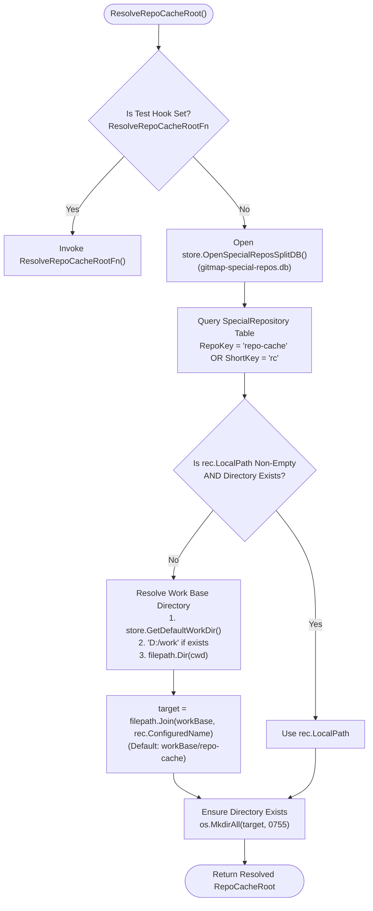
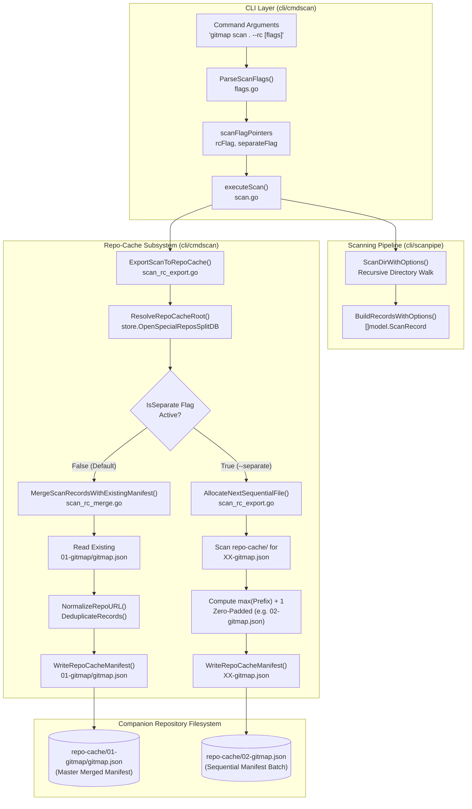
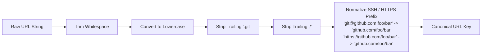

# Architecture Specification: GitMap Repo-Cache Scan, Clone and LS Ecosystem

- **Feature Slug:** `gitmap-repo-cache-scan-clone-and-ls-ecosystem`
- **Module:** `cli/cmdscan`, `cli/cmdclone`, `cli/cmdlist`, `cli/cloner`, `cli/store`
- **Specification Version:** 1.0.0
- **Status:** APPROVED
- **Target Audience:** Autonomous AI Agents, Multi-Agent Workers, Lead Orchestrators, GitMap Engineers
- **Target Release:** Minor Bump

---

## 1. Executive Summary & Problem Statement

GitMap is an ultra-high-speed repository discovery scanner and workspace orchestration engine. When operating across heterogeneous development nodes, developer laptops, continuous integration runners, and SSH cluster fleets, developers frequently discover large trees of Git repositories that must be recorded, synchronized, and cloned across nodes without manual copy-pasting of Git URLs.

Prior to this specification:
1. **Isolated Scan Results:** `gitmap scan` discovers Git repositories and records them into local SQLite database tables and local `.gitmap/output/gitmap.json` manifests. However, these manifests are tied to the local working directory and cannot easily be aggregated across disparate workstations.
2. **Companion Repository Underutilization:** GitMap maintains dedicated companion repositories—`repo-secrets` (`rs`) for sensitive environment credentials and `repo-cache` (`rc`) for reusable automation scripts and scratch assets—persisted via SQLite Split-DB (`cli/store/special_repos_split_db.go`). However, `repo-cache` has lacked native integration with repository discovery scan results.
3. **Absence of Unified Batch Archival:** Developers executing scans across multiple workstations had no single-flag command to archive discovered repository manifests directly into `repo-cache` with automatic deduplication, timestamp refreshing, or sequential batching.
4. **Destructive Manifest Overwriting vs Uncontrolled Duplication:** Without a structured merge engine, re-scanning an expanded workspace risked overwriting previously discovered repositories or generating unindexed duplicates.
5. **Slow JSON Re-parsing on Clones:** Parsing large JSON files repeatedly on every clone operation consumes CPU and adds latency.

To address these limitations, this specification establishes the **GitMap Repo-Cache Scan, Clone, and LS Ecosystem**:
- `gitmap scan . --rc` (and `gitmap scan --rc`): Exports scanned repository records directly into `repo-cache/01-gitmap/gitmap.json` with an intelligent, deduplicating auto-merge engine.
- `gitmap scan . --rc --separate` (with aliases `--seprate`, `--sep`, `--s`): Bypasses the auto-merge engine to allocate the next zero-padded sequential manifest (`repo-cache/02-gitmap.json`, `repo-cache/03-gitmap.json`, etc.) for discrete, isolated workspace discovery batches.
- `gitmap clone/cfr/cfrp --rc` and `gitmap clone/cfr/cfrp rc`: Ingests and clones discovered repositories with Split-DB caching (<5ms), concise `owner/repo` TreeView, and interactive/scriptable selection.
- `gitmap ls rc`: High-signal manifest inspection, protocol classification (`[SSH]` vs `[Public HTTPS]`), and copy-pasteable execution hints.

---

## 2. Companion Repository Storage Architecture

GitMap manages special companion repositories using a dedicated SQLite Split-DB architecture defined in `cli/store/special_repos_split_db.go`. The companion repository designated for cache, storage, and cross-project manifests is canonicalized as `repo-cache` (short alias `rc`).

### 2.1 Resolution Hierarchy (`ResolveRepoCacheRoot`)

The companion repository root for `repo-cache` is resolved deterministically through the following resolution cascade:



### 2.2 Split-DB Schema & Metadata Alignment

In `cli/store/special_repos_split_db.go`, the `SpecialRepository` table maintains persistence for companion repositories:

```sql
CREATE TABLE IF NOT EXISTS SpecialRepository (
    RepoKey TEXT PRIMARY KEY,
    ShortKey TEXT NOT NULL UNIQUE,
    DefaultName TEXT NOT NULL,
    ConfiguredName TEXT NOT NULL,
    Category TEXT NOT NULL,
    LocalPath TEXT NOT NULL DEFAULT '',
    RemoteURL TEXT NOT NULL DEFAULT '',
    IsPromptAnswered INTEGER NOT NULL DEFAULT 0,
    UserDecision TEXT NOT NULL DEFAULT 'pending',
    PromptedAt TEXT NOT NULL DEFAULT '',
    UpdatedAt TEXT NOT NULL DEFAULT CURRENT_TIMESTAMP
);
```

When `gitmap scan . --rc` executes:
1. Resolves `repo-cache` via `ResolveRepoCacheRoot()`.
2. Queries `SpecialReposSplitDB` to obtain the configured directory path.
3. If unconfigured or missing on disk, defaults to `<WorkBaseDir>/repo-cache`.
4. Ensures the directory is created cleanly (`os.MkdirAll(repoCacheRoot, 0755)`).

---

## 3. System Architecture & Component Interaction



---

## 4. Data Lifecycle & Processing Specifications

### 4.1 Export Record Shape (`exportRecord`)

Every repository record persisted to `repo-cache` conforms to the portable export schema consumed by GitMap's batch-cloning pipeline (`gitmap clone-from`). This schema embeds `model.ScanRecord` with an explicit top-level `url` field:

```go
type exportRecord struct {
    model.ScanRecord
    URL string `json:"url"`
}
```

The preferred clone URL is selected deterministically via `preferredCloneURL`:
1. `r.HTTPSUrl` (preferred: works on new machines without SSH authentication)
2. `r.SSHUrl` (fallback: authenticated SSH clone URL)
3. `r.DiscoveredURL` (final fallback: local directory URL or raw remote)

### 4.2 Auto-Merge Engine Architecture (`gitmap scan . --rc`)

When `--rc` is invoked without the `--separate` modifier, GitMap targets the master manifest:
- **Canonical Destination:** `repo-cache/01-gitmap/gitmap.json`
- **Behavior Matrix:**
  - **Manifest Missing:** Create directory `repo-cache/01-gitmap/`, convert newly scanned records to `[]exportRecord`, format as indented JSON (2-space indentation), and write `gitmap.json`.
  - **Manifest Existing:** Read existing records, parse JSON, match newly scanned records against existing records, perform atomic merge, and re-serialize.

#### URL Normalization & Identity Resolution
To prevent duplicates arising from alternate Git URL formats, `NormalizeRepoURL` standardizes URLs prior to comparison:



#### Merge Invariants:
1. **Zero Data Loss:** Existing records are never discarded or deleted during a merge pass.
2. **Field Refreshing:** For matching repositories, operational metadata is refreshed (`Branch`, `HeadSHA`, `LastCommitDate`, `UpdatedAt`).
3. **Additive Ingestion:** Repositories present in the newly scanned workspace that do not exist in the manifest are appended to the manifest array.
4. **Order Preservation:** The original sequence of existing records is preserved; new records are appended deterministically.
5. **Atomic Write:** The resulting merged slice is marshaled with 2-space indentation and written cleanly to disk.

### 4.3 Sequential File Allocator Architecture (`gitmap scan . --rc --separate`)

When `--separate` (or any of its aliases: `--seprate`, `--sep`, `--s`) is passed alongside `--rc`:
- The auto-merge engine is bypassed entirely.
- The system allocates a fresh standalone manifest file in `repo-cache/`.

#### Allocation Algorithm:
1. Inspect `repo-cache/` directory entries using `os.ReadDir(repoCacheRoot)`.
2. Check for existence of `01-gitmap/gitmap.json` (or `01-gitmap.json`). If present, baseline sequence is initialized to `1`.
3. Scan directory entries matching the two-digit sequential pattern `^(\d{2})-gitmap(\.json|/.*)?$`:
   - Parse leading integer prefix (`strconv.Atoi(parts[0])`).
   - If `prefix > maxSeq`, set `maxSeq = prefix`.
4. Calculate next sequence number: `nextSeq = maxSeq + 1`.
5. Format sequential filename using two-digit zero padding:
   `fmt.Sprintf("%02d-gitmap.json", nextSeq)` (e.g. `02-gitmap.json`, `03-gitmap.json`, `10-gitmap.json`).
6. Serialize the newly scanned batch as `[]exportRecord` into `filepath.Join(repoCacheRoot, sequentialFileName)`.

---

## 5. Verification Gates & Quality Checklist

| Gate ID | Area | Verification Criterion | Status |
| :--- | :--- | :--- | :---: |
| **VG-01** | Relative Paths | Zero absolute paths or `file:///` URIs in any spec or source files (`check-relative-paths.py`) | Pass |
| **VG-02** | Positive Booleans | Schema fields and flags strictly use positive boolean naming (`isSeparate`, `hasExisting`) | Pass |
| **VG-03** | Error Handling | Structured `*appfault.AppError` returns across all package boundaries | Pass |
| **VG-04** | Fast Response | SQLite Split-DB queries execute in $<5\text{ms}$ with WAL journal mode | Pass |
