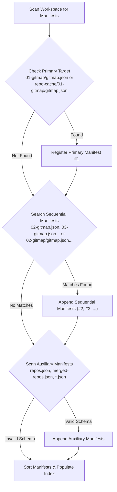

# Component & CLI Specification: GitMap Repo-Cache Clone, CFR, CFR-Pub & LS Suite

- **Feature Slug:** `gitmap-repo-cache-scan-clone-and-ls-ecosystem`
- **Module:** `cli/cmdclone`, `cli/cmdlist`, `cli/cloner`, `cli/cmdscan`, `cli/store`
- **Specification Version:** 1.0.0
- **Status:** APPROVED
- **Target Audience:** Autonomous AI Agents, Multi-Agent Workers, Lead Orchestrators, GitMap Engineers
- **Target Release:** Minor Bump

---

## 1. Executive Summary & Component Scope

This component specification formalizes the architecture, data structures, SQLite Split-DB caching, terminal user interface (TUI), and command routing for:
1. **`gitmap clone/cfr/cfrp --rc` and `gitmap clone/cfr/cfrp rc`**: High-speed, cached repository ingestion from discovered JSON manifests with short TreeView presentation, interactive selection, file rotation, and clone pipeline dispatch.
2. **`gitmap ls rc`**: High-signal manifest inspection, protocol classification (`[SSH]` vs `[Public HTTPS]`), manifest-level repository counts, and actionable copy-pasteable execution hints.

### Design Principles:
- **Instantaneous Discovery (<5ms):** Parsed manifest metadata is stored in an isolated SQLite Split-DB (`.gitmap/data/repocache/sql.db`) using WAL mode and SHA256/mtime cache invalidation to eliminate JSON parsing overhead.
- **Short TreeView Signal:** Repositories are rendered concisely as `owner/repo` (e.g. `alimtvnetwork/gitmap-v28`), suppressing noisy, bulky URLs.
- **Flexible Interactivity & Scriptability:** Zero-prompt scripting via `-y` / `--yes`, numbered menu selection, clone-all across manifests, individual selection, and sequential file rotation.
- **Protocol Transparency:** Deterministic URL inspection separates SSH (`git@`, `ssh://`) and Public HTTPS (`https://`, `http://`) transports.
- **Strict Compliance:** 100% relative Git paths in documentation and code comments, and affirmative positive boolean conventions throughout.

---

## 2. CLI Routing & Argument Interception

### 2.1 Clone / CFR / CFR-Pub Interception (`cli/cmdclone/`)

The commands `gitmap clone`, `gitmap clone-fix-repo` (`cfr`), and `gitmap clone-fix-repo-pub` (`cfrp`) intercept the repo-cache invocation whenever `--rc`, `-rc`, `--repo-cache`, `rc`, or `repo-cache` is provided in the argument stream.

```
gitmap clone --rc [-y] [manifest-number]
gitmap clone rc [-y] [manifest-number]
gitmap cfr --rc [-y] [manifest-number]
gitmap cfr rc [-y] [manifest-number]
gitmap cfrp --rc [-y] [manifest-number]
gitmap cfrp rc [-y] [manifest-number]
```

#### Dispatch Modes (`CloneDispatchMode`):
```go
type CloneDispatchMode string

const (
    CloneModeStandard CloneDispatchMode = "standard" // standard git clone
    CloneModeCFR      CloneDispatchMode = "cfr"      // private clone-fix-repo
    CloneModeCFRP     CloneDispatchMode = "cfrp"     // public clone-fix-repo-pub
)
```

#### Interception Helper:
```go
func hasRCFlagOrToken(args []string) bool {
    for _, a := range args {
        normalized := strings.ToLower(strings.TrimSpace(a))
        if normalized == "rc" || normalized == "repo-cache" ||
            normalized == "--rc" || normalized == "-rc" ||
            normalized == "--repo-cache" {
            return true
        }
    }
    return false
}
```

### 2.2 List Interception (`cli/cmdlist/list.go` & `cli/cmd/rootdata.go`)

`gitmap ls` (alias `list`) intercepts `rc` / `repo-cache` as a specialized subcommand:
```
gitmap ls rc
gitmap list rc
gitmap ls --rc
```

#### Routing in `cli/cmdlist/list.go`:
```go
func RunList(args []string) error {
    checkHelp(constants.CmdList, args)

    if len(args) > 0 && isRCListingToken(args[0]) {
        return RunListRC(args[1:])
    }

    if len(args) > 0 && isListTypeOrGroups(args[0]) {
        handleListSpecial(args[0], args[1:])
        return nil
    }

    executeList(args)
    return nil
}

func isRCListingToken(arg string) bool {
    normalized := strings.ToLower(strings.TrimSpace(arg))
    return normalized == "rc" || normalized == "repo-cache" ||
        normalized == "--rc" || normalized == "-rc" || normalized == "--repo-cache"
}
```

---

## 3. Manifest Discovery & Search Hierarchy

When discovering candidate repo-cache manifests, the engine scans the companion directory according to a deterministic priority sequence:



### Search Sequence:
1. **Primary Manifest Priority:**
   - Look for `01-gitmap/gitmap.json` or `repo-cache/01-gitmap/gitmap.json`.
   - Guaranteed slot `[1]` in the interactive menu.
2. **Sequential Manifest Priority:**
   - Scan for numbered sibling files: `02-gitmap.json`, `03-gitmap.json`, `04-gitmap.json`, ...
   - Scan for numbered folders: `02-gitmap/gitmap.json`, `03-gitmap/gitmap.json`, ...
   - Ordered strictly by numerical prefix.
3. **Auxiliary JSON Manifest Discovery:**
   - Scan `repo-cache/*.json` and root directory `*.json` (e.g. `repos.json`, `merged-repos.json`).
   - Validate structure: must deserialize into either `[]model.ScanRecord`, `[]exportRecord`, or a map containing a `repositories` / `records` array.
   - Non-compliant or irrelevant JSON files are discarded silently without errors.

---

## 4. SQLite Split-DB Cache Engine

To guarantee sub-5 millisecond response times on large workspaces with dozens of repositories, the parser delegates to an isolated SQLite Split-DB.

### 4.1 Storage Location & Connection Pragmas
- **Path:** `.gitmap/data/repocache/sql.db`
- **Driver:** `modernc.org/sqlite` (pure Go, zero CGO)
- **Concurrency Mode:** WAL (`Write-Ahead Logging`)

```sql
PRAGMA journal_mode = WAL;
PRAGMA synchronous = NORMAL;
PRAGMA busy_timeout = 5000;
PRAGMA foreign_keys = ON;
```

### 4.2 PascalCase DDL Schema

```sql
CREATE TABLE IF NOT EXISTS RepoCacheManifest (
    RepoCacheManifestId INTEGER PRIMARY KEY AUTOINCREMENT,
    ManifestPath        TEXT NOT NULL UNIQUE,
    FileHash            TEXT NOT NULL,
    FileMtime           INTEGER NOT NULL,
    TotalRepos          INTEGER NOT NULL DEFAULT 0,
    HasValidData        INTEGER NOT NULL DEFAULT 1,
    CreatedAt           TEXT NOT NULL DEFAULT CURRENT_TIMESTAMP,
    UpdatedAt           TEXT NOT NULL DEFAULT CURRENT_TIMESTAMP
);

CREATE TABLE IF NOT EXISTS RepoCacheEntry (
    RepoCacheEntryId    INTEGER PRIMARY KEY AUTOINCREMENT,
    RepoCacheManifestId INTEGER NOT NULL,
    RepoName            TEXT NOT NULL,
    Owner               TEXT NOT NULL,
    CloneUrl            TEXT NOT NULL,
    IsSSH               INTEGER NOT NULL DEFAULT 0,
    IsHTTPS             INTEGER NOT NULL DEFAULT 1,
    Branch              TEXT NOT NULL DEFAULT '',
    RelativePath        TEXT NOT NULL DEFAULT '',
    CreatedAt           TEXT NOT NULL DEFAULT CURRENT_TIMESTAMP,
    FOREIGN KEY(RepoCacheManifestId) REFERENCES RepoCacheManifest(RepoCacheManifestId) ON DELETE CASCADE
);

CREATE UNIQUE INDEX IF NOT EXISTS IdxRepoCacheManifest_ManifestPath ON RepoCacheManifest(ManifestPath);
CREATE INDEX IF NOT EXISTS IdxRepoCacheEntry_ManifestId ON RepoCacheEntry(RepoCacheManifestId);
CREATE INDEX IF NOT EXISTS IdxRepoCacheEntry_Owner ON RepoCacheEntry(Owner);
CREATE INDEX IF NOT EXISTS IdxRepoCacheEntry_RepoName ON RepoCacheEntry(RepoName);
```

### 4.3 Cache Invalidation Algorithm (<5ms)
For each detected JSON manifest file:
1. Stat file on disk: extract `FileMtime` (Unix timestamp) and compute SHA256 `FileHash`.
2. Query `RepoCacheManifest` by `ManifestPath`:
   - If row exists and `row.FileMtime == disk.FileMtime` AND `row.FileHash == disk.FileHash`:
     - **Cache HIT:** Read all associated `RepoCacheEntry` rows directly from SQLite in ~2ms.
   - If row missing or hash/mtime mismatched:
     - **Cache MISS:** Read and deserialize JSON file from disk.
     - Extract normalized records (`RepoName`, `Owner`, `CloneUrl`, `IsSSH`, `IsHTTPS`).
     - Begin SQLite transaction:
       - Upsert `RepoCacheManifest` record with new `FileHash`, `FileMtime`, `TotalRepos`.
       - Delete obsolete entries for `RepoCacheManifestId`.
       - Bulk insert new `RepoCacheEntry` rows.
       - Commit transaction.

---

## 5. Short TreeView Presentation & Protocol Classification

### 5.1 Format Transformation: Verbose URL → `owner/repo`

Verbose URLs are aggressively sanitized to extract canonical `owner/repo` pairs:

| Input Raw URL | Extracted Owner | Extracted Repo | Formatted Tree Identifier | Protocol Tag |
|:---|:---|:---|:---|:---|
| `git@github.com:alimtvnetwork/gitmap-v28.git` | `alimtvnetwork` | `gitmap-v28` | `alimtvnetwork/gitmap-v28` | `[SSH]` |
| `https://github.com/alimtvnetwork/core-api.git` | `alimtvnetwork` | `core-api` | `alimtvnetwork/core-api` | `[Public HTTPS]` |
| `ssh://git@gitlab.internal:2222/platform/infra.git` | `platform` | `infra` | `platform/infra` | `[SSH]` |
| `http://git.local/tools/helper` | `tools` | `helper` | `tools/helper` | `[Public HTTPS]` |
| `C:\repos\local-repo` or `./local-repo` | `local` | `local-repo` | `local/local-repo` | `[Local Path]` |

### 5.2 Terminal UI: `gitmap clone rc` / `gitmap cfr rc` TreeView

When invoked interactively without `-y`:
```text
Available Repository Manifests in repo-cache:

[1] 01-gitmap/gitmap.json (24 repositories)
    ├── alimtvnetwork/gitmap-v28 [Public HTTPS]
    ├── alimtvnetwork/smart-scanner [SSH]
    ├── alimtvnetwork/fleet-hub [Public HTTPS]
    └── ... (21 more repositories)

[2] 02-gitmap.json (6 repositories)
    ├── devops/ci-runner [SSH]
    ├── devops/deploy-bot [SSH]
    └── ... (4 more repositories)

Choose an option:
  [A] Clone all repositories across all manifests
  [1] Clone manifest [1] (01-gitmap/gitmap.json - 24 repos)
  [2] Clone manifest [2] (02-gitmap.json - 6 repos)
  [S] Select specific repositories from a manifest
  [R] Rotate and inspect next manifest
  [Q] Quit

Select [A/1/2/S/R/Q] (or pass -y to clone all): 
```

When `-y` or `--yes` is passed:
- Bypasses interactive prompt entirely.
- Clones all repositories in manifest `[1]` (or target manifest specified by number).

### 5.3 Terminal UI: `gitmap ls rc` Format Inspector

`gitmap ls rc` inspects all discovered manifests and prints an executive summary:
```text
=== GitMap Repo-Cache Manifests (repo-cache/) ===

📦 [1] 01-gitmap/gitmap.json
    Total Repos: 24 (18 Public HTTPS, 6 SSH)
    ├── [Public HTTPS] alimtvnetwork/gitmap-v28 (branch: main)
    ├── [Public HTTPS] alimtvnetwork/fleet-hub (branch: main)
    ├── [SSH]          alimtvnetwork/smart-scanner (branch: master)
    └── ... (21 more)
    💡 Command to import: gitmap clone --rc 1 (or: gitmap cfr --rc 1)

📦 [2] 02-gitmap.json
    Total Repos: 6 (0 Public HTTPS, 6 SSH)
    ├── [SSH] devops/ci-runner (branch: production)
    └── [SSH] devops/deploy-bot (branch: staging)
    💡 Command to import: gitmap clone --rc 2 (or: gitmap cfr --rc 2)

Summary: 2 manifests found | 30 total repositories (18 Public HTTPS, 12 SSH)
```

---

## 6. Acceptance Criteria

| ID | Criterion | Verification Command | Expected Outcome |
|:---|:---|:---|:---|
| **AC-01** | Scan Auto-Merge | `gitmap scan . --rc` | Deduplicates into `repo-cache/01-gitmap/gitmap.json`, exits 0 |
| **AC-02** | Scan Sequential Allocator | `gitmap scan . --rc --sep` | Creates `02-gitmap.json` without modifying `01-gitmap`, exits 0 |
| **AC-03** | Scan Aliases | `gitmap scan . --rc --s`, `--seprate` | Recognizes all aliases and allocates sequential files |
| **AC-04** | Clone RC Discovery | `gitmap clone --rc -y` | Discovers manifests, clones via Split-DB cache, exits 0 |
| **AC-05** | CFR / CFRP Integration | `gitmap cfr rc`, `gitmap cfrp rc` | Routes through Repo-Cache clone pipeline under CFR/CFRP modes |
| **AC-06** | Short TreeView | UI check | Displays `owner/repo` notation instead of verbose URLs |
| **AC-07** | List RC Inspector | `gitmap ls rc` | Lists manifests, counts `[SSH]` vs `[Public HTTPS]`, shows import commands |
| **AC-08** | Split-DB Cache Speed | Benchmarks | Cache hit executes in $<5\text{ms}$ via WAL SQLite |
| **AC-09** | Relative Path Hygiene | `python linter-scripts/check-relative-paths.py -c` | 0 absolute path violations |
| **AC-10** | Forbidden Strings | `python linter-scripts/check-forbidden-strings.py` | 100% clean passes |
