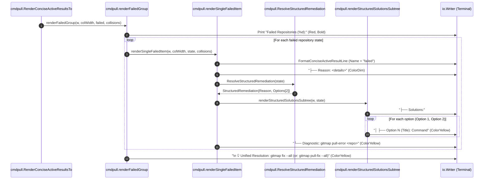

# Architecture Specification: Pull Failure Subtree Solutions, Yellow Rendering & Batch Remediation

- **Feature Slug:** `repository-fix-and-solution-implementation`
- **Module:** `cli/cmdpull`, `cli/cmdfix`, `cli/cmdautofix`
- **Specification Version:** 1.0.0
- **Status:** APPROVED
- **Author:** Spec Subagent 01 (Task 85)
- **Target Release:** Minor Bump

---

## 1. Problem Statement & System Context

During concurrent repository synchronization operations (`gitmap pull-all`, `gitmap pa`), individual repositories frequently fail to synchronize due to diverse operational causes: uncommitted local changes, untracked working tree collisions, diverged Git branches, authentication credential failures, or directories missing `.git` tracking.

While the concise active results renderer (`cli/cmdpull/pull_efficient_render.go`) successfully isolates active/failed repositories from clean repositories, the failure diagnostics display several critical usability and architectural flaws:

1. **Flat Colon Lines with Ambiguous Inline "or":**
   - Current failure rendering emits a flat line:
     ```text
     ├── Next Step: gitmap status repo-cache or gitmap fix repo-cache
     ```
   - This flat layout mixes multiple distinct operational strategies into an inline text sentence with an embedded `"or"`. It obscures actionable commands and prevents operators from immediately discerning alternative remediation pathways.

2. **Sub-optimal Visual Contrast (Dim Grey Options):**
   - Remediation options are currently styled using `constants.ColorDim` (dim grey):
     ```text
     │   ├── Option 1 (Discard Local Changes): git -C "..." reset --hard
     ```
   - On modern terminal emulators (Windows Terminal, VS Code Integrated Terminal, macOS Terminal, iTerm2), dim grey merges with background contrast, causing high visual fatigue and making primary commands difficult to scan during high-volume workspace synchronization.

3. **Missing Aggregate Batch Resolution Command:**
   - At the conclusion of the `Failed Repositories (%d):` list, operators are left without an immediate, copy-pasteable batch command to repair all failed repositories at once.
   - Operators must manually inspect each repository or run multiple separate commands, significantly degrading productivity when dozens of repositories fail simultaneously.

4. **Inaccurate Non-Repo Directory Diagnosis:**
   - When a registered directory exists on disk but is not an initialized Git repository (e.g. `repo-cache`, `repo-secrets`, or a new workspace folder), the pull engine historically classified the failure as `missing repository directory` or `no remote configured`.
   - The emitted suggestions (`gitmap status <repo>` or `gitmap pull <repo>`) inevitably fail because the target directory lacks a `.git` repository folder. The correct diagnosis is that the folder is not a Git repo, and the primary solution is `gitmap clone <repo>` or repository initialization.

---

## 2. Architecture & Subtree Design

To resolve these deficiencies, the pull failure reporting architecture is restructured around three core architectural pillars:
1. **Subtree Solution Hierarchy:** Transform flat inline suggestions into a structured subtree labeled `Solutions:` with discrete child branches.
2. **High-Contrast Yellow Palette:** Render all actionable remediation commands and titles in vibrant ANSI yellow (`constants.ColorYellow`).
3. **Unified Batch Resolution Footer:** Emit a single, prominent batch resolution command at the bottom of the failed repositories summary.

### 2.1 Terminal Output Topology

```
┌────────────────────────────────────────────────────────────────────────┐
│               Failed Repositories Summary Topology                     │
└──────────────────────────────────┬─────────────────────────────────────┘
                                   │
                                   ▼
  Failed Repositories (N):  [Red + Bold Header]
  ● <repo-display-name>     failed [Red Badge]
    ├── Reason: <Error Diagnostic Text> [Dim Grey]
    ├── Solutions:                      [Standard Subtree Root]
    │   ├── Option 1 (<Title>): <cmd1>  [Bright Bold Yellow]
    │   └── Option 2 (<Title>): <cmd2>  [Bright Bold Yellow]
    └── Diagnostic: To inspect stack trace: gitmap pe <repo> [Yellow Command]
                                   │
                                   ▼
  [Additional Failed Repositories ...]
                                   │
                                   ▼
  💡 Unified Resolution: gitmap fix --all (or: gitmap pull-fix --all) [Yellow]
```

### 2.2 Concrete Terminal Output Representation

```text
  Failed Repositories (2):
  ● repo-cache               failed
    ├── Reason: directory exists but is not a Git repository (missing .git)
    ├── Solutions:
    │   ├── Option 1 (Clone from Upstream): gitmap clone repo-cache
    │   └── Option 2 (Initialize Repository): cd repo-cache && git init
    └── Diagnostic: To inspect stack trace: gitmap pull-error repo-cache (or: gitmap pe)
  ● web-platform             failed
    ├── Reason: local changes would be overwritten by pull
    ├── Solutions:
    │   ├── Option 1 (Commit WIP): git -C "web-platform" add -A && git commit -m "wip"
    │   └── Option 2 (Stash Changes): git -C "web-platform" stash
    └── Diagnostic: To inspect stack trace: gitmap pull-error web-platform (or: gitmap pe)

  💡 Unified Resolution: gitmap fix --all (or: gitmap pull-fix --all)
```

---

## 3. Component Architecture & Responsibilities

The implementation spans three core subsystems within `cli/cmdpull`, `cli/cmdfix`, and `cli/constants`:

| Component Subsystem | Implementation File | Primary Responsibilities |
| :--- | :--- | :--- |
| **Concise Active Results Renderer** | `cli/cmdpull/pull_efficient_render.go` | Formats `Failed Repositories (%d):` group, renders `Solutions:` subtrees, eliminates flat `Next Step:` lines, applies yellow styling, and emits the unified batch footer. |
| **Remediation Hint & Dual Option Resolver** | `cli/cmdpull/pull_remediation_hint.go` | Decomposes error conditions into paired, non-inlined `Option 1` and `Option 2` structs with forward-slash command strings. |
| **Batch Fix & Orchestration Engine** | `cli/cmdfix/fix_cmd.go` & `cli/cmdpull/pull_remediation.go` | Executes `gitmap fix --all` and `gitmap pull-fix --all` across recorded failed repositories. |
| **Terminal Palette & Constants** | `cli/constants/constants_terminal.go` | Provides `ColorYellow` (`\033[1;93m`), `ColorBold`, `ColorRed`, and tree box-drawing glyphs (`├── `, `└── `, `│   `). |

### 3.1 Rendering Subsystem Sequence



---

## 4. Detailed Specification: Subtree Formatting & Yellow Styling

### 4.1 Deprecation of Legacy `Next Step:` Flat Line

The legacy rendering pattern in `cli/cmdpull/pull_efficient_render.go` is strictly prohibited:
```go
// FORBIDDEN: Legacy flat colon line with inline "or"
remHint := ResolvePullRemediationHint(s)
if remHint == "" {
    remHint = fmt.Sprintf("gitmap status %s or gitmap fix %s", s.RepoName, s.RepoName)
}
fmt.Fprintf(w, "    %sNext Step: %s%s%s\n", treeBranch, constants.ColorCyan, remHint, constants.ColorReset)
```

**Replacement Architecture:**
- The `Next Step:` line is completely removed.
- All prescriptive remediation is delegated exclusively to `renderStructuredSolutionsSubtree`.

### 4.2 Subtree `Solutions:` Formatting Logic

The subtree renderer must construct clean hierarchical branches adhering to strict indentation:

1. **Subtree Root Line:**
   - Connector: `treeBranch` (`├── `)
   - Indentation: 4 spaces (`    `)
   - Text: `Solutions:\n`
   - Result: `    ├── Solutions:\n`

2. **Sub-Item Option Lines:**
   - Continuation Prefix: 4 spaces + `treeContinuation` (`    │   `)
   - Branch Connector:
     - For non-terminal options: `treeBranch` (`├── `)
     - For the final option: `treeTerminal` (`└── `)
   - Color Styling: Option label, option title, and command must be wrapped in `constants.ColorYellow` and terminated with `constants.ColorReset`.
   - String Format:
     ```go
     fmt.Fprintf(w, "    %s%s%sOption %d (%s): %s%s\n",
         treeContinuation, connector,
         constants.ColorYellow, opt.OptionNumber, opt.Title, opt.Command, constants.ColorReset)
     ```

3. **Fallback Handling:**
   - If `structured.Options` has zero options (unclassified error), the renderer must generate synthetic dual fallback options:
     - Option 1 (Auto-Fix): `gitmap fix <repo>`
     - Option 2 (Inspect Status): `gitmap status <repo>`
   - This ensures every failed item displays a valid, informative `Solutions:` subtree rather than leaving the user with no recourse.

### 4.3 Unified Batch Resolution Footer Specification

When `len(deduped) > 0` in `renderFailedGroup`, after the final failed repository is rendered, the renderer MUST emit the unified batch resolution banner:

```go
fmt.Fprintf(w, "\n  %s💡 Unified Resolution:%s %sgitmap fix --all%s %s(or: %sgitmap pull-fix --all%s)%s\n",
    constants.ColorBold, constants.ColorReset,
    constants.ColorYellow, constants.ColorReset,
    constants.ColorDim, constants.ColorYellow, constants.ColorDim, constants.ColorReset)
```

Visual Breakdown:
- Leading blank line and 2-space margin.
- `💡 Unified Resolution:` in bold white text.
- Primary command `gitmap fix --all` in bright yellow (`constants.ColorYellow`).
- Secondary alias `(or: gitmap pull-fix --all)` in dim grey with the command highlighted in yellow.

---

## 5. Non-Repo Folder Detection & Solution Specifications

When a repository directory is missing `.git`, the system must not emit generic pull error messages.

### 5.1 Detection Matrix

| Folder State | Detection Logic | Classified Error Reason | Structured Solutions |
| :--- | :--- | :--- | :--- |
| **Directory Does Not Exist** | `!dirExists` | `Repository directory does not exist on disk` | **Option 1 (Clone from Upstream):** `gitmap clone <repo>`<br>**Option 2 (Remove from Registry):** `gitmap rm --db-only <repo>` |
| **Directory Exists, Missing `.git`** | `dirExists && !isGitRepo` | `Directory exists but is not a Git repository (missing .git)` | **Option 1 (Clone from Upstream):** `gitmap clone <repo>`<br>**Option 2 (Initialize Repository):** `cd <path> && git init` |
| **Infrastructure Cache/Secrets Missing `.git`** | `isInfraRepo && !isGitRepo` | `Infrastructure cache/secrets directory not initialized` | **Option 1 (Clone Cache Repo):** `gitmap clone <repo>`<br>**Option 2 (Initialize & Link):** `gitmap fix <repo> init` |
| **Standard Dirty Workspace** | `isGitRepo && isDirty` | `Uncommitted working tree changes prevent pull` | **Option 1 (Commit WIP):** `git -C "<path>" add -A && git commit -m "wip"`<br>**Option 2 (Stash Changes):** `git -C "<path>" stash` |
| **Branch Divergence** | `isGitRepo && isDiverged` | `Branches have diverged and cannot fast-forward` | **Option 1 (Rebase Local):** `git -C "<path>" pull --rebase`<br>**Option 2 (Hard Reset to Remote):** `git -C "<path>" reset --hard @{u}` |

---

## 6. Coding Standards & Non-Negotiable Invariants

1. **Strictly Relative Git Paths:**
   - Zero absolute paths (e.g. `d:/...`, `C:\...`) or `file:///` URIs in any source files, documentation, release notes, or tests.
   - All paths must use forward slashes (`filepath.ToSlash(...)`).

2. **Positive Boolean Naming:**
   - All boolean variables, fields, and helper functions must be positively named (`isActionable`, `hasOptions`, `isGitRepo`, `hasFailures`), never negated (`notClean`, `isNonRepo`).

3. **Color Isolation:**
   - All ANSI styling must strictly utilize constants from `cli/constants/constants_terminal.go`. Zero raw escape codes (`\033...`) in formatting calls.

4. **Clean Markdown Tables:**
   - All tables must feature complete markdown pipes, aligned headers, and non-empty descriptive cells.

---

## 7. Verification Gates & Acceptance Criteria

| Gate ID | Verification Item | Success Criteria | Automated Test / Command |
| :--- | :--- | :--- | :--- |
| **VG-01** | Subtree Solution Layout | Output formats `Solutions:` as a nested subtree with `treeBranch` and `treeTerminal`. Zero flat colon lines. | `go test -v ./cli/cmdpull -run TestRenderConciseActiveResultsTo` |
| **VG-02** | Yellow Option Rendering | All option labels, titles, and command strings render with `constants.ColorYellow`. | Unit test assertions on ANSI byte sequence `\033[1;93m`. |
| **VG-03** | Batch Resolution Footer | Output ends with `💡 Unified Resolution: gitmap fix --all (or: gitmap pull-fix --all)`. | Unit test verifying presence of footer banner in output buffer. |
| **VG-04** | Next Step Removal | The string `"Next Step:"` does NOT appear anywhere in pull output. | Assertion `!strings.Contains(output, "Next Step:")`. |
| **VG-05** | Relative Path Hygiene | All file references in docs, tests, and code are strictly relative. Zero absolute path leaks. | Scan for drive letters and root paths. |
| **VG-06** | Regression Prevention | Up-to-date and dirty repository rendering remains stable and vertically aligned. | `go test -v ./cli/cmdpull -run TestFormatConciseActiveResultLine` |
