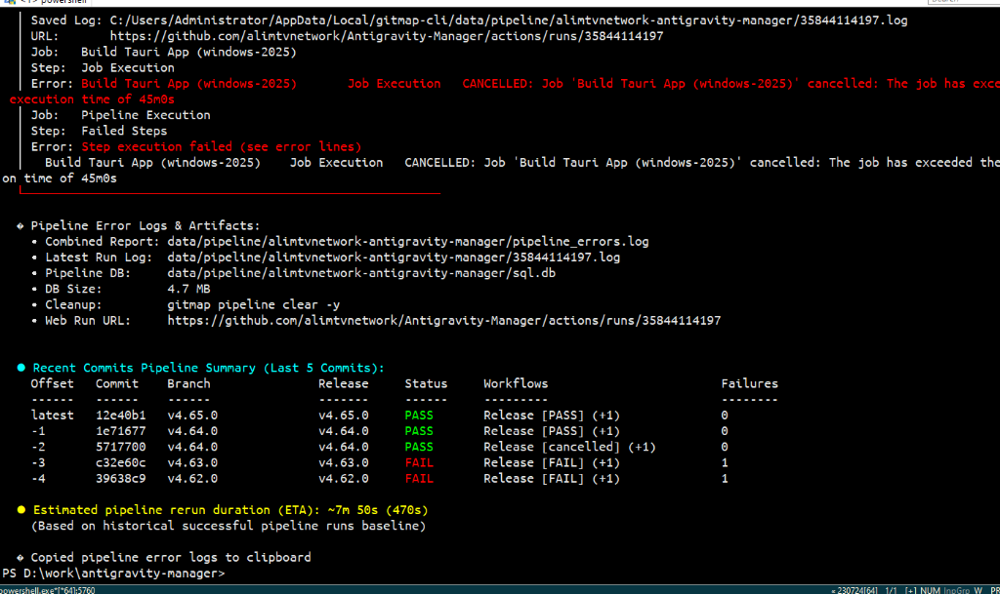

# Issue 37: Pipeline Cancelled / Timed Out Runs Erroneously Displayed as PASS

> **/goal** Provide 4-part Root Cause Analysis (Reproduction, Cause, Fix, Prevention) for GitMap pipeline history reporting cancelled and timed-out workflow runs as `PASS` with 0 failures.
> **/learn** Grounded 4-part RCA adhering to `AC-AI-001` with verifiable reproduction and test invariants.

---

## 1. Issue Summary & Status Matrix

| Component | Target Commit / Run | Reported Symptom | Root Cause | Status |
|---|---|---|---|---|
| **Pipeline Commit Groups** | `Antigravity-Manager` `12e40b1` & `5717700` | Cancelled / timed-out pipeline runs display as `PASS` with `0` failures | `isWorkflowFailure` omitted `"cancelled"`, incrementing `PassedWorkflows` instead of `FailedWorkflows` | Resolved |
| **Pipeline History Badge** | `cli/cmdpipeline/pipeline_history.go` | Status badge returned `PASS` because aggregate conclusion fell back to `"success"` | Missing `isFailingConclusion` evaluation in `computeAggregateConclusion` and `formatStatusBadge` | Resolved |
| **Positional Commit Inspector** | `cli/cmdpipeline/pipeline_history.go` | `isCommitGroupFailure` checked strictly `== "failure"`, treating cancelled groups as clean | `isCommitGroupFailure` bypassed cancelled and multi-failure groups | Resolved |

---

## 2. Reproduction

In `Antigravity-Manager`, running `gitmap pe` for commit `12e40b1` (run `35844114197`) or commit `5717700` produced:



```text
Saved Log: C:/Users/Administrator/AppData/Local/gitmap-cli/data/pipeline/alimtvnetwork-antigravity-manager/35844114197.log
URL: https://github.com/alimtvnetwork/Antigravity-Manager/actions/runs/35844114197
Job: Build Tauri App (windows-2025)
Step: Job Execution
Error: Build Tauri App (windows-2025)   Job Execution   CANCELLED: Job 'Build Tauri App (windows-2025)' cancelled: The job has exceeded the maximum execution time of 45m0s
Job: Pipeline Execution
Step: Failed Steps
Error: Step execution failed (see error lines)
  Build Tauri App (windows-2025)   Job Execution   CANCELLED: Job 'Build Tauri App (windows-2025)' cancelled: The job has exceeded the maximum execution time of 45m0s

● Recent Commits Pipeline Summary (Last 5 Commits):
Offset   Commit   Branch   Release   Status   Workflows               Failures
------   ------   ------   -------   ------   ---------               --------
latest   12e40b1  v4.65.0  v4.65.0   PASS     Release [PASS] (+1)     0
-1       1e71677  v4.64.0  v4.64.0   PASS     Release [PASS] (+1)     0
-2       5717700  v4.64.0  v4.64.0   PASS     Release [cancelled] (+1) 0
-3       c32e60c  v4.63.0  v4.63.0   FAIL     Release [FAIL] (+1)     1
-4       39638c9  v4.62.0  v4.62.0   FAIL     Release [FAIL] (+1)     1
```

### Key Observation
1. For `5717700`: Both `Release` and `CI` were cancelled, yet Status shows `PASS` and Failures shows `0`.
2. For `12e40b1`: Run `35844114197` cancelled due to 45m timeout, yet the table reported `PASS` with 0 failures and hid the cancellation behind `Release [PASS] (+1)`.

---

## 3. Root Cause Analysis

### Cause 1: Incomplete Failure Predicate in `pipeline_commit_groups.go`
In `cli/cmdpipeline/pipeline_commit_groups.go`:
```go
func isWorkflowFailure(wf CommitWorkflowItem) bool {
    return wf.Conclusion == "failure" || wf.Conclusion == "timed_out" || wf.Conclusion == "startup_failure"
}
```
GitHub Actions produces several non-passing conclusions: `cancelled`, `timed_out`, `action_required`, `stale`.
Because `cancelled` was omitted from `isWorkflowFailure`:
- `isWorkflowFailure(wf)` evaluated to `false`.
- `updateWorkflowCounts` fell through and executed `group.PassedWorkflows++`.
- `hasFailingWorkflow(workflows)` returned `false`.
- `computeAggregateConclusion(workflows)` returned `"success"`.
- `group.FailedWorkflows` was never incremented, leaving `Failures: 0`.

### Cause 2: Naive Conclusion Matching in Status Badges
In `cli/cmdpipeline/pipeline_history.go`:
```go
func formatStatusBadge(conclusion, status string) string {
    switch conclusion {
    case "success":
        return constants.ColorGreen + "PASS" + constants.ColorReset
    case "failure":
        return constants.ColorRed + "FAIL" + constants.ColorReset
    }
    ...
}
```
When `conclusion` is `"cancelled"`, it fell through to return the raw uncolored string `"cancelled"`, or when aggregate conclusion was `"success"`, it returned `PASS`.

### Cause 3: Passing Workflows Masking Failures in Summary
In `formatGroupWorkflowsSummary`, workflows were formatted in arbitrary iteration order up to 32 characters. When a commit group had both passing and failing workflows (e.g. `Release [PASS]` and `CI [cancelled]`), `Release [PASS]` was printed first and the failure was hidden behind `(+1)`.

---

## 4. Code Fix & Remediation

1. **Unify Failure Predicate with `isFailingConclusion`:**
   In `cli/cmdpipeline/pipeline_commit_groups.go`:
   Update `isWorkflowFailure` to call `isFailingConclusion(wf.Conclusion)`.
   Update `isFailingConclusion` in `cli/cmdpipeline/pipeline_logs.go` to recognize `cancelled`, `failure`, `timed_out`, `startup_failure`, `action_required`, and `stale`.

2. **Fix Status Badge Rendering:**
   In `cli/cmdpipeline/pipeline_history.go` and `cli/cmdpipeline/pipeline_history_cmd.go`:
   Use `isFailingConclusion` to map any failing or cancelled conclusion to `FAIL` (red).

3. **Fix Commit Group Failure Detection:**
   In `cli/cmdpipeline/pipeline_history.go`:
   Update `isCommitGroupFailure(group)` to check `isFailingConclusion(group.Conclusion) || group.FailedWorkflows > 0`.

4. **Prioritize Failing Workflows in Column Summary:**
   In `formatGroupWorkflowsSummary`:
   Order workflows so that failing / cancelled workflows appear before passing workflows, ensuring failures are immediately visible instead of hidden behind `(+N)`.

---

## 5. Prevention & Quality Invariants

1. **Unit Test Invariants:**
   - Add unit test verifying that `ghRunItem` with `Conclusion: "cancelled"` produces `g.Conclusion == "failure"` and `g.FailedWorkflows == 1`.
   - Add unit test verifying `formatStatusBadge("cancelled", "completed")` renders `FAIL`.
   - Add unit test verifying `formatGroupWorkflowsSummary` prioritizes failing workflows.
2. **Quality Gates:**
   - Run `python linter-scripts/check-nested-ifs.py` (0 violations).
   - Run `python linter-scripts/check-enum-and-boolean.py` (0 violations).
   - Run `python linter-scripts/check-error-management.py` (0 violations).
   - Run `python linter-scripts/check-relative-paths.py` (0 violations).
