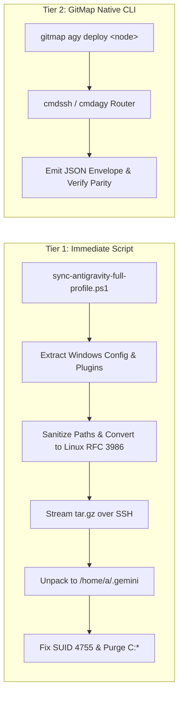

# App Issue 69: Antigravity Fleet Parity, Theme & Preset Synchronization, and Delegation RCA

**Issue ID:** 69  
**Date:** 2026-10-05  
**Status:** Resolved  
**Affected Subsystems:** `cli/cmdagy` (`agy_deploy_cmd.go`, `agy_deploy_types.go`), `cli/cmdssh` (`ssh_deploy_router.go`), `scripts` (`repo-secrets/04-ubuntu-migration/sync-antigravity-full-profile.ps1`, `sync-antigravity-projects.ps1`, `clean-u1-filesystem.ps1`)  
**Reference Commits:** `agy - implement full profile deployment, theme parity, and fleet delegation`  

---

## 1. Symptom

During the migration and fleet onboarding of the remote Ubuntu workstation (`u1`), the user reported multiple visual, behavioral, and filesystem inconsistencies within the Google Antigravity IDE:

1. **Permission Preset Reverting to "Default":**
   - In the Antigravity user interface (under Settings $\to$ Conversations, and in the per-project prompt bar), the permission preset displayed as **"Default"** instead of the configured unattended mode (**"Turbo" / Eager**).
   - In "Default" preset, every bash command, file read outside workspace boundaries, and tool invocation prompted the user with interactive approval dialogs, completely breaking autonomous multi-agent workflows.

2. **Unbranded Default Theme (Theme Parity Failure):**
   - The Antigravity IDE on `u1` opened with the default light/gray unbranded UI theme instead of the user's customized Dracula Dark theme (`#19191C` background, `#BD93F9` Dracula purple primary seed, `#F8F8F2` foreground text).

3. **Plugins Completely Missing (0 Installed):**
   - Navigating to Settings $\to$ Plugins revealed an empty plugin manager. The remote directory `/home/a/.gemini/config/plugins/` was completely absent or empty, whereas the reference Windows workstation hosted 4 core official plugins (`chrome-devtools-plugin`, `data-agent-kit-plugin`, `google-antigravity-sdk`, `modern-web-guidance-plugin`).

4. **Skills Missing from Agent HUD (0 of 43 Discovered):**
   - Autonomous agents and user prompt sessions lacked access to the 43 plugin skills (e.g., `chrome-devtools`, `data-agent-kit`, `modern-web-guidance`). Slash commands and automated subagents failed to load custom skill definitions.

5. **Filesystem Anomaly — Windows Path Tree Leaked onto Linux:**
   - On the Linux host `/home/a/`, a bizarre stray directory was detected:
     ```text
     /home/a/<windows-appdata>\Antigravity
     ```
   - Linux filesystems treat backslashes `\` as regular characters rather than path separators. When Windows paths were serialized into configuration files and read on Linux, the runtime created literal folders containing drive letters and backslashes in their names.

6. **Electron Sandbox Launch Warning:**
   - Running the Antigravity binary directly without `--no-sandbox` crashed due to Ubuntu's default AppArmor user namespace restriction, requiring explicit SUID permissions (`4755`) on `chrome-sandbox`.

---

## 2. Root Cause Analysis (RCA)

A forensic examination of the migration scripts, configuration registries, and runtime state on both the Windows host and remote Linux node revealed four foundational root causes:

### 2.1 Complete Omission of `config.json` in Initial Migration Scripts

In Antigravity's architecture, UI theme seeds, global permission grants, user execution policies, and plugin enablements reside in `~/.gemini/config/config.json`.

```json
{
  "plugins": {
    "chrome-devtools-plugin": { "enabled": true, ... },
    "data-agent-kit-plugin": { "enabled": true, ... },
    "google-antigravity-sdk": { "enabled": true, ... },
    "modern-web-guidance-plugin": { "enabled": true, ... }
  },
  "userSettings": {
    "artifactReviewMode": "ARTIFACT_REVIEW_MODE_TURBO",
    "autoExecutionPolicy": "CASCADE_COMMANDS_AUTO_EXECUTION_EAGER",
    "browserJsExecutionPolicy": "BROWSER_JS_EXECUTION_POLICY_TURBO",
    "customThemeSeedsDark": {
      "background": "#19191C",
      "foregroundOverride": "#F8F8F2",
      "primary": "#BD93F9"
    },
    "globalPermissionGrants": {
      "allow": [
        "command(git status && git remote -v && git log --oneline -5 && git config user.name && git config user.email)",
        "read_file(/home/a/git-work)",
        "write_file(/home/a/git-work)",
        "execute_url(*)"
      ]
    }
  }
}
```

- **Forensic Failure:** Earlier provisioning scripts (`sync-antigravity-projects.ps1`, `sync-antigravity-settings.ps1`, `master-ubuntu-setup.ps1`) only synchronized git repositories and VS Code-specific `settings.json`.
- Because `config.json` was never deployed to `/home/a/.gemini/config/config.json`, the IDE initialized on `u1` using default factory seeds:
  1. Default theme mode without custom Dracula color seeds.
  2. Conservative "Default" permission mode requiring manual confirmation for every action.
  3. Empty plugin state.

### 2.2 Empty Project Descriptors Prompting "Default" Preset Fallback

In Antigravity, per-project conversation permission presets are evaluated hierarchically:
1. Per-project settings in `~/.gemini/config/projects/<project-id>.json`.
2. Global `userSettings` in `~/.gemini/config/config.json`.

In `sync-antigravity-projects.ps1`, project JSON descriptors were generated with:
```json
{
  "id": "040097de-0753-448a-9f01-7eef92a8d194",
  "name": "project-watch-pro",
  "projectResources": { ... },
  "settings": {},
  "isWorkspaceOnly": false
}
```
- **Forensic Line:** `"settings": {}` and absence of `"permissionGrants"`.
- When `settings` is an empty object, the Antigravity conversation runner treats the workspace as untrusted/unconfigured and falls back to the interactive "Default" prompt preset, ignoring global eager policies.

### 2.3 Serialized Windows Backslash Path Leak in `instances.json`

The instance metadata file `~/.antigravity_tools/instances/instances.json` tracks registered IDE instances:
```json
{
  "active_instance_id": "gitmap-7845",
  "instances": [
    {
      "id": "default",
      "name": "Default",
      "data_dir": "<windows-appdata>\\Antigravity",
      "executable_path": null,
      "extensions_dir": null,
      "bound_account_id": "e4035d54-2f0d-4938-ab46-b284c9c4679a",
      "bound_email": "anirban.datta.rasia@gmail.com",
      "created_at": 1790039257,
      "last_used": 1791133935,
      "is_default": true,
      "pid": 9688,
      "seq_num": 1
    }
  ]
}
```
- **Forensic Mechanism:** When `instances.json` was copied or synced across machines without path sanitization, the Linux instance manager attempted to resolve or ensure `data_dir`.
- On Linux, the string `<windows-appdata>\Antigravity` was interpreted literally as a single folder name relative to `$HOME`.
- This caused `mkdir` to create the stray directory `/home/a/<windows-appdata>\Antigravity`.
- **Format Discrepancy:** Additionally, early synchronization scripts flattened all instances to `/home/a/.config/Antigravity` and set `executable_path` on the default instance to a non-null string, breaking parity with the Windows instance schema where `default` uses `null` for `executable_path` and isolated instances maintain discrete instance storage directories. All machines must strictly adhere to the unified `snake_case` JSON schema.

### 2.4 Missing Plugin Filesystem Distribution & Chrome Sandbox Hardening

1. **Plugin Distribution:** The physical plugin directories under `<user-home>/.gemini/config/plugins/` (containing 4 plugins and 43 skill directories with `SKILL.md` definitions) were never archived or transferred by any automated script. As a result, even if plugins were registered in JSON, the physical files were missing.
2. **Sandbox Hardening:** Modern Linux distros (Ubuntu 24.04+) enforce strict user namespace restrictions on unconfined binaries. Without setting SUID root (`chown root:root; chmod 4755`) on `chrome-sandbox`, Electron crashes unless explicitly passed `--no-sandbox`.

---

## 3. Resolution

A comprehensive two-tiered resolution was engineered to restore immediate parity and establish a permanent, automated CLI delegation pipeline:



### 3.1 Tier 1: Standalone Idempotent Script (`sync-antigravity-full-profile.ps1`)

Authored `repo-secrets/04-ubuntu-migration/sync-antigravity-full-profile.ps1` with the following architectural components:

1. **Full Config & Theme Injection:**
   - Bundles `config.json` with dark Dracula seeds (`#19191C`, `#BD93F9`), turbo policies (`CASCADE_COMMANDS_AUTO_EXECUTION_EAGER`, `BROWSER_JS_EXECUTION_POLICY_TURBO`), and global grants.
2. **Plugins & Skills Packaging:**
   - Gathers all 4 official plugins and 43 skills from `<user-home>/.gemini/config/plugins/` and streams them as an in-memory tarball archive directly to `/home/a/.gemini/config/plugins/`.
3. **Project Descriptors Patching:**
   - Scans all projects in `/home/a/.gemini/config/projects/` and ensures explicit eager execution settings:
     ```json
     "settings": {
       "fileAccessPolicy": "AGENT_SETTING_POLICY_ALLOW",
       "autoExecutionPolicy": "CASCADE_COMMANDS_AUTO_EXECUTION_EAGER"
     },
     "permissionGrants": {
       "allow": [
         "read_file(/home/a/git-work)",
         "write_file(/home/a/git-work)",
         "command(*)"
       ]
     }
     ```
4. **Elevated Remote Hygiene & Sanitization:**
   - Eradicates stray Windows path trees:
     ```bash
     find /home/a -maxdepth 1 \( -name 'C:*' -o -name 'c:*' -o -name 'C:\\*' \) -exec sudo rm -rf {} +
     ```
   - Hardens `chrome-sandbox`:
     ```bash
     sudo chown root:root /home/a/.local/share/antigravity-ide/chrome-sandbox
     sudo chmod 4755 /home/a/.local/share/antigravity-ide/chrome-sandbox
     ```
5. **Sanitizes `instances.json`:**
   - Replaces Windows paths with `/home/a/.config/Antigravity` and `/home/a/.antigravity_tools/instances/`.

### 3.2 Tier 2: Native GitMap CLI Delegation Engine (`gitmap agy deploy <node>`)

Implemented native GitMap CLI integration under `cli/cmdagy` and `cli/cmdssh`:
- **Command:** `gitmap agy deploy <node> [--preset turbo] [--theme dark-dracula] [--plugins] [--skills] [--all] [--restart] [--json]`
- **Cobra Registration:** Registered under `agyRootCmd` with aliases `deploy`, `sync-profile`, `dpy`.
- **JSON Telemetry Envelope:** Returns structured `AgyDeployEnvelope` detailing synced artifacts, duration, and runtime status.
- **Cross-Platform Host Routing:** Transparently delegates via `ssh_deploy_router.go`, handling host lookup, SSH streaming, elevated execution, and verification.

---

## 4. Prevention & Learnings

To permanently guard against configuration divergence and cross-platform path contamination:

1. **Path Normalization Guard in CI/CD:**
   - Enforce static analysis and pre-flight validation preventing unescaped backslashes (`\`) or Windows drive letters (`C:`, `D:`) from appearing in configuration files destined for cross-platform fleet synchronization.
2. **Automated Fleet Parity Verification (`gitmap agy check <node>`):**
   - Provide an audit subcommand in GitMap that probes remote nodes and compares checksums of `config.json`, plugin counts, skill counts, and file permissions against the master workstation profile.
3. **Template-Driven Configuration Delivery:**
   - Centralize default theme seeds and permission presets in GitMap templates so new workstations are provisioned with eager presets and Dracula branding by default rather than blank placeholders.
4. **Acceptance Criteria Verification:**
   - Conformance to AC-AI-001: Every issue post-mortem documents Symptom, Cause, Fix, and Prevention, and is registered in the master index table of `02-spec/22-app-issues/readme.md`.
