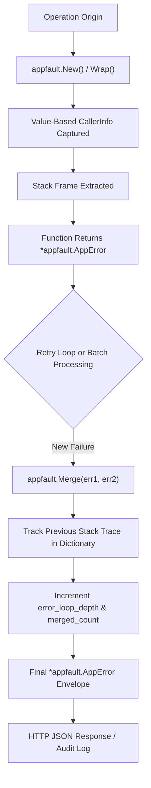

# Appfault Package Architecture & Specification

## Overview

The `appfault` package provides the universal structured error and fault representation standard (`*appfault.AppError`) across the Go repository. It guarantees immutability, zero-allocation value-based caller telemetry, complete stack trace capture across nested loops and error merges, and null safety.

---

## Architectural Principles

1. **Immutability Principle:**
   `*appfault.AppError` is strictly immutable. Once constructed, no internal field can be mutated in-place. Methods that modify state (such as `.WithDetail()`, `.WithCaller()`, or `.WithField()`) return a brand-new cloned instance, ensuring safe concurrent sharing across goroutines.
2. **Value-Based `CallerInfo`:**
   Telemetry and origin metadata (`File`, `Line`, `Function`, `Package`) are encapsulated in a value-type `CallerInfo` struct rather than heavy pointers, eliminating pointer dereferencing overhead and garbage collection pressure.
3. **Loop Stack Trace Tracking & Error Merging:**
   When errors are merged (`appfault.Merge(firstErr, secondErr)`), the previous error's full stack trace and cause chain are preserved in metadata dictionary entries (`previous_stack_trace`, `merged_error_count`, `error_loop_depth`). This provides complete historical lineage across retry loops and batch pipelines without losing origin diagnostics.
4. **Defensive Null-Safety:**
   All methods on `*AppError` safely handle nil receivers. Calling `.IsNull()`, `.IsEmpty()`, `.HasZero()`, `.HasNullError()`, `.HasError()`, `.Error()`, `.StatusCode()`, `.Clone()`, or `.Concat()` on a `(*AppError)(nil)` pointer will never panic.
5. **Universal Serialization Envelopes:**
   Produces standardized JSON (`.ToJSON()`, `.JsonString()`, `.PrettyJsonString()`) and YAML representations conforming to enterprise API response schemas:
   ```json
   {
     "status": false,
     "statusCode": 400,
     "type": "Validation",
     "code": 2,
     "message": "username cannot be empty",
     "file": "pkg/auth/login.go",
     "line": 42
   }
   ```

---

## Error Propagation & Merging Diagram



---

## AppError Memory Hierarchy (ASCII Layout)

```
+-------------------------------------------------------------------------+
|                         *appfault.AppError                              |
|  - message: "database query timed out"                                 |
|  - errType: errtype.Timeout (code: 8, status: 504)                      |
|  - caller: CallerInfo { File: "user_dao.go", Line: 88, Fn: "FindByID" } |
|  - details: map[string]any {                                            |
|      "query": "SELECT * FROM users WHERE id = $1",                      |
|      "duration_ms": 5002,                                               |
|      "previous_stack_trace": "...",                                     |
|      "error_loop_depth": 2                                              |
|    }                                                                    |
|  - cause: original underlying error                                     |
|  - stack: []uintptr call stack frames                                   |
+-------------------------------------------------------------------------+
```

---

## Core API & Usage Patterns

### 1. Construction & Wrapping
```go
// New error with classification
err := appfault.New(errtype.Validation, "invalid email format")

// Wrapping underlying standard error
err = appfault.Wrap(errtype.IO, ioErr, "failed to read configuration")

// Adding contextual diagnostics (returns new immutable clone)
err = err.WithDetail("userId", "usr-9901").WithDetail("tier", "pro")
```

### 2. Null-Safe Receiver Checking
```go
var err *appfault.AppError = nil

// Guaranteed panic-free checks:
if err.IsNull() {
    // True: receiver is nil
}

if !err.HasError() {
    // True: represents successful operation
}
```

### 3. Merging with Historical Stack Tracking
```go
var accumulated *appfault.AppError

for attempt := 1; attempt <= 3; attempt++ {
    err := executeOperation()
    if err != nil {
        accumulated = appfault.Merge(accumulated, err)
    }
}

if accumulated != nil {
    // accumulated contains previous_stack_trace and full causal lineage
}
```

---

## Result Containers

The companion types `Result[T]`, `ResultSlice[T]`, and `ResultMap[K, V]` provide ergonomic value-or-error monadic wrappers:
```go
res := result.Success(user)
if res.IsFailed() {
    return res.Fault()
}

val := res.Value()
```
