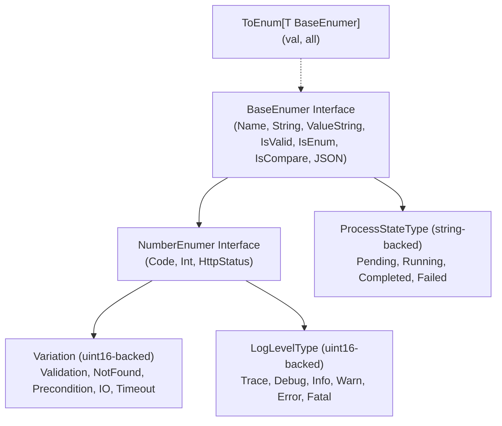

# Errtype Package Architecture & Specification

## Overview

The `errtype` package provides strongly-typed enumerations, standardized error classification codes, and universal enum interfaces (`BaseEnumer`, `NumberEnumer` with backward-compatible aliases `BaseEnum`, `NumberEnum`) across the repository. It includes automated Python tooling (`03-ai-scripts/30-enum-generator.py`) to generate robust, JSON-compatible Go enums.

---

## Architectural Principles

1. **`BaseEnumer` & `NumberEnumer` Universal Contracts:**
   All enum types adhere to standard Go interfaces conforming to the idiomatic `er` suffix convention:
   - `BaseEnumer` (alias `BaseEnum`): `Name() string`, `String() string`, `ValueString() string`, `IsValid() bool`, `IsEnum() bool`, `IsCompare() bool`, `MarshalJSON()`, `UnmarshalJSON()`.
   - `NumberEnumer` (alias `NumberEnum`): Extends `BaseEnumer` with numeric accessors: `Code() uint16`, `Int() int`, and `HttpStatus() int`.
2. **String & Numeric Implementations:**
   - **String-backed enums** (e.g. `ProcessStateType`): Backed by `string`, providing zero-allocation human-readable string values (`Pending`, `Running`, `Completed`, `Failed`, `Cancelled`).
   - **Number-backed enums** (e.g. `Variation`, `LogLevelType`): Backed by `uint16`, providing efficient integer serialization and HTTP status mapping.
3. **Generic Lookup Helper (`ToEnum`):**
   A type-safe generic helper allows looking up any `BaseEnumer` from a string case-insensitively:
   ```go
   found, ok := errtype.ToEnum("running", errtype.AllProcessStates())
   ```
4. **Automated Enum Generation:**
   Enums are generated and synchronized using `03-ai-scripts/30-enum-generator.py`, guaranteeing complete boilerplate implementation (registries, stringifiers, JSON handlers, parse functions, slice generators).

---

## Enum Architecture & Hierarchy Diagram



---

## Enum Memory Layout & Serialization (ASCII Layout)

```
+-------------------------------------------------------------------------+
|                       BaseEnum Interface Contract                       |
|  - Name() string: "Running"                                             |
|  - ValueString() string: "Running" (string) or "2" (numeric)            |
|  - IsValid() bool: validated against internal registry map             |
|  - IsEnum() bool: true if registered                                    |
|  - MarshalJSON() ([]byte, error): JSON-ready representation             |
|  - UnmarshalJSON(data []byte) error: string or integer deserializer    |
+-------------------------------------------------------------------------+
                                    |
                    +---------------+---------------+
                    |                               |
    [String-backed Enum]                    [Number-backed Enum]
    type ProcessStateType string            type Variation uint16
    - JSON: `"Running"`                     - JSON: `2` or `"Validation"`
    - Memory: 16-byte string header         - Memory: 2-byte unsigned integer
```

---

## Core Types & API

### 1. `Variation` (Error Type Code)
Standard classification codes mapped to HTTP status codes:
| Variation | Code | Name | HTTP Status |
| :--- | :--- | :--- | :--- |
| `None` | 0 | None | 200 OK |
| `Generic` | 1 | Generic | 500 Internal Server Error |
| `Validation` | 2 | Validation | 400 Bad Request |
| `NotFound` | 3 | NotFound | 404 Not Found |
| `Precondition` | 4 | Precondition | 400 Bad Request |
| `Execution` | 5 | Execution | 500 Internal Server Error |
| `Database` | 6 | Database | 500 Internal Server Error |
| `Network` | 7 | Network | 500 Internal Server Error |
| `Timeout` | 8 | Timeout | 504 Gateway Timeout |
| `IO` | 9 | IO | 500 Internal Server Error |
| `Unauthorized` | 10 | Unauthorized | 401 Unauthorized |
| `Forbidden` | 11 | Forbidden | 403 Forbidden |
| `Internal` | 12 | Internal | 500 Internal Server Error |
| `Unknown` | 13 | Unknown | 500 Internal Server Error |
| `Serialization` | 14 | Serialization | 400 Bad Request |

### 2. `ProcessStateType` (String-backed Lifecycle Enum)
```go
state := errtype.ProcessStateRunning

// Inspection
if state.IsValid() {
    fmt.Printf("State: %s\n", state.Name())
}

// Slice of all states
all := errtype.AllProcessStates()

// Generic lookup
found, ok := errtype.ToEnum("completed", all)
```

### 3. `LogLevelType` (Number-backed Logger Level Enum)
```go
level := errtype.LogLevelInfo
fmt.Printf("Level Code: %d, Name: %s\n", level.Code(), level.Name())
```

---

## Automated Enum Generator CLI

Generate new enums or regenerate existing ones using the Python script `03-ai-scripts/30-enum-generator.py`:

```bash
# Generate a string-backed enum
python 03-ai-scripts/30-enum-generator.py \
  --name DeploymentStatus \
  --type string \
  --package errtype \
  --members Pending InProgress Succeeded Failed RolledBack \
  --out 04-code/golang/pkg/errtype/deployment_status_enum.go

# Generate a uint16-backed number enum
python 03-ai-scripts/30-enum-generator.py \
  --name PriorityLevel \
  --type int \
  --package errtype \
  --members Low Medium High Critical \
  --out 04-code/golang/pkg/errtype/priority_level_enum.go
```
