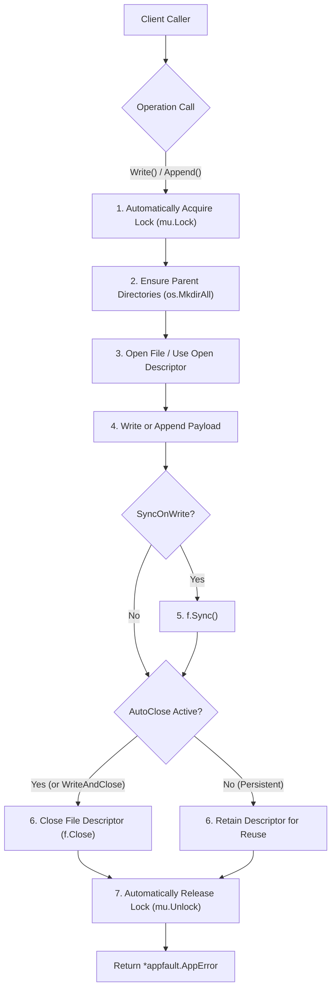

# Fileutil Package Architecture & Specification

## Overview

The `fileutil` package provides enterprise-grade filesystem utilities, behavior-shifting file writers, continuous append loggers, file-specific auto-locking handlers (`BoundFileWriter`), atomic swap operations, and granular file permission management.

---

## Architectural Principles

1. **Behavior-Shifting `FileWriter`:**
   Enables runtime switching of writing strategies via `.SetMode(mode)` without re-instantiating file handles:
   - `FileWriteModeDirect` (default): In-place streaming directly to the target file.
   - `FileWriteModeAtomic`: Writes completely to a temporary file in the same directory, flushes buffers, and atomically swaps it using `os.Rename`. Prevents corrupted partial writes during system crashes.
   - `FileWriteModeTruncate`: Truncates existing file content prior to writing.
2. **File-Specific Auto-Locking `BoundFileWriter`:**
   A reusable, file-bound object (`BoundFileWriter`, aliased as `SpecificFileWriter` and `FileHandler`) designed for operations on a specific file:
   - **Automatic Locking & Unlocking:** Every `.Write()`, `.WriteString()`, `.Append()`, and `.AppendString()` automatically acquires the mutex lock and releases it upon completion.
   - **Immediate Auto-Closing vs Persistent Reuse:**
     - In **AutoClose mode** (`.SetAutoClose(true)` or via `.WriteAndClose()` / `.AppendAndClose()`), the file descriptor is opened, written/appended to, synced, and closed immediately after writing is done. This prevents open file descriptor leaks when writes are infrequent.
     - In **Persistent mode** (default `autoClose: false`), the open file descriptor is retained across calls for maximum throughput and closed explicitly via `.Close()`.
   - **Transactional Batch Blocks (`WithLock`):** Callers can execute multiple writes and appends atomically under a single lock without interleaving:
     ```go
     err := writer.WithLock(ctx, func(w *fileutil.BoundFileWriter) *appfault.AppError {
         _ = w.AppendLocked(ctx, []byte("line 1\n"))
         _ = w.AppendLocked(ctx, []byte("line 2\n"))
         return nil
     })
     ```
   - **Manual Locking (`sync.Locker`):** Exposes `.Lock()`, `.Unlock()`, `.WriteLocked()`, and `.AppendLocked()`.
   - **Diagnostic Telemetry:** Atomic counters `.BytesWritten()`, `.BytesAppended()`, and `.WriteCount()`.
3. **Dedicated Continuous `FileAppender`:**
   Designed for persistent append-only workflows (journals, WALs, audit logs). Provides automatic parent directory creation, persistent file handles, thread safety, auto-syncing, and atomic byte counters (`.BytesAppended()`).
4. **Standard Library Compatibility via `StdWriter()` and `StdAppender()`:**
   All writer types implement `streamwriter.Writer[[]byte]` directly returning `*appfault.AppError`, and offer `.StdWriter() io.WriteCloser` adapters for seamless integration with `io.Copy`, `fmt.Fprintf`, and standard `log.SetOutput`.
5. **Strict Permission Types (`FilePermType`):**
   Strongly-typed bitmasks (`FilePermStandard`, `FilePermExecutable`, `FilePermReadOnly`, `FilePermOwnerOnly`, etc.) with octal parsing and inspection helpers (`.IsReadable()`, `.IsWritable()`, `.IsExecutable()`).

---

## BoundFileWriter Auto-Lock & Auto-Close Flow



---

## BoundFileWriter Lifecycle Architecture (ASCII Layout)

```
+-------------------------------------------------------------------------+
|                       BoundFileWriter / FileHandler                     |
|  - path: "data/state.json" (specific bound file)                        |
|  - mode: Direct | Atomic | Truncate                                     |
|  - perm: FilePermStandard (0644)                                        |
|  - autoClose: true (close on write) | false (reusable persistent handle)|
|  - mu: sync.Mutex (automatic or manual locking)                         |
|  - counters: bytesWritten, bytesAppended, writeCount                    |
+-------------------------------------------------------------------------+
                                    |
     +------------------------------+------------------------------+
     |                              |                              |
[Write Operations]          [Append Operations]          [Transactional Batch]
- .Write(ctx, data)         - .Append(ctx, data)         - .WithLock(ctx, fn)
- .WriteString(ctx, text)   - .AppendString(ctx, text)   - .Lock() / .Unlock()
- .WriteAndClose(ctx, data) - .AppendAndClose(ctx, data) - .WriteLocked(ctx, data)
- (auto lock/unlock)        - (auto lock/unlock)         - .AppendLocked(ctx, data)
     |                              |                              |
     +------------------------------+------------------------------+
                                    |
                    +---------------+---------------+
                    |                               |
          [AutoClose: true]               [AutoClose: false]
          - f.Close() immediately         - Retain open handle
          - Zero dangling file handles    - High-throughput streaming
          - Perfect for periodic writes   - Call .Close() when finished
```

---

## Core Types & API

### 1. `BoundFileWriter` (File-Specific Auto-Locking Writer/Appender)
```go
// 1. Creation bound to a specific file
writer := fileutil.NewBoundFileWriter("var/data/state.log")

// 2. Automatic lock write and append
err := writer.WriteString(ctx, "State: Initialized\n")
err = writer.AppendString(ctx, "Event: User logged in\n")

// 3. Configure auto-close after write (closes handle immediately)
writer.SetAutoClose(true)
err = writer.AppendString(ctx, "Event: Periodic checkpoint\n")
// File descriptor is now closed; no lingering file handle

// 4. Transactional lock block (multiple writes under one lock)
err = writer.WithLock(ctx, func(w *fileutil.BoundFileWriter) *appfault.AppError {
    _ = w.AppendLocked(ctx, []byte("--- Batch Start ---\n"))
    _ = w.AppendLocked(ctx, []byte("Record: 101\n"))
    _ = w.AppendLocked(ctx, []byte("--- Batch End ---\n"))
    return nil
})

// 5. One-off write and close
err = writer.WriteAndClose(ctx, []byte("Final Snapshot"))

// 6. Query diagnostics
fmt.Printf("Writes: %d, Written: %d bytes, Appended: %d bytes\n",
    writer.WriteCount(), writer.BytesWritten(), writer.BytesAppended())
```

### 2. `FileWriter` (Behavior Shifting)
```go
writer := fileutil.NewFileWriterEngine("configs/app.json")

// Direct write
_ = writer.WriteString(ctx, "mode: initial\n")

// Shift to atomic mode (writes to temp file, fsyncs, renames)
writer.SetMode(fileutil.FileWriteModeAtomic)
_ = writer.WriteString(ctx, "mode: atomic-update\n")

// Shift to truncate with fsync
writer.SetMode(fileutil.FileWriteModeTruncate).SetSyncOnWrite(true)
_ = writer.WriteString(ctx, "mode: clean-state\n")
```

### 3. `FileAppender` (Dedicated Continuous WAL/Journal)
```go
appender := fileutil.NewFileAppender("var/log/audit.log", fileutil.FilePermStandard)
appender.SetAutoSync(true)

_ = appender.AppendString(ctx, "EVENT: Transaction 9912 processed\n")
bytesAppended := appender.BytesAppended()
_ = appender.Close()
```

### 4. Standard Library Adapters (`io.WriteCloser`)
```go
// Adapters for io.Copy, fmt.Fprintf, log.SetOutput
stdWriter := writer.StdWriter()
stdAppender := writer.StdAppender()
```

---

## Usage Example

```go
package main

import (
    "context"
    "fmt"
    "path/filepath"

    "coding-guidelines/common/pkg/fileutil"
)

func main() {
    ctx := context.Background()
    logPath := filepath.Join(".", "tmp-data", "service.log")

    // 1. Initialize file-specific BoundFileWriter
    writer := fileutil.NewBoundFileWriter(logPath)

    // Write header with auto-lock
    if err := writer.WriteString(ctx, "=== SERVICE AUDIT LOG ===\n"); err != nil {
        panic(err)
    }

    // Append event with auto-lock
    if err := writer.AppendString(ctx, "INFO: Worker pool initialized\n"); err != nil {
        panic(err)
    }

    // Enable auto-close so file handle closes immediately after writing
    writer.SetAutoClose(true)
    if err := writer.AppendString(ctx, "INFO: Checkpoint flushed to disk\n"); err != nil {
        panic(err)
    }

    // Perform atomic multi-step batch under a single lock
    err := writer.WithLock(ctx, func(w *fileutil.BoundFileWriter) *fileutil.BoundFileWriter {
        _ = w.AppendLocked(ctx, []byte("TX 101: START\n"))
        _ = w.AppendLocked(ctx, []byte("TX 101: COMMIT\n"))
        return nil
    })
    if err != nil {
        panic(err)
    }

    fmt.Printf("Total operations: %d, Appended bytes: %d\n",
        writer.WriteCount(), writer.BytesAppended())
}
```
