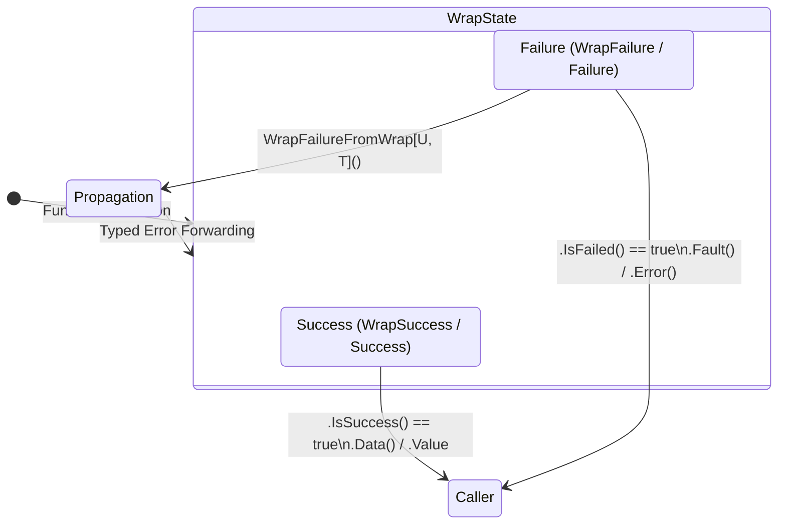

# Package `result`: Generic Monadic Result Container (`result.Wrap[T]`)

`coding-guidelines/common/pkg/result` provides the canonical monadic result container `result.Wrap[T]` for all Go codebases across the repository.

---

## 1. Overview & Core Motivation

In Go, functions that can fail traditionally return `(T, error)` tuples. While standard, this pattern has significant drawbacks in enterprise and distributed systems:
1. **Unchecked Nil Values:** Callers frequently forget to check `err != nil` before dereferencing `T`, leading to runtime panics.
2. **Context Loss During Propagation:** Raw Go errors require manual wrapping at each layer, often causing duplicated prefix clutter (`"failed to query: failed to connect: dial tcp..."`).
3. **Package Stutter:** When packages name their result type `Result[T]`, callers are forced to write `result.Result[T]`. This stutter is verbose and anti-idiomatic.

`pkg/result` resolves these issues by defining **`result.Wrap[T]`** as the primary standard:

```go
// Clean, stutter-free return signature:
func FindUser(ctx context.Context, id int64) result.Wrap[*User] {
    if id <= 0 {
        return result.WrapFailureWithId[*User](errtype.Validation, "user id must be positive")
    }

    user, err := db.GetUser(ctx, id)
    if err != nil {
        return result.WrapFailureWithCause[*User](errtype.Database, err, "database query failed")
    }

    return result.WrapSuccess(user)
}
```

---

## 2. Architecture & State Diagram

A `result.Wrap[T]` container is always in one of two states: **Success** (containing payload `Value` of type `T`) or **Failure** (containing structured `*appfault.AppError`).



---

## 3. Type Definitions

```go
// Wrap represents the canonical monadic result container.
type Wrap[T any] = appfault.Result[T]

// Result is maintained as an alias for backward compatibility.
type Result[T any] = Wrap[T]
```

---

## 4. Constructor Catalog

| Constructor | Signature | Use Case |
| :--- | :--- | :--- |
| `WrapSuccess[T]` | `(data T) Wrap[T]` | Return successful computation with payload |
| `Success[T]` | `(data T) Wrap[T]` | Short-form alias for `WrapSuccess` |
| `WrapFailure[T]` | `(err *appfault.AppError) Wrap[T]` | Wrap an existing structured `*AppError` |
| `Failure[T]` | `(err *appfault.AppError) Wrap[T]` | Short-form alias for `WrapFailure` |
| `WrapFailureWithId[T]` | `(id errtype.Variation, msg string) Wrap[T]` | Create failure directly from enum variation |
| `FailureWithId[T]` | `(id errtype.Variation, msg string) Wrap[T]` | Short-form alias for `WrapFailureWithId` |
| `WrapFailureWithCause[T]` | `(id, cause error, msg) Wrap[T]` | Create failure with root cause and enum variation |
| `FailureWithCause[T]` | `(id, cause error, msg) Wrap[T]` | Short-form alias for `WrapFailureWithCause` |
| `WrapFailureFromError[T]` | `(err *appfault.AppError) Wrap[T]` | Wrap `*AppError` into typed `Wrap[T]` |
| `WrapFailureFromWrap[T, U]` | `(failed Wrap[U]) Wrap[T]` | Cross-type error propagation (`Wrap[U]` -> `Wrap[T]`) |
| `FailureFromWrap[T, U]` | `(failed Wrap[U]) Wrap[T]` | Short-form alias for `WrapFailureFromWrap` |

---

## 5. Usage Patterns

### 5.1 Returning Results
```go
import (
    "coding-guidelines/common/pkg/errtype"
    "coding-guidelines/common/pkg/result"
)

func ReadConfig(path string) result.Wrap[*Config] {
    if len(path) == 0 {
        return result.WrapFailureWithId[*Config](errtype.Validation, "config path cannot be empty")
    }

    data, err := os.ReadFile(path)
    if err != nil {
        return result.WrapFailureWithCause[*Config](errtype.IO, err, "failed to read config file")
    }

    var cfg Config
    if err := json.Unmarshal(data, &cfg); err != nil {
        return result.WrapFailureWithCause[*Config](errtype.Serialization, err, "invalid json in config")
    }

    return result.WrapSuccess(&cfg)
}
```

### 5.2 Handling Results & Zero-Rewrap Propagation
```go
func LoadAndApply(path string) result.Wrap[bool] {
    cfgRes := ReadConfig(path)
    if cfgRes.IsFailed() {
        // Propagate the exact fault without losing caller information or error context
        return result.WrapFailureFromWrap[bool](cfgRes)
    }

    cfg := cfgRes.Data()
    applyConfig(cfg)

    return result.WrapSuccess(true)
}
```

### 5.3 Formatting & Terminal Output
`result.Wrap[T]` exposes rich formatting methods:
```go
res := ReadConfig("config.json")

// Default formatting:
// ✅ [OK] <payload> OR ❌ [ERR] <error message>
fmt.Println(res.Format(nil))

// Custom presentation:
formatted := res.Format(func(r result.Wrap[*Config]) string {
    if r.IsFailed() {
        return fmt.Sprintf("CRITICAL ALERT: %s", r.Fault().Message())
    }
    return fmt.Sprintf("Loaded version %s", r.Data().Version)
})
```

---

## 6. Guidelines Alignment

- **No Package Stutter:** Always use `result.Wrap[T]` in exported function signatures.
- **Implicit Boolean Checks:** Always evaluate `.IsSuccess()` or `.IsFailed()` implicitly (`if res.IsFailed() { ... }`).
- **Structured Error Flow:** Wrap raw errors immediately at the I/O boundary using `result.WrapFailureWithCause`.
- **Zero Loss Propagation:** Use `result.WrapFailureFromWrap` when passing failures across architectural layers.
