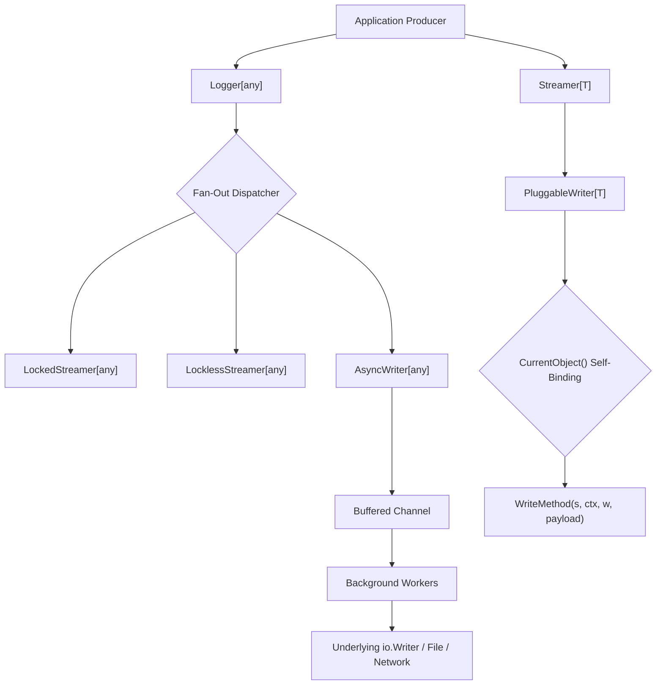

# Streamwriter Package Architecture & Specification

## Overview

The `streamwriter` package provides a unified, high-performance streaming, logging, and serialization engine for Go applications. It establishes strict contracts for generic stream emission, thread-safe synchronization, non-blocking asynchronous buffering, and reflection-driven deserialization.

---

## Architectural Principles

1. **Streamer as First Parameter:** All pluggable write closures define the active streamer as their first argument:
   ```go
   WriteMethod: func(s Streamer[T], ctx context.Context, w *PluggableWriter[T], payload T) *appfault.AppError
   ```
2. **Current Object Self-Binding:** Every pluggable writer binds to its owning streamer reference via `.SetCurrentObject(streamer)` and `.CurrentObject()`.
3. **Dual Concurrency Models:**
   - `LockedStreamer[T]`: Thread-safe execution using internal mutex synchronization.
   - `LocklessStreamer[T]`: Direct lock-free execution designed for single-threaded or thread-confined high-throughput pipelines.
4. **Non-Blocking Asynchronous Buffering:** `AsyncWriter[T]` queues payloads into buffered channels with worker pools, drop-on-full safety policies, and on-error failure dispatching.
5. **Defensive Null-Safety & Immutability:** `Bytes[T]` and `JsonResult` provide complete protection against nil receivers, offering `.IsNull()`, `.IsEmpty()`, `.Clone()`, and `.Concat()`.
6. **ReflectConverter Singleton:** Dynamic JSON deserialization, pointer unwrapping, slice-to-interface conversion, and runtime type inspection.

---

## Workflow Diagram



---

## Component Architecture (ASCII Layout)

```
+-------------------------------------------------------------------------+
|                              Logger[T]                                  |
|   .Trace()  .Debug()  .Info()  .Warn()  .Error()  .Fatal()              |
+-------------------------------------------------------------------------+
                                    |
                    +---------------+---------------+
                    |                               |
+-----------------------------------+   +---------------------------------+
|       LockedStreamer[T]           |   |       LocklessStreamer[T]       |
|  - sync.RWMutex synchronization   |   |  - Zero-locking fast path       |
|  - Compound batch operations      |   |  - Memory-buffer optimized      |
+-----------------------------------+   +---------------------------------+
                    |                               |
                    +---------------+---------------+
                                    |
                                    v
+-------------------------------------------------------------------------+
|                         PluggableWriter[T]                              |
|  - Name() string                                                        |
|  - Destination() io.Writer                                              |
|  - CurrentObject() Streamer[T]                                          |
|  - WriteMethod: func(s, ctx, w, payload) *appfault.AppError             |
+-------------------------------------------------------------------------+
                                    |
                    +---------------+---------------+
                    |                               |
+-----------------------------------+   +---------------------------------+
|          AsyncWriter[T]           |   |       ReflectConverter          |
|  - channel buffered queue         |   |  - UnmarshalTo(data, target)    |
|  - drop-on-full policies          |   |  - UnmarshalToType[T](data)     |
|  - on-error callback hooks        |   |  - ReducePointer(multiPtr)      |
+-----------------------------------+   +---------------------------------+
```

---

## Core Interfaces & Types

### 1. `Streamer[T]` & `Writer[T]`
```go
type Writer[T any] interface {
    Name() string
    Write(ctx context.Context, payload T) *appfault.AppError
}

type Streamer[T any] interface {
    Writer[T]
    CurrentObject() Streamer[T]
    SetCurrentObject(obj Streamer[T]) Streamer[T]
    Writers() []Writer[T]
    AddWriter(w Writer[T]) Streamer[T]
    Flush(ctx context.Context) *appfault.AppError
    Close() *appfault.AppError
}
```

### 2. `PluggableWriter[T]`
```go
type PluggableWriter[T any] struct { ... }

func NewPluggableWriter[T any](opts WriterOptions[T]) *PluggableWriter[T]
```
Allows dynamic shifting of writing algorithms at runtime without subclassing.

### 3. `Bytes[T]` & `JsonResult`
- **`Bytes[T]`**: Encapsulates formatted raw bytes together with strongly-typed generic payload `T`, status boolean, status code, and `*appfault.AppError`.
- **`JsonResult`**: Self-contained JSON envelope with pretty printing (`.Pretty()`), unmarshaling (`.Unmarshal(&target)`), and null checking (`.IsNull()`).

### 4. `Reflect` Singleton
```go
// Dynamic unmarshaling directly into target pointer
err := streamwriter.Reflect.UnmarshalTo(data, &user)

// Generic unmarshaling into new instance
user, err := streamwriter.UnmarshalToType[User](data)

// Multi-level pointer unwrapping (***T -> T)
val := streamwriter.Reflect.ReducePointer(ptrChain)

// Homogeneous or heterogeneous slice to []any
infs := streamwriter.Reflect.ToInterfaces(slice)
```

---

## Usage Example

```go
package main

import (
    "context"
    "fmt"
    "os"

    "coding-guidelines/common/pkg/appfault"
    "coding-guidelines/common/pkg/streamwriter"
)

func main() {
    ctx := context.Background()

    // 1. Construct pluggable writer with streamer as first parameter
    pw := streamwriter.NewPluggableWriter[string](streamwriter.WriterOptions[string]{
        Name:        "console-writer",
        Destination: os.Stdout,
        WriteMethod: func(s streamwriter.Streamer[string], ctx context.Context, w *streamwriter.PluggableWriter[string], payload string) *appfault.AppError {
            fmt.Fprintf(w.Destination(), "[%s] %s\n", w.Name(), payload)
            return nil
        },
    })

    // 2. Wrap in thread-safe LockedStreamer
    streamer := streamwriter.NewLockedStreamer[string](streamwriter.LockedOptions[string]{
        Name: "main-streamer",
    })
    streamer.AddWriter(pw)

    // 3. Emit payload
    if err := streamer.Write(ctx, "System initialized successfully"); err != nil {
        fmt.Fprintf(os.Stderr, "Error: %v\n", err)
    }
}
```
