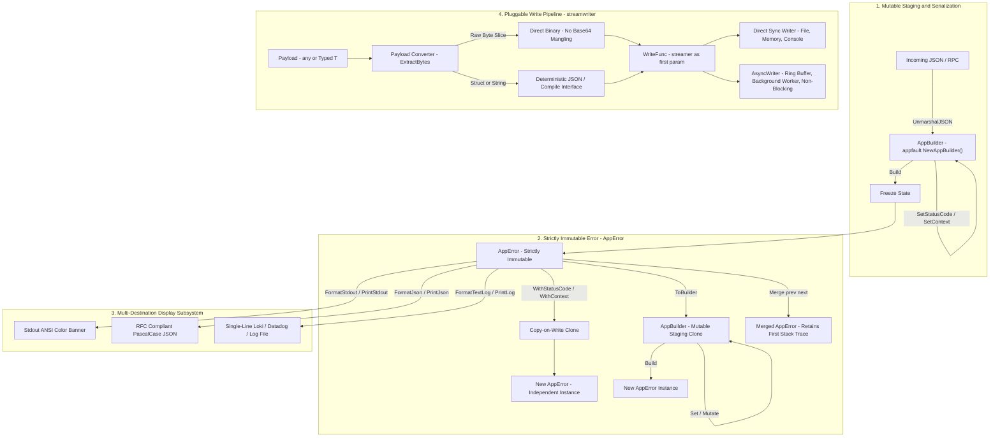

# Golang Architecture & Common Packages

This directory contains the production-grade Go core packages adhering strictly to the Prompt Architect coding guidelines.

## Architecture Flow Overview

For the complete standalone reference asset, see [Architecture Flow Diagram](assets/architecture-flow.md).

### Mermaid Flowchart



### ASCII Architecture Flow Diagram (100% Viewer Visible)

```text
+-----------------------------------------------------------------------------------------+
|                        1. MUTABLE STAGING & NETWORK SERIALIZATION                       |
|                                                                                         |
|   Incoming JSON / RPC ---> json.Unmarshal() ---> AppBuilder (appfault.NewAppBuilder())  |
|                                                          |                              |
|                                                          v .Build()                     |
+----------------------------------------------------------+------------------------------+
                                                           |
                                                           v
+-----------------------------------------------------------------------------------------+
|                        2. STRICTLY IMMUTABLE ERROR (*AppError)                          |
|                                                                                         |
|   +---------------------------------------------------------------------------------+   |
|   | struct AppError {                                                               |   |
|   |     errType  errtype.ErrorType  // 16-bit UTF-16 enum code                      |   |
|   |     message  string             // Human readable description                   |   |
|   |     caller   CallerInfo         // Value-based caller (file, line, func)        |   |
|   |     status   int                // HTTP status code (e.g. 404, 500)             |   |
|   |     context  *ContextMap        // Immutable contextual key-value pairs         |   |
|   |     stack    StackTrace         // Immediate capture via runtime.Callers        |   |
|   | }                                                                               |   |
|   +---------------------------------------------------------------------------------+   |
|           |                                       |                          |          |
|           v Derivation (Copy-on-Write)            v Mutation Staging         v Merge    |
|   .WithStatusCode(422)                    .ToBuilder()              Merge(prev, next)   |
|   .WithContext(k, v)                              |                          |          |
|           |                                       v                          v          |
|   New independent *AppError               AppBuilder.Build()        Retains first error |
|   (Original error untouched)              New *AppError instance    stack trace & count |
+-----------------------------------------------------------------------------------------+
                               |
           +-------------------+-------------------+
           |                                       |
           v                                       v
+-----------------------+   +-------------------------------------------------------------+
|  3. PRESENTATION      |   |  4. PLUGGABLE WRITE PIPELINE (pkg/streamwriter)             |
|                       |   |                                                             |
| .FormatStdout()       |   |   Payload (any or typed T)                                  |
|   -> ANSI colored banner  |          |                                                  |
| .FormatJson()         |   |          v                                                  |
|   -> PascalCase RFC JSON  |   PayloadConverter.ExtractBytes()                           |
| .FormatTextLog()      |   |   +-----------------------------------------------------+   |
|   -> Single line log  |   |   | []byte -> Direct binary (NO Base64 mangling)        |   |
+-----------------------+   |   | string -> Clean bytes (NO extra quotes)             |   |
                            |   | Struct -> Deterministic JSON / Compile() interface  |   |
                            |   +-----------------------------------------------------+   |
                            |          |                                                  |
                            |          v                                                  |
                            |   WriteFunc(streamer, ctx, writer, payload)                 |
                            |          |                                                  |
                            |          +--------------------------+                       |
                            |          |                          |                       |
                            |          v                          v                       |
                            |   Sync Writers:              Async Writers:                 |
                            |   - FileWriter (Atomic)      - AsyncWriter[T]               |
                            |   - MemoryWriter (Buffer)    - AnyAsyncWriter (Non-generic) |
                            |   - ConsoleWriter (Stderr)   - Ring/Channel Buffer Worker   |
                            +-------------------------------------------------------------+
```

## Quick Reference Links

- **Universal Writer & Logging Guide:** [universal-writer-and-logging-guide.md](universal-writer-and-logging-guide.md)
- **Authoritative Technical Guide:** [architecture-guide.md](architecture-guide.md)
- **Visual Diagram Asset:** [assets/architecture-flow.md](assets/architecture-flow.md)
- **Executable Examples:** [examples/streamwriter_examples.go](examples/streamwriter_examples.go)
- **Test Suites:** Run `go test ./...` in this folder.

## Core Packages

| Package | Path | Purpose |
| :--- | :--- | :--- |
| `errtype` | `pkg/errtype` | Extensible 16-bit (`uint16`) UTF-16 code error variation enum. |
| `appfault` | `pkg/appfault` | Strictly immutable structured error type (`*AppError`), `AppBuilder` staging, error merging, null safety, and multi-destination formatters (`FormatStdout`, `FormatJson`, `FormatTextLog`). |
| `result` | `pkg/result` | Monadic result container (`result.Wrap[T]`) eliminating `(T, error)` tuples with full null safety. |
| `fileutil` | `pkg/fileutil` | Safe filesystem I/O, enum permissions, atomic swapping (`WriteAtomic`), and chunked streaming (`ReadChunked`). |
| `streamwriter` | `pkg/streamwriter` | Pluggable write engine, thread-safe streamers (`sync.Locker`), payload intelligence without Base64 mangling, async non-blocking writer (`AsyncWriter[T]`), and composite logger. |
