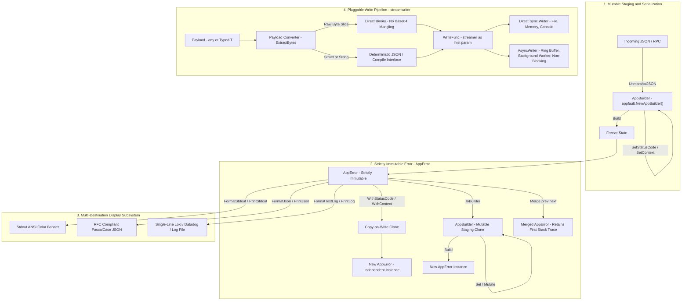

# Universal Writer and Logging Architectural Guide

This guide provides a comprehensive, top-to-bottom reference for configuring, creating, and executing writers, loggers, streamers, and error formatters within the Prompt Architect Go core ecosystem (`04-code/golang/pkg/`).

---

## 1. Architectural Overview & Design Decisions

The logging, streaming, and error pipeline is built upon four foundational tenets:

1. **Strict Immutability & Value Semantics:** `*appfault.AppError` is strictly immutable once built. Derivations (`WithStatusCode`, `WithContext`) use copy-on-write semantics. Origin sites (`CallerInfo`) are stored by value to eliminate heap allocations and pointer mutability.
2. **First-Parameter Streamer Signature:** Pluggable write functions (`WriteFunc[T]`) accept the attached streamer as their very first parameter, followed by the active context, the writer reference itself, and the payload:
   ```go
   type WriteFunc[T any] func(streamer Streamer[T], ctx context.Context, writer *PluggableWriter[T], payload T) *appfault.AppError
   ```
3. **Payload Intelligence (No Base64 Mangling):** `PayloadConverter.ExtractBytes(payload)` preserves raw `[]byte` slices directly into binary streams without Base64 encoding corruptions, extracts clean strings without extra quotation marks, and leverages `Compilable` or deterministic JSON for structs.
4. **Comprehensive Receiver Null-Safety:** Calling inspection, formatting, cloning, or concatenating methods on a `nil *AppError` or an empty monadic `Result[T]` never panics or throws.

### 1.1 Mermaid Flowchart



### 1.2 ASCII Architecture Flow Diagram (100% Viewer Visible)

```text
+-----------------------------------------------------------------------------------------+
|                        1. MUTABLE STAGING & NETWORK SERIALIZATION                       |
|                                                                                         |
|   Incoming JSON / RPC ---> json.Unmarshal() ---> AppBuilder (appfault.NewAppBuilder())  |
|                                                          |                              |
|                                                          v .Build()                     |
+----------------------------------------------------------+------------------------------+
                                                           |
                                                           v
+-----------------------------------------------------------------------------------------+
|                        2. STRICTLY IMMUTABLE ERROR (*AppError)                          |
|                                                                                         |
|   +---------------------------------------------------------------------------------+   |
|   | struct AppError {                                                               |   |
|   |     errType  errtype.ErrorType  // 16-bit UTF-16 enum code                      |   |
|   |     message  string             // Human readable description                   |   |
|   |     caller   CallerInfo         // Value-based caller (file, line, func)        |   |
|   |     status   int                // HTTP status code (e.g. 404, 500)             |   |
|   |     context  *ContextMap        // Immutable contextual key-value pairs         |   |
|   |     stack    StackTrace         // Immediate capture via runtime.Callers        |   |
|   | }                                                                               |   |
|   +---------------------------------------------------------------------------------+   |
|           |                                       |                          |          |
|           v Derivation (Copy-on-Write)            v Mutation Staging         v Merge    |
|   .WithStatusCode(422)                    .ToBuilder()              Merge(prev, next)   |
|   .WithContext(k, v)                              |                          |          |
|           |                                       v                          v          |
|   New independent *AppError               AppBuilder.Build()        Retains first error |
|   (Original error untouched)              New *AppError instance    stack trace & count |
+-----------------------------------------------------------------------------------------+
                               |
           +-------------------+-------------------+
           |                                       |
           v                                       v
+-----------------------+   +-------------------------------------------------------------+
|  3. PRESENTATION      |   |  4. PLUGGABLE WRITE PIPELINE (pkg/streamwriter)             |
|                       |   |                                                             |
| .FormatStdout()       |   |   Payload (any or typed T)                                  |
|   -> ANSI colored banner  |          |                                                  |
| .FormatJson()         |   |          v                                                  |
|   -> PascalCase RFC JSON  |   PayloadConverter.ExtractBytes()                           |
| .FormatTextLog()      |   |   +-----------------------------------------------------+   |
|   -> Single line log  |   |   | []byte -> Direct binary (NO Base64 mangling)        |   |
+-----------------------+   |   | string -> Clean bytes (NO extra quotes)             |   |
                            |   | Struct -> Deterministic JSON / Compile() interface  |   |
                            |   +-----------------------------------------------------+   |
                            |          |                                                  |
                            |          v                                                  |
                            |   WriteFunc(streamer, ctx, writer, payload)                 |
                            |          |                                                  |
                            |          +--------------------------+                       |
                            |          |                          |                       |
                            |          v                          v                       |
                            |   Sync Writers:              Async Writers:                 |
                            |   - FileWriter (Atomic)      - AsyncWriter[T]               |
                            |   - MemoryWriter (Buffer)    - AnyAsyncWriter (Non-generic) |
                            |   - ConsoleWriter (Stderr)   - Ring/Channel Buffer Worker   |
                            +-------------------------------------------------------------+
```

---

## 2. Writer Creation Patterns

All writers implement the `streamwriter.Writer[T]` interface and `sync.Locker`:

```go
type Writer[T any] interface {
    Name() string
    Write(ctx context.Context, payload T) *appfault.AppError
    AsWriter() Writer[T]
    Lock()
    Unlock()
    Sync() *appfault.AppError
    Close() *appfault.AppError
}
```

### 2.1 Filesystem Writer (Direct or Atomic)

For standard continuous writes to a file descriptor:
```go
package main

import (
    "context"
    "os"

    "coding-guidelines/common/pkg/appfault"
    "coding-guidelines/common/pkg/errtype"
    "coding-guidelines/common/pkg/streamwriter"
)

func CreateFileWriter(filePath string) (*streamwriter.PluggableWriter[string], *appfault.AppError) {
    file, err := os.OpenFile(filePath, os.O_CREATE|os.O_APPEND|os.O_WRONLY, 0644)
    if err != nil {
        return nil, appfault.Wrap(errtype.IO, err, "failed to open log file")
    }

    writer := streamwriter.NewPluggableWriter[string](streamwriter.WriterOptions[string]{
        Name:        "file-audit-writer",
        Destination: file,
    })

    return writer, nil
}
```

For zero-loss atomic swapping of complete files:
```go
import "coding-guidelines/common/pkg/fileutil"

func SaveSnapshotAtomic(filePath string, data []byte) *appfault.AppError {
    result := fileutil.WriteAtomic(filePath, data, fileutil.FilePermStandard)
    if result.IsFailed() {
        return result.Fault()
    }
    return nil
}
```

### 2.2 In-Memory Writer

Ideal for testing, unit-test assertions, and transient buffering:
```go
import (
    "bytes"
    "coding-guidelines/common/pkg/streamwriter"
)

func CreateMemoryWriter() (*streamwriter.PluggableWriter[string], *bytes.Buffer) {
    buf := &bytes.Buffer{}
    writer := streamwriter.NewPluggableWriter[string](streamwriter.WriterOptions[string]{
        Name:        "in-memory-buffer",
        Destination: buf,
    })
    return writer, buf
}
```

### 2.3 Console / Stderr Writer

Thread-safe console writer backed by `os.Stderr` or `os.Stdout`:
```go
import (
    "os"
    "coding-guidelines/common/pkg/streamwriter"
)

func CreateConsoleWriter() *streamwriter.PluggableWriter[any] {
    return streamwriter.NewAnyWriter(streamwriter.WriterOptions[any]{
        Name:        "stderr-console",
        Destination: os.Stderr,
    })
}
```

### 2.4 REST / Webhook / RPC Writer

Custom `WriteMethod` performing remote delivery with timeout context and error mapping:
```go
import (
    "bytes"
    "context"
    "net/http"
    "time"

    "coding-guidelines/common/pkg/appfault"
    "coding-guidelines/common/pkg/errtype"
    "coding-guidelines/common/pkg/streamwriter"
)

func CreateWebhookWriter(endpoint string, client *http.Client) *streamwriter.PluggableWriter[any] {
    return streamwriter.NewAnyWriter(streamwriter.WriterOptions[any]{
        Name: "remote-webhook-writer",
        WriteMethod: func(s streamwriter.Streamer[any], ctx context.Context, w *streamwriter.PluggableWriter[any], payload any) *appfault.AppError {
            bodyBytes, convErr := streamwriter.PayloadConverter.ExtractBytes(payload)
            if convErr != nil {
                return convErr
            }

            reqCtx, cancel := context.WithTimeout(ctx, 3*time.Second)
            defer cancel()

            req, err := http.NewRequestWithContext(reqCtx, http.MethodPost, endpoint, bytes.NewReader(bodyBytes))
            if err != nil {
                return appfault.Wrap(errtype.Precondition, err, "failed to build webhook request")
            }
            req.Header.Set("Content-Type", "application/json")

            resp, err := client.Do(req)
            if err != nil {
                return appfault.Wrap(errtype.Network, err, "webhook POST failed")
            }
            defer resp.Body.Close()

            if resp.StatusCode >= 400 {
                return appfault.New(errtype.External, "remote webhook rejected payload").
                    WithStatusCode(resp.StatusCode)
            }

            return nil
        },
    })
}
```

### 2.5 Asynchronous Writer (`AsyncWriter[T]` & `AnyAsyncWriter`)

For high-throughput pipelines requiring non-blocking calls, buffer queues, and background flush workers:

```go
import (
    "time"
    "coding-guidelines/common/pkg/appfault"
    "coding-guidelines/common/pkg/streamwriter"
)

func CreateAsyncPipeline(underlying streamwriter.Writer[any]) *streamwriter.AnyAsyncWriter {
    opts := streamwriter.AsyncWriterOptions{
        Name:          "async-background-worker",
        BufferSize:    1024,                     // Internal queue capacity
        FlushInterval: 25 * time.Millisecond,     // Background batch flush cadence
        DropOnFull:    true,                     // Drop items instead of blocking on buffer overflow
        OnError: func(err *appfault.AppError) {
            // Background dispatch error hook
            err.PrintStdout()
        },
    }

    return streamwriter.NewAnyAsyncWriter(underlying, opts)
}
```

---

## 3. Logger Creation & Default Logger Usage

The `streamwriter.Logger[T]` coordinates fanout to multiple streamers and writers.

### 3.1 Creating and Configuring a Logger

```go
package main

import (
    "context"
    "os"

    "coding-guidelines/common/pkg/streamwriter"
)

func InitializeApplicationLogger() *streamwriter.AnyLogger {
    // 1. Instantiate the universal logger (silent by default with 0 writers)
    logger := streamwriter.NewAnyLogger()

    // 2. Configure destinations
    consoleStreamer := streamwriter.NewLockedStreamer[any](streamwriter.LockedOptions[any]{
        Name:        "console-streamer",
        Destination: os.Stdout,
    })

    fileWriter := streamwriter.NewAnyWriter(streamwriter.WriterOptions[any]{
        Name:        "file-audit",
        Destination: os.Stderr,
    })

    // 3. Fluently register destinations
    logger.AddWriters(consoleStreamer, fileWriter)

    return logger
}
```

### 3.2 Emitting Structured Logs

```go
func LogOperations(ctx context.Context, log *streamwriter.AnyLogger) {
    // Info level event with structured metadata
    _ = log.Info(ctx, "User session authenticated", map[string]any{
        "userId": "usr-1049",
        "ip":     "192.168.1.50",
    })

    // Warning level event
    _ = log.Warn(ctx, "Rate limit threshold reached 80%", map[string]any{
        "currentRps": 850,
        "limitRps":   1000,
    })
}
```

### 3.3 Adding Errors to Loggers

You can pass `*appfault.AppError` instances directly as metadata or as the primary emitted payload:

```go
func HandleFailure(ctx context.Context, log *streamwriter.AnyLogger, appErr *appfault.AppError) {
    if appErr.IsNull() {
        return
    }

    // Pattern A: Pass AppError in structured log fields
    _ = log.Error(ctx, "Database query execution failed", map[string]any{
        "error":     appErr.Error(),
        "errorCode": appErr.Code(),
        "status":    appErr.StatusCode(),
        "caller":    appErr.Caller().String(),
    })

    // Pattern B: Emit raw AppError directly to writers capable of inspecting AppError
    _ = log.Emit(ctx, appErr)
}
```

---

## 4. Runtime Swapping of Formats and Write Methods

`PluggableWriter` provides thread-safe runtime mutation of write methods, destinations, and formatters via internal read-write locks (`configMu` and reentrant `mu`).

### 4.1 Hot-Swapping the Write Method

To alter dispatch logic dynamically (e.g. switching between mock mode, dry-run mode, and live delivery):

```go
func SwitchToDryRun(writer *streamwriter.PluggableWriter[string]) {
    writer.SetWriteMethod(func(s streamwriter.Streamer[string], ctx context.Context, w *streamwriter.PluggableWriter[string], payload string) *appfault.AppError {
        // Intercept writes during dry-run mode
        dest := w.Destination()
        if dest != nil {
            _, _ = dest.Write([]byte("[DRY-RUN INTERCEPTED] " + payload + "\n"))
        }
        return nil
    })
}
```

### 4.2 Hot-Swapping the Formatter Function

To alter serialization dynamically (e.g. switching between compact JSON and pretty JSON):

```go
func EnablePrettyPrint(writer *streamwriter.PluggableWriter[any]) {
    writer.SetFormatMethod(func(payload any) streamwriter.Bytes[any] {
        res := streamwriter.JsonSource.FromPayload(payload)
        if !res.IsValid() {
            return streamwriter.NewBytesWithError[any](res.AppError(), payload)
        }
        return streamwriter.NewBytes([]byte(res.Pretty()), payload)
    })
}
```

---

## 5. Changing the `*AppError` Formatter

`*appfault.AppError` provides multi-destination formatters out of the box, as well as pluggable formatter injection:

```go
type FaultFormatter func(e *AppError) string
```

### 5.1 Built-in Presentation Formatters

| Method | Target Output | Description |
| :--- | :--- | :--- |
| `err.FormatStdout()` / `err.PrintStdout()` | Terminal / ANSI Console | Formatted box banner with icons, HTTP status code, caller site, cause, and context. |
| `err.FormatJson()` / `err.PrintJson()` | HTTP APIs / Microservices | Indented, machine-readable PascalCase JSON payload. |
| `err.FormatTextLog()` / `err.PrintLog()` | Loki / Fluentbit / Datadog | Compact, single-line log format with quoted fields and caller site. |

### 5.2 Plugging in a Custom Formatter

To plug in custom formatting for Slack, PagerDuty, or proprietary telemetry:

```go
package main

import (
    "fmt"
    "coding-guidelines/common/pkg/appfault"
)

// Custom Slack alert formatter
func SlackAlertFormatter(e *appfault.AppError) string {
    if e == nil {
        return ""
    }
    return fmt.Sprintf(":rotating_light: *ALERT [%s]*: %s (Status: %d, Caller: %s)",
        e.Type().Name(), e.Message(), e.StatusCode(), e.Caller().String())
}

func OutputAlert(appErr *appfault.AppError) {
    // Generate formatted string
    formatted := appErr.Format(SlackAlertFormatter)

    // Or print directly using the custom formatter
    appErr.PrintWith(SlackAlertFormatter)
}
```

---

## 6. Null Safety, Clone, Concat, and Error Merge Workflows

Defensive programming is baked directly into the receivers across `AppError`, `Result[T]`, and `Collection`.

### 6.1 Null & Zero Checking

No receiver method panics when invoked on a `nil *AppError`:

```go
var err *appfault.AppError = nil

// All these checks safely return true for a nil or uninitialized receiver:
if err.IsNull() { /* safe: true */ }
if err.IsEmpty() { /* safe: true */ }
if err.IsZero() { /* safe: true */ }
if err.HasZero() { /* safe: true */ }
if err.HasNull() { /* safe: true */ }

// Getters on nil receiver return safe default values:
code := err.Code()           // returns 0
msg := err.Message()         // returns ""
caller := err.Caller()       // returns empty CallerInfo{}
stdout := err.FormatStdout() // returns ""
err.PrintStdout()            // no-op, safe
```

### 6.2 Cloning & Immutability

Derive independent copies without affecting the source instance:

```go
baseErr := appfault.New(errtype.Validation, "Invalid user request")

// Clone creates a deep copy
clonedErr := baseErr.Clone()

// Derivations use copy-on-write immutability
annotatedErr := baseErr.WithStatusCode(422).WithContext("field", "email")

// baseErr remains untouched with status 0
```

### 6.3 Concatenating Errors (`Concat`)

Safely combine two errors without mutating either:

```go
var firstErr *appfault.AppError = appfault.New(errtype.Network, "Connection dropped")
var secondErr *appfault.AppError = appfault.New(errtype.Timeout, "Retry timeout exceeded")

// Concat combines messages and returns a new AppError
combined := firstErr.Concat(secondErr)

// Safe with nil receivers:
var nilErr *appfault.AppError = nil
safeResult := nilErr.Concat(secondErr) // returns secondErr.Clone()
```

### 6.4 Error Merging & Multi-Loop Tracking (`Merge`)

When retrying in loops, merging errors retains the **first error's stack trace** while recording retry attempts:

```go
func ExecuteWithRetry(ctx context.Context) *appfault.AppError {
    var accumulatedErr *appfault.AppError

    for attempt := 1; attempt <= 3; attempt++ {
        err := performNetworkCall(ctx)
        if err == nil {
            return nil
        }

        // Merge preserves the initial root-cause stack trace and increments LoopCount
        accumulatedErr = appfault.Merge(accumulatedErr, err)
    }

    // accumulatedErr now contains:
    // - Original error type and initial stack trace
    // - Context key "FirstErrorStackTrace"
    // - Context key "LoopCount" = 3
    // - Context key "StackTraceHistory"
    return accumulatedErr
}
```

### 6.5 Null Safety & Defensive Operations Across All Wrapper Envelopes

Every wrapper across the core ecosystem (`Result[T]`, `Collection`, `Bytes[T]`, `JsonResult`, and `JsonPayloadResult[T]`) implements complete defensive null and empty inspection, cloning, and concatenating:

| Wrapper Type | Package | Null/Zero Checks | Clone Method | Concat Method |
| :--- | :--- | :--- | :--- | :--- |
| `*AppError` | `pkg/appfault` | `IsNull()`, `IsEmpty()`, `HasZero()`, `IsZero()`, `HasNull()` | `.Clone() *AppError` | `.Concat(other) *AppError` |
| `Result[T]` / `Wrap[T]` | `pkg/appfault`, `pkg/result` | `IsNull()`, `IsEmpty()`, `HasZero()`, `IsZero()`, `HasNull()` | `.Clone() Result[T]` | `.Concat(other) Result[T]` |
| `*Collection` | `pkg/appfaults` | `IsNull()`, `IsEmpty()`, `HasZero()`, `IsZero()`, `HasNull()` | `.Clone() *Collection` | `.Concat(err) *Collection` |
| `Bytes[T]` | `pkg/streamwriter` | `IsNull()`, `IsEmpty()`, `HasZero()`, `IsZero()`, `HasNull()` | `.Clone() Bytes[T]` | `.Concat(other) Bytes[T]` |
| `JsonResult` | `pkg/streamwriter` | `IsNull()`, `IsEmpty()`, `HasZero()`, `IsZero()`, `HasNull()` | `.Clone() JsonResult` | `.Concat(other) JsonResult` |
| `JsonPayloadResult[T]` | `pkg/streamwriter` | `IsNull()`, `IsEmpty()`, `HasZero()`, `IsZero()`, `HasNull()` | `.Clone() JsonPayloadResult[T]` | `.Concat(other) JsonPayloadResult[T]` |

#### Example: Zero-State and Null Defensive Pipeline
```go
// 1. Calling methods on zero-value or null wrappers never panics:
var zeroBytes streamwriter.Bytes[string]
if zeroBytes.IsNull() && zeroBytes.IsEmpty() {
    // Safe evaluation: true
}

var zeroJson streamwriter.JsonResult
if zeroJson.IsNull() && zeroJson.HasZero() {
    // Safe evaluation: true
}

// 2. Concat with a null or empty first part safely returns the other operand:
popBytes := streamwriter.NewBytes([]byte("valid payload"), "meta")
mergedBytes := zeroBytes.Concat(popBytes) // returns popBytes without panic

// 3. Clone produces an independent deep copy:
clonedBytes := mergedBytes.Clone()
```

---

## 7. Generic `[T]` vs `any` Architectural Trade-offs

When designing streaming and logging pipelines in Go, choosing between generic `[T]` and `any` involves deliberate trade-offs:

```text
+---------------------+---------------------------------------+---------------------------------------+
| Criterion           | Generic Writer/Logger (Writer[T])     | Non-Generic Any (AnyWriter/AnyLogger) |
+---------------------+---------------------------------------+---------------------------------------+
| Compile-Time Safety | Strong: Compiler prevents invalid     | Loose: Accepts any type; runtime      |
|                     | payload types from entering pipeline. | checks handle conversions.            |
+---------------------+---------------------------------------+---------------------------------------+
| Heap Allocations    | Zero: Direct struct passing without   | Moderate: Primitives and structs box  |
|                     | interface boxing (escape analysis).   | into interface{} on the heap.         |
+---------------------+---------------------------------------+---------------------------------------+
| Multi-Type Routing  | Rigid: Single logger instance only    | Flexible: Can accept logs, metrics,   |
|                     | handles one concrete type T.          | telemetry, and audit records mixed.   |
+---------------------+---------------------------------------+---------------------------------------+
| Use Case            | High-throughput single-domain streams | Cross-cutting application logging     |
|                     | (e.g. order events, metric counters). | and composite multi-writer routing.   |
+---------------------+---------------------------------------+---------------------------------------+
```

### Architectural Recommendation: Hybrid Approach

- **Use `AnyLogger` / `AnyWriter`** at the application boundary for general logging, diagnostic fanout, and multi-format error reporting where heterogeneous payloads (`LogRecord`, `string`, `*AppError`) are processed.
- **Use `Writer[T]` / `Streamer[T]`** within domain packages where high throughput is required (e.g. processing 100,000+ domain events per second) to eliminate interface boxing overhead and ensure strict compile-time payload validation.
