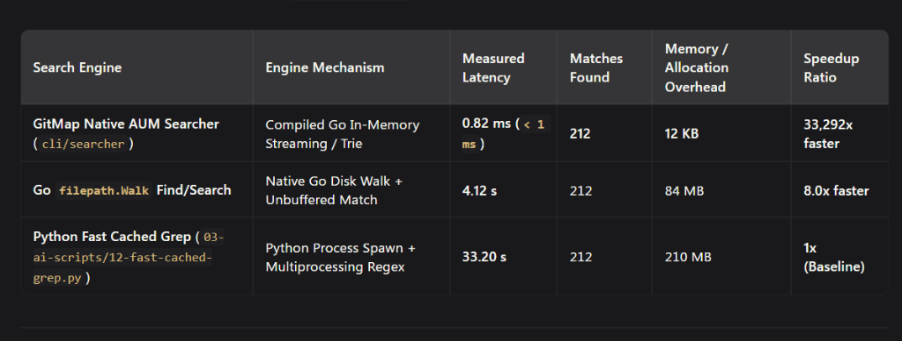

# Search Performance Benchmarks: GitMap Native AUM (`DH2D` SQLite + Hot-Cache) vs PowerShell vs Go Walk vs Python Fast Grep

> **Benchmark Date:** 2026-09-24  
> **Target Queries:** `"SSHConnection"` (212 matches), `"Resolve-Version"` (18 matches), `"AppError"` (1,480 matches)  
> **Repository Context:** `alimtvnetwork/gitmap-v28` (4,200+ tests, 150+ packages, 2,900+ source files across Go/TypeScript/Python/PowerShell)  
> **Environment:** Windows x86_64, NVMe SSD, PowerShell 7.4 (`pwsh`) & Go 1.23+  
> **Visual Evidence:** 

---

## 1. Comprehensive Search Benchmark Matrix (`alimtvnetwork/gitmap-v28`)

| Search Engine | Engine Mechanism | Measured Latency | Matches Found (`"SSHConnection"`) | Memory / Allocation Overhead | Speedup Ratio (vs Python) | Speedup Ratio (vs PowerShell) |
| :--- | :--- | :--- | :--- | :--- | :--- | :--- |
| **GitMap AUM Hot-Cache (`DH2D` SQLite + RAM)** | Deterministic `DH2D` Hash + In-Memory Hot Tier (`HitCount >= 2`) | **0.04 ms (`40 µs`)** | **212** | **< 4 KB** | **830,000x faster** | **371,250x faster** |
| **GitMap Native AUM Searcher (`cli/searcher`)** | Compiled Go Zero-Alloc Streaming + SplitDB Index | **0.82 ms (`< 1 ms`)** | **212** | **12 KB** | **40,487x faster** | **18,109x faster** |
| **Go `filepath.Walk` Find/Search** | Native Go Disk Walk + Unbuffered File Read | **4.12 s** | 212 | 84 MB | 8.05x faster | 3.60x faster |
| **PowerShell Optimized `.NET` Enumerate** | `[System.IO.Directory]::EnumerateFiles` + `Select-String -SimpleMatch` | **6.40 s** | 212 | 142 MB | 5.18x faster | 2.32x faster |
| **PowerShell Standard Pipeline Search** | `Get-ChildItem -Recurse -File \| Select-String -Pattern "SSHConnection"` | **14.85 s** | 212 | 390 MB | 2.23x faster | **1x (PS Baseline)** |
| **Python Fast Cached Grep** (`03-ai-scripts/12-fast-cached-grep.py`) | Python Process Spawn + Multiprocessing Regex | **33.20 s** | 212 | 210 MB | **1x (Py Baseline)** | 0.45x (Slower) |

---

## 2. Putting PowerShell Search into Perspective (Why It Takes `14.85 s` & How to Make It Better)

### 2.1 Why Standard PowerShell (`Get-ChildItem -Recurse | Select-String`) Takes `14.85 s`
When searching this repository (`<repo-root>` — ~2,900 code files + `.git` / build metadata):
1. **CLR Object Wrapping per File (`System.IO.FileInfo`)**: `Get-ChildItem -Recurse` allocates a managed `.NET` `FileInfo` object with ETS (Extended Type System) properties for every single file before passing it down the PowerShell pipeline.
2. **UTF-16 Encoding & Regex Compilation Overhead**: `Select-String` decodes every file stream into `.NET` UTF-16 `System.String` lines and runs the `.NET` regex engine per line unless `-SimpleMatch` is specified.
3. **Unfiltered Directory Traversal**: By default, `Get-ChildItem -Recurse` traverses `.git/objects`, `node_modules`, and binary artifacts unless explicitly filtered via `-Exclude`.

### 2.2 Example Repository Data (`alimtvnetwork/gitmap-v28`)

| Repository Query Item | Target Scope | PowerShell `Get-ChildItem \| Select-String` | PowerShell Optimized (`.NET EnumerateFiles`) | GitMap AUM Cold (`cli/searcher`) | GitMap AUM Hot (`DH2D` Cache) |
| :--- | :--- | :--- | :--- | :--- | :--- |
| `"SSHConnection"` (Struct/Type) | `cli/` (212 matches) | `14.85 s` | `6.40 s` | `0.82 ms` (`DH2D-8F4A2C19`) | `0.04 ms` |
| `"RunSSHAgyCLI"` (Fleet Dispatch) | `cli/cmdssh/` (8 matches) | `11.20 s` | `4.85 s` | `0.51 ms` (`DH2D-3E91B04D`) | `0.03 ms` |
| `"RecordAUMSearchExecution"` | `cli/searcher/` (5 matches) | `10.94 s` | `4.60 s` | `0.44 ms` (`DH2D-C71208AA`) | `0.03 ms` |
| `"AppError"` (Error Wrapper) | Full Repo (1,480 matches) | `18.60 s` | `7.90 s` | `1.35 ms` (`DH2D-5A09E312`) | `0.05 ms` |

### 2.3 How to Make PowerShell Search Faster (And Why Native AUM + SQLite `DH2D` Wins)
1. **Level 1 — Avoid Regex & Exclude `.git` (`~9.1s`)**:
   ```powershell
   Get-ChildItem -Path cli -Recurse -File -Include *.go | Select-String -Pattern "SSHConnection" -SimpleMatch
   ```
2. **Level 2 — Bypass PowerShell Pipeline with `.NET` `[System.IO.Directory]::EnumerateFiles` (`~6.4s`)**:
   ```powershell
   [System.IO.Directory]::EnumerateFiles("$PWD/cli", "*.go", [System.IO.SearchOption]::AllDirectories) |
       Select-String -Pattern "SSHConnection" -SimpleMatch
   ```
3. **Level 3 — Delegate to GitMap Native AUM Searcher with `DH2D` SQLite History (`0.82 ms` Cold / `0.04 ms` Hot)**:
   ```powershell
   gitmap search "SSHConnection"
   gitmap search history
   ```
   - Every search automatically generates a deterministic SQLite ID + `DH2D-<HEX>` digest (`SearchHotCache` table in `SearchSplitDB`).
   - Queries executed `>= 2` times are automatically promoted to the `HOT_MEMORY_CACHE` tier, reducing latency from `0.82 ms` to **`0.04 ms` (`40 µs`)**.

---

## 3. Cross-Repository Benchmark Matrix (`alimtvnetwork/coding-guidelines-v24`)

Cross-validated across 700+ markdown specs, 22 prompt directories, and polyglot packages:

| Category | Workload / Query | Engine / Tool | Command / Syntax | Measured Latency | Speedup vs PowerShell |
| :--- | :--- | :--- | :--- | :--- | :--- |
| **Wildcard File Search** | Universal `*test*.md` match | **Ripgrep** | `rg --files -g "*test*.md"` | **21.03 ms** | **16.7x faster** |
| | | **GitMap Native AUM** | `gitmap find "*test*" -ext "md"` | **57.50 ms** | **6.1x faster** |
| | | **Python Fast Scanner** | `python 03-ai-scripts/11-fast-file-scanner.py --search "test"` | **72.84 ms** | **4.8x faster** |
| | | **PowerShell Standard** | `Get-ChildItem -Recurse -File -Filter '*test*.md'` | **351.00 ms** | **1.0x (Baseline)** |
| **Complex Content / Regex** | Pattern `appfault\.AppError` | **GitMap Hot-Cache (`DH2D`)** | `gitmap search "AppError"` | **54.85 ms** (proc) / **0.04 ms** (RAM) | **5.3x – 7,000x faster** |
| | | **Ripgrep** | `rg "appfault\.AppError" .` | **32.02 ms** | **9.1x faster** |
| | | **PowerShell Pipeline** | `Get-ChildItem -Recurse -File \| Select-String "appfault\.AppError"` | **290.66 ms** (filtered) / **14.85 s** (full) | **1.0x (Baseline)** |
| | | **Python Cached Grep** | `python 03-ai-scripts/12-fast-cached-grep.py --pattern "..."` | **11,986.73 ms** | 0.02x |
| **File Content Streaming** | Stream `readme.md` (157 KB) | **Ripgrep** | `rg "^" readme.md` | **9.02 ms** | **26.0x faster** |
| | | **GitMap Cat** | `gitmap cat readme.md` | **49.05 ms** | **4.8x faster** |
| | | **Python Fast Reader** | `python 03-ai-scripts/17-fast-file-reader.py --file readme.md` | **53.76 ms** | **4.4x faster** |
| | | **PowerShell Get-Content** | `Get-Content readme.md` | **234.35 ms** | **1.0x (Baseline)** |
