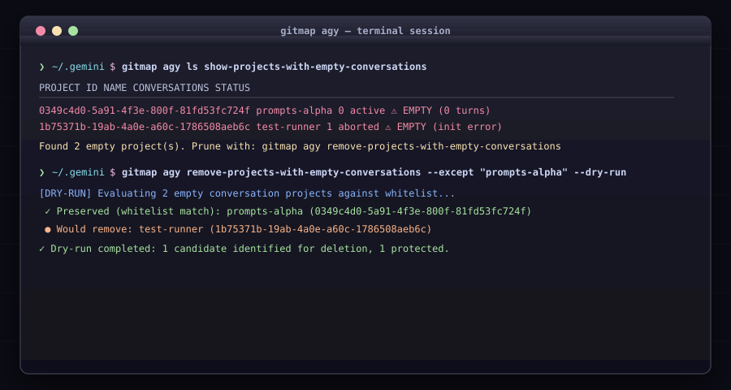

# Antigravity (AGY) Integration

Manage Google Antigravity workspaces, prompts, deduplication, and conversation health.

## Command Files in this Folder

| File | Subcommand | Description |
|---|---|---|
| [`ls.md`](./ls.md) | `gitmap agy ls` | Status table of all projects & empty conversation detection |
| [`remove-projects-with-empty-conversations.md`](./remove-projects-with-empty-conversations.md) | `gitmap agy remove-projects-with-empty-conversations` | Prune projects having 0 or aborted sessions (`--except`, `--dry-run`) |
| [`find-duplicate-projects.md`](./find-duplicate-projects.md) | `gitmap agy find-duplicate-projects` | Identify duplicate project paths and names (`fdp`) |
| [`cure-duplicate-projects.md`](./cure-duplicate-projects.md) | `gitmap agy cure-duplicate-projects` | Deduplicate and keep newest project per path (`cdp`, `optimize-projects`) |
| [`remove-missing-projects.md`](./remove-missing-projects.md) | `gitmap agy remove-missing-projects` | Prune missing workspace records whose paths don't exist on disk |
| [`reconcile.md`](./reconcile.md) | `gitmap agy reconcile` | Reconcile and re-link moved project directories with tracked repos (`recon`) |
| [`all-projects-read-memory-prompt.md`](./all-projects-read-memory-prompt.md) | `gitmap agy all-projects-read-memory-prompt` | Broadcast Read Memory prompt across projects with prefix/slug exceptions (`aprmp`) |
| [`clear.md`](./clear.md) | `gitmap agy clear` | Remove missing or stale workspace records (`--except`) |
| [`prompt.md`](./prompt.md) | `gitmap agy prompt` | Send prompts to single or all project sessions |
| [`sync-and-backup.md`](./sync-and-backup.md) | `gitmap agy sync`, `export`, `import` | Sync repos to workspaces and backup configurations |

## Overview
Antigravity workspaces are stored as JSON files under `~/.gemini/config/projects/*.json` and conversation histories are recorded in SQLite databases under `~/.gemini/antigravity/conversations/*.db`.
