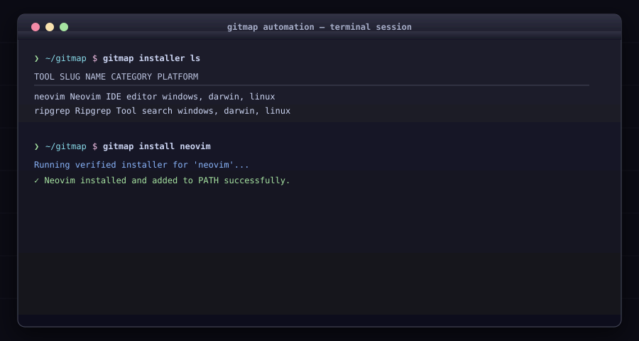

# Automation, Installers & Macros

Package releases, install developer tools, and replay terminal automation macros.

## Commands

### Developer Tool Installers (`gitmap installer`)

* **Aliases:** `installer`, `in`
* Subcommands:
  * `gitmap installer ls`: Lists available developer tool install recipes.
  * `gitmap installer install <slug>`: Runs verified installer for a tool.
  * `gitmap installer create <name>`: Authors a new tool installation recipe.
  * `gitmap installer export <slug>`: Exports installer script to a standalone file.
  * `gitmap installer import <file>`: Imports an installer recipe.
  * `gitmap installer update <slug>`: Updates tool installer to latest remote recipe.
  * `gitmap installer rm <slug>`: Deletes an installer recipe.
  * `gitmap install <tool>`: Direct shortcut to install a tool by name.
  * `gitmap uninstall <tool>`: Direct shortcut to uninstall a tool.

### Task Automation Macros (`gitmap macro`)

* **Alias:** `m`
* Subcommands:
  * `gitmap macro record <name>` (alias: `rec`): Interactively records terminal commands.
  * `gitmap macro list` (alias: `ls`): Lists recorded macros.
  * `gitmap macro show <name>`: Displays steps inside a macro.
  * `gitmap macro run <name>`: Executes a macro.
  * `gitmap macro run-until-succeed <name>` (alias: `retry`): Loops execution until exit code 0.
  * `gitmap macro rm <name>`: Deletes a recorded macro.

### Release ZIP Archives (`gitmap zip-group`)

* **Alias:** `z`
* Subcommands:
  * `gitmap zip-group create <name> [paths...] [--archive <name>]`: Creates file collection for ZIP.
  * `gitmap zip-group add <group> <path...>`: Adds files or folders.
  * `gitmap zip-group remove <group> <path>`: Removes files from group.
  * `gitmap zip-group list`: Lists defined zip groups.
  * `gitmap zip-group show <group>`: Inspects files in group.
  * `gitmap zip-group delete <group>`: Deletes a zip group.
