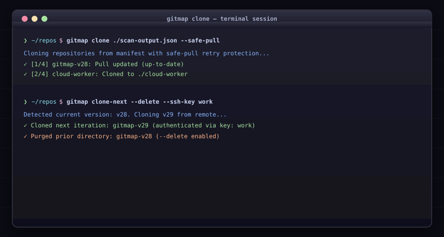

# Cloning & Workspace Synchronization

Commands for batch cloning, version increment cloning, and IDE registration.

<div align="center">



</div>

## Commands & Flag References

### 1. `gitmap clone <source|json|csv|text>`
* **Alias:** `c`
* **Flags:**
  * `--target-dir <dir>`: Base directory where repositories will be cloned.
  * `--safe-pull`: Pull existing repos with automatic retry and unlock diagnostics.
  * `--fix`: Automatically prune redundant clone directories.
  * `--verbose`: Output verbose logging.

#### Flag Examples:
```bash
# Clone all repositories using safe pull
gitmap clone ./scan-output.json --safe-pull --target-dir ~/projects

# Auto-remediate repeated clone folders
gitmap clone ./manifest.csv --fix
```

### 2. `gitmap clone-sync <url> [urls...]`
* **Alias:** `cs`
* Clones one or more repositories and immediately registers them with VS Code Workspaces and Antigravity.
```bash
gitmap clone-sync https://github.com/my-org/api-server
```

### 3. `gitmap clone-next [v++|vN]`
* **Alias:** `cn`
* Clones the next versioned iteration of the current repo (e.g. `v27` $\rightarrow$ `v28`).
* **Flags:**
  * `--delete`: Remove prior version folder automatically after clone.
  * `--keep`: Keep prior folder without prompting.
  * `--no-desktop`: Skip GitHub Desktop registration.
  * `--ssh-key <name>` (`-K`): Named SSH key to use for authentication.
  * `--create-remote`: Create target GitHub repo if missing (requires `GITHUB_TOKEN`).

#### Flag Examples:
```bash
# Clone next version and delete old folder
gitmap clone-next --delete --ssh-key work

# Clone next version and auto-create remote repo
gitmap clone-next --create-remote
```

### 4. `gitmap desktop-sync` & `github-desktop`
* `gitmap desktop-sync` (alias: `ds`): Sync all tracked repositories to GitHub Desktop.
* `gitmap github-desktop` (alias: `gd`): Register current repo with GitHub Desktop directly.
