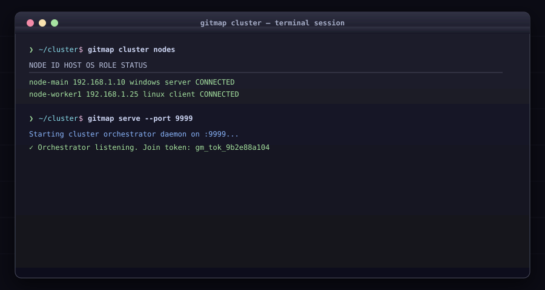

# Cluster & Distributed Delegation (`gitmap cluster`)

Coordinate operations across multiple machines in a distributed network.

## Commands

### `gitmap cluster <subcommand>`
* Subcommands:
  * `status`: Shows cluster node connectivity and synchronization health.
  * `nodes` (alias: `ls`): Lists all active nodes in the cluster.
  * `history`: Displays distributed execution audit history.
  * `set-password`: Sets cluster join and access passwords.
  * `reset-password`: Resets cluster credentials.
  * `remove <node-id>` (alias: `rm`): Disconnects and unregisters a node.
  * `audit-clean`: Purges orphaned node communication logs.
  * `stats`: Shows cluster resource utilization metrics.

### Orchestrator & Broadcast
* `gitmap serve` (alias: `sv`): Starts the orchestrator daemon and emits a join token.
* `gitmap servers-clients <cmd>` (alias: `sc`): Broadcasts command across both servers and client nodes.
* `gitmap clients <cmd>`: Broadcasts command across client worker nodes only.
* `gitmap user <subcommand>`: Manages cross-platform OS system users (`add`, `list`, `rm`).
