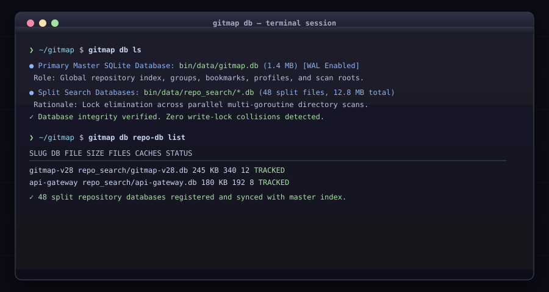

# Database Architecture & Management (`gitmap db`)

GitMap employs a hybrid database architecture:
1. **Primary Master Database (`bin/data/gitmap.db`)**: Central repository, bookmark, tag, and profile store.
2. **Split Search Databases (`bin/data/repo_search/*.db`)**: Dedicated per-repository databases for file lists and search caches to eliminate SQLite WAL write lock contention during parallel multi-goroutine scans.

## Command Files in this Folder

| File | Subcommand | Description |
|---|---|---|
| [`ls.md`](./ls.md) | `gitmap db ls` | Master and Split DB path, size, and architectural purpose |
| [`repo-db.md`](./repo-db.md) | `gitmap db repo-db list` | Per-repo split DB table metrics (`RepoFile`, `SearchCache`) |
| [`sizes.md`](./sizes.md) | `gitmap db sizes list` | Compact disk usage report across all DB files |
| [`reset.md`](./reset.md) | `gitmap db reset` | Reset database records and clear split DBs |
| [`start-fresh.md`](./start-fresh.md) | `gitmap start-fresh` | Irreversible total wipe and fresh schema reconstruction |
