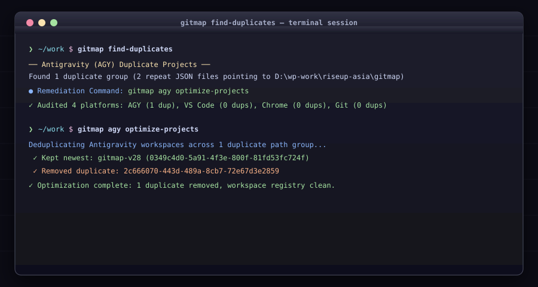

# Cross-Platform Duplicate Audit & Remediation (`gitmap find-duplicates`)

Scan and remediate duplicate projects, profiles, and repositories across developer tooling with copy-pasteable remediation CLI commands printed immediately beneath findings.

<div align="center">



</div>

## Subcommand Scopes

| File | Subcommand | Target Platform |
|---|---|---|
| [`agy.md`](./agy.md) | `gitmap agy find-duplicates` | Antigravity workspaces (`~/.gemini/config/projects/`) |
| [`vscode.md`](./vscode.md) | `gitmap vscode find-duplicates` | VS Code Project Manager (`projects.json`) |
| [`chrome.md`](./chrome.md) | `gitmap chrome find-duplicates` | Chrome browser profiles (`User Data/`) |
| [`git.md`](./git.md) | `gitmap git find-duplicates` | GitMap tracked repository database |

## All Platforms Audit

Running with no arguments audits all 4 platforms in a single pass:

```bash
gitmap find-duplicates
```
