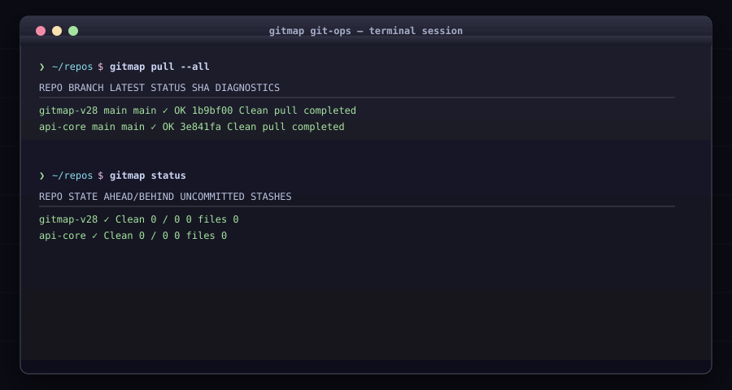

# Git Operations & Pull Engine

Execute Git operations across individual, grouped, or all repositories.

<div align="center">



</div>

## Commands & Flags

### 1. `gitmap pull [name]`

* **Alias:** `p`
* **Flags:**
  * `--all` (alias: `gitmap pull-all`): Pull all tracked repositories concurrently.
  * `--group <name>`: Pull only repositories within a specified group.
  * `--verbose`: Show detailed git output during pulls.
* **Examples:**
  ```bash
  # Pull single repo with failure diagnostics
  gitmap pull my-repo

  # Pull all tracked repos in parallel
  gitmap pull --all

  # Pull all repos in the 'backend' group
  gitmap pull --group backend
  ```

### 2. `gitmap fix [repo] [action]`

Remediate pull collisions and untracked file conflicts.
* **Actions:** `stash`, `wip`, `discard`.
* **Examples:**
  ```bash
  # Stash changes, pull, and pop stash
  gitmap fix my-repo stash

  # Discard untracked collision files
  gitmap fix my-repo discard
  ```

### `gitmap push`

* **Alias:** `ph`
* Push commits with `--ssh` / `--https` transport flags.

### `gitmap status`

* **Alias:** `st`
* Tabular overview of dirty/clean states, uncommitted files, ahead/behind counts, and stashes.

### `gitmap watch`

* **Alias:** `w`
* Live auto-refreshing terminal dashboard of tracked repository statuses.

### `gitmap exec <args...>`

* **Alias:** `x`
* Executes arbitrary Git commands across all tracked repositories simultaneously.

### `gitmap has-any-updates`

* **Aliases:** `hau`, `hac`
* Checks if remote repositories contain unpulled commits.

### `gitmap latest-branch`

* **Alias:** `lb`
* Identifies the most recently updated remote branch.

### `gitmap lfs-common`

* **Alias:** `lfsc`
* Automatically tracks common binary file types with Git LFS.
