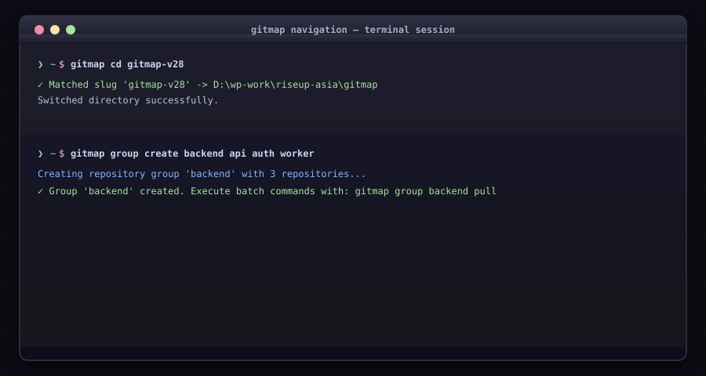

# Navigation, Groups & Aliases

Fast repository jumping, grouping for batch commands, and navigation aliases.

## Commands

### `gitmap cd <name>`
* **Alias:** `go`
* Navigates to a tracked repository directory by slug or partial match.

### `gitmap group <subcommand>`
* **Alias:** `g`
* Subcommands:
  * `create <name> [repos...]`: Creates a new repository group.
  * `add <group> <repo>`: Adds a repository to a group.
  * `remove <group> <repo>`: Removes a repository from a group.
  * `list`: Lists all groups.
  * `show <group>`: Shows members of a group.
  * `delete <group>`: Deletes a group.
  * `<name>`: Activates a group for scoped batch ops (`pull`, `status`, `exec`).

### `gitmap multi-group`
* **Alias:** `mg`
* Selects multiple groups for concurrent batch execution.

### `gitmap alias <subcommand>`
* **Alias:** `a`
* Subcommands:
  * `set <alias> <repo>`: Assigns a short alias to a repository.
  * `rm <alias>`: Removes an alias.
  * `list`: Displays all active aliases.
  * `show <alias>`: Shows target repository for an alias.
  * `suggest`: Suggests short aliases for untracked repositories.
