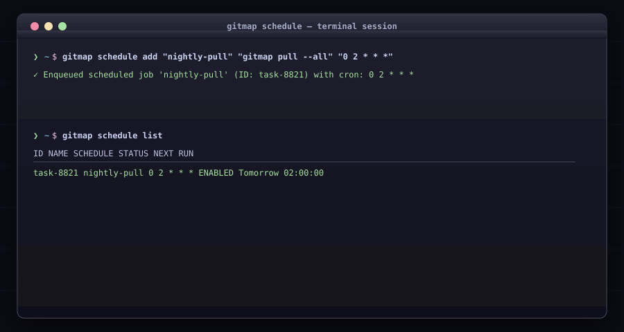

# Background Task Scheduler (`gitmap schedule`)

Automate background jobs, triggers, and recurring routines.

## Commands

### `gitmap schedule <subcommand>`

* **Alias:** `sc`
* Subcommands:
  * `add <name> <command> [cron]`: Enqueues a scheduled background task.
  * `list` (alias: `ls`): Lists all active scheduled tasks.
  * `status`: Displays runner daemon health and execution telemetry.
  * `enable <id>`: Enables a paused task.
  * `disable <id>`: Disables an active task.
  * `run <id>`: Triggers immediate one-shot execution.
  * `logs <id>` (alias: `log`): Inspects task execution logs.
  * `rm <id>` (alias: `del`): Deletes a task.
  * `export [file]`: Exports scheduled task configurations.
  * `import <file>`: Imports scheduled task configurations.
  * `startup`: Configures system autostart for the scheduler service.
  * `restart`: Restarts background scheduler service.
  * `shutdown`: Gracefully stops the scheduler service.
