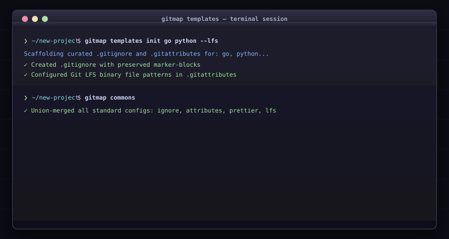

# Templates, Curated Configs & LFS

Scaffold standardized configuration files with idempotent marker-block preservation.

## Commands

### `gitmap add <target>`
* `gitmap add ignore [langs...]`: Merges curated `.gitignore` blocks into `./.gitignore`.
* `gitmap add attributes [langs...]`: Merges curated `.gitattributes` blocks into `./.gitattributes`.
* `gitmap add lfs-install`: Runs `git lfs install --local` and adds binary LFS attributes.

### `gitmap templates <subcommand>`
* **Alias:** `tpl`
* Subcommands:
  * `init [langs...]` (alias: `ti`): Scaffolds `.gitignore` and `.gitattributes`.
  * `list` (alias: `tl`): Lists all available templates and origins.
  * `show <name>` (alias: `ts`): Prints template contents to stdout.
  * `diff` (alias: `td`): Previews what template application would change.

### `gitmap sync <target>`
* **Alias:** `sy`
* Targets: `ignore`, `attributes`, `lfs-install`, `prettier-ignore`, `prettier-rc`, `all`.

### `gitmap commons`
* **Alias:** `co`
* Shortcut for `sync all` (adds and dedupes all standard configs + Git LFS).
