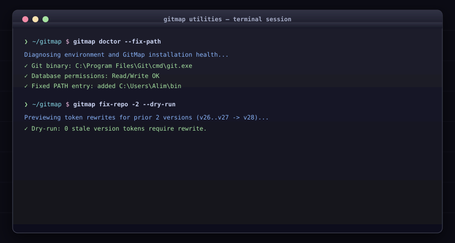

# Utilities & Diagnostics

System diagnostics, self-updating, interactive TUI, and repository utilities.

<div align="center">



</div>

## Commands

| Command | Alias | Description |
|---|---|---|
| `gitmap doctor` | — | Diagnoses PATH, Git layout, and database health (`--fix-path`) |
| `gitmap update` | — | Self-updates GitMap binary to latest GitHub release |
| `gitmap update-cleanup` | — | Purges temporary update artifacts and `.old` binary backups |
| `gitmap version` | `v` | Displays GitMap SemVer version number |
| `gitmap completion <shell>` | `cmp` | Generates shell autocompletion (`bash`, `zsh`, `powershell`, `fish`) |
| `gitmap interactive` | `i` | Launches terminal interactive TUI repo browser with batch actions |
| `gitmap dashboard` | `db` | Generates standalone HTML interactive dashboard for a repo |
| `gitmap docs` | `d` | Opens documentation website in default browser |
| `gitmap help-dashboard` | `hd` | Serves local offline documentation server |
| `gitmap gomod <path>` | `gm` | Safe Go module renaming across repository tree |
| `gitmap seo-write` | `sw` | Automated commit generator and scheduler with templating |
| `gitmap llm-docs` | `ld` | Exports consolidated `LLM.md` reference for AI assistants |
| `gitmap fix-repo` | `fr` | Rewrites prior `{base}-vN` version tokens (`-2`, `-3`, `-5`, `--all`, `--dry-run`) |
| `gitmap clone-fix-repo <url>` | `cfr` | Clones repo, then runs `fix-repo --all` in new folder |
| `gitmap clone-fix-repo-pub <url>` | `cfrp` | Clones, runs `fix-repo`, and makes repository public |
| `gitmap make-public` | — | Sets repository visibility to public on GitHub/GitLab |
| `gitmap make-private` | — | Sets repository visibility to private on GitHub/GitLab |
| `gitmap open [target]` | `o` | Opens current repo or target folder in OS file explorer |
| `gitmap setup` | — | Configures git diff/merge tools and global preferences |
| `gitmap env <sub>` | `ev` | Manages environment variables and PATH (`set`, `get`, `list`, `rm`) |
| `gitmap cg <sub>` | — | Scaffolds Coding Guidelines (v24) into a repository (`install`, `update`) |
| `gitmap user <sub>` | — | Manages cross-platform OS system users (`add`, `list`, `rm`) |
| `gitmap help [command]` | — | Views manual and flag reference for any command |

---

## Desktop & File Utilities

Cross-platform OS desktop integration, clipboard memory buffers, and safe file operations.

| Command | Alias | Description |
|---|---|---|
| `gitmap copy [text\|file]` | `cp` | Copies text or file content to system clipboard & persistent memory buffer (`.gitmap/memory/clipboard.txt`) |
| `gitmap paste [file]` | `pst` | Pastes clipboard/memory content to stdout or writes to destination file (`--memory`) |
| `gitmap explorer [path]` | `exp` | Opens directory or reveals file in native OS desktop file manager (Explorer/Finder/xdg-open) |
| `gitmap browse <url>` | `open-url`, `web` | Opens URL or local HTML file in default browser (or Google Chrome via `--chrome`) |
| `gitmap cat <file>` | `view` | Streams file content directly to terminal stdout |
| `gitmap touch <file>` | `mkfile` | Creates a new empty file and automatically generates any missing parent directories |

### Usage Examples

```bash
# Copy and Paste via clipboard & persistent memory buffer
gitmap copy "gitmap release --tag v1.0.0"
gitmap paste
gitmap paste --file deploy-notes.txt
gitmap copy --file ./config.json

# Cross-platform desktop file explorer & browser openers
gitmap explorer .
gitmap explorer ./src/components/Card.tsx
gitmap browse https://github.com/alimtvnetwork/gitmap-v28
gitmap browse https://localhost:3000 --chrome

# Cross-platform file creation & viewing
gitmap touch docs/new-feature.md
gitmap cat docs/new-feature.md
```
