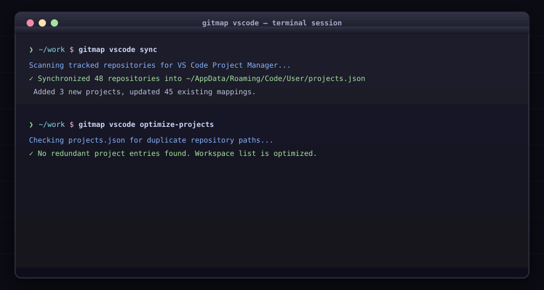

# VS Code Project Manager Integration (`gitmap vscode`)

<div align="center">



</div>

Synchronize GitMap repositories into the VS Code Project Manager extension (`projects.json`).

## Commands

### `gitmap vscode sync`

Scans tracked GitMap repositories and populates `projects.json` for Project Manager.
```bash
gitmap vscode sync
```

### `gitmap vscode ls`

Lists all projects registered in VS Code Project Manager.
```bash
gitmap vscode ls
```

### `gitmap vscode optimize-projects`

Removes duplicate project path entries from `projects.json`.
```bash
gitmap vscode optimize-projects
```

### `gitmap vscode clear`

Clears projects from VS Code Project Manager. Displays a formatted table with IDs, names, and slugs, allowing exclusions by numeric ID, slug, name, or starts-with prefix.

| Flag | Default | Description |
|---|---|---|
| `--except`, `-e` | `""` | Exclude projects by numeric ID, project name, slug, or starts-with prefix |
| `--missing`, `-m` | `false` | Only clear projects whose target directories no longer exist on disk |
| `--dry-run`, `-d` | `false` | Preview clearance table with IDs without writing changes |
| `--yes`, `-y` | `false` | Skip confirmation prompt |

```bash

# Preview clearance in structured table with IDs:

gitmap vscode clear --dry-run

# Clear with exclusions based on numeric ID, slug, or starts-with prefix:

gitmap vscode clear --except "wp-, gitmap, 1" --dry-run

# Clear only missing directories non-interactively:

gitmap vscode clear --missing -y
```

### `gitmap vscode paths <add|rm|list>`

Manually manages explicit path alias mappings in the registry.
```bash
gitmap vscode paths add my-alias D:\projects\my-repo
gitmap vscode paths list
gitmap vscode paths rm my-alias
```
