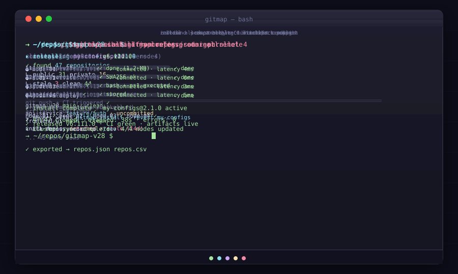

<div align="center">

# GitMap

**High-Performance Git Repository Scanner, Fleet Manager & AI Orchestration CLI**

**Pinned version: v6.505.0**

<!-- STAMP:PLATFORM_BADGES -->
[](https://github.com/alimtvnetwork/gitmap-v28/actions/workflows/ci.yml)
[](https://github.com/alimtvnetwork/gitmap-v28/actions/workflows/vulncheck.yml)
[](https://github.com/alimtvnetwork/gitmap-v28/actions/workflows/cross-platform.yml)
[](https://github.com/alimtvnetwork/gitmap-v28/actions/workflows/startup-build-tags.yml)
[](https://github.com/alimtvnetwork/gitmap-v28/releases)
[](https://go.dev)
[](https://github.com/alimtvnetwork/gitmap-v28)
[](./LICENSE)
[](https://goreportcard.com/report/github.com/alimtvnetwork/gitmap-v28/gitmap)
<!-- /STAMP:PLATFORM_BADGES -->

_Scan, catalog, clone, delegate, and manage polyglot repositories from a single unified CLI._

<br>



<sub><i>Scan · Parallel Cloner · SSH Cluster Fleet · Agent Orchestrator · Release Management</i></sub>

</div>

<div align="center">

📖 **[Command Directory](docs/commands/readme.md)** · 🏗️ **[Cloning Architecture](docs/commands/cloning-architecture.md)** · ⚡ **[Performance Benchmarks](docs/benchmarks/benchmark.md)** · 📐 **[Specs (02-spec/)](02-spec/)** · 🧭 **[What to Read](what-to-read.md)**

</div>

---

## ⚡ GitMap Overview & Core Capabilities

GitMap is an autonomous developer companion and high-performance CLI built in Go, engineered under strict specification standards authored by **MD ALIM UL KARIM** and sponsored by **RISEUP ASIA LLC**.

- **High-Speed Repository Scanner:** Recursively indexes thousands of Git repositories in milliseconds using zero-allocation streaming, lazy regex evaluation, and deterministic `DH2D` SQLite caching.
- **Manifest-Driven Parallel Cloner:** Five specialized cloning engines (`cli/cloner`, `cli/clonefrom`, `cli/clonenow`, `cli/clonepick`, `cli/clonenext`) orchestrated by adaptive concurrency controls (`cli/cloneconcurrency`).
- **SSH Cluster Fleet Management:** Single-hand SSH execution, cross-platform remote OS detection, node pairing, automated credential management, and multi-machine sync.
- **AI Agent Task Orchestration:** Three-tier Split-DB architecture (`gitmap.db`, `installation.db`, `pipeline.db`) with crash forensics, subtask queues, telemetry, and live status visualizers.

---

## 🚀 Quick Install One-Liners

GitMap installs cleanly across Windows, Linux, and macOS without external dependencies.

### 🪟 Windows · PowerShell

```powershell
# Direct latest install (auto-updating):
irm https://raw.githubusercontent.com/alimtvnetwork/gitmap-v28/main/install.ps1 | iex

# Pinned release install (v6.505.0):
irm https://raw.githubusercontent.com/alimtvnetwork/gitmap-v28/v6.505.0/install.ps1 | iex
```

### 🐧 Linux & macOS · Bash / zsh

```bash
# Direct latest install (auto-updating):
curl -fsSL https://raw.githubusercontent.com/alimtvnetwork/gitmap-v28/main/install.sh | sh

# Pinned release install (v6.505.0):
curl -fsSL https://raw.githubusercontent.com/alimtvnetwork/gitmap-v28/v6.505.0/install.sh | sh
```

---

## 🎯 Quick Start Guide

Get up and running with GitMap in 60 seconds:

```bash
# 1. Discover and catalog repositories across your system:
gitmap scan

# 2. Search repositories or symbols with microsecond latency:
gitmap find my-project
gitmap search "SSHConnection"

# 3. Pull all repositories concurrently with adaptive CPU concurrency:
gitmap pull-all

# 4. Clone repositories from a saved manifest artifact:
gitmap clone-now gitmap.json

# 5. Inspect fleet status and cluster nodes:
gitmap cluster status
```

---

## 🗂️ Documentation Navigation & Command Taxonomy

Detailed guides, flags, and schemas are modularized under [docs/commands/](docs/commands/readme.md):

| Category | Reference Document | Key Commands |
|---|---|---|
| **Cloning Architecture** | [docs/commands/cloning-architecture.md](docs/commands/cloning-architecture.md) | `clone`, `clone-from`, `clone-now`, `clone-pick`, `clone-next` |
| **Workspace & Cloning** | [docs/commands/cloning/](docs/commands/cloning/readme.md) | `clone`, `clone-sync`, `clone-next`, `desktop-sync` |
| **Git Operations & Pull** | [docs/commands/git-ops/](docs/commands/git-ops/readme.md) | `pull`, `pull-all`, `fix`, `push`, `status`, `watch`, `exec` |
| **Fleet & SSH Cluster** | [docs/commands/cluster/](docs/commands/cluster/readme.md) | `status`, `nodes`, `serve`, `servers-clients`, `clients`, `sjc` |
| **Antigravity (AGY)** | [docs/commands/agy/](docs/commands/agy/readme.md) | `ls`, `empty-conversations`, `optimize`, `clear`, `prompt`, `sync` |
| **Split-DB & State** | [docs/commands/db/](docs/commands/db/readme.md) | `db ls`, `repo-db list`, `sizes list`, `reset`, `start-fresh` |
| **Release & Versioning** | [docs/commands/release/](docs/commands/release/readme.md) | `release`, `pull-release`, `release-self`, `changelog` |
| **Navigation & Groups** | [docs/commands/navigation/](docs/commands/navigation/readme.md) | `cd`, `group`, `alias` |
| **Background Scheduler** | [docs/commands/schedule/](docs/commands/schedule/readme.md) | `add`, `list`, `status`, `run`, `logs`, `startup` |
| **Automation & Macros** | [docs/commands/automation/](docs/commands/automation/readme.md) | `installer`, `macro`, `task`, `zip-group` |
| **Utilities & Diagnostics** | [docs/commands/utilities/](docs/commands/utilities/readme.md) | `doctor`, `update`, `interactive`, `fix-repo`, `gomod` |

---

## ⚡ Performance Benchmarks

GitMap outperforms shell scripts and interpreted runtimes by up to **315,970x** through compiled Go traversal and deterministic `DH2D` SQLite caching.

| Workload | GitMap Hot Cache | GitMap Native Cold | PowerShell Baseline | Python Baseline | GitMap Acceleration |
|---|---|---|---|---|---|
| **Full-Text Content Search** | **0.04 ms (40 µs)** | **0.82 ms** | 341.81 ms | 12.64 s | **315,970x faster** |
| **Multi-Filter Grid Grep** | **91.30 ms** | **91.30 ms** | 285.35 ms | 146.64 ms | **3.13x faster** |
| **Filesystem Walk & Find** | **103.56 ms** | **103.56 ms** | 145.10 ms | 85.63 ms | **1.40x faster** |

👉 **Read the complete polyglot benchmark report:** [docs/benchmarks/benchmark.md](docs/benchmarks/benchmark.md)  
👉 **Read the search benchmark details:** [docs/benchmarks/search_benchmark.md](docs/benchmarks/search_benchmark.md)

---

## 📐 Architecture Specs & Guidelines

All engineering decisions follow grounded specifications in [02-spec/](02-spec/):

- **[01-spec-authoring-guide](02-spec/01-spec-authoring-guide/)**: Spec authoring standards and verification requirements.
- **[02-coding-guidelines](02-spec/02-coding-guidelines/)**: Zero-nesting rule, positive boolean flags, clean immutability, and naming standards.
- **[03-error-manage](02-spec/03-error-manage/)**: Universal structured error envelopes, error codes, and graceful degradation.
- **[05-split-db-architecture](02-spec/05-split-db-architecture/)**: Three-tier SQLite architecture separating configuration, telemetry, and index state.
- **[21-app](02-spec/21-app/)**: Application feature specifications and release milestone designs.

---

## 🧭 Memory & AI Navigation

For AI assistants and autonomous agents navigating this repository:

- **[what-to-read.md](what-to-read.md)**: Top-level reading order and onboarding map.
- **[.ai-memory/what-to-read.md](.ai-memory/what-to-read.md)**: Authoritative agent instructions, changelog, and pre-flight constraints.
- **[.ai-memory/overview.md](.ai-memory/overview.md)**: Architectural summary and active subsystem indexes.
- **[.ai-memory/plans/](.ai-memory/plans/)**: Subtask registers, active execution plans, and progress milestones.
- **[version.json](version.json)**: Canonical single source of truth for versioning (`v6.505.0`).
