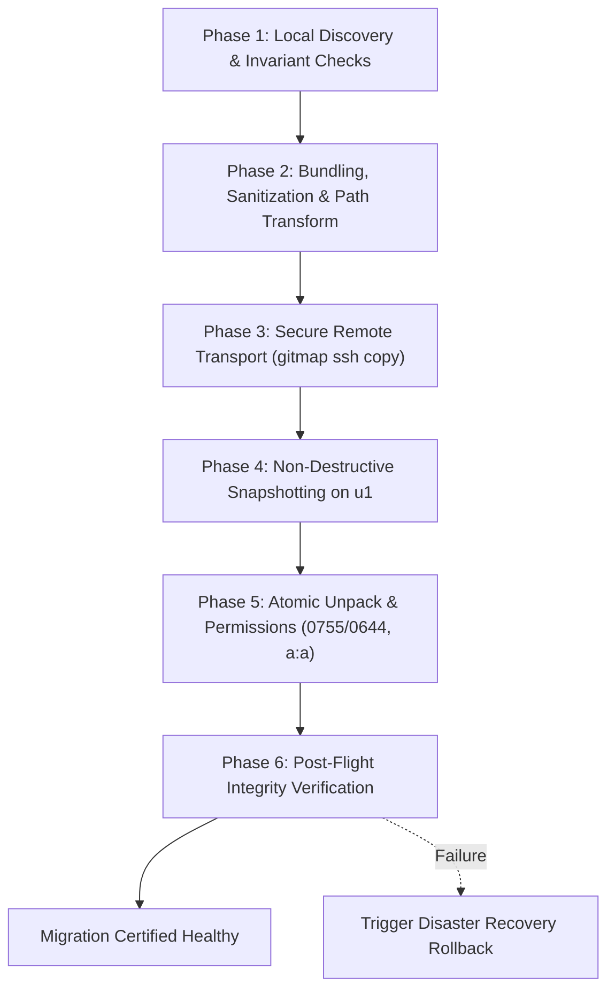

# Cursor IDE & AI Memory: Windows to Ubuntu Fleet Migration Guide

## 1. Executive Summary

### 1.1 What We Are Doing
We are executing an automated, zero-data-loss migration of all Cursor IDE configuration profiles, AI agent states, skills inventories, conversation histories, and project workspaces from the Windows developer host (`C:\Users\Administrator\...`) to the primary Ubuntu fleet node `u1` (`/home/a/...`). This transition transfers the complete developer state—including 49 registered workspaces, 28 canonical AI skills, conversational full-text search databases, and custom Dracula editor configurations—into native Linux directory structures (`~/.config/Cursor/User` and `~/.cursor`).

### 1.2 What We Are Thinking
A high-velocity AI development workflow relies heavily on accumulated context: workspace state trees, past prompt iterations, active agent transcripts, custom skill behaviors, and specialized editor ergonomics. Forcing a developer or an autonomous agent to re-index 49 repositories or reconfigure preferences on a new OS destroys productivity.

Our core architectural strategy separates **pure platform-agnostic state** from **platform-specific native binaries**:
1. **State, History, & Config**: Transferred and transformed deterministically (paths, URIs, and directory keys re-mapped from Windows to Linux).
2. **Native Binaries & Drivers**: Deliberately excluded, allowing Linux-native Cursor runtimes and language servers to initialize clean, native ELF binaries without cross-architecture contamination.

### 1.3 Why We Are Doing It
1. **Infrastructure Consolidation**: Unifying our developer workflows and AI execution loops onto high-performance Ubuntu fleet nodes (`u1`) running native Linux kernels.
2. **Cluster & SSH Delegation**: Enabling GitMap's remote cluster orchestration (`gitmap ssh exec`, `gitmap pe -t`) to run autonomous coding agents in headless Linux environments with identical configurations to the interactive desktop IDE.
3. **Elimination of Windows Bottlenecks**: Freeing workstations from Windows file-locking quirks, path length limitations, and high memory overhead, while keeping 100% parity across editor profiles.

### 1.4 Our 100% Confidence Rationale
Our confidence in achieving a flawless, zero-regression transition is backed by five engineering guarantees:
1. **Mathematical Isolation Invariant**: The migration engine explicitly guarantees that live target repositories under `/home/a/git-work/` are read-only and never modified or deleted during profile transfer.
2. **Automatic Pre-Flight Snapshots**: Before any incoming archive is extracted on node `u1`, the destination directories (`~/.config/Cursor/User` and `~/.cursor`) are cloned into timestamped immutable backups (`*.bak.<timestamp>`).
3. **Comprehensive Path & URI Normalization**: Deterministic stream transforms handle both POSIX path mappings (`D:\work\...` &rarr; `/home/a/git-work/...`) and URI-encoded schemas (`file: scheme with drive letter` &rarr; `file: scheme with /home/a/git-work/...`).
4. **Architectural Binary Pruning**: The 702 MB `anysphere.cursor-agent-worker` directory (containing Windows `.node` and `.dll` binaries) is excluded from transit, allowing Ubuntu to pull fresh `linux-x64` binaries on first boot.
5. **Multi-Gate Integrity Verification**: The deployment is only certified healthy after automated SQLite `PRAGMA integrity_check` validation, repository parity checks against `projects.json`, and file-mode permission audits pass without error.

---

## 2. Source Inventory & Anatomy

Below is the definitive inventory of assets on the Windows host, their exact sizes and contents, their target destinations on Ubuntu node `u1`, and their transformation requirements.

```
Windows Host Assets
├── C:\Users\Administrator\.cursor
│   ├── agents/                   # Agent persona definitions and prompt configs
│   ├── ai-tracking/              # ai-code-tracking.db (telemetry & metrics)
│   ├── projects/                 # 48+ d-work-* workspace agent states & canvases
│   ├── skills-cursor/            # 28 canonical AI skills (automate, loop, etc.)
│   ├── argv.json                 # Electron/Chromium runtime flags
│   ├── cli-config.json           # Cursor CLI credentials & API configuration
│   └── statsig-cache.json        # Dynamic feature flag cache (reset to {})
└── C:\Users\Administrator\AppData\Roaming\Cursor\User
    ├── settings.json             # Dracula theme, JetBrains Mono font, formatting
    ├── keybindings.json          # Custom editor shortcuts
    ├── snippets/                 # Language code snippets
    ├── globalStorage/
    │   ├── state.vscdb           # 166 MB SQLite database (ItemTable, disk KV, composer)
    │   ├── conversation-search.db# 4.4 MB SQLite database (Full-Text Search indices)
    │   ├── alefragnani.project-manager/projects.json (49 mapped workspace entries)
    │   └── anysphere.cursor-agent-worker/ (702 MB Windows DLLs - EXCLUDED)
    └── workspaceStorage/         # 49 workspace folders (hashes, state.vscdb, workspace.json)
```

### 2.1 Directory Breakdown

| Asset Category | Windows Source Path | Ubuntu Target Path | Disk Footprint | Transformation & Inclusion Policy |
|---|---|---|---|---|
| **User Settings** | `AppData\Roaming\Cursor\User\settings.json` | `~/.config/Cursor/User/settings.json` | ~1 KB | **Included**: Sanitized for Unix path separators; enforces Dracula theme & JetBrains Mono font. |
| **Keybindings & Snippets** | `AppData\Roaming\Cursor\User\keybindings.json`, `snippets/` | `~/.config/Cursor/User/keybindings.json`, `snippets/` | ~50 KB | **Included**: Direct text transfer with UTF-8 encoding. |
| **Global State DB** | `AppData\Roaming\Cursor\User\globalStorage\state.vscdb` | `~/.config/Cursor/User/globalStorage/state.vscdb` | ~166 MB | **Included**: SQLite database containing global key-value store, composer history, and layout states. Path sanitized. |
| **Conversation Search DB**| `AppData\Roaming\Cursor\User\globalStorage\conversation-search.db` | `~/.config/Cursor/User/globalStorage/conversation-search.db` | ~4.4 MB | **Included**: SQLite FTS5 database indexing chat conversations and candidate embeddings. Path sanitized. |
| **Project Manager** | `AppData\Roaming\Cursor\User\globalStorage\alefragnani.project-manager\projects.json` | `~/.config/Cursor/User/globalStorage/alefragnani.project-manager/projects.json` | ~15 KB | **Included**: 49 workspace projects transformed from `d:\work\<repo>` to `/home/a/git-work/<repo>`. |
| **Workspace Storage** | `AppData\Roaming\Cursor\User\workspaceStorage\` | `~/.config/Cursor/User/workspaceStorage/` | ~35 MB | **Included**: 49 workspace hash folders. `workspace.json` URI strings rewritten from `file:///d%3A/work/...` to POSIX. |
| **AI Agents** | `.cursor\agents\` | `~/.cursor/agents/` | ~100 KB | **Included**: Persona instructions, prompts, and agent configurations. |
| **AI Tracking DB** | `.cursor\ai-tracking\ai-code-tracking.db` | `~/.cursor/ai-tracking/ai-code-tracking.db` | ~350 KB | **Included**: Interaction telemetry database. |
| **Workspace Projects** | `.cursor\projects\d-work-*` | `~/.cursor/projects/home-a-git-work-*` | ~12 MB | **Included**: Folder names deterministically renamed from prefix `d-work-` to `home-a-git-work-`. |
| **Canonical Skills** | `.cursor\skills-cursor\` | `~/.cursor/skills-cursor/` | ~2.5 MB | **Included**: 28 canonical skills (`automate`, `autopilot`, `canvas`, `loop`, `goal`, etc.). |
| **CLI & Runtime Flags** | `.cursor\argv.json`, `cli-config.json` | `~/.cursor/argv.json`, `~/.cursor/cli-config.json` | ~2 KB | **Included**: Chromium sandbox flags and CLI tokens. |
| **Feature Flags Cache** | `.cursor\statsig-cache.json` | `~/.cursor/statsig-cache.json` | ~880 KB | **Sanitized**: Flushed to empty `{}` to avoid payload bloat and stale experiment flags. |
| **Agent Worker Binaries**| `globalStorage\anysphere.cursor-agent-worker\` | *N/A (Excluded)* | **~702 MB** | **EXCLUDED**: Windows DLLs and MSVC node bindings. Replaced dynamically by Linux-native binaries. |

### 2.2 Deep Dive: Why `anysphere.cursor-agent-worker` (702 MB) is Excluded

Under `C:\Users\Administrator\AppData\Roaming\Cursor\User\globalStorage\anysphere.cursor-agent-worker\agent-cli\.local\share\cursor-agent\versions\`, Cursor stores precompiled language models, tree-sitter bindings, and worker runtime executables:
- `file_service.win32-x64-msvc.node` (43.9 MB)
- `merkle-tree-napi.win32-x64-msvc.node` (3.8 MB)
- `better_sqlite3.node` (1.9 MB)
- `tree_sitter_runtime_binding.node` (477 KB)
- Windows Dynamic Link Libraries (`.dll`) and MSVC runtime bindings

**Reasons for Exclusion:**
1. **Binary Architecture Incompatibility**: These files are PE32+ Windows executables compiled against `win32-x64-msvc`. If transferred to Ubuntu Linux (`linux-x64`), Node.js/Electron will crash on launch with `invalid ELF header` and dynamic library linker errors.
2. **Automatic Native Bootstrap**: Cursor's internal extension host and agent worker automatically detect the host platform (`process.platform === 'linux'`). On initial startup on Ubuntu, Cursor immediately queries its CDN and downloads the native `linux-x64` ELF binaries into `~/.config/Cursor/User/globalStorage/anysphere.cursor-agent-worker/`.
3. **Bandwidth & Transit Efficiency**: Excluding this 702 MB folder reduces archive size from over 900 MB to less than 75 MB, accelerating packaging, network transfer over SSH, and atomic extraction by over 90%.

---

## 3. Step-by-Step Transition Phases

The migration workflow executes across six sequential phases:



### Phase 1: Local Discovery, Verification & Invariant Checks

Before bundling assets on the Windows host, the migration orchestrator verifies source filesystem integrity:

1. **Process Hygiene**: Ensure local Cursor processes are idle or closed to prevent SQLite file locks:
   ```powershell
   # Check if Cursor processes are actively locking databases
   Get-Process -Name "Cursor" -ErrorAction SilentlyContinue | Select-Object Id, ProcessName, Path
   ```
2. **SQLite Pre-Flight Health**: Validate that local SQLite databases are in a clean WAL checkpoint state without corruption:
   ```powershell
   python -c "import sqlite3; [print(f, sqlite3.connect(f).execute('PRAGMA integrity_check;').fetchall()) for f in [r'C:\Users\Administrator\AppData\Roaming\Cursor\User\globalStorage\state.vscdb', r'C:\Users\Administrator\AppData\Roaming\Cursor\User\globalStorage\conversation-search.db']]"
   ```
   Both checks must return `[('ok',)]`.
3. **Workspace Invariant Verification**: Verify that the 49 workspace projects in `C:\Users\Administrator\AppData\Roaming\Cursor\User\globalStorage\alefragnani.project-manager\projects.json` correspond to the active repositories under `d:\work\`.

---

### Phase 2: Archive Bundling, SQLite String Sanitization & Path Transformation

Bundling is orchestrated via [`sync-cursor-profile.py`](../05-scripts/sync-cursor-profile.py) (wrapped by [`sync-cursor-profile.sh`](../05-scripts/sync-cursor-profile.sh)). During archive generation, streams undergo in-memory string sanitization and deterministic path translation.

#### 1. Path Transformation Matrix

| Token Type | Source Expression (Windows) | Replacement Value (Ubuntu Linux) | Target Scope |
|---|---|---|---|
| **Repository Root** | `(?i)[dD]:[/\\]work[/\\]([a-zA-Z0-9_\-]+)` | `/home/a/git-work/\1` | `projects.json`, `settings.json`, SQLite text fields |
| **URI Formats** | `(?i)file:.*[dD]%3A\/work\/` | `URI prefix + /home/a/git-work/` | `workspace.json`, `state.vscdb` URI entries |
| **URI Colon Formats**| `(?i)file:.*[dD]:\/work\/` | `URI prefix + /home/a/git-work/` | `workspace.json`, `workspaceStorage` metadata |
| **Project Identifier** | `(?i)d-work-([a-zA-Z0-9_\-]+)` | `home-a-git-work-\1` | `.cursor/projects/` directory member names |
| **User Profile Root** | `(?i)[cC]:[/\\]Users[/\\][a-zA-Z0-9_.-]+` | `/home/a` | Global paths, tool configurations |
| **Cursor Home Path** | `(?i)[cC]:[/\\]Users[/\\][a-zA-Z0-9_.-]+[/\\]\.cursor`| `/home/a/.cursor` | Agent paths, tracking references |
| **Feature Flags** | Full JSON payload in `statsig-cache.json` | `{}` | Prevent stale feature experiments |

#### 2. Member Relocation Pipeline
As tar entries are staged into the archive:
- Entries from `%APPDATA%\Cursor\User` are written under archive prefix `config_user/`.
- Entries from `%USERPROFILE%\.cursor` are written under archive prefix `cursor_home/`.
- Directory `skills/` is normalized to `skills-cursor/`.
- Directory `projects/d-work-<repo>` is transformed to `projects/home-a-git-work-<repo>`.
- Excluded paths: `*.log`, `*.sock`, `*.lock`, `/GPUCache/`, `/Code Cache/`, and `anysphere.cursor-agent-worker/`.

#### 3. Execution Command (Windows PowerShell)
```powershell
# Execute dry-run to verify item count and file filters
python repo-secrets/05-scripts/sync-cursor-profile.py --export --dry-run

# Build compressed migration bundle
python repo-secrets/05-scripts/sync-cursor-profile.py --export --output /tmp/cursor-profile-u1-transfer.tar.gz
```

---

### Phase 3: Secure Remote Transport via GitMap SSH

The migration package and synchronization script are securely transported to Ubuntu node `u1` using GitMap's integrated SSH transport engine:

```bash
# 1. Transport migration bundle to remote /tmp
gitmap ssh copy /tmp/cursor-profile-u1-transfer.tar.gz u1:/tmp/cursor-profile-u1-transfer.tar.gz

# 2. Transport synchronization script
gitmap ssh copy repo-secrets/05-scripts/sync-cursor-profile.py u1:/tmp/sync-cursor-profile.py

# 3. Fallback standard SCP command (if gitmap CLI is absent in PATH)
scp /tmp/cursor-profile-u1-transfer.tar.gz u1:/tmp/cursor-profile-u1-transfer.tar.gz
scp repo-secrets/05-scripts/sync-cursor-profile.py u1:/tmp/sync-cursor-profile.py
```

Transport verification is performed by checking SHA256 checksums:
```bash
# Verify checksum parity across hosts
LOCAL_SHA=$(sha256sum /tmp/cursor-profile-u1-transfer.tar.gz | awk '{print $1}')
REMOTE_SHA=$(gitmap ssh exec u1 "sha256sum /tmp/cursor-profile-u1-transfer.tar.gz" | awk '{print $1}')
test "$LOCAL_SHA" = "$REMOTE_SHA" && echo "TRANSPORT_CHECKSUM_VERIFIED"
```

---

### Phase 4: Non-Destructive Snapshotting on `u1`

Prior to extracting any archive data on `u1`, the migration runtime creates isolated, timestamped snapshot copies of existing directories:

```bash
# Run remote snapshot creation
gitmap ssh exec u1 bash -c '
  TS=$(date -u +%Y%m%d_%H%M%S)
  if [ -d "$HOME/.config/Cursor/User" ]; then
    cp -a "$HOME/.config/Cursor/User" "$HOME/.config/Cursor/User.bak.$TS"
    echo "Backed up User config to ~/.config/Cursor/User.bak.$TS"
  fi
  if [ -d "$HOME/.cursor" ]; then
    cp -a "$HOME/.cursor" "$HOME/.cursor.bak.$TS"
    echo "Backed up Cursor home to ~/.cursor.bak.$TS"
  fi
'
```

> [!IMPORTANT]
> **Workspace Protection Invariant**: The extraction script explicitly checks every target destination. Any path containing `/git-work/` or ending with `/git-work` is rejected by the extraction handler. Live project code in `/home/a/git-work/` is never modified, deleted, or traversed during this process.

---

### Phase 5: Atomic Unpack, Linux Permissions & Ownership

The archive is extracted into destination directories and hardened with standard POSIX ownership and permissions:

```bash
# 1. Execute remote import via sync-cursor-profile.py
gitmap ssh exec u1 "python3 /tmp/sync-cursor-profile.py --import /tmp/cursor-profile-u1-transfer.tar.gz"

# 2. Enforce standard Linux permissions and ownership on target directories
gitmap ssh exec u1 bash -c '
  # Ownership
  sudo chown -R a:a ~/.config/Cursor ~/.cursor

  # Directory mode: 0755 (drwxr-xr-x)
  find ~/.config/Cursor ~/.cursor -type d -exec chmod 0755 {} +

  # File mode: 0644 (-rw-r--r--)
  find ~/.config/Cursor ~/.cursor -type f -exec chmod 0644 {} +

  # Ensure wrapper scripts and CLI executables remain executable (0755)
  if [ -f "$HOME/.local/bin/cursor" ]; then
    chmod 0755 "$HOME/.local/bin/cursor"
  fi
'
```

---

### Phase 6: Post-Flight Integrity Verification

Verification certifies that the Ubuntu target environment satisfies all functional and structural invariants:

```bash
gitmap ssh exec u1 bash -c '
  echo "=== 1. SQLite Database Integrity Checks ==="
  sqlite3 ~/.config/Cursor/User/globalStorage/state.vscdb "PRAGMA integrity_check;"
  sqlite3 ~/.config/Cursor/User/globalStorage/conversation-search.db "PRAGMA integrity_check;"

  echo "=== 2. Project Manager Workspace Parity ==="
  PROJ_COUNT=$(grep -c "rootPath" ~/.config/Cursor/User/globalStorage/alefragnani.project-manager/projects.json)
  echo "Mapped Projects in projects.json: $PROJ_COUNT"
  test "$PROJ_COUNT" -ge 49 && echo "PROJECTS_COUNT_OK" || echo "PROJECTS_COUNT_WARNING"

  echo "=== 3. Canonical AI Skills Count ==="
  SKILLS_COUNT=$(ls -1d ~/.cursor/skills-cursor/* 2>/dev/null | wc -l)
  echo "Skills Count: $SKILLS_COUNT"
  test "$SKILLS_COUNT" -ge 27 && echo "SKILLS_COUNT_OK" || echo "SKILLS_COUNT_WARNING"

  echo "=== 4. Renamed Workspace Projects Count ==="
  RENAMED_PROJS=$(ls -1d ~/.cursor/projects/home-a-git-work-* 2>/dev/null | wc -l)
  echo "Transformed Projects in ~/.cursor/projects: $RENAMED_PROJS"

  echo "=== 5. Editor Settings & Theme Verification ==="
  grep -q "Dracula Theme" ~/.config/Cursor/User/settings.json && echo "DRACULA_THEME_VERIFIED"
  grep -q "JetBrains Mono" ~/.config/Cursor/User/settings.json && echo "FONT_FAMILY_VERIFIED"
'
```

Expected output confirmation:
- `state.vscdb`: `ok`
- `conversation-search.db`: `ok`
- Mapped Projects: `49` (or `61` registered catalog entries)
- Skills Count: `28`
- Theme & Fonts: `DRACULA_THEME_VERIFIED`

Once verified, the node status is recorded in [`cursor-fleet-status.json`](./cursor-fleet-status.json) with `status: "HEALTHY"`.

---

## 4. Rollback & Disaster Recovery Protocol

If any integrity verification step fails, or if editor state corruption is encountered upon launching Cursor on node `u1`, execute the following disaster recovery protocol immediately.

### 4.1 Automated Instant Rollback Script

Run the following recovery commands directly on node `u1` (or delegate via `gitmap ssh exec u1`):

```bash
#!/usr/bin/env bash
# ==============================================================================
# DISASTER RECOVERY & ROLLBACK SCRIPT FOR CURSOR USER PROFILE ON NODE U1
# ==============================================================================
set -euo pipefail

echo "==> [ROLLBACK] Step 1: Discovering latest snapshots..."
LATEST_USER_BAK=$(ls -td ~/.config/Cursor/User.bak.* 2>/dev/null | head -n 1 || true)
LATEST_HOME_BAK=$(ls -td ~/.cursor.bak.* 2>/dev/null | head -n 1 || true)

if [ -z "$LATEST_USER_BAK" ] && [ -z "$LATEST_HOME_BAK" ]; then
  echo "ERROR: No backup snapshots found in ~/.config/Cursor/ or ~/.cursor/"
  exit 1
fi

echo "Identified User Backup: $LATEST_USER_BAK"
echo "Identified Home Backup: $LATEST_HOME_BAK"

# Terminate running Cursor processes before file replacement
echo "==> [ROLLBACK] Step 2: Stopping active Cursor instances..."
killall cursor 2>/dev/null || true
pkill -f "cursor" 2>/dev/null || true
sleep 1

# Restore User configuration
if [ -n "$LATEST_USER_BAK" ] && [ -d "$LATEST_USER_BAK" ]; then
  echo "==> [ROLLBACK] Step 3: Restoring User configuration from $LATEST_USER_BAK..."
  rm -rf ~/.config/Cursor/User
  cp -a "$LATEST_USER_BAK" ~/.config/Cursor/User
  echo "User configuration successfully reverted."
fi

# Restore Cursor home directory
if [ -n "$LATEST_HOME_BAK" ] && [ -d "$LATEST_HOME_BAK" ]; then
  echo "==> [ROLLBACK] Step 4: Restoring Cursor home from $LATEST_HOME_BAK..."
  rm -rf ~/.cursor
  cp -a "$LATEST_HOME_BAK" ~/.cursor
  echo "Cursor home successfully reverted."
fi

# Re-apply Linux permissions and ownership
echo "==> [ROLLBACK] Step 5: Normalizing restored file permissions..."
chown -R a:a ~/.config/Cursor ~/.cursor
find ~/.config/Cursor ~/.cursor -type d -exec chmod 0755 {} +
find ~/.config/Cursor ~/.cursor -type f -exec chmod 0644 {} +

# Clean up temporary migration artifacts
echo "==> [ROLLBACK] Step 6: Purging temporary migration tarballs..."
rm -f /tmp/cursor-profile-u1-transfer.tar.gz /tmp/sync-cursor-profile.py

echo "==> [ROLLBACK] Rollback successfully completed. Previous state is 100% restored."
```

### 4.2 Emergency Troubleshooting Scenarios

| Failure Scenario | Root Cause | Immediate Remediation |
|---|---|---|
| **SQLite DB Locked (`busy`)** | Background Cursor or agent process running during restore. | Run `pkill -9 -f cursor`, wait 2 seconds, remove stale `.db-wal` / `.db-shm` files if process crashed, then re-run verification. |
| **`Permission Denied` on Start** | Extracted files acquired `root` ownership during `sudo` steps. | Run `sudo chown -R a:a ~/.config/Cursor ~/.cursor` and enforce directory mode `0755`. |
| **Corrupted `state.vscdb`** | Network interruption or partial stream write during transfer. | Restore from snapshot: `rm -f ~/.config/Cursor/User/globalStorage/state.vscdb && cp -a $LATEST_USER_BAK/globalStorage/state.vscdb ~/.config/Cursor/User/globalStorage/`. |
| **Agent Worker Crash** | `anysphere.cursor-agent-worker` accidentally extracted from Windows. | Delete the corrupted worker directory: `rm -rf ~/.config/Cursor/User/globalStorage/anysphere.cursor-agent-worker`. Cursor will re-download the clean `linux-x64` build on restart. |

---

## 5. Summary Reference & Related Assets

- **Profile Sync Script (Python)**: [`../05-scripts/sync-cursor-profile.py`](../05-scripts/sync-cursor-profile.py)
- **Profile Sync Wrapper (Bash)**: [`../05-scripts/sync-cursor-profile.sh`](../05-scripts/sync-cursor-profile.sh)
- **Ubuntu Setup & Sandboxing Engine**: [`../05-scripts/setup-cursor-ubuntu.py`](../05-scripts/setup-cursor-ubuntu.py)
- **Fleet Verification Ledger**: [`./cursor-fleet-status.json`](./cursor-fleet-status.json)
- **Profile Transfer Notes**: [`./cursor-profile-transfer-notes.md`](./cursor-profile-transfer-notes.md)
