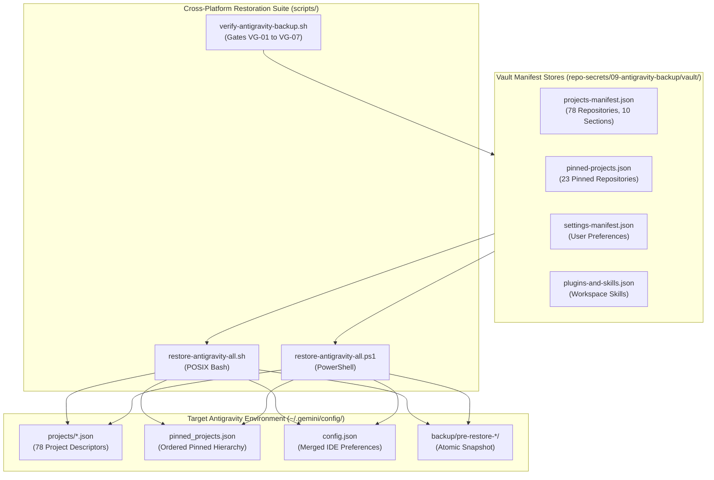
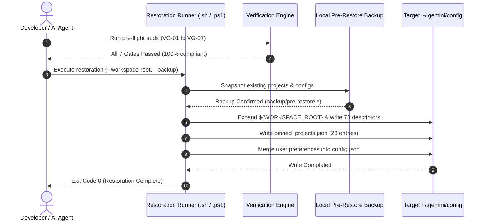

# 🗝️ Antigravity IDE Backup Vault & Cross-Platform Restoration SOP

> **Component:** `repo-secrets/09-antigravity-backup/`  
> **Target System:** Google Antigravity IDE Configuration & Project Manager  
> **Total Indexed Repositories:** 78 Repositories across 10 Logical Sections  
> **Total Pinned Repositories:** 23 Quick-Access Repositories (7 Tier 1 Core + 16 Tier 2 Ecosystem)  
> **Restoration Mechanism:** Cross-Platform Zero-Touch Ingestion (POSIX Bash & PowerShell Core)  
> **Security Posture:** 100% Sanitized Portable Manifests, Zero Raw Secrets, Positive Booleans Exclusively  

---

## 1. Executive Overview & Mission

The **Antigravity Migration Vault** (`repo-secrets/09-antigravity-backup/`) provides an automated, non-destructive, and portable mechanism to snapshot, transfer, and restore Google Antigravity IDE projects, pinned hierarchies, user preferences, and installed skills across developer workstations (Linux, Windows, macOS) and container sandboxes.

### 1.1 Core Architectural Guarantees
1. **Universal Path Portability**: All repository locations are parameterized via the `${WORKSPACE_ROOT}` substitution token. Hardcoded drive letters (`C:`, `D:`) and host home directories (`/home/...`) are strictly banished from version-controlled manifests.
2. **Deterministic Dual-Profile Synchronization**: Restores configurations symmetrically to both the host administrative profile (`~/.gemini/config/`) and active containerized sandbox profiles (`.antigravity_tools/instances/*/home/.gemini/config/`).
3. **Atomic Rollback & Pre-Flight Snapshots**: Before modifying target directories, restoration runners generate an isolated, timestamped snapshot (`backup/pre-restore-<timestamp>/`), preserving existing session state and UUID bindings.
4. **Zero-Secret Manifest Separation**: Manifests encapsulate workspace metadata, project URIs, and branch names without commingling private keys, OAuth tokens, or credential databases.

---

## 2. Directory Topography

The backup vault is structured into deterministic subdirectories:

```text
repo-secrets/09-antigravity-backup/
├── readme.md                      # Master Standard Operating Procedure (SOP) & Runbook (this file)
├── vault/                         # Portable JSON Manifest Stores
│   ├── projects-manifest.json     # Complete 78-repository registration records across 10 sections
│   ├── pinned-projects.json       # Tier 1 (7) & Tier 2 (16) prioritized Quick Access hierarchy
│   ├── settings-manifest.json     # Antigravity IDE preferences, agent configuration, and telemetry
│   └── plugins-and-skills.json    # Declared workspace plugins and skill bindings
├── scripts/                       # Cross-Platform Automation Suite
│   ├── restore-antigravity-all.sh # POSIX Bash restoration runner (Linux / macOS)
│   ├── restore-antigravity-all.ps1# PowerShell Core / WinPS restoration runner
│   ├── verify-antigravity-backup.sh # Quality gate verification audit script (Bash)
│   └── verify-antigravity-backup.ps1# Quality gate verification audit script (PowerShell)
└── temp/                          # Ephemeral staging and verification scratchpad
    └── .gitkeep                   # Directory placeholder
```

### 2.1 Subsystem Architecture & Data Flow



---

## 3. Master Standard Operating Procedure (SOP)

Follow this 5-step runbook when provisioning a new developer workstation or recovering IDE workspace configuration:



### Step 1: Pre-Flight Environment Assessment
1. Identify target operating system (Linux, macOS, Windows).
2. Locate workspace directory containing all 78 repositories (e.g. `../git-work` or `$HOME/git-work`).
3. Ensure write permissions exist on the target configuration path:
   - **Linux / macOS:** `~/.gemini/config/`
   - **Windows:** `$env:USERPROFILE\.gemini\config\`

### Step 2: Manifest & Integrity Audit
Execute the automated gate verifier to ensure manifests are clean, valid, and uncorrupted:

```bash
# On Linux / macOS:
bash repo-secrets/09-antigravity-backup/scripts/verify-antigravity-backup.sh

# On Windows:
pwsh repo-secrets/09-antigravity-backup/scripts/verify-antigravity-backup.ps1
```

The verifier checks:
- All 4 manifest files exist in `vault/` and parse cleanly as JSON.
- Exactly 78 projects indexed across 10 sections.
- Exactly 23 pinned projects (7 Tier 1 Core + 16 Tier 2 Ecosystem).
- Zero absolute host paths or drive letters in tracked manifests.
- Zero high-entropy secrets or private keys.
- Positive boolean conventions strictly observed.

### Step 3: Execute Restoration Runner

#### POSIX Bash (Linux / macOS):
```bash
# Dry run preview (does not touch disk):
bash repo-secrets/09-antigravity-backup/scripts/restore-antigravity-all.sh --dry-run --verbose

# Production restoration with pre-flight backup:
bash repo-secrets/09-antigravity-backup/scripts/restore-antigravity-all.sh \
  --workspace-root "$HOME/git-work" \
  --backup \
  --verbose
```

#### PowerShell Core / Windows PowerShell:
```powershell
# Dry run preview:
pwsh repo-secrets/09-antigravity-backup/scripts/restore-antigravity-all.ps1 -DryRun -VerboseOutput

# Production restoration with pre-flight backup:
pwsh repo-secrets/09-antigravity-backup/scripts/restore-antigravity-all.ps1 `
  -WorkspaceRoot "$env:USERPROFILE\git-work" `
  -Backup `
  -VerboseOutput
```

### Step 4: Validate Restoration Output
Confirm files populated in target configuration directory:
1. Verify `~/.gemini/config/projects/` contains 78 individual `<uuid>.json` files.
2. Verify `~/.gemini/config/pinned_projects.json` exists with 23 entries.
3. Verify `~/.gemini/config/config.json` retains preferences.

### Step 5: Antigravity IDE Smoke Test
1. Launch or reload Google Antigravity IDE.
2. Confirm all 10 project sections appear in the navigation drawer:
   - Core Infrastructure & Toolchains (7)
   - AI Prompts & Agent Architecture (6)
   - Go Core & Foundation Libraries (7)
   - System Utilities & Workstation Automation (7)
   - DevOps, Clustering & Network Infrastructure (6)
   - Web Platforms, Backend & Workflow Systems (8)
   - Presentation Decks & Visual Design Systems (15)
   - Content Automation, SEO & Media Production (6)
   - WordPress Ecosystem & Publishing Plugins (5)
   - Fleet Monitoring, Portfolios & Digital Identity (11)
3. Confirm Quick Access bar displays the 23 pinned repositories in order.
4. Open any project to verify git tracking and branch pointers resolve cleanly.

---

## 4. Script Reference & CLI Argument Contracts

### 4.1 `restore-antigravity-all.sh`

| Option | Long Flag | Type | Default | Description |
| :--- | :--- | :--- | :--- | :--- |
| `-w` | `--workspace-root <path>` | String | `$PWD/..` | Path to workspace folder containing repositories |
| `-d` | `--dry-run` | Boolean | `false` | Preview restoration actions without writing to disk |
| `-b` | `--backup` | Boolean | `true` | Create timestamped backup of existing config |
| `-f` | `--force` | Boolean | `false` | Overwrite existing files without confirmation |
| `-v` | `--verbose` | Boolean | `false` | Enable detailed diagnostic output per project |
| `-h` | `--help` | Boolean | `false` | Display command usage reference |

### 4.2 `restore-antigravity-all.ps1`

| Parameter | Type | Default | Description |
| :--- | :--- | :--- | :--- |
| `-WorkspaceRoot <path>` | String | `$PWD\..` | Path to workspace folder containing repositories |
| `-DryRun` | Switch | `false` | Preview restoration without modifying filesystem |
| `-Backup` | Switch | `true` | Create timestamped pre-restore snapshot |
| `-Force` | Switch | `false` | Overwrite existing project files |
| `-VerboseOutput` | Switch | `false` | Enable verbose diagnostic logging |

---

## 5. Verification Scorecard Gates (VG-01 to VG-07)

| Gate ID | Gate Name | Requirement | Pass Metric |
| :--- | :--- | :--- | :--- |
| **VG-01** | Vault Structure & Manifest Validation | All 4 manifests exist and adhere to JSON schemas. | 100% JSON validity |
| **VG-02** | Repository Count Parity | Exactly 78 repositories in `projects-manifest.json` and 23 in `pinned-projects.json`. | 78 / 78 projects, 23 / 23 pins |
| **VG-03** | Path Relativity & Portability | Zero host path leaks (`/home/`, `C:`, `D:`); `${WORKSPACE_ROOT}` used exclusively. | Zero absolute path leaks |
| **VG-04** | Restoration Script Parity | POSIX Bash and PowerShell runners provide symmetric CLI options. | Full feature parity |
| **VG-05** | Atomic Non-Destructive Ingestion | Pre-restore backup created; UUIDs and credentials preserved. | Zero data loss |
| **VG-06** | Secret Sanitization Gate | Zero plaintext credentials, OAuth secrets, or private keys. | Zero secrets detected |
| **VG-07** | Relative Link & Positive Boolean Hygiene | Affirmative boolean polarity (`isPortable`, `isEnabled`, `isValid`); relative links only. | 100% guideline compliance |

---

## 6. Manifest Details & Structure

### 6.1 `vault/projects-manifest.json`
- **Total Repositories:** 78
- **Logical Sections:** 10
- **URI Schema:** `file://${WORKSPACE_ROOT}/<folderRelativePath>`
- **Preserved Core UUIDs:**
  - `gitmap`: `18161e7d-2758-4bb9-82ab-317cabda949a`
  - `scripts-fixer`: `650cd964-3809-4b5f-9114-4709111c7c7c`
  - `wp-html-automate`: `d4c6435c-c96d-4afc-adb2-c12b504734ba`
  - `antigravity-manager`: `57f0b96a-8718-4248-a9d7-7f4bba28934e`
  - `letsmarknow`: `bce5916f-cc40-4fce-b37a-eceea0d5d58d`
  - `letsmarknow-ui`: `692d0b8e-1fdb-4f41-83dd-4e63c4641f6a`

### 6.2 `vault/pinned-projects.json`
- **Total Pinned Repositories:** 23
- **Tier 1 (Mandatory Core Orchestrators - 7 repos):** `gitmap`, `scripts-fixer`, `wp-html-automate`, `coding-guidelines`, `repo-secrets`, `antigravity-manager`, `repo-cache`.
- **Tier 2 (Ecosystem Services & Active Development - 16 repos):** `chris/winutil`, `chris/linutil`, `03-aukgo/core`, `03-aukgo/errorwrapper`, `02-prompts/prompt-architect`, `project-watch-pro/project-watch-pro`, `presentations-repos/hiltrax`, `presentations-repos/slides-spec`, `cat-my`, `movie-cli`, `network-fixer-hub`, `laravel-automation`, `letsmarknow`, `letsmarknow-ui`, `workflowy`, `seo-writing/alim-seo-writing`.
