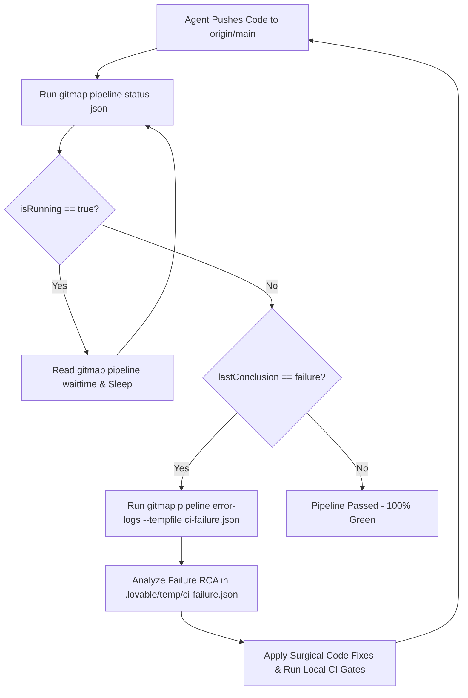

# CI/CD Pipeline Monitoring & Autonomous Remediation Guideline

> **Rule ID:** `CG-PIPELINE-01`  
> **Applicability:** All Repositories & Autonomous AI Agents

---

## 1. Overview & Purpose

Autonomous AI coding agents must verify remote CI/CD pipelines following code pushes. The `gitmap pipeline` command family provides structured JSON telemetry, ETA wait times, and failure log exports.

---

## 2. CLI Command Specification

### 2.1. Check Pipeline Status
```bash
gitmap pipeline status --json
```

**JSON Output Format:**
```json
{
  "isRunning": false,
  "etaSeconds": 0,
  "lastTagRelease": "v6.153.0",
  "pendingPipelines": 0,
  "pendingTasks": 0,
  "pendingPRs": 1,
  "repo": "alimtvnetwork/gitmap-v28",
  "activeWorkflow": "CI Quality Gates",
  "lastStatus": "completed",
  "lastConclusion": "success",
  "lastRunUrl": "https://github.com/alimtvnetwork/gitmap-v28/actions/runs/12345",
  "updatedAt": "2026-08-30T16:30:00Z"
}
```

### 2.2. Query Wait Time (ETA Seconds)
```bash
gitmap pipeline waittime
```
Outputs the remaining wait time in seconds (e.g. `45` or `0` when idle).

### 2.3. Export Failure Logs for AI Remediation
```bash
gitmap pipeline error-logs --json --tempfile ci-failure.json
```
Exports the failure trace from GitHub Actions directly into `.lovable/temp/ci-failure.json` (or the configured temp folder in settings) so AI subagents can parse the failure root cause.

---

## 3. Autonomous AI Self-Healing Workflow



---

## 4. In-Repository Settings & Browser UI

Users and agents can launch the settings dashboard:
```bash
gitmap ui
gitmap ui settings
gitmap ui pipeline
```
Configures `.lovable/temp` folder paths, polling intervals, and terminal drawer preferences directly in SQLite and localStorage.
