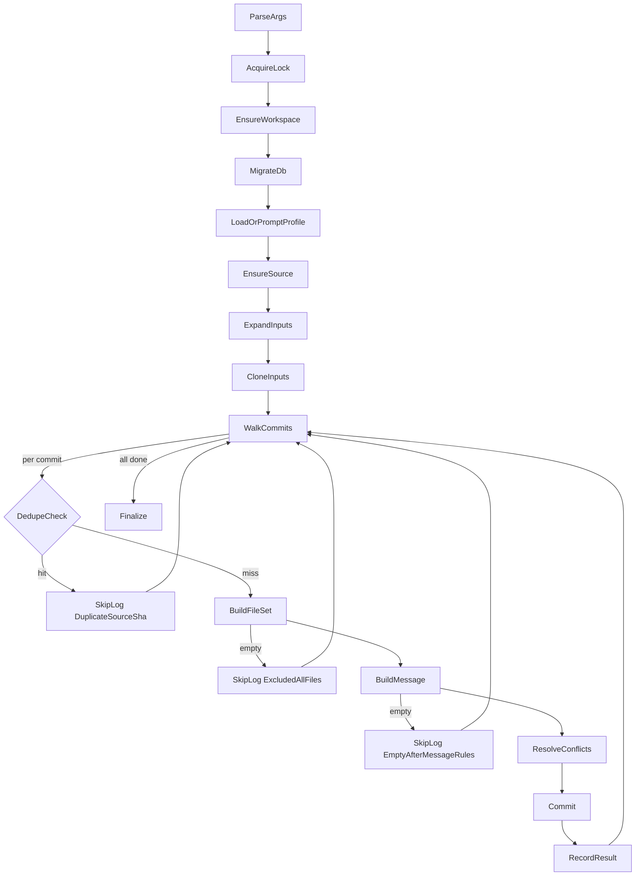

# 03 — Pipeline (`CommitInStage` Enum)

The pipeline is a strict, ordered, single-pass state machine. Each stage
below corresponds to one `CommitInStage` enum member. Stages run in the
listed order; a failure at any stage either skips the current commit
(per-commit stages) or aborts the run with the matching exit code
(global stages).

## 3.1 Stage table (canonical order)

| #  | `CommitInStage`         | Scope       | On failure                                           |
|----|-------------------------|-------------|------------------------------------------------------|
| 01 | `ParseArgs`             | Global      | Exit `CommitInExitBadArgs`                           |
| 02 | `AcquireLock`           | Global      | Exit `CommitInExitLockBusy`                          |
| 03 | `EnsureWorkspace`       | Global      | Exit `CommitInExitDbFailed` if `.gitmap/` unwritable |
| 04 | `MigrateDb`             | Global      | Exit `CommitInExitDbFailed`                          |
| 05 | `LoadOrPromptProfile`   | Global      | Exit `CommitInExitProfileMissing` / `MissingAnswer`  |
| 06 | `EnsureSource`          | Global      | Exit `CommitInExitSourceUnusable`                    |
| 07 | `ExpandInputs`          | Global      | Exit `CommitInExitBadArgs` (e.g. `all` w/ no siblings)|
| 08 | `CloneInputs`           | Per-input   | Exit `CommitInExitInputUnusable`                     |
| 09 | `WalkCommits`           | Per-input   | Per-input failure → `Run.Status = PartiallyFailed`   |
| 10 | `DedupeCheck`           | Per-commit  | Hit → `SkipLog(DuplicateSourceSha)`, continue        |
| 11 | `BuildFileSet`          | Per-commit  | Empty after exclusions → `SkipLog(ExcludedAllFiles)` |
| 12 | `BuildMessage`          | Per-commit  | Empty after rules → `SkipLog(EmptyAfterMessageRules)`|
| 13 | `ResolveConflicts`      | Per-commit  | `Prompt` aborted → exit `CommitInExitConflictAborted`|
| 14 | `Commit`                | Per-commit  | `git commit` non-zero → `RewrittenCommit.Outcome=Failed`|
| 15 | `RecordResult`          | Per-commit  | DB write fail → exit `CommitInExitDbFailed`          |
| 16 | `Finalize`              | Global      | Always runs (defer); writes summary + releases lock  |

## 3.2 Stage contracts (input → output)

Each stage is a pure-ish function whose output is the input to the next.
Implementation MUST keep stages in their own files (one per stage) per
the "definitions in own files" coding guideline.

- `ParseArgs(argv)             → ParsedArgs`
- `AcquireLock(workspaceRoot)  → LockHandle`
- `EnsureWorkspace(root)       → WorkspacePaths`
- `MigrateDb(WorkspacePaths)   → *sql.DB`  (idempotent migrations)
- `LoadOrPromptProfile(args, db) → RunConfig`
- `EnsureSource(args.Source)   → SourceHandle{Path, IsFreshlyInit}`
- `ExpandInputs(args.Inputs, source) → []ResolvedInput`
- `CloneInputs([]ResolvedInput, paths) → []InputRepoRow`
- `WalkCommits(InputRepoRow)   → iter.Seq[SourceCommitRow]`
- `DedupeCheck(db, sourceSha)  → DedupeVerdict{Skip, PreviousId}`
- `BuildFileSet(db, commit, exclusions) → FilePlan`
- `BuildMessage(commit, RunConfig)      → MessagePlan`
- `ResolveConflicts(FilePlan, source)   → ResolvedFilePlan`
- `Commit(source, ResolvedFilePlan, MessagePlan, dates, identity) → NewSha`
- `RecordResult(db, runId, sourceCommit, outcome, newSha)`
- `Finalize(db, runId)         → ExitCode`

## 3.3 Mermaid pipeline diagram

## 3.4 Determinism rules

- Inputs walked in user-supplied order. `ExpandInputs` preserves
  positional order; `all` / `-N` insert siblings in ascending version
  order at the position the keyword occupied (always position 1 since
  keywords MUST appear alone — see §2.4).
- Commits within an input walked **first-parent only**, oldest → newest.
  Merge commits' second-parent history is NOT recursed.
- Random picks (`MessagePrefix` pool, `OverrideMessages` pool) use a
  PRNG seeded with `RunId XOR SourceSha` so dry-run and real run
  produce identical messages.

## 3.5 Idempotency contract

Re-running the same `commit-in` invocation on the same workspace MUST:

1. Insert exactly zero new `RewrittenCommit` rows (every `SourceSha`
   already in `ShaMap` → SKIP).
2. Insert one new `CommitInRun` row with `Status = Completed` and
   skip-only `SkipLog` entries.
3. Leave the source repo's git log byte-identical to before the
   re-run.