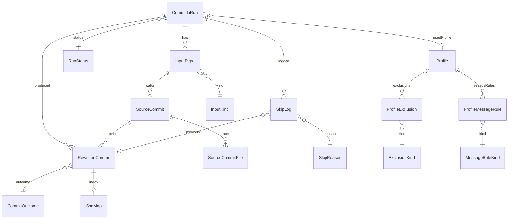

# 04 — Database Schema (SQLite, PascalCase)

## 4.1 Conventions (apply to every table below)

- Storage: shared `<.gitmap>/db/gitmap.sqlite` (same DB as the rest of
  gitmap-v28; tables namespaced with the `CommitIn…` prefix where collision
  is plausible).
- Every table has `CreatedAt DATETIME NOT NULL DEFAULT CURRENT_TIMESTAMP`.
- Every primary key: `INTEGER PRIMARY KEY AUTOINCREMENT`, named
  `<TableName>Id`.
- Every classifier column ends in `Id` and FKs into a mirror enum table
  (`(Id, Name UNIQUE)`); the column type is `INTEGER NOT NULL`. Code
  uses the matching Go enum (smallest viable int type — `uint8` for
  ≤255 members).
- All datetime columns store ISO-8601 with timezone offset (`%Y-%m-%dT%H:%M:%S%z`).
- All foreign keys declared `ON DELETE RESTRICT` (purge requires explicit
  `commit-in --reset` — out of scope v1).
- Indexes are listed inline; create them in the same migration that
  creates the table.

## 4.2 Core tables

### `CommitInRun`
| Column            | Type      | Notes                                                |
|-------------------|-----------|------------------------------------------------------|
| `CommitInRunId`   | INT PK AI |                                                      |
| `SourceRepoPath`  | TEXT NN   | Absolute, symlink-resolved path of `<source>`.       |
| `SourceRepoUrl`   | TEXT NULL | Set when `<source>` was a URL.                       |
| `WasSourceFreshlyInit` | INT NN | 0/1. True when stage 06 ran `git init`.            |
| `StartedAt`       | DATETIME NN |                                                    |
| `FinishedAt`      | DATETIME NULL |                                                  |
| `RunStatusId`     | INT NN FK → `RunStatus.RunStatusId`                   |
| `ProfileId`       | INT NULL FK → `Profile.ProfileId`                     |
| Index             | `IX_CommitInRun_SourceRepoPath` on (`SourceRepoPath`) |

### `RunStatus` (enum mirror)
Members: `Pending`, `Running`, `Completed`, `Failed`, `PartiallyFailed`.

### `InputRepo`
| Column          | Type      | Notes                                                  |
|-----------------|-----------|--------------------------------------------------------|
| `InputRepoId`   | INT PK AI |                                                        |
| `CommitInRunId` | INT NN FK → `CommitInRun.CommitInRunId`                 |
| `OrderIndex`    | INT NN    | Position as user supplied (1-based).                   |
| `OriginalRef`   | TEXT NN   | Token as typed (URL, path, or expanded sibling name).  |
| `ResolvedPath`  | TEXT NN   | `<.gitmap>/temp/<runId>/<orderIndex>-<basename>/`.     |
| `InputKindId`   | INT NN FK → `InputKind.InputKindId`                     |
| Unique          | (`CommitInRunId`, `OrderIndex`)                         |

### `InputKind` (enum mirror)
Members: `LocalFolder`, `GitUrl`, `VersionedSibling`.

### `SourceCommit`
| Column           | Type      | Notes                                                  |
|------------------|-----------|--------------------------------------------------------|
| `SourceCommitId` | INT PK AI |                                                        |
| `InputRepoId`    | INT NN FK |                                                        |
| `SourceSha`      | TEXT NN   | 40-char full SHA.                                      |
| `AuthorName`     | TEXT NN   |                                                        |
| `AuthorEmail`    | TEXT NN   |                                                        |
| `AuthorDate`     | DATETIME NN |                                                      |
| `CommitterDate`  | DATETIME NN |                                                      |
| `OriginalMessage`| TEXT NN   |                                                        |
| `OrderIndex`     | INT NN    | Walk order within input (1-based).                     |
| Unique           | (`InputRepoId`, `SourceSha`)                            |
| Index            | `IX_SourceCommit_SourceSha` on (`SourceSha`)            |

### `SourceCommitFile`
| Column               | Type      | Notes                                              |
|----------------------|-----------|----------------------------------------------------|
| `SourceCommitFileId` | INT PK AI |                                                    |
| `SourceCommitId`     | INT NN FK |                                                    |
| `RelativePath`       | TEXT NN   | POSIX separators, no leading `./`.                 |
| Unique               | (`SourceCommitId`, `RelativePath`)                  |

### `RewrittenCommit`
| Column                 | Type      | Notes                                              |
|------------------------|-----------|----------------------------------------------------|
| `RewrittenCommitId`    | INT PK AI |                                                    |
| `CommitInRunId`        | INT NN FK |                                                    |
| `SourceCommitId`       | INT NN FK |                                                    |
| `NewSha`               | TEXT NULL | NULL when `Outcome = Failed` or `--dry-run`.       |
| `FinalMessage`         | TEXT NN   | Post-rules, post-prefix/suffix, post-fn-intel.     |
| `AppliedAuthorName`    | TEXT NN   |                                                    |
| `AppliedAuthorEmail`   | TEXT NN   |                                                    |
| `AppliedAuthorDate`    | DATETIME NN | Always equals source `AuthorDate`.               |
| `AppliedCommitterDate` | DATETIME NN | Always equals source `CommitterDate`.            |
| `CommitOutcomeId`      | INT NN FK → `CommitOutcome.CommitOutcomeId`         |
| Unique                 | (`CommitInRunId`, `SourceCommitId`)                 |
| Index                  | `IX_RewrittenCommit_NewSha` on (`NewSha`)           |

### `CommitOutcome` (enum mirror)
Members: `Created`, `Skipped`, `Failed`.

### `SkipLog`
| Column                       | Type      | Notes                                       |
|------------------------------|-----------|---------------------------------------------|
| `SkipLogId`                  | INT PK AI |                                             |
| `CommitInRunId`              | INT NN FK |                                             |
| `SourceCommitId`             | INT NN FK |                                             |
| `SkipReasonId`               | INT NN FK → `SkipReason.SkipReasonId`        |
| `PreviousRewrittenCommitId`  | INT NULL FK → `RewrittenCommit.RewrittenCommitId` |

### `SkipReason` (enum mirror)
Members: `DuplicateSourceSha`, `ExcludedAllFiles`, `EmptyAfterMessageRules`,
`DryRun`.

### `ShaMap` (cross-run dedupe view)
| Column              | Type      | Notes                                              |
|---------------------|-----------|----------------------------------------------------|
| `ShaMapId`          | INT PK AI |                                                    |
| `SourceSha`         | TEXT NN UNIQUE                                                  |
| `RewrittenCommitId` | INT NN FK → `RewrittenCommit.RewrittenCommitId`     |
| Index               | `IX_ShaMap_SourceSha` on (`SourceSha`)              |

## 4.3 Profile tables

### `Profile`
| Column              | Type      | Notes                                              |
|---------------------|-----------|----------------------------------------------------|
| `ProfileId`         | INT PK AI |                                                    |
| `Name`              | TEXT NN UNIQUE                                                  |
| `SourceRepoPath`    | TEXT NN   | Binding key (absolute path).                       |
| `IsDefault`         | INT NN    | 0/1. Unique partial index when 1 per `SourceRepoPath`. |
| `PayloadJson`       | TEXT NN   | Verbatim JSON file contents.                       |
| Unique partial      | (`SourceRepoPath`) WHERE `IsDefault = 1`            |

### `ProfileExclusion`
| Column                | Type      | Notes                                            |
|-----------------------|-----------|--------------------------------------------------|
| `ProfileExclusionId`  | INT PK AI |                                                  |
| `ProfileId`           | INT NN FK |                                                  |
| `Value`               | TEXT NN   | Path or path-fragment.                           |
| `ExclusionKindId`     | INT NN FK → `ExclusionKind.ExclusionKindId`       |

### `ExclusionKind` (enum mirror)
Members: `PathFolder`, `PathFile`.

### `ProfileMessageRule`
| Column                  | Type      | Notes                                          |
|-------------------------|-----------|------------------------------------------------|
| `ProfileMessageRuleId`  | INT PK AI |                                                |
| `ProfileId`             | INT NN FK |                                                |
| `MessageRuleKindId`     | INT NN FK → `MessageRuleKind.MessageRuleKindId` |
| `Value`                 | TEXT NN   |                                                |

### `MessageRuleKind` (enum mirror)
Members: `StartsWith`, `EndsWith`, `Contains`.

## 4.4 Mermaid ERD

## 4.5 Migration discipline

- One migration file per table OR per cohesive table cluster, named
  `NNN_commit_in_<purpose>.sql`. Idempotent (`CREATE TABLE IF NOT EXISTS`,
  `INSERT OR IGNORE` for enum seed rows).
- Enum-mirror tables seeded by the same migration that creates them;
  seeded `Name` values match the Go enum's `String()` exactly.
- Schema changes in v1 forbidden post-merge — bump to a new migration
  number.