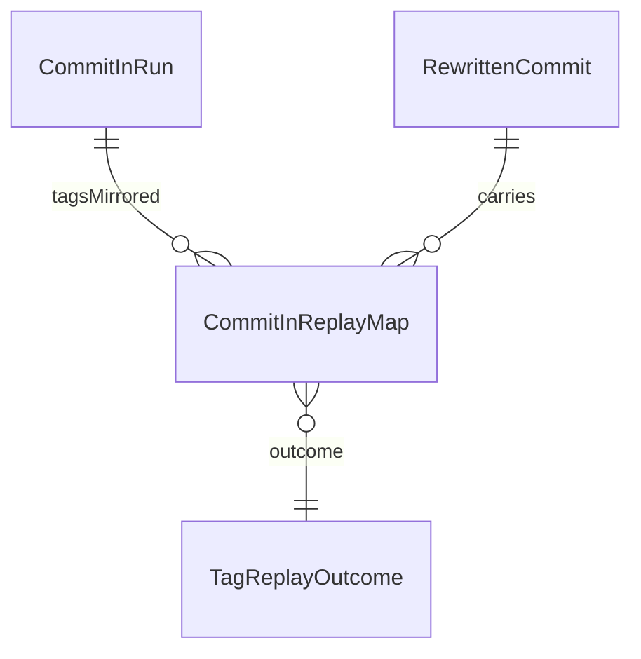

# 09 — `CommitInReplayMap` (Annotated-Tag Old↔New SHA Map)

> Status: **specification only — implementation forbidden until the user
> says `next` per `.lovable/plan.md`**. Extends §04 (database schema) and
> §08 (tag mirroring) without renaming or removing any existing artifact.

## 9.1 Why a dedicated table

§08 added two columns to `RewrittenCommit` (`MirroredTagName`,
`MirroredReleaseBranch`) so a single row can carry "this commit was
replayed AND it carries a mirrored tag". That is sufficient to RECREATE
the destination tag during a single run. It is **not** sufficient to
answer the questions a downstream consumer asks AFTER the run:

1. "Which annotated source tags shipped in run `R`?" — today this
   requires a self-join on `RewrittenCommit` filtered by
   `MirroredTagName IS NOT NULL`, plus a second pass per-tag through the
   §08 sibling-row rule (additional aliases are stored as
   `Skipped/AdditionalTagAlias`). Three different `CommitOutcomeId`
   values can carry a tag name; the consumer has to know §08 by heart.
2. "What was the source-side tag-object SHA for the dest tag `v1.2.3`?"
   — `RewrittenCommit` only stores the source COMMIT SHA (via
   `SourceCommitId → SourceCommit.SourceSha`). Annotated tags are
   themselves git objects with their own SHA distinct from the commit
   they point at. Today that SHA is unrecorded.
3. "Has tag `v1.2.3` already been mirrored in a previous run?" — the
   cross-run dedupe primitive `ShaMap` is keyed on commit SHA; tag
   identity is not in scope. A second-run `commit-in` against the same
   source repo currently re-attempts the `git tag` write and reports
   `T9 already exists` (§8.7). That is correct but noisy and wastes a
   git call per pre-existing tag.

`CommitInReplayMap` is the addressable, single-row-per-mirrored-tag
artifact that answers all three. It is a **read view** for tags in the
same way `ShaMap` is a read view for commits.

## 9.2 Scope and non-goals

In scope:

- Persist exactly one row per annotated tag that the §08 mirroring
  layer mirrored (or WOULD mirror under `--dry-run`).
- Record both the source-side tag-object SHA AND the destination tag's
  resolved SHA (for annotated tags, the dest tag SHA is the SHA of the
  newly-created annotated tag object on the destination, NOT the
  `NewSha` commit it points at — those are two distinct SHAs).
- Record the auto release branch name created by §08, when applicable.
- Cross-run lookup by `(SourceRepoPath, SourceTagName)` so a re-run
  can short-circuit the `git tag` call when the destination tag
  already exists at the same NewSha.

Out of scope:

- Lightweight tags (§08 ignores them under default `--tags=Annotated`;
  when `--tags=All` is set we record them in `RewrittenCommit` but
  NOT in `CommitInReplayMap`. The replay map is annotated-tags-only;
  see §9.10 open question O1).
- Tag MESSAGES / signatures. The `git for-each-ref` walker in §08
  already replays them onto the dest tag; we do not duplicate that
  payload here.
- Branch-only replays (no tag). `MirroredReleaseBranch` lives on
  `RewrittenCommit` AND on `CommitInReplayMap` because the branch is
  always derived from the tag in §08 — no tag, no branch, no row.

## 9.3 Glossary additions (extends §01)

- **Source Tag SHA** — the SHA of the annotated tag OBJECT in the
  source repository, as returned by
  `git rev-parse refs/tags/<name>^{tag}`. Distinct from the commit SHA
  the tag points at (`refs/tags/<name>^{commit}`).
- **Dest Tag SHA** — the SHA of the annotated tag object created by
  §08 on the destination, as returned by
  `git rev-parse refs/tags/<name>^{tag}` after the mirror step. NULL
  under `--dry-run` and NULL when §08 chose `--tags=Annotated` and
  the source tag was lightweight.
- **Tag Replay Outcome** — enum mirror; see §9.4.

## 9.4 Schema

ONE new table. ONE new enum mirror. NO change to §04 tables, NO change
to the §08 `RewrittenCommit` columns. Migration file
`007_commit_in_replay_map.sql`. Per §4.5 schema discipline, migrations
001–006 are not edited.

### `CommitInReplayMap`

| Column                      | Type      | Notes                                                                                          |
|-----------------------------|-----------|------------------------------------------------------------------------------------------------|
| `CommitInReplayMapId`       | INT PK AI |                                                                                                |
| `CommitInRunId`             | INT NN FK → `CommitInRun.CommitInRunId`                                                                     |
| `RewrittenCommitId`         | INT NN FK → `RewrittenCommit.RewrittenCommitId`. The canonical row that carries `NewSha` for this tag.      |
| `SourceTagName`             | TEXT NN   | Verbatim ref short name (e.g. `v1.2.3`, NOT `refs/tags/v1.2.3`).                                |
| `SourceTagSha`              | TEXT NN   | 40-char SHA of the source tag OBJECT.                                                           |
| `SourceCommitSha`           | TEXT NN   | 40-char SHA of the commit the source tag points at. Mirrors `SourceCommit.SourceSha` for join-free lookup. |
| `DestTagSha`                | TEXT NULL | 40-char SHA of the dest tag object after §08 ran. NULL on `--dry-run`, NULL on `Failed`/`AlreadyExists`.     |
| `DestCommitSha`             | TEXT NULL | 40-char SHA the dest tag points at (= `RewrittenCommit.NewSha`). Denormalised. NULL on `--dry-run`.          |
| `MirroredReleaseBranch`     | TEXT NULL | e.g. `release/v1.2.3`. NULL when `--no-release-branch`, when `SourceTagName` is not a version tag, or `--dry-run`. |
| `IsVersionTag`              | INT NN    | 0/1. True iff `SourceTagName` matches `constants.VersionTagPattern`.                            |
| `TagReplayOutcomeId`        | INT NN FK → `TagReplayOutcome.TagReplayOutcomeId`                                                            |
| Unique                      | (`CommitInRunId`, `SourceTagName`)                                                                          |
| Unique                      | (`CommitInRunId`, `RewrittenCommitId`, `SourceTagName`) — sibling-aliases per §08 are SAME row, NOT a new row |
| Index                       | `IX_CommitInReplayMap_SourceTagName` on (`SourceTagName`)                                                    |
| Index                       | `IX_CommitInReplayMap_DestCommitSha` on (`DestCommitSha`)                                                    |
| Index                       | `IX_CommitInReplayMap_MirroredReleaseBranch` on (`MirroredReleaseBranch`)                                    |

### `TagReplayOutcome` (enum mirror)

Members (PascalCase, mirrored to the `TagReplayOutcome (Id, Name UNIQUE)`
table per §4.1):

| Name             | Meaning                                                                                                            |
|------------------|--------------------------------------------------------------------------------------------------------------------|
| `Created`        | §08 ran `git tag -a` successfully. `DestTagSha` populated.                                                          |
| `CreatedDryRun`  | `--dry-run` path; no git mutation. `DestTagSha` and `DestCommitSha` NULL.                                           |
| `Skipped`        | Source tag was lightweight under `--tags=Annotated`, OR `--tags=None`. No git call, no destination state.           |
| `AlreadyExists`  | Dest tag of same name + same SHA already present (re-run idempotency hit). No `git tag` call. `DestTagSha` populated from the existing dest object. |
| `Failed`         | `git tag` failed for any reason other than the idempotent `AlreadyExists` (most commonly: dest tag already exists with a DIFFERENT SHA — `T9` in §8.7). `DestTagSha` NULL. |

Failed rows still carry `MirroredReleaseBranch` per §08 (the branch may
have succeeded even though the tag did not — orthogonal git operations).

## 9.5 Insert and lookup contract

**Insert site.** §08 §8.4 places tag mirroring inline in stage 14
(NOT a finalize stage). The `CommitInReplayMap` insert is the LAST
operation in the same stage 14 transaction, after the
`RewrittenCommit` insert/update completes:

```
stage 14 per source commit:
  rewId = store.InsertRewrittenCommit(result, plan)             ← §04, unchanged
  store.UpdateRewrittenCommitMirrorColumns(rewId, tag, branch)  ← §08, unchanged
  store.InsertCommitInReplayMap(runId, rewId, tagFacts)         ← NEW, this spec
```

The whole stage 14 unit remains a single transaction so a crash
between the §08 column update and the `CommitInReplayMap` insert
cannot leave a half-written row.

**Cross-run lookup.** Before the §08 `git tag` call runs, the
mirroring layer queries:

```sql
SELECT DestTagSha, DestCommitSha
FROM   CommitInReplayMap
WHERE  SourceTagName = ?
  AND  SourceTagSha  = ?
  AND  TagReplayOutcomeId IN (Created, AlreadyExists)
LIMIT  1;
```

If a row exists AND `DestCommitSha = RewrittenCommit.NewSha` for the
current commit, §08 sets `TagReplayOutcomeId = AlreadyExists`, skips
the `git tag` call, and emits the standard run-log line "tag v1.2.3
already mirrored at <sha> — idempotent". This is the cleanup of the
"noisy T9" path described in §9.1 case 3.

**Aliases (§08 N-tags-per-commit rule).** When a source commit carries
multiple annotated tags pointing at the same SHA, §08 already writes
sibling `RewrittenCommit` rows with `Skipped/AdditionalTagAlias`. The
`CommitInReplayMap` follows the SAME rule: ONE row per
`(CommitInRunId, SourceTagName)`. The first tag's row references the
canonical `RewrittenCommit`; each alias gets its OWN
`CommitInReplayMap` row referencing its OWN sibling `RewrittenCommit`,
keeping the `(RewrittenCommitId, SourceTagName)` unique constraint
honored by construction.

## 9.6 Dry-run and rerun semantics

- `--dry-run`: the row is INSERTED with `TagReplayOutcomeId = CreatedDryRun`,
  `DestTagSha = NULL`, `DestCommitSha = NULL`, `MirroredReleaseBranch =
  NULL`. The matching `RewrittenCommit` row already has `NewSha = NULL`
  per §04, so the join stays consistent.
- Rerun against the same source repo: §9.5 lookup short-circuits at
  the per-tag level. The new run still INSERTS its OWN
  `CommitInReplayMap` rows scoped by `CommitInRunId` (we do NOT
  upsert across runs — each run owns its row). The
  `(CommitInRunId, SourceTagName)` unique constraint protects against
  intra-run duplicates.
- `--reset` (§4.1 ON DELETE RESTRICT note): `CommitInRun` deletion
  cascades nothing; explicit `commit-in --reset` (out of scope v1) is
  the only way to remove `CommitInReplayMap` rows. v1 leaves them.

## 9.7 ERD delta (extends §4.4)

Append to the existing diagram:



The relationship `RewrittenCommit ||--o{ CommitInReplayMap` is `o{`
(zero-or-many) because most commits carry no tag at all; the §08
N-tags-per-commit case is handled by sibling RewrittenCommit rows
(§9.5), so each `CommitInReplayMap` row still points at exactly ONE
`RewrittenCommit`.

## 9.8 Acceptance matrix (extends §07 and §8.7)

| #   | Setup                                                                          | Expected                                                                                                                                |
|-----|--------------------------------------------------------------------------------|-----------------------------------------------------------------------------------------------------------------------------------------|
| R1  | Source commit has annotated tag `v1.2.3`                                       | One row: `SourceTagName=v1.2.3`, `IsVersionTag=1`, `MirroredReleaseBranch=release/v1.2.3`, `TagReplayOutcome=Created`, both dest SHAs populated. |
| R2  | Source commit has lightweight tag `bookmark`, `--tags=Annotated`               | NO row written (lightweight tags are out of scope per §9.2).                                                                            |
| R3  | Source commit has annotated tag `nightly`                                      | One row: `IsVersionTag=0`, `MirroredReleaseBranch=NULL`, `TagReplayOutcome=Created`.                                                    |
| R4  | `--no-release-branch` + annotated tag `v2.0.0`                                 | One row: `IsVersionTag=1`, `MirroredReleaseBranch=NULL`, `TagReplayOutcome=Created`.                                                    |
| R5  | `--tags=None`                                                                  | No tag walk happens; `CommitInReplayMap` receives ZERO rows for the run.                                                                |
| R6  | `--dry-run` + annotated tag `v1.0.0`                                           | One row: `TagReplayOutcome=CreatedDryRun`, `DestTagSha=NULL`, `DestCommitSha=NULL`, `MirroredReleaseBranch=NULL`.                       |
| R7  | Source commit has TWO annotated tags `v1.0.0` and `release-1.0`                | TWO rows (one per tag). Each row references its own sibling `RewrittenCommitId` per §08. `(CommitInRunId, SourceTagName)` unique holds. |
| R8  | Re-run against same source after R1; nothing changed                           | §9.5 lookup hits; new run inserts its OWN row with `TagReplayOutcome=AlreadyExists`, `DestTagSha` populated from existing dest tag, NO `git tag` call made. |
| R9  | Re-run; dest tag `v1.2.3` was manually moved to a different SHA                | §9.5 lookup misses (`DestCommitSha != current NewSha`); §08 `git tag` is attempted, fails with `T9`-style error, row written with `TagReplayOutcome=Failed`, `DestTagSha=NULL`, `MirroredReleaseBranch` populated iff the branch step still succeeded. Run is `PartiallyFailed`. |
| R10 | Source tag is annotated, dest tag step succeeds, but `release/v1.2.3` branch already exists | Tag row: `TagReplayOutcome=Created`, `DestTagSha` populated. `MirroredReleaseBranch=NULL` (per §8.7 T8 — branch failure leaves the column NULL on `RewrittenCommit`; `CommitInReplayMap` mirrors the same NULL for query consistency). Run is `PartiallyFailed`. |

## 9.9 Cross-cutting rules

- **Zero-swallow** (Core memory): `git rev-parse refs/tags/<name>^{tag}`
  failures during the dest-tag-SHA capture step are logged to
  `os.Stderr` in the standardized format and the row is still INSERTED
  with `TagReplayOutcome=Failed`. We never silently drop a row — the
  absence of a row in `CommitInReplayMap` for a tag we attempted is
  itself a bug.
- **Idempotent migration**: `007_commit_in_replay_map.sql` uses
  `CREATE TABLE IF NOT EXISTS` + `CREATE INDEX IF NOT EXISTS`. The
  `TagReplayOutcome` enum mirror is seeded with `INSERT OR IGNORE`.
- **No magic strings**: all five `TagReplayOutcome` member names are
  centralised in `constants/constants_commitin_tagreplay.go` (NEW
  file) — never inlined into SQL or Go literals. The `(SourceTagName,
  SourceTagSha)` lookup query lives in `constants_commitin_sql.go`
  alongside `SQLCreateCommitInShaMap`.
- **Boolean prefix** (Core memory): the in-memory struct field for
  `IsVersionTag` is `IsVersionTag bool` (positive logic, `is`
  prefix). The DB column stays `INT NN` per §4.1.

## 9.10 Open questions (resolve before implementation)

| ID | Question                                                                                                  | Default if unanswered                                                                                                       |
|----|-----------------------------------------------------------------------------------------------------------|-----------------------------------------------------------------------------------------------------------------------------|
| O1 | Should `--tags=All` lightweight-tag mirrors get `CommitInReplayMap` rows too?                              | NO — §9.2 keeps the table annotated-only. Re-open if a consumer needs lightweight-tag dedupe.                               |
| O2 | Should the §9.5 cross-run lookup be `(SourceTagName, SourceTagSha)` or also keyed by `SourceRepoPath`?     | NO repo key — `SourceTagSha` is globally unique by git's hash function; same SHA across repos = same tag object content.    |
| O3 | When BOTH the tag step AND the branch step fail (R9 + R10 combined), do we write one row or two?          | ONE row, `TagReplayOutcome=Failed`, `MirroredReleaseBranch=NULL`. The branch failure is logged via §8.8 and not double-counted in the replay map. |
| O4 | Do we need a `DestTagMessage` column for round-trip diffing of annotated-tag messages?                    | NO — §9.2 explicitly excludes payloads. Tag-message replay correctness is covered by §08 acceptance matrix, not by this map. |

---

## 9.11 Summary

`CommitInReplayMap` is a **read view for annotated tags**, parallel to
`ShaMap`'s **read view for commits**. It records:

- `(SourceTagName, SourceTagSha)` ↔ `(DestTagSha, DestCommitSha)` — the
  old↔new SHA mapping the user explicitly asked for.
- `MirroredReleaseBranch` — denormalised from `RewrittenCommit` for
  query convenience.
- `TagReplayOutcome` — five-member enum that lets dashboards answer
  "what shipped, what was skipped, what failed" without re-deriving §08
  semantics.

Section 04 schema, section 08 `RewrittenCommit` columns, and existing
migrations 001–006 are unchanged. New migration: `007`.
